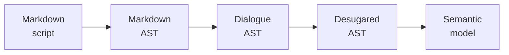

<p align="center">
  
</p>

# DialogueDown

Engine-agnostic, C#-first **dialogue compiler** library. It lowers a
Markdown-first dialogue script through distinct compiler stages into a validated
**semantic model**, reporting precise diagnostics as it goes, and keeps the core
free of any Godot dependency so it stays **reusable** and **unit-testable**. The
`dialoguedown` CLI compiles scripts and renders every stage as an interactive
report. The runtime that *plays* a compiled script — a dialogue runner and thin
engine presentation adapters — is **planned**, not yet built.

> [!NOTE]
> DialogueDown is a work-in-progress open-source project. The public API,
> script language, and runtime model may change while the library is still in
> early development.

## Table of contents

- [Status](#status)
- [How it works](#how-it-works)
- [Layout](#layout)
- [Build and test](#build-and-test)
- [Documentation](#documentation)
- [Compilation visualization](#compilation-visualization)
- [Similar projects](#similar-projects)
- [Contributing](#contributing)
- [Security](#security)
- [License](#license)

## Status

- **Maturity:** early development.
- **Target framework:** .NET 8 (`net8.0`).
- **Engine dependency:** none in the core library.
- **Primary consumer:** Godot/C# game projects through `ProjectReference`.
- **Built today:** the compiler pipeline (Markdown → semantic model), collected
  diagnostics, the `dialoguedown` CLI (`compile`, `visualize`), and `dialogue.toml`
  configuration.
- **Planned:** the runtime — a dialogue runner, effects and conditions, and thin
  engine presentation adapters.

## How it works

DialogueDown compiles a Markdown-first dialogue script through a pipeline of
small, independently testable stages, behind one `IScriptCompiler` facade (wire
it up with `AddDialogueDown()` for DI, or `ScriptCompilerFactory.CreateDefault()`):



- **Stages.** Parse → transpile → desugar → analyze, each a documented stage.
  Read them in pipeline order in the [design notes](docs/contributing/design-notes/README.md).
- **Diagnostics.** Every problem is a located diagnostic with a stable `DLG####`
  code and a severity; the compiler collects them and continues where it safely
  can, rather than stopping at the first. See the [error codes](docs/guide/error-codes.md).
- **Configuration.** A project's `dialogue.toml` declares its speakers and the
  compilation mode, and the CLI finds it automatically. See
  [project configuration](docs/guide/configuration.md).
- **Planned runtime.** Playing a compiled script — a runner, effects and
  conditions, and thin engine adapters — is design intent, not yet implemented.

Compile a script and see its diagnostics from the command line:

```bash
dotnet run --project src/DialogueDown.Cli -- compile scene.dialogue.md
```

## Layout

| Path | Purpose |
| --- | --- |
| `src/DialogueDown/` | the reusable class library (net8.0, no engine refs) |
| `src/DialogueDown.Visualization/` | diagnostics-only visualizer of compiler stages (not shipped in the core package) |
| `src/DialogueDown.Visualization.Live/` | loopback server that serves the report, hot-reloads it on edit, and hosts the launcher |
| `src/DialogueDown.Cli/` | the `dialoguedown` command-line interface (`compile`, `visualize`) |
| `tests/DialogueDown.Tests/` | xUnit tests for the pure logic |
| `tests/DialogueDown.Visualization.Tests/` | xUnit tests for the visualizer |
| `tests/DialogueDown.Visualization.Live.Tests/` | xUnit tests for the live server and launcher |
| `tests/DialogueDown.Cli.Tests/` | xUnit tests for the CLI |

## Build and test

Restore, build, and test the solution:

```bash
dotnet restore DialogueDown.sln
dotnet build DialogueDown.sln --configuration Release --no-restore
dotnet test DialogueDown.sln
```

To collect source-focused coverage for the core library:

```bash
dotnet tool restore
dotnet test DialogueDown.sln \
  --settings coverage.runsettings \
  --collect:"XPlat Code Coverage"
dotnet reportgenerator \
  "-reports:tests/**/TestResults/**/coverage.cobertura.xml" \
  "-targetdir:coverage-report" \
  "-reporttypes:Html;MarkdownSummary;Cobertura"
```

Coverage is verified against the `DialogueDown` and `DialogueDown.Visualization`
source assemblies and excludes test files. The collector writes Cobertura XML under
`TestResults/`, and ReportGenerator writes an interactive HTML report to
`coverage-report/index.html`. Both output folders are ignored by Git.

CI fails if line coverage drops below 90% and emits a warning when it is below
100%.

## Documentation

📖 **[Documentation site](https://pengzhengyi.github.io/godot-dialoguedown/)** — the
writer guide, the contributing docs and per-stage design notes, and the generated
C# API reference, published from `docs/` on every merge to `main`.

In the repository:

- **[Writer guide](docs/guide/index.md)** — author dialogue with DialogueDown: the
  [script language](docs/guide/script-language.md), [project
  configuration](docs/guide/configuration.md) (`dialogue.toml`), and the
  [error codes](docs/guide/error-codes.md) the compiler reports.
- **[Design notes](docs/contributing/design-notes/README.md)** — the goal, key
  decisions, and tradeoffs behind each compiler stage and component.

## Compilation visualization

<p align="center">
  
</p>

> [!TIP]
> **[▶ Try the live demo](https://pengzhengyi.github.io/godot-dialoguedown/demo/)** — an
> interactive, read-only report for a sample script, served from GitHub Pages and
> rebuilt on every merge to `main`.

DialogueDown is **transparent end to end**: you can *see* what the compiler
produced at each stage. The optional
[`DialogueDown.Visualization`](src/DialogueDown.Visualization/) project renders the
compiler's stages as a **single, self-contained HTML report** — a **Source** tab
with a live preview and working anchor links, a graph tab per stage (**Markdown
AST**, **Dialogue AST**, **Desugared AST**) with pan, zoom, and click-to-collapse,
and a **Semantic Model** tab that pairs the resolved scene tree with cross-linked
speaker, anchor, and jump-resolution tables. A served report toggles between
read-only **View** and an in-browser **Edit** mode — with document-aware
autocomplete for jump targets, speakers, `@id`s, and `#tag`s — that saves back to
the file. It bundles all its assets (D3, CodeMirror, Pico.css, marked, Tippy.js)
so it works fully offline, and reads the compiler through the same seams the tests
use, never touching the shipped core package.

Render a script from the command line with the `dialoguedown visualize` command:

```bash
# Open the launcher to browse for a script (the uniform entry point)
dotnet run --project src/DialogueDown.Cli -- visualize

# Serve a script's report and toggle View ⇄ Edit in the browser (auto-updates on save)
dotnet run --project src/DialogueDown.Cli -- visualize scene.dialogue.md --root .

# Start directly in Edit (editable, saves back to the file)
dotnet run --project src/DialogueDown.Cli -- visualize scene.dialogue.md --edit --root .

# Export a self-contained report to a file (no server, no browser)
dotnet run --project src/DialogueDown.Cli -- visualize scene.dialogue.md -o report.html

# Emit each stage's graph as portable Mermaid or Graphviz DOT text (to stdout or -o)
dotnet run --project src/DialogueDown.Cli -- visualize scene.dialogue.md --emit mermaid
dotnet run --project src/DialogueDown.Cli -- visualize scene.dialogue.md --emit dot -o scene.dot
```

> [!NOTE]
> The visualizer is a diagnostics helper, built quickly with lighter review than
> the core library; its API and abstractions may still change.

See the
[Compilation Visualization note](docs/contributing/design-notes/Compilation%20Visualization.md).

## Similar projects

DialogueDown is intentionally small, engine-agnostic, and C#-first. These
projects are useful references if you need a different tradeoff:

| Project | What it does | How DialogueDown differs |
| --- | --- | --- |
| [Ink](https://github.com/inkle/ink) | Mature interactive-fiction scripting language and runtime with strong authoring tools. | DialogueDown keeps Markdown-like source close to game writing notes and focuses on a lightweight C# library that Godot projects can reference directly. |
| [Yarn Spinner](https://github.com/YarnSpinnerTool/YarnSpinner) | Full-featured Yarn dialogue compiler/runtime with a writer-friendly scripting language and broad engine integrations. | DialogueDown is narrower and dependency-light: it prioritizes a Markdown-first C# compiler with explicit stage visualization over a larger cross-engine toolchain. |
| [Dialogic](https://github.com/coppolaemilio/dialogic) | Feature-rich Godot dialogue plugin with visual editing, portraits, timelines, variables, and localization. | DialogueDown deliberately avoids Godot dependencies in the core so dialogue logic stays reusable, unit-testable, and portable across consuming games. |
| [Godot Dialogue Manager](https://github.com/nathanhoad/godot_dialogue_manager) | Godot-native dialogue manager and scripting workflow for branching conversations. | DialogueDown targets engine-agnostic C# packages first, leaving Godot presentation and input as thin adapters in each game. |
| [Godot Ink](https://github.com/paulloz/godot-ink) | Godot integration for Ink stories. | DialogueDown is not an Ink bridge; it explores a smaller Markdown-to-dialogue pipeline with compiler-stage visualization for debugging and teaching. |

## Contributing

Contributions are welcome while the project is still taking shape. Start with
[CONTRIBUTING.md](CONTRIBUTING.md) for local setup, commit style, tests, and pull
request expectations.

Please follow the [Code of Conduct](CODE_OF_CONDUCT.md) in all project spaces.

## Security

Please don't report vulnerabilities in public issues. See
[SECURITY.md](SECURITY.md) for the current reporting process.

## License

DialogueDown is released under the [MIT License](LICENSE).
