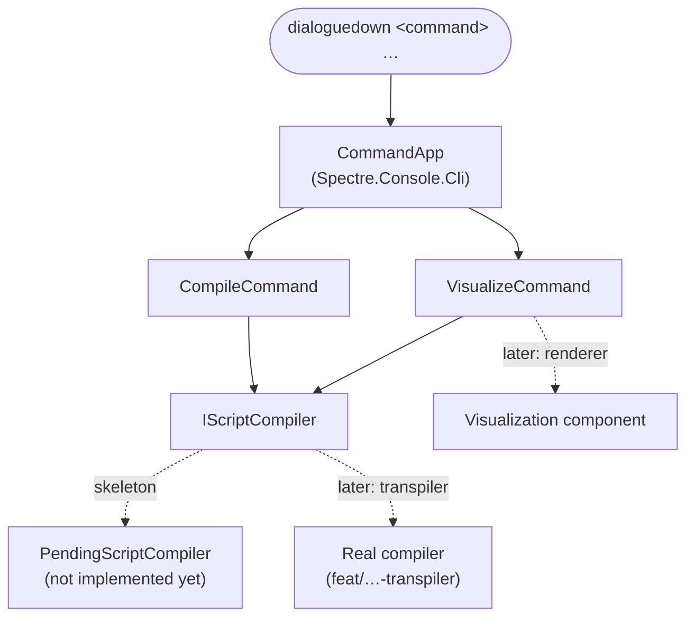

# Implementation note: command-line interface

> [!NOTE]
> Status: **implemented**.
> The `dialoguedown` CLI: a Spectre.Console.Cli host with `compile` and
> `visualize` subcommands. This first pass builds the **skeleton and
> architecture** only — both commands are stubs behind a compilation seam that
> later components fill in.

## Table of contents

- [Goal and scope](#goal-and-scope)
- [Ubiquitous language](#ubiquitous-language)
- [Where it sits](#where-it-sits)
- [Functionality checklist](#functionality-checklist)
- [Interfaces and abstractions](#interfaces-and-abstractions)
- [Key design decisions](#key-design-decisions)
- [Error and boundary cases](#error-and-boundary-cases)
- [Integration](#integration)
- [Testability](#testability)
- [Resolved decisions](#resolved-decisions)

## Goal and scope

Give DialogueDown a real **command-line front-end** instead of a hand-rolled
parser that grows with every feature. This component delivers the **CLI skeleton**:
the command host, the two subcommands, and the seam through which real behavior
plugs in later.

**In scope:**

- A `dialoguedown` executable built on **Spectre.Console.Cli** (`CommandApp`), with
  built-in `--help`, per-command help, and `--version`.
- Two subcommands as **command shells** — strongly-typed settings, description, and
  argument validation — then a clear "not yet implemented" result:
  - `compile <script>` — compile a script (the transpiler fills this in later).
  - `visualize <script>` — visualize a script's compilation (the visualization
    component fills this in later).
- A **compilation seam** (`IScriptCompiler`) that both commands depend on, so
  `visualize` is designed to **consume** compilation rather than re-implement it.
- Dependency injection so commands receive their collaborators and tests can
  substitute them.
- The project wired into the solution and CI.

**Out of scope (arrives with later components):**

- Actual **compilation** — the Markdown-to-Dialogue transpiler
  (`feat/markdown-to-dialogue-transpiler`) implements `IScriptCompiler`.
- Actual **visualization** — the visualization component (currently on its own
  branch) reworks its renderer onto `visualize`, atop `IScriptCompiler`.
- Packaging as a `dotnet tool` (planned; see D8).

## Ubiquitous language

These terms are used verbatim in the note, code, tests, and CLI help.

| Term | Meaning |
| --- | --- |
| **Script** | A `.dialogue.md` source file — the thing a command acts on. (The visualization context calls the same file a *document*; they are the same artifact across contexts.) |
| **Command** | A CLI subcommand: `compile` or `visualize`. |
| **Settings** | A command's strongly-typed arguments and options (a Spectre `CommandSettings` subclass). |
| **Compile** | Run the compiler pipeline over a script's source (`source → Markdown AST → Dialogue AST → …`). |
| **Compilation result** | The compiled form of a script. A placeholder here; the transpiler enriches it (AST, diagnostics). |
| **Script compiler** (`IScriptCompiler`) | The seam that compiles a script. Both commands depend on it; the transpiler provides the real implementation. |

## Where it sits

The CLI is a thin **front-end** over the library. It owns argument parsing,
help/version, and process exit codes; it delegates the real work to the
compilation seam. Commands never compile Markdown themselves.

The dashed edges are the seams later components fill: the transpiler swaps the stub
for the real compiler, and the visualization component builds `visualize`'s
rendering on top of `IScriptCompiler` — **relying on compilation, not
self-invoking it**.

## Functionality checklist

- [x] `dialoguedown` with no arguments prints help (exit `0`).
- [x] `dialoguedown --help` lists the `compile` and `visualize` commands.
- [x] `dialoguedown --version` prints the tool version.
- [x] `dialoguedown compile --help` / `visualize --help` show each command's usage.
- [x] `compile <script>` validates the argument, then reports "not yet
      implemented" with a distinct exit code.
- [x] `visualize <script>` behaves the same (validate → not-yet-implemented).
- [x] A missing file or a non-`.dialogue.md` argument fails with a clear message
      before any compilation is attempted.
- [x] An unknown command or option fails with Spectre's usage error.
- [x] Both commands resolve `IScriptCompiler` through DI (substitutable in tests).

## Interfaces and abstractions

| Type | Responsibility | Collaborators |
| --- | --- | --- |
| `Program` / `CliRunner` | Composition root: build the DI container, configure the app, and run it. Excluded from coverage (wiring exercised end-to-end). | `CommandApp`, `TypeRegistrar`, `CliServices`, `CliConfigurator` |
| `CliConfigurator` | Configure the app: name, version, the subcommands, and the exception handler that maps exceptions to a clean message and an exit code. | `IConfigurator`, `ExitCodes` |
| `CliServices` | Register the CLI's services (the `IScriptCompiler` seam) for injection. | `IServiceCollection` |
| `TypeRegistrar` / `TypeResolver` | Adapt Spectre's `ITypeRegistrar`/`ITypeResolver` onto `Microsoft.Extensions.DependencyInjection`, so commands get constructor-injected services. | `IServiceCollection` |
| `CompileCommand` + `CompileSettings` | The `compile` command shell: `<script>` argument (plus `-o` / `--output`), validate, then invoke the seam. | `IScriptCompiler` |
| `VisualizeCommand` + `VisualizeSettings` | The `visualize` command shell: `<script>` argument, validate, then invoke the seam. | `IScriptCompiler` |
| `IScriptCompiler` | The seam: `Compile(source) → CompilationResult`. The single place compilation happens. | `CompilationResult` |
| `CompilationResult` | The compiled form of a script (placeholder; enriched by the transpiler). | — |
| `PendingScriptCompiler` | The skeleton stub: throws a "not yet implemented" signal so the handler reports it cleanly. Replaced by the real compiler. | — |
| `ScriptArgument` (validation) | Reject a missing file or wrong extension with a clear message, shared by both commands. | — |
| `ExitCodes` | The process exit codes in one place (`Success`, `Error`, `UsageError`, `NotImplemented`). | — |

## Key design decisions

### D1 — Spectre.Console.Cli over a hand-rolled parser

The CLI is becoming a first-class surface, so it deserves a real framework rather
than growing a bespoke parser. **Spectre.Console.Cli** gives a strongly-typed
command/settings model, automatic `--help`/`--version`, subcommands, validation,
and a DI seam; paired with **Spectre.Console** it also unlocks modern, readable
output (tables, colour, prompts) for later. It is MIT-licensed, widely adopted, and
first-class **testable** (see [Testability](#testability)). The one trade-off is
its pre-1.0 (0.x) versioning — minor bumps can carry small API changes — accepted
because the CLI API has been stable for years and this avoids reinventing a parser.

### D2 — One strongly-typed command per subcommand

Each subcommand is a `Command<TSettings>` with its own `CommandSettings` class
declaring arguments and options. The settings type is the command's contract:
validation lives there (`Validate()`), and tests assert on the parsed settings.
This keeps parsing declarative and the command body focused on behavior.

### D3 — Dependency injection via a type registrar

Commands receive collaborators (`IScriptCompiler`, `IAnsiConsole`) by constructor
injection. A small `TypeRegistrar`/`TypeResolver` bridges Spectre onto
`Microsoft.Extensions.DependencyInjection`. This is what makes commands testable in
isolation — a test swaps in a fake compiler or a `TestConsole` — and lets later
components register the real compiler without touching command code.

### D4 — A compilation seam both commands depend on

`IScriptCompiler` is the single seam through which a script is compiled. **Both**
commands depend on it: `compile` runs it and reports the outcome; `visualize` will
render its stages. Encoding this now means `visualize` **relies on compilation
rather than self-invoking** it — the dependency direction the architecture wants.
In the skeleton the seam is `PendingScriptCompiler`, which raises a clear "not yet
implemented" signal; a **single app-level exception handler** (in `CliConfigurator`)
turns that into a friendly message and a distinct exit code, so the commands stay
trivial and the not-implemented UX lives in one place. When the transpiler lands it
registers the real `IScriptCompiler`, and the commands light up with **no change to
their bodies**.

### D5 — Skeleton commands still validate and route

A skeleton command is not a no-op: it parses and **validates** its `<script>`
argument (exists, `.dialogue.md`), resolves the seam, and routes to it — only the
compilation itself is deferred. This gives real, testable behavior (arg parsing,
help, validation, exit codes) now, and leaves nothing but the seam's body to fill
later.

### D6 — Naming: `dialoguedown`, short alias `ddown`

The command is **`dialoguedown`** (matches the library and repository), with a
short alias **`ddown`** for everyday use. The project is `DialogueDown.Cli`. The
alias is realized when the tool is packaged (D8); until then the application name
is set on the `CommandApp` and the alias is documented intent.

### D7 — Exit codes are meaningful

A small, named set in one place (`ExitCodes`): `0` success, `64` usage error
(a bad argument or an unknown command/option, following `EX_USAGE`), `70`
not-implemented (`EX_SOFTWARE`, so scripts and tests can tell a stub from a real
failure), and `1` for an unexpected error. The app-level exception handler maps
framework and command exceptions onto these — a validation or parse failure to
`64`, the not-implemented signal to `70` — rather than leaking a stack trace.

### D8 — Packaging as a `dotnet tool` is planned, not now

The project will later set `PackAsTool`/`ToolCommandName` so it installs as a
global/local `dotnet tool` (the natural home for the `ddown` alias). Deferred to
keep this pass to the architecture; the skeleton is a normal executable.

### D9 — This CLI supersedes the hand-rolled `visualize` parser

The visualization branch currently ships its own `visualize` entry point built on
`System.CommandLine`. That hand-rolled parser is **retired**: once this skeleton is
on `main`, the visualization branch pulls it in and reworks its `visualize` onto
this `CommandApp`, contributing the real command body. One CLI, one parser.

## Error and boundary cases

| Case | Intended behavior |
| --- | --- |
| No arguments | Print root help; exit non-zero. |
| `--help` / `command --help` | Print help for the app / the command; exit `0`. |
| `--version` | Print the version; exit `0`. |
| Missing file / not `.dialogue.md` | Clear message naming the argument; exit non-zero **before** compiling. |
| Unknown command or option | Spectre usage error (with suggestions); non-zero. |
| Valid script, `compile`/`visualize` | "Not yet implemented" message; the distinct not-implemented exit code. |

## Integration

- **Solution & CI.** `DialogueDown.Cli` and `DialogueDown.Cli.Tests` join
  `DialogueDown.sln`. CI already builds and tests the **solution**
  (`dotnet build/test DialogueDown.sln`) and runs coverage over it, so the new
  projects are covered without workflow changes.
- **Core library.** The CLI references the `DialogueDown` core library; the
  compilation seam is the boundary to it.
- **Transpiler component.** Implements `IScriptCompiler` (and enriches
  `CompilationResult`), registered in place of the stub.
- **Visualization component.** After this lands on `main`, its branch pulls `main`
  and moves its renderer under `visualize`, consuming `IScriptCompiler`; the old
  `System.CommandLine` entry point is removed (D9).
- **Error model.** When real compilation lands, the commands surface the library's
  [error model](./README.md#error-model) (`ScriptCompilationException` and its
  kinds) as friendly CLI messages; the skeleton only needs the not-implemented
  path.

## Testability

The whole point of the framework choice is testability without a real terminal.

- **`CommandAppTester`** (from the `Spectre.Console.Cli.Testing` package — split
  from `Spectre.Console.Cli`) runs a command in-process and returns the **exit
  code**, captured **output**, and the parsed **settings** — so tests assert
  behavior end-to-end (help, version, validation, exit codes, the not-implemented
  path) with no process spawn. It captures the app's configured console, so the
  exception handler writes to the resolver-provided `IAnsiConsole` for output to be
  visible in tests.
- **Substitutable seam.** Tests register a fake `IScriptCompiler` (returns a canned
  result, or throws) to drive command behavior independently of the stub — proving
  the DI wiring and the command's handling of success/failure ahead of the real
  compiler. Because the seam is `internal`, the CLI project also exposes internals
  to `DynamicProxyGenAssembly2` so NSubstitute (Castle DynamicProxy) can mock it.
- **Coverage.** The composition root (`Program`, `CliRunner`) is excluded as wiring
  exercised end-to-end; everything else — commands, settings, validation, the
  handler, the seam, and the DI bridge — reaches 100% line coverage.
- **Stack.** xUnit + NSubstitute + `Spectre.Console.Cli.Testing` (matched Spectre
  `0.55.0` set), mirroring the repo's existing test setup (one test file per source
  file, parallel-friendly).

## Resolved decisions

- **Exit-code values.** Adopted the sysexits-style set in `ExitCodes`: `0` success,
  `64` usage, `70` not-implemented, `1` unexpected error (see D7).
- **Core reference.** The CLI references the `DialogueDown` core library now, for a
  stable project graph; the compilation seam is the boundary, and the transpiler
  wires the real compiler through it later.
