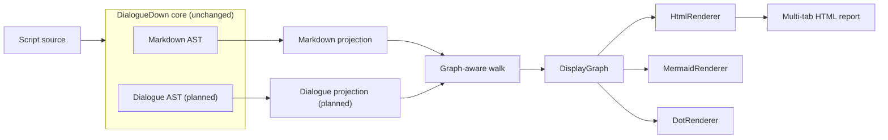

# Compilation Visualization

> [!NOTE]
> **Proposed design — not yet implemented.** This note defines a diagnostic
> visualization component that renders each compiler stage's intermediate
> representation as a human-readable tree or graph. It is developed in parallel
> with the main compiler work and syncs from `main` as new stages land.

Full-process transparency is a goal of DialogueDown: a reader should be able to
*see* what the compiler produced at each step. This component renders those
intermediate representations — the **Markdown AST** today, the **Dialogue AST**
next, and later the runtime graph — in a format that is readable by developers
and non-developers alike, and interactive where it helps.

## Table of contents

- [Goal and scope](#goal-and-scope)
- [Ubiquitous language](#ubiquitous-language)
- [Functionality checklist](#functionality-checklist)
- [Component plan](#component-plan)
- [Architecture](#architecture)
- [Interfaces and abstractions](#interfaces-and-abstractions)
- [Key design decisions](#key-design-decisions)
- [Error and boundary cases](#error-and-boundary-cases)
- [Integration](#integration)
- [Testability](#testability)

## Goal and scope

Render the compiler's **intermediate representations** as node–edge diagrams a
human can read. Every IR today is a **tree** (the Markdown AST, the Dialogue AST);
a later stage — the runtime dialogue graph — is a **directed graph that may
contain cycles**. The display model and the traversal are therefore
**graph-capable from the start**, with a tree handled as the acyclic case.

**In scope:**

- A **unified projection seam** so every IR — tree or graph — is presented through
  one interface, without bespoke rendering code per IR type.
- A stage-agnostic pipeline: any IR → one display model → one or more output
  formats.
- A **Markdown AST** visualization (this stage exists on `main` today).
- An interactive, self-contained **HTML** report with one tab per available stage.
- Secondary text formats (**Mermaid**, **DOT**) from the same display model.
- A seam for the **Dialogue AST** visualization, activated once the transpiler
  lands on `main`, and for the runtime graph after it.

**Out of scope (for now):**

- Rendering the runtime dialogue graph — a later stage. The model anticipates it
  (cycles, shared nodes), but no runtime-graph projection ships yet.
- Editing or round-tripping — this is read-only diagnostics.
- Shipping the visualizer inside the core NuGet package (see
  [D1](#d1--a-separate-project-keeps-the-core-pure)).
- A public/CLI entry point — the parser's external API is not public yet, so the
  visualizer is invoked from tests only for now (see [Integration](#integration)).

**Delivery reality.** On `main`, only the Markdown AST stage exists; the Dialogue
AST and transpiler are still on a separate branch. So this component ships the
**framework plus the Markdown AST view first**, and adds the Dialogue AST
projection once that stage merges to `main`. This matches the
"developed along the way, sync from `main`" model.

## Ubiquitous language

One concept, one name — used here, in code, and in tests.

| Term | Meaning |
| --- | --- |
| **Stage** | A compilation phase that produces an IR (Markdown AST, Dialogue AST, runtime graph, …). |
| **IR** | Intermediate representation — the tree or directed graph a stage produces (e.g. `MarkdownDocument`). |
| **Node projection** | The unified seam (`INodeProjection<TNode>`): for one IR node, its `Label`, `Attributes`, and out-neighbours. One small implementation per IR family. |
| **Display node** | One node prepared for display: an `Id`, a short `Label`, and optional `Attributes` (key–value extras such as span or kind). Renderer-agnostic. |
| **Display edge** | A directed link between display nodes, with a `Kind` — a normal **child** edge, or a **reference** edge back to an already-seen node (how a cycle or shared node is shown). |
| **Display graph** | A titled diagram for one stage: a `Title`, its display nodes, and its display edges. A **tree** is the acyclic, single-parent case. |
| **Walk** | The graph-aware traversal that builds a display graph from an IR root plus a projection, using a visited set so cycles terminate. |
| **Renderer** | Turns a display graph into one output format (HTML, Mermaid, DOT). |
| **Report** | The assembled multi-tab HTML across every available stage. |

## Functionality checklist

- [ ] A unified `INodeProjection<TNode>` seam describes any IR node (label,
      attributes, out-neighbours), with extension-method ergonomics
      (`ir.ToDisplayGraph()`).
- [ ] A graph-aware **walk** builds a display graph from any IR root and its
      projection, using a **visited set** so cycles terminate — a revisited node
      becomes a **reference edge** rather than infinite recursion.
- [ ] A **Markdown AST** projection maps every node type (`MarkdownDocument`,
      `Heading`, `Paragraph`, `ListBlock`, `ListItem`, `TextInline`, `LinkInline`,
      `ImageInline`, `CodeSpanInline`, `EmphasisInline`, `LineBreak`) to a
      labelled display node with useful attributes (span, kind, target, etc.).
- [ ] An **HTML renderer** emits an interactive, collapsible view with the JS
      bundled for offline use.
- [ ] A **report** facade compiles a source string and assembles one **tab per
      stage** into a single self-contained HTML page.
- [ ] **Mermaid** and **DOT** renderers (fast-follow extras) emit graph text from
      the same display graph.
- [ ] A **Dialogue AST** projection seam (planned; lands with the transpiler).
- [ ] Handles empty input, deep nesting, cycles, and special characters safely
      (escaping).

## Component plan

The work is split into three components, each on its own dev branch and
Design→Review→Implement→Crosscheck-style pass. This note is the shared design
record; the components are sequenced by dependency:

1. **Display model and walk** — `DisplayNode`, `DisplayEdge`, `DisplayGraph`, the
   `INodeProjection<TNode>` seam, and the graph-aware `Walk`. Pure, no
   dependencies, no core changes. The foundation everything else builds on.
2. **Renderers** — the `IDisplayRenderer` strategy and its concretes:
   `HtmlRenderer` (interactive, bundled JS) first, then `MermaidRenderer` and
   `DotRenderer` as extras.
3. **Compilation report** — the Markdown AST projection (and later the Dialogue
   AST projection) plus the `CompilationVisualizer` facade that runs the stages
   and assembles the multi-tab report. This is where the core seam is consumed.

## Architecture

The core idea is a **single walk, many renderers**. Each stage is projected into
one shared display graph; renderers are thin formatters over that model. The core
compiler is untouched, and a new output format is one small class.



The walk is one generic routine over the projection seam. A visited set keyed by
node identity keeps it finite even for cyclic graphs; a tree simply never
revisits:

```text
DisplayGraph Walk<TNode>(TNode root, INodeProjection<TNode> projection):
    graph = empty display graph
    visited = {}                       # node identity -> display node id

    DisplayNode Visit(node):
        if node in visited:            # cycle or shared node
            return visited[node]       # caller adds a reference edge
        display = DisplayNode(projection.Describe(node))
        visited[node] = display
        graph.Add(display)
        for neighbour in projection.Neighbours(node):
            child = Visit(neighbour)
            kind = (neighbour was already visited) ? Reference : Child
            graph.AddEdge(display -> child, kind)
        return display

    Visit(root)
    return graph
```

A projection supplies `Describe` (label + attributes) and `Neighbours` (the
out-edges) for its IR family; the walk supplies the graph-aware mechanics.

## Interfaces and abstractions

| Type | Responsibility | Collaborators |
| --- | --- | --- |
| `DisplayNode` | Immutable display node: `Id`, `Label`, `Attributes`. | built by the walk |
| `DisplayEdge` | Directed edge with a `Kind` (child or reference). | built by the walk |
| `DisplayGraph` | Titled diagram: `Title` + display nodes + display edges. A tree is the acyclic case. | produced by the walk |
| `INodeProjection<TNode>` | The unified seam: `Describe(node)` and `Neighbours(node)` for one IR family. | `Walk` |
| `Walk` | Generic graph-aware projection: `(root, projection) → DisplayGraph`, with cycle-safe visited tracking. | every projection |
| `MarkdownAstProjection` | `INodeProjection` over `MarkdownDocument` and its node types; titled "Markdown AST". | `IMarkdownParser` |
| `IDisplayRenderer` | Turns a `DisplayGraph` into one output format (string). | `DisplayGraph` |
| `HtmlRenderer` / `MermaidRenderer` / `DotRenderer` | Concrete renderers per format. | `DisplayGraph` |
| `CompilationVisualizer` | Facade: compile a source string, run each available projection, assemble a multi-tab report. | parser, projections, renderers |

Extension methods (e.g. `markdownDocument.ToDisplayGraph()`) wrap the matching
projection, so callers get a unified, ergonomic entry without naming the
projection type.

## Key design decisions

### D1 — A separate project keeps the core pure

The core `DialogueDown` library is deliberately minimal and engine-agnostic
(only Markdig; the README stresses "no engine deps, reusable, unit-testable").
The visualizer lives in a **separate `DialogueDown.Visualization` project** that
references the core via `ProjectReference`. Rendering concerns and any
visualization dependencies stay out of the shipped core package.

Because the AST types are `internal`, the core grants
`InternalsVisibleTo("DialogueDown.Visualization")` — the same mechanism the test
project already uses. This is the only change to the core, and it adds no runtime
dependency.

### D2 — The visualization layer owns traversal via a unified projection

Traversal lives entirely in the visualization layer. Each IR family implements one
small `INodeProjection<TNode>` — `Describe` (label + attributes) and `Neighbours`
(out-edges) — and the generic `Walk` turns any projected IR into a display graph.
Extension methods (`ir.ToDisplayGraph()`) give a uniform call site.

This is the **unified interface** the design needs: adding a stage is one
projection, not a bespoke graph-building routine, and the core AST records stay
pure — traversal is not their responsibility, and the core is never modified.

### D3 — A graph model with a cycle-safe walk; a tree is the acyclic case

The display model is a **graph** (nodes + directed edges), not strictly a tree,
because a later IR (the runtime dialogue graph) has cycles and shared nodes. The
walk carries a **visited set** keyed by node identity: the first visit creates a
display node; a revisit emits a **reference edge** back to it instead of recursing.
This keeps traversal finite and the diagram readable for graphs, while a tree —
which never revisits — falls out as the simple acyclic case with only child edges.

### D4 — One display model, pluggable renderers (Strategy)

The walk produces a single renderer-agnostic **display graph**; renderers are
**Strategy** implementations of `IDisplayRenderer`. Adding a format is one new
class, and every stage automatically gets every format. This is the "thin wrapper
over a good library" shape: the model is tiny, and each renderer is a formatter.

### D5 — Interactive, offline HTML via D3

The flagship format is an interactive, collapsible **HTML** view built on
**D3.js** — the gold standard for readable, expand/collapse, zoom/pan trees, and
extensible to graph layouts when the runtime graph arrives. The .NET side emits
the display graph as JSON plus a small HTML template; D3 does the layout and
interaction, so the .NET code never hand-rolls rendering.

The **JavaScript is bundled** into the page, so the report works fully offline —
one self-contained HTML file that opens in any browser without a network or a
server.

### D6 — Mermaid and DOT as fast-follow text formats

HTML lands first. From the same display graph, **Mermaid** (`flowchart` text —
already used in these docs, renders on GitHub) and **DOT** (Graphviz) follow as
extras. Both are pure string formatting over a graph and need no heavy dependency;
if a fluent DOT builder is later wanted, `DotNetGraph` (MIT) is the vetted choice.

### D7 — One self-contained page, one tab per stage

The report is a **single self-contained HTML page with a tab per stage**
(Markdown AST, later Dialogue AST, …). One artifact opens in any browser, needs
no server, and reads well for non-developers.

## Error and boundary cases

| Case | Intended behavior |
| --- | --- |
| Empty source | Compiles to an empty document; the display graph is a lone root with no edges; renderers show an empty-but-valid diagram. |
| Deeply nested inlines (nested emphasis, nested lists) | The walk recurses; renderers must not assume shallow depth. |
| Cyclic or shared-node graph IR (future runtime graph) | The visited set stops re-expansion; a revisited node becomes a **reference edge** to its first occurrence, so traversal terminates and the diagram stays finite. |
| Special characters in labels (`<`, `>`, `&`, quotes, newlines) | Each renderer escapes for its format (HTML entities, Mermaid/DOT quoting) so output stays valid and safe. |
| A stage that fails to compile | The report shows the stages that did compile and surfaces the error for the failing stage rather than aborting the whole page. |
| A stage not present on `main` yet (Dialogue AST) | Its tab is simply absent until the stage exists; no dead UI. |

Visualization is **read-only diagnostics**: it must never mutate the IR and should
not throw for well-formed compiler output. Genuinely malformed *usage* (e.g. a
null tree) uses standard .NET argument exceptions, consistent with the project's
error model.

## Integration

- **Obtaining the IR.** The Markdown stage exposes `IMarkdownParser.Parse(string)`,
  returning `MarkdownDocument`. The projection consumes that seam;
  `InternalsVisibleTo` makes the internal parser and nodes reachable from the
  visualization project.
- **Sync-from-`main` model.** The component is built on a branch off `main` and
  periodically merged forward. The Markdown AST view ships first; when the
  transpiler's Dialogue AST lands on `main`, a `DialogueAstProjection` is added
  with no change to the walk, model, or renderers.
- **Entry point.** For now the visualizer is **invoked from tests only** — the
  parser's external API is not public yet, so there is no CLI or public entry.
  When the parser exposes a public surface, a CLI or `dotnet run` sample can wrap
  the same `CompilationVisualizer` facade.
- **README.** The project README gains a short "full-process transparency" section
  linking here, integrated when the component ships.

## Testability

Testing is lighter than the core library but still real; high coverage is the
target where it is cheap.

- **Unit — display model and walk.** `Walk` and the display model are pure and
  fully unit-testable: given a small projected IR, assert the resulting display
  graph's nodes, edges, and child order. A small synthetic **cyclic** projection
  asserts the walk terminates and emits a reference edge.
- **Unit — projection.** For each Markdown node type, assert it projects to the
  expected labelled display node (mirror the source layout: one test file per
  projection).
- **Unit — renderers.** Assert the rendered string for a tiny display graph, and
  assert escaping of special characters. Snapshot-style assertions on small,
  readable inputs (multi-line raw string literals).
- **End-to-end.** A few tests take a real script string, run
  `CompilationVisualizer`, and assert the report contains the expected stage tabs
  and node labels — enough to prove the whole pipeline wires up.

Tests build the IR via the existing test factories where possible and keep unit
tests independent, so the runner parallelizes them.
