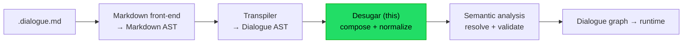
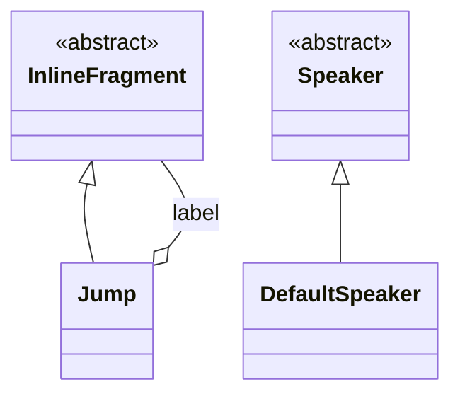

# Implementation note: Desugar

> [!NOTE]
> Status: **proposed** — a design draft, not yet implemented. Component 3 of the
> DialogueDown script compiler, sitting between the transpiler and semantic
> analysis.

## Table of contents

- [Implementation note: Desugar](#implementation-note-desugar)
  - [Table of contents](#table-of-contents)
  - [Goal and scope](#goal-and-scope)
  - [Where it sits](#where-it-sits)
  - [Ubiquitous language](#ubiquitous-language)
  - [Functionality checklist](#functionality-checklist)
  - [Interfaces and abstractions](#interfaces-and-abstractions)
  - [The rewriter foundation](#the-rewriter-foundation)
  - [Key design decisions](#key-design-decisions)
    - [DD1 — Local rewrite; do only what the transpiler deferred](#dd1--local-rewrite-do-only-what-the-transpiler-deferred)
    - [DD2 — A reusable, complete-hook rewriter](#dd2--a-reusable-complete-hook-rewriter)
    - [DD3 — Rules are named functions behind typed hooks](#dd3--rules-are-named-functions-behind-typed-hooks)
    - [DD4 — Jump assembly is a fragment-sequence transform](#dd4--jump-assembly-is-a-fragment-sequence-transform)
    - [DD5 — Default speaker is a sentinel; silent commands fold in](#dd5--default-speaker-is-a-sentinel-silent-commands-fold-in)
    - [DD6 — Same node AST, a document-level stage marker](#dd6--same-node-ast-a-document-level-stage-marker)
    - [DD7 — What Desugar does not touch](#dd7--what-desugar-does-not-touch)
  - [Desugar in pseudocode](#desugar-in-pseudocode)
  - [New AST nodes](#new-ast-nodes)
  - [Error and boundary cases](#error-and-boundary-cases)
  - [Integration](#integration)
  - [Testability](#testability)
  - [Placement in namespaces](#placement-in-namespaces)

## Goal and scope

Desugar is the **normalize-and-compose** stage that runs on the Dialogue AST
between the transpiler and semantic analysis. The transpiler is a faithful,
**local tokenizer**: it deliberately leaves two constructs un-composed. Desugar
performs exactly those, as a **local whole-tree rewrite** — no document-wide
knowledge, no reference resolution.

It does two things:

1. **Assemble jumps.** Collapse a `JumpIndicator · (same-line whitespace) · Link`
   run in a fragment sequence into a single **`Jump`**. A jump is single-line, so a
   `LineBreak` between the `=>` and the link ends it. A dangling `=>` (no link
   after it) degrades back to plain text; a bare link stays a link.
2. **Fill the default speaker.** A `Line` that names no speaker gets the
   **`DefaultSpeaker`** sentinel. A lone command line is just a speaker-less line,
   so this same fill also covers the DSL's **silent command**.

Alongside these, this component builds a small **reusable rewriter foundation** —
an immutable clone-by-default tree transformer with a complete set of typed hooks.
The next component, **semantic analysis**, reuses it and adds a read-only walk of
its own (to gather every speaker, validate references, and compile the graph); that
read traversal is deferred until it has a real consumer to shape its hooks.

**Out of scope**, left to **semantic analysis**: resolving `DefaultSpeaker` to a
concrete speaker (or the system speaker), merging a `PartialSpeakerDeclaration`'s
tags into the speaker it references, binding ids, nesting `SceneHeading`s into
scenes, and validating jump targets.

## Where it sits



Desugar takes a `ScriptDocument` and returns a `ScriptDocument`. The transpiler
emits `JumpIndicator` and `Link` separately and leaves speaker-less lines with a
null speaker; Desugar composes and normalizes those, and passes everything else
through unchanged.

## Ubiquitous language

| Term                        | Meaning                                                                |
| --------------------------- | ---------------------------------------------------------------------- |
| **Desugar**                 | the stage that composes and normalizes the Dialogue AST.               |
| **Rewriter**                | an immutable tree transformer: clone by default, override a few nodes. |
| **Rule**                    | one small, named transform (`FillDefaultSpeaker`, `AssembleJumps`).    |
| **Jump**                    | an assembled jump fragment: a label and an unresolved target.          |
| **DefaultSpeaker**          | the sentinel for "the default speaker", resolved later.                |
| **DesugaredScriptDocument** | the desugared tree, wrapped as a distinct pipeline-stage type.         |
| **Silent command**          | a lone command line, spoken by the default speaker.                    |
| **Dangling `=>`**           | a `JumpIndicator` with no link after it; reads as plain text.          |

## Functionality checklist

- [ ] **Assemble a `Jump`** from `JumpIndicator · (same-line whitespace) · Link`
      in any fragment sequence, folding the between-whitespace into the jump's span.
- [ ] **Degrade a dangling `=>`** to a plain `Text` at the arrow's own span, kept
      granular (folding adjacent text is a later, rendering-stage concern).
- [ ] **Keep a bare `Link`** (no preceding `=>`) as an inline link.
- [ ] **Fill `DefaultSpeaker`** on a `Line` that names no speaker.
- [ ] **Cover silent commands** by the same default-speaker fill.
- [ ] **Reusable rewriter**: clone by default, a complete set of typed hooks
      (blocks, line, speaker, tag, and every fragment sequence).
- [ ] **Invariants after Desugar**: no `JumpIndicator` survives; no `Line` has a
      null speaker.
- [ ] **Wrap the result** in a `DesugaredScriptDocument` stage marker.
- [ ] **Everything else passes through** structurally unchanged.

## Interfaces and abstractions

| Type                      | Responsibility                                                                                                                      | Collaborators                               |
| ------------------------- | ----------------------------------------------------------------------------------------------------------------------------------- | ------------------------------------------- |
| `IScriptDesugarer`        | public seam: `DesugaredScriptDocument Desugar(ScriptDocument, string source)`; `source` is validated only, held for future warnings | `ScriptDocument`, `DesugaredScriptDocument` |
| `Desugarer`               | the default desugarer — a `DialogueAstRewriter` wired with the rules                                                                | rewriter, rules                             |
| `DialogueAstRewriter`     | immutable clone-by-default tree rewrite with a complete set of typed hooks                                                          | `ScriptNode`                                |
| `FillDefaultSpeaker`      | rule: a `Line` with no speaker gets a `DefaultSpeaker`                                                                              | `Line`, `DefaultSpeaker`                    |
| `AssembleJumps`           | rule: fold `JumpIndicator · Link` into `Jump`; degrade dangling                                                                     | `InlineFragment` list                       |
| `Jump` (AST)              | assembled jump fragment: label + unresolved target                                                                                  | `InlineFragment`                            |
| `DefaultSpeaker` (AST)    | the default-speaker sentinel                                                                                                        | `Speaker`                                   |
| `DesugaredScriptDocument` | thin wrapper marking a desugared tree, so stages type-check in order                                                                | `ScriptDocument`                            |

## The rewriter foundation

Desugar is an immutable rewrite that **clones every node except a few**. Rather
than hand-write that clone-recursion once here and again for semantic analysis,
this component builds a small, reusable rewriter modelled on Roslyn's
`CSharpSyntaxRewriter`.

`DialogueAstRewriter` walks the tree and, for each node, **rebuilds it with its
rewritten children** — an identity transform by default. Every node kind that
holds children has a `protected virtual` hook, so a subclass customizes only the
nodes it cares about, never the traversal:

```text
DialogueAstRewriter
  Rewrite(ScriptDocument)             -> ScriptDocument   # entry
  virtual RewriteBlock(ScriptBlock)   -> ScriptBlock      # dispatch: Line / Choices / SceneHeading
  virtual RewriteLine(Line)           -> Line             # rebuild with rewritten speaker + speech
  virtual RewriteSpeaker(Speaker)     -> Speaker          # declarations recurse into their tags
  virtual RewriteSceneHeading(...)    -> SceneHeading
  virtual RewriteChoices(Choices)     -> Choices
  virtual RewriteFragments(list)      -> list             # default: rewrite each fragment
  virtual RewriteFragment(frag)       -> frag             # dispatch: StyledText / Image / Link / Jump / Tag / leaf
  virtual RewriteTag(Tag)             -> Tag              # tags in speech or a speaker prefix
```

The hooks cover **every** child slot — blocks, a line's speaker and speech,
a speaker declaration's tags, a heading title, choice bodies, and every nested
fragment sequence — so a subclass can transform any node kind and the clone reaches
the whole tree. A tag routes through `RewriteTag` wherever it sits (speech or a
speaker prefix), and a null speaker is handled at the `Line` so `RewriteSpeaker`
only ever sees a present one.

Desugar overrides just two hooks; each delegates to a separate, pure **rule**, so
the two transforms stay independent and are never interleaved during traversal:

```text
Desugarer : DialogueAstRewriter
  RewriteLine(line)      = FillDefaultSpeaker(base.RewriteLine(line))
  RewriteFragments(list) = AssembleJumps(base.RewriteFragments(list))
```

A **configurable rule pipeline** (registering rules dynamically) is a deliberate
**future seam**, not built now: two rules of different shapes (a node transform
and a sequence transform) do not need a registry, and the typed hooks already
keep them separate.

A read-only walk (enumerating descendants for collection and validation) is
**deferred to semantic analysis**, where a real consumer will shape its hooks; the
rewriter is the only traversal this component needs.

## Key design decisions

### DD1 — Local rewrite; do only what the transpiler deferred

Desugar composes and normalizes with **local** information: a jump is assembled
from adjacent fragments; a default speaker is filled per line. Nothing here needs
the whole document. Anything that does — resolving which speaker is the default,
merging referenced tags, nesting scenes, validating targets — is **semantic
analysis**. This keeps the stage a pure, total `ScriptDocument → ScriptDocument`
function.

### DD2 — A reusable, complete-hook rewriter

The clone-by-default rewriter is built once and reused by semantic analysis. This
is justified infrastructure (a confirmed second consumer), not speculation. It
gives the "default handling for everything, special handling for some" seam, and
its hooks cover every child slot so any later pass can rewrite any node kind. The
read-only descendant walk semantic analysis will also want is deferred to that
component, so its hooks are shaped by a real consumer rather than guessed here.

### DD3 — Rules are named functions behind typed hooks

Each desugar operation is a separate, independently tested **rule** invoked from a
rewriter hook. This separates concerns (no rule logic tangled into traversal) and
composes cleanly. A dynamic rule **registry** is left as a documented seam — see
[the foundation](#the-rewriter-foundation).

### DD4 — Jump assembly is a fragment-sequence transform

`JumpIndicator` can appear in any jumps-enabled fragment sequence the transpiler
produces — a line's speech and nested `StyledText` children (jumps are disabled
in `SceneHeading` titles, since a heading is itself a jump target). To uphold the
invariant that **no `JumpIndicator` survives Desugar**,
assembly runs on **every** fragment list (via `RewriteFragments`), not one node
type. For each list:

- Scan for a `JumpIndicator`. Look ahead past **blank, same-line** fragments
  (whitespace-only `Text`). If the next fragment is a `Link`, emit a
  `Jump(link.Label, link.Target, span)` whose span covers from the `=>` through
  the link — the between-whitespace is folded in. A jump is single-line, so a soft
  `LineBreak` is not skipped: it stops the scan and the `=>` is left dangling.
- Otherwise the `JumpIndicator` is **dangling**: replace it with a plain
  `Text("=>")` at the arrow's own span. Fragments stay granular, so the degraded
  arrow is left as its own run next to any surrounding text (`the => arrow` becomes
  three `Text` runs) — folding adjacent text is a later, rendering-stage concern.
- A `Link` with no preceding `=>` is left untouched.

### DD5 — Default speaker is a sentinel; silent commands fold in

A `Line` with no speaker gets a **`DefaultSpeaker`** node — a sentinel meaning
"whatever the default is". It is **not** resolved to a concrete speaker here;
binding it to the `##default`-tagged speaker (or the system speaker when none
exists) is semantic analysis, which owns the document-wide speaker table. Because
a lone command line is simply a speaker-less line whose speech is a command, the
DSL's **silent command** needs no special case — the same fill produces a
default-speaker command line (the spec's `@default:` form).

### DD6 — Same node AST, a document-level stage marker

Desugar does not define a parallel "normalized AST". It reuses the Dialogue AST
and adds two node types — `Jump` and `DefaultSpeaker` — that only appear *after*
desugaring. The pre/post distinction ("`JumpIndicator` and null speakers before;
`Jump` and `DefaultSpeaker` after") is an **invariant**, not a separate node
hierarchy, keeping the model small.

At the **document level**, though, Desugar returns a distinct
`DesugaredScriptDocument` — a thin wrapper around the rewritten `ScriptDocument`
that surfaces `Body` — so the pipeline type-checks in order: semantic analysis
takes a `DesugaredScriptDocument`, so a raw transpiler tree cannot reach it and
Desugar cannot be skipped. The marker attests **ordering** (Desugar ran), not the
internal invariant, which the implementation and tests uphold.

### DD7 — What Desugar does not touch

References and declarations pass through unchanged: `SpeakerDeclaration`,
`SpeakerNameReference`, `SpeakerIdReference`, and `PartialSpeakerDeclaration` are
left for semantic analysis to resolve. In particular, merging a
`PartialSpeakerDeclaration`'s tags **into the referenced speaker** needs that
speaker's declaration (document-wide), so it belongs to semantic analysis, not
here. (The transpiler note's D11 currently assigns that merge to Desugar; it will
be corrected to say semantic analysis.)

## Desugar in pseudocode

```text
Desugar(document, source):
    validate(source)                         # held for future warnings; not read here
    rewritten = Rewriter.Rewrite(document)   # clone-by-default walk; hooks apply the rules
    return DesugaredScriptDocument(rewritten)

# hook overrides
RewriteLine(line):
    line = base.RewriteLine(line)         # rewrite speech first (assembles inner jumps)
    return FillDefaultSpeaker(line)

RewriteFragments(fragments):
    fragments = base.RewriteFragments(fragments)   # rewrite each fragment first
    return AssembleJumps(fragments)

# rules
FillDefaultSpeaker(line):
    if line.Speaker is null:
        return line with Speaker = DefaultSpeaker(line.Span)
    return line

AssembleJumps(fragments):
    out = []
    i = 0
    while i < fragments.length:
        if fragments[i] is JumpIndicator:
            j = skipBlanks(fragments, i + 1)
            if fragments[j] is Link link:
                out += Jump(link.Label, link.Target, cover(fragments[i], link))
                i = j + 1
                continue
            out += Text("=>", fragments[i].Span)                 # dangling
        else:
            out += fragments[i]
        i += 1
    return out
```

## New AST nodes

Both live in `DialogueDown.Script.Ast` beside the other nodes; Desugar merely
introduces them.



- **`Jump(IReadOnlyList<InlineFragment> Label, string Target, SourceSpan Span)`**
  — an `InlineFragment`. `Label` is the link's fragment label (so it can carry
  styling or tags); `Target` is the link's raw, unresolved target. The span
  covers the `=>` through the link.
- **`DefaultSpeaker(SourceSpan Span)`** — a `Speaker`. A leaf sentinel with no
  data; it marks "the default speaker" for semantic analysis to resolve.

## Error and boundary cases

| Case                                                        | Behavior                                                                                                    |
| ----------------------------------------------------------- | ----------------------------------------------------------------------------------------------------------- |
| Dangling `=>` (`the => arrow`)                              | degrades to a plain `Text` at its own span, kept granular; **not** an error                                 |
| `=>` then non-whitespace then link (`=> x [a](b)`)          | `=>` is dangling (only same-line whitespace may sit between); the link stays bare                           |
| `=>` then line break then link (`=>` ⏎ `[a](b)`)            | a jump is single-line; the break ends it, so `=>` is dangling and the link stays bare                       |
| `=>` immediately before a link (`=>[a](b)`)                 | assembled; no whitespace to fold                                                                            |
| Multiple jumps in one speech                                | each `JumpIndicator · Link` pair assembled independently; a later stage may warn (sequential jumps confuse) |
| `JumpIndicator` nested in `StyledText`                      | assembled or degraded in place, so none survive                                                             |
| Line already has a speaker                                  | passes through unchanged                                                                                    |
| Line with no speaker (any speech, including a lone command) | gets `DefaultSpeaker`                                                                                       |
| `PartialSpeakerDeclaration` / references                    | untouched — resolved by semantic analysis                                                                   |
| Empty document                                              | an empty `ScriptDocument`, unchanged                                                                        |

## Integration

- **Upstream — Transpiler:** consumes the `ScriptDocument` it produces. Desugar
  reads nothing from the raw source — every span and fragment it acts on is
  already in the tree — but it still takes the `source` string and **validates
  it**, holding it (like the transpiler) as the anchor for future desugar
  warnings. When diagnostics land, `source` should move into a shared
  `CompilationContext` threaded through every stage instead of a bare parameter.
- **Downstream — Semantic analysis:** receives a `DesugaredScriptDocument`
  (jumps composed, default speakers filled) and resolves references, merges
  partial-declaration tags, nests scenes, and validates jump targets — reusing
  the `DialogueAstRewriter` from this component and adding its own read walk.
- **Compiler seam:** the CLI's `IScriptCompiler` will chain front-end → transpiler
  → **Desugar** → semantic analysis → graph; Desugar plugs in as one link via
  `IScriptDesugarer`.

## Testability

- **Rules** are pure functions tested in isolation on hand-built fragments and
  lines: jump assembly (assemble, fold same-line whitespace, single-line boundary,
  dangling degrade, nested), and default-speaker fill (fills only when absent, covers a command
  line). A shared Object Mother builds AST inputs; `DialogueAstAssert` grows
  `AssertJump` / `AssertDefaultSpeaker` helpers.
- **Rewriter** is tested by a trivial subclass (identity clone leaves the tree
  equal, across every fragment sequence and speaker form) and small subclasses
  that change one node kind (text, tags) to confirm the hook reaches everywhere
  while the rest stays unchanged.
- **Desugarer** is tested end to end on small `ScriptDocument`s built through the
  transpiler, asserting the invariants (no `JumpIndicator`, no null speaker) and
  the composed shapes. Tests run in parallel with thread-safe fakers.

## Placement in namespaces

| Concern                                  | Namespace                     |
| ---------------------------------------- | ----------------------------- |
| New AST nodes (`Jump`, `DefaultSpeaker`) | `DialogueDown.Script.Ast`     |
| `DialogueAstRewriter`                    | `DialogueDown.Script.Ast`     |
| Desugarer, rules, `IScriptDesugarer`     | `DialogueDown.Script.Desugar` |
| `DesugaredScriptDocument`                | `DialogueDown.Script.Desugar` |
