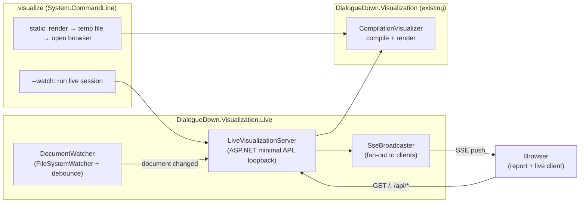
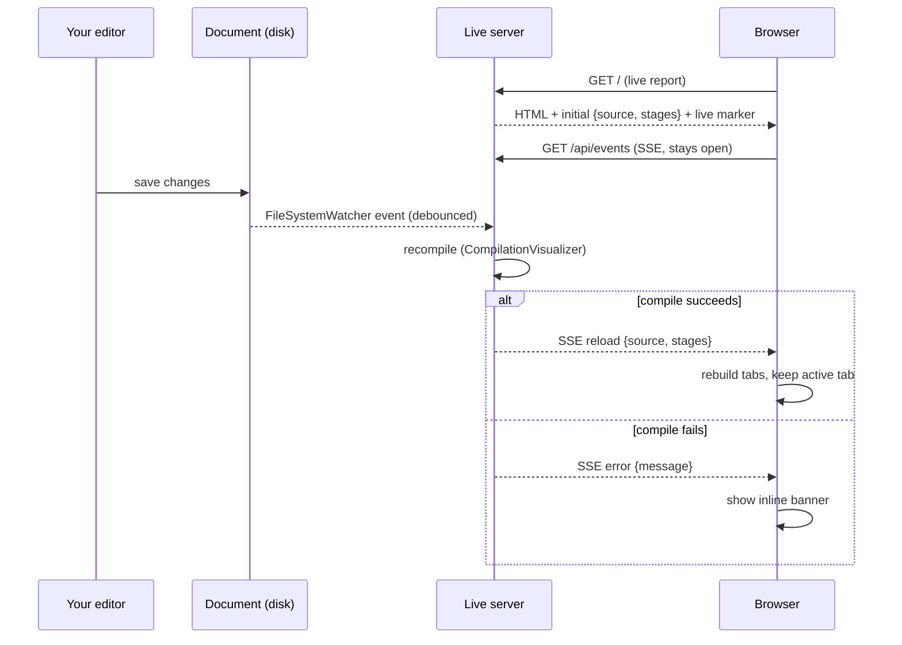

# Live Visualization — Hot Reload

> [!IMPORTANT]
> Status: **approved — implementation in progress**. This is the first of three
> components that turn the static compilation report into a live, server-backed
> experience. This component adds a command-line entry point and a **watch mode**
> that serves the report from a local server and refreshes the browser whenever
> the source file changes on disk. **Live editing** (an in-browser editor, Save,
> dirty tracking) and a **file launcher** (in-app document picker) follow as
> separate components and reuse the foundation laid here.

The compilation report is transparent but **frozen**: you run it once and get a
snapshot. When you are iterating on a `.dialogue.md` script, you want the report
to keep up — save the file, see the new AST. This component delivers that loop
without touching the offline report: a `visualize` command renders a file (as
today), and `--watch` keeps the rendered report in sync with the file on disk.

## Table of contents

- [Goal and scope](#goal-and-scope)
- [Ubiquitous language](#ubiquitous-language)
- [Functionality checklist](#functionality-checklist)
- [Architecture](#architecture)
- [Hot-reload flow](#hot-reload-flow)
- [Interfaces and abstractions](#interfaces-and-abstractions)
- [HTTP surface](#http-surface)
- [Key design decisions](#key-design-decisions)
- [Error and boundary cases](#error-and-boundary-cases)
- [Security](#security)
- [Integration](#integration)
- [Testability](#testability)

## Goal and scope

Give the visualization a **command-line entry point** and a **watch mode** that
keeps the report live against a file on disk.

**In scope:**

- A `visualize` CLI over the existing renderer:
  - `visualize <file>` — **static mode**: compile the file, write a self-contained
    report, and open it in the browser (today's offline artifact, now one command).
  - `visualize <file> --watch` — **watch mode**: start a local server bound to the
    file, serve the live report, and **hot-reload** the browser on every on-disk
    change.
- A local **live server** (loopback only) that compiles the document, serves the
  report, watches the file, and **pushes** recompiled stages to the browser.
- A small **live client** in the existing frontend that, when served live,
  subscribes to server pushes and rebuilds the tabs in place (keeping your active
  tab), with an inline banner for compile or file errors.

**Out of scope (deferred to later components):**

- **Editing in the browser, Save, and dirty tracking** — Component 2 (Live
  Editing). This component's report is **read-only**; the file changes from your
  editor, not from the page.
- **Picking a document from within the app** — Component 3 (File Launcher).
- Any change to the offline, embedded `report.html` behavior.

## Ubiquitous language

The domain is a running server reflecting a file. These terms are used verbatim in
the note, code, tests, and CLI help.

| Term | Meaning |
| --- | --- |
| **Document** | The `.dialogue.md` source file on disk being visualized. |
| **Report** | The rendered visualization of a document (Source tab + stage graphs). |
| **Static mode** | One-shot render to a self-contained file, no server (today's behavior, now via the CLI). |
| **Live session** | A running server bound to one document, serving its report and pushing updates. |
| **Watch mode** | A live session that reflects **on-disk** changes; the report is read-only. |
| **Hot reload** | The cycle triggered by a document change: recompile, then push the fresh stages to the browser. |
| **Live client** | The browser-side code (active only when served live) that subscribes to pushes and updates the report. |

Terms introduced by later components — **buffer**, **dirty**, **save**, **live
mode** (Component 2) and **launcher** (Component 3) — are noted where this design
leaves a seam for them, but are not built here.

## Functionality checklist

- [ ] `visualize <file>` renders a document and opens the self-contained report.
- [ ] `visualize <file> -o <path>` writes the report to a path instead of opening.
- [ ] `visualize <file> --watch` starts a loopback live session and opens the browser.
- [ ] `--watch` prints the URL and keeps running until interrupted (Ctrl+C).
- [ ] Saving the document in an external editor updates the browser within ~1s.
- [ ] The report rebuilds in place on reload, preserving the active tab.
- [ ] A compile error after a change shows an inline banner, not a blank page; the
      session recovers on the next good save.
- [ ] Deleting/renaming the document shows a "document missing" banner and recovers
      when it reappears.
- [ ] Multiple open browser tabs all receive updates.
- [ ] Missing file / not `.dialogue.md` / bad arguments fail with a clear message.

## Architecture

A new project, **`DialogueDown.Visualization.Live`**, owns all web and CLI
concerns and depends on the existing render library. The render library stays free
of any web dependency.

The render library gains a **public** seam for two operations the server needs:
compile a source to stages, and render the report HTML with an optional **live
marker**. `CompilationVisualizer` (today `internal`) becomes public for this.

## Hot-reload flow

## Interfaces and abstractions

| Type | Responsibility | Collaborators |
| --- | --- | --- |
| `Program` (CLI) | Parse arguments; dispatch to static render or a live session. | `System.CommandLine`, `CompilationVisualizer`, `LiveVisualizationServer` |
| `LiveVisualizationServer` | Build and run the loopback web app; wire endpoints, watcher, and broadcaster; own the compile-and-broadcast cycle. | ASP.NET, `CompilationVisualizer`, `DocumentWatcher`, `SseBroadcaster` |
| `DocumentWatcher` | Wrap `FileSystemWatcher`; **debounce** editor write bursts; raise one "changed"/"removed" event with fresh text. | `FileSystemWatcher` |
| `SseBroadcaster` | Track connected SSE clients; fan out an event to all; drop closed ones. | ASP.NET response streams |
| `ReportPayload` | DTO for `{ path, source, stages }` (reuses `DisplayGraph`). | `DisplayGraph` |
| `LiveEvent` | Tagged push payload: `reload { source, stages }`, `error { message }`. | — |
| `resolveMode` (frontend) | Detect the live marker and start the live client; otherwise render static as today. | `EventSource`, existing `runApp` |
| `live-client.ts` (frontend) | Subscribe to `/api/events`; on push, rebuild the report preserving the active tab; render error banners. | `runApp`, `renderReport` |

## HTTP surface

Loopback only. This component is **read-only**; Component 2 adds the write routes.

| Route | Purpose |
| --- | --- |
| `GET /` | The live report HTML: the embedded report with the initial `{ source, stages }` injected and the **live marker** set (so the client goes live). |
| `GET /api/document` | Current `{ path, source, stages }` — used by the client to re-sync on reconnect. |
| `GET /api/events` | **SSE** stream. Emits `reload { source, stages }` after a successful recompile and `error { message }` on failure. |

## Key design decisions

### D1 — A separate project keeps the render library web-free

The server needs ASP.NET, a file watcher, and a process host — none of which
belong in the render library (which is a diagnostics companion to a deliberately
dependency-light core). A new `DialogueDown.Visualization.Live` project holds all
of it and references the render library. The render library exposes only a small
public seam (compile, render-with-live-marker); it never learns about HTTP.

### D2 — ASP.NET Core minimal API over a hand-rolled listener

A minimal API gives JSON, static content, and streaming responses idiomatically,
and — crucially — is **testable in memory** via `WebApplicationFactory`, so the
endpoints get real unit tests without binding a socket. A hand-rolled
`HttpListener` would add no dependency but cost boilerplate and testability. We
prefer the mature, well-understood host.

### D3 — Server-Sent Events over WebSocket

Hot reload only needs the server to **push** ("recompiled — here are the new
stages"). Everything the client sends (later: save) is a normal HTTP request. SSE
is exactly one-way server→client over plain HTTP, with a built-in browser
`EventSource` that **auto-reconnects**. WebSocket's full-duplex channel would be
unused complexity. If Component 2 or 3 later needs rich bidirectional messaging,
this decision can be revisited in isolation.

### D4 — One build; the live client is dormant until marked live

The frontend stays a **single bundle**. The static report leaves the live marker
unset and behaves exactly as today; the live server sets it, and the small live
client (an `EventSource` subscription plus an in-place rebuild) activates. The
live client is a few kilobytes, so carrying it in the offline artifact is
negligible — and it keeps one build and one code path to test. (Component 2's
editor, CodeMirror, is large, so **that** component introduces lazy-loading; this
one does not need it.)

### D5 — Reload rebuilds in place, preserving the active tab

On a push, the client re-runs the report render against the new payload and
restores the previously active tab index, rather than doing a full
`location.reload()`. You keep your place (Source vs a stage tab) across saves,
which is the point of a live loop. Finer per-graph state — zoom/pan and which
nodes are expanded — resets on reload; preserving it is deferred (a possible
Component 2 refinement). A full reload remains the fallback if a rebuild ever
throws.

### D6 — Debounce the watcher and carry the fresh text in the event

Editors save by writing several times or writing a temp file and renaming, so
`FileSystemWatcher` fires bursts. `DocumentWatcher` **debounces** (~150 ms) and
coalesces to a single event, reads the file once, and hands the text to the
server — so the compile step is decoupled from raw filesystem noise and always
sees the latest content.

### D7 — Static mode opens a temp report by default

`visualize <file>` with no flag renders to a temp file and opens the browser (the
common case), with `-o <path>` to write somewhere instead and `--no-open` to
suppress launching. This makes the everyday "just show me" path a single word
while keeping scripting options.

## Error and boundary cases

| Case | Intended behavior |
| --- | --- |
| File does not exist / wrong extension | CLI exits with a clear message before starting a session. |
| Compile error on first render (`--watch`) | Server still starts and serves a report whose banner shows the error; a later good save clears it. |
| Compile error after a change | Push an `error` event; the browser shows an inline banner and keeps the last good graph; recovers on the next good save. |
| Editor save burst (temp-write + rename) | Debounced and coalesced into one recompile of the final content. |
| Document deleted or renamed away | Push a "document missing" banner; keep the session alive; resume when the path reappears. |
| Rapid successive saves | Debounce; always compile the most recent content. |
| Multiple browser tabs / reconnect | Broadcast to all SSE clients; a reconnecting client re-syncs via `GET /api/document`. |
| Port in use | Bind an ephemeral loopback port by default; print the chosen URL. |

## Security

This is a **development tool**, and the note says so plainly:

- The server binds **loopback (`127.0.0.1`) only**, on an ephemeral port — never a
  public interface.
- No authentication; it reads exactly one document and serves its report. There
  are **no write routes** in this component (Component 2 adds writes and will
  tighten this: confining writes to the one document path).
- No arbitrary file serving: the frontend assets are the embedded bundle, and the
  only file read is the document the CLI was pointed at.

## Integration

- **Render library:** `CompilationVisualizer` becomes **public**; the library
  exposes a public seam to (a) compile a source to `IReadOnlyList<DisplayGraph>`,
  (b) render the **live** report HTML, and (c) serialize the current document
  payload (`{ path, source, stages }`) for the API and push events. The existing
  static `RenderHtmlReport(source)` is unchanged, and the JSON/HTML plumbing stays
  internal. The **live marker rides in the injected report payload** (`report.live`
  with the document path); when it is absent the report behaves exactly as the
  static artifact — no separate template slot.
- **Frontend:** `main.ts` gains a branch — live marker present ⇒ start the live
  client; otherwise the current static path (`window.__DD_REPORT__`) is untouched.
  The report-building code is factored so both the initial render and a hot reload
  call the same `renderReport(report)`.
- **Existing tests:** unchanged. The static renderer and its embedding keep their
  current behavior and assertions.
- **CI:** a new job builds and tests the `.Live` project; the frontend live e2e
  (below) launches the real server via Playwright's `webServer`.

## Testability

Following the test pyramid, with the existing 100%-coverage bar as the target.

- **Server (.NET, in-memory):** `WebApplicationFactory<Program>` drives the
  endpoints without a socket — `GET /` serves a live-marked report; `GET
  /api/document` returns the payload; `GET /api/events` emits a `reload` after a
  simulated change. New test project `DialogueDown.Visualization.Live.Tests`.
- **`DocumentWatcher`:** point it at a temp file; write, and assert a single
  debounced event with the fresh text; delete, and assert a "removed" event.
- **`SseBroadcaster`:** connect fake clients; assert fan-out and that closed
  clients are dropped.
- **CLI:** `System.CommandLine` parsing is unit-tested (static vs watch, `-o`,
  bad input); a smoke test covers the static render path.
- **Frontend (Vitest):** the live client with a mocked `EventSource` — a `reload`
  rebuilds and preserves the active tab; an `error` shows a banner.
- **Frontend (Playwright e2e):** spawn the **real** `dotnet` live server against a
  temp document (`webServer` in the Playwright config); load the page, modify the
  file from the test, and assert the report updates; delete the file and assert the
  banner. This is the project's first server-backed e2e.
