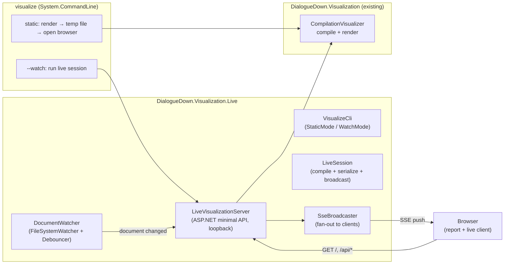
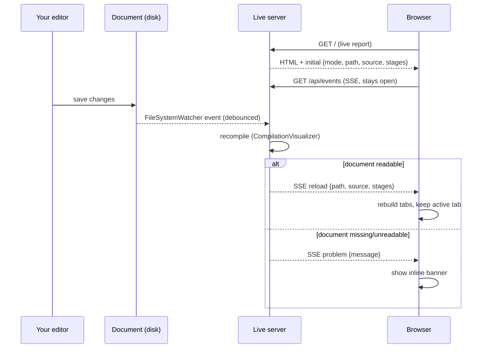

# Live Visualization — Hot Reload

> [!NOTE]
> Status: **implemented** (Component 1 of live visualization). This component adds
> a `visualize` command-line entry point and a **watch mode** that serves the
> report from a local server and refreshes the browser whenever the source file
> changes on disk. **Live editing** (an in-browser editor, Save, dirty tracking)
> and a **file launcher** (in-app document picker) follow as separate components
> and reuse the foundation laid here.

The compilation report is transparent but **frozen**: you run it once and get a
snapshot. When you are iterating on a `.dialogue.md` script, you want the report
to keep up — save the file, see the new AST. This component delivers that loop
without touching the offline report: a `visualize` command renders a file (as
today), and `--watch` keeps the rendered report in sync with the file on disk.

## Table of contents

- [Goal and scope](#goal-and-scope)
- [Ubiquitous language](#ubiquitous-language)
- [Functionality checklist](#functionality-checklist)
- [Architecture](#architecture)
- [Hot-reload flow](#hot-reload-flow)
- [Interfaces and abstractions](#interfaces-and-abstractions)
- [HTTP surface](#http-surface)
- [Key design decisions](#key-design-decisions)
- [Error and boundary cases](#error-and-boundary-cases)
- [Security](#security)
- [Integration](#integration)
- [Testability](#testability)

## Goal and scope

Give the visualization a **command-line entry point** and a **watch mode** that
keeps the report live against a file on disk.

**In scope:**

- A `visualize` CLI over the existing renderer:
  - `visualize <file>` — **static mode**: compile the file, write a self-contained
    report, and open it in the browser (today's offline artifact, now one command).
  - `visualize <file> --watch` — **watch mode**: start a local server bound to the
    file, serve the live report, and **hot-reload** the browser on every on-disk
    change.
- A local **live server** (loopback only) that compiles the document, serves the
  report, watches the file, and **pushes** recompiled stages to the browser. It
  hosts a **consent-gated serve root** for the report's images: the document's own
  folder by default, a broader folder only with consent or an explicit
  `--render-root`.
- A small **live client** in the existing frontend that, when served live,
  subscribes to server pushes and rebuilds the tabs in place (keeping your active
  tab), with an inline banner for compile or file errors.

**Out of scope (deferred to later components):**

- **Editing in the browser, Save, and dirty tracking** — Component 2 (Live
  Editing). This component's report is **read-only**; the file changes from your
  editor, not from the page.
- **Picking a document from within the app** — Component 3 (File Launcher).
- Any change to the offline, embedded `report.html` behavior.

## Ubiquitous language

The domain is a running server reflecting a file. These terms are used verbatim in
the note, code, tests, and CLI help.

| Term | Meaning |
| --- | --- |
| **Document** | The `.dialogue.md` source file on disk being visualized. |
| **Report** | The rendered visualization of a document (Source tab + stage graphs). |
| **Static mode** | One-shot render to a self-contained file, no server (today's behavior, now via the CLI). |
| **Live session** | A running server bound to one document, serving its report and pushing updates. |
| **Watch mode** | A live session that reflects **on-disk** changes; the report is read-only. |
| **Hot reload** | The cycle triggered by a document change: recompile, then push the fresh stages to the browser. |
| **Live client** | The browser-side code (active only when served live) that subscribes to pushes and updates the report. |
| **Mode** | How a report is shown — `static`, `watch`, or `live` — carried in the payload and surfaced by the status-bar badge. |
| **Status bar** | The footer's left area: the mode badge and the document path. |
| **Serve root** | The folder the live server hosts as static files (the document's own folder, or a broader one it was allowed to host), and the URL sub-path the report is served at under it. |
| **Hosting consent** | The user's opt-in to host a folder above the document's own so images outside the document's folder can load. |
| **Render root** | An explicit serve root named on the CLI (`--render-root`); an up-front hosting consent that skips the prompt. |

Terms introduced by later components — **buffer**, **dirty**, **save**, **live
mode** (Component 2) and **launcher** (Component 3) — are noted where this design
leaves a seam for them, but are not built here.

## Functionality checklist

- [x] `visualize <file>` renders a document and opens the self-contained report.
- [x] `visualize <file> -o <path>` writes the report to a path instead of opening.
- [x] `visualize <file> --watch` starts a loopback live session and opens the browser.
- [x] `--watch` prints the URL and keeps running until interrupted (Ctrl+C).
- [x] Saving the document in an external editor updates the browser within ~1s.
- [x] The report rebuilds in place on reload, preserving the active tab.
- [x] Deleting the document shows a banner, not a blank page; the session recovers
      when the file reappears (a later good save pushes a fresh `reload`).
- [x] Multiple open browser tabs all receive updates.
- [x] Missing file / not `.dialogue.md` / bad arguments fail with a clear message.
- [x] A **status bar** shows the mode badge (with a hover description) and the
      document path (middle-truncated, full path on hover, click to copy).
- [x] The footer help is **contextual** — the Source tab explains the source and
      preview panes; a graph tab explains graph navigation.
- [x] Relative image links in the report resolve: images inside the document's
      folder load with no prompt; images outside it load only after hosting consent
      or an explicit `--render-root`, and never expose files above the folder
      silently.

The design also called for a distinct inline banner on a **compile error** after a
change. On `main` today the single Markdown stage always parses (any text is valid
Markdown), so there is no compile-failure path to surface yet; the banner is wired
for document-read failures (missing file) and will cover compile errors unchanged
once a stage that can reject input (the Dialogue AST) lands.

## Architecture

A new project, **`DialogueDown.Visualization.Live`**, owns all web and CLI
concerns and depends on the existing render library. The render library stays free
of any web dependency.

The render library gains a **public** seam for the operations the server needs:
compile a source to stages, render the report HTML in a given **mode**, list the
document's local image references, and serialize the current document payload.
`CompilationVisualizer` (previously `internal`) is public for this.

## Hot-reload flow

## Interfaces and abstractions

| Type | Responsibility | Collaborators |
| --- | --- | --- |
| `VisualizeCli` | Build the `visualize` command (arguments and options); dispatch to static or watch mode. | `System.CommandLine`, `StaticMode`, `WatchMode` |
| `StaticMode` / `WatchMode` | The two run paths: render-to-file-and-open, and run a live session until canceled. Watch mode also resolves the serve root before starting. | `CompilationVisualizer`, `LiveVisualizationServer`, `ServeRootResolver`, `DocumentWatcher` |
| `DocumentValidation` | Reject a missing file or wrong extension with a clear message. | — |
| `ServeRootResolver` / `IHostConsent` / `ConsoleHostConsent` | Decide the serve root: the document's folder by default, the longest common ancestor of the document and any outside images with consent, or an explicit `--render-root`. `ConsoleHostConsent` is the opt-in prompt (auto-declines off a terminal). | `CompilationVisualizer.LocalImageReferences`, `ServeRoot` |
| `LiveVisualizationServer` | Build and run the loopback web app; host the serve root's static files, serve the report at its sub-path, map the endpoints, and stream SSE. | ASP.NET, `LiveSession`, `ServeRoot`, `SseBroadcaster` |
| `LiveSession` | Own one document: render its live HTML, serialize its payload, and broadcast a `reload`/`problem` on refresh. | `CompilationVisualizer`, `SseBroadcaster` |
| `DocumentWatcher` | Wrap `FileSystemWatcher`; **debounce** editor write bursts (via `Debouncer`) into one callback. | `FileSystemWatcher`, `Debouncer` |
| `SseBroadcaster` | Track connected SSE clients (one channel each); fan out an event to all; drop closed ones. | ASP.NET response streams |
| `LiveEvent` | A tagged push: an event name (`reload`/`problem`) and its JSON data. Payloads are serialized by `CompilationVisualizer.SerializeDocument` (reusing `DisplayGraph`). | `DisplayGraph` |
| `resolveReport` + `startLiveClient` (frontend) | `main.ts` reads the injected payload; when its mode is `watch`/`live`, `startLiveClient` subscribes and drives updates — otherwise the static path is unchanged. | `EventSource`, `runApp` |
| `live-client.ts` (frontend) | Subscribe to `/api/events`; on `reload`, rebuild the report preserving the active tab; on `problem`, show the banner. | `AppController` (`runApp`) |
| `mode-badge.ts` / `path-display.ts` / `help.ts` (frontend) | The status bar and contextual help: the mode badge with its tooltip, the click-to-copy document path, and per-tab help content. | Tippy.js, `runApp`'s activate |

## HTTP surface

Loopback only. This component is **read-only**; Component 2 adds the write routes.

| Route | Purpose |
| --- | --- |
| `GET /` (or the document sub-path) | The report HTML: the embedded report with the initial `{ mode, path, source, stages }` injected so the client goes live. When the serve root is broadened, the report is served at the document's sub-path and `/` redirects there. |
| `GET /api/document` | Current `{ mode, path, source, stages }` — used by the client to re-sync on reconnect. |
| `GET /api/events` | **SSE** stream. Emits `reload { path, source, stages }` after a successful recompile and `problem { message }` when the document cannot be read. |
| `GET /<asset>` | Static files under the **serve root** (the document's folder, or a broader folder allowed via consent / `--render-root`), so the report's relative image links — including `../` links when the root is broadened — resolve. |

## Key design decisions

### D1 — A separate project keeps the render library web-free

The server needs ASP.NET, a file watcher, and a process host — none of which
belong in the render library (which is a diagnostics companion to a deliberately
dependency-light core). A new `DialogueDown.Visualization.Live` project holds all
of it and references the render library. The render library exposes only a small
public seam (compile, render-with-live-marker); it never learns about HTTP.

### D2 — ASP.NET Core minimal API over a hand-rolled listener

A minimal API gives JSON, static content, and streaming responses idiomatically,
and hosts cleanly on an ephemeral loopback port so the endpoints get real
integration tests over HTTP. A hand-rolled `HttpListener` would add no dependency
but cost boilerplate and testability. We prefer the mature, well-understood host.

### D3 — Server-Sent Events over WebSocket

Hot reload only needs the server to **push** ("recompiled — here are the new
stages"). Everything the client sends (later: save) is a normal HTTP request. SSE
is exactly one-way server→client over plain HTTP, with a built-in browser
`EventSource` that **auto-reconnects**. WebSocket's full-duplex channel would be
unused complexity. If Component 2 or 3 later needs rich bidirectional messaging,
this decision can be revisited in isolation.

### D4 — One build; the live client is dormant unless the mode is live

The frontend stays a **single bundle**. A `static` payload leaves the live client
dormant and behaves exactly as today; a `watch`/`live` payload activates the small
live client (an `EventSource` subscription plus an in-place rebuild). The live
client is a few kilobytes, so carrying it in the offline artifact is negligible —
and it keeps one build and one code path to test. (Component 2's editor,
CodeMirror, is large, so **that** component introduces lazy-loading; this one does
not need it.)

### D5 — Reload rebuilds in place, preserving the active tab

On a push, the client re-runs the report render against the new payload and
restores the previously active tab index, rather than doing a full
`location.reload()`. You keep your place (Source vs a stage tab) across saves,
which is the point of a live loop. Finer per-graph state — zoom/pan and which
nodes are expanded — resets on reload; preserving it is deferred (a possible
Component 2 refinement). A full reload remains the fallback if a rebuild ever
throws.

### D6 — Debounce the watcher; the session re-reads on each change

Editors save by writing several times, or writing a temp file and renaming, so
`FileSystemWatcher` fires bursts. `DocumentWatcher` **debounces** (~150 ms, via a
small `Debouncer`) and coalesces the burst into a single callback. The callback is
the session's refresh: it re-reads and recompiles the current file once, so the
compile step is decoupled from raw filesystem noise and always sees the latest
content. Splitting the timing into `Debouncer` keeps it deterministically
testable, apart from the filesystem.

### D7 — Static mode opens a temp report by default

`visualize <file>` with no flag renders to a temp file and opens the browser (the
common case), with `-o <path>` to write somewhere instead and `--no-open` to
suppress launching. This makes the everyday "just show me" path a single word
while keeping scripting options. In watch mode, `--port` pins the loopback port
(otherwise an ephemeral port is chosen and its URL printed), and `--render-root`
names the folder to host for assets (see D9).

### D8 — A status bar surfaces the mode and the document; help is contextual

The footer's left side is a **status bar**: a **mode badge** (Static / Hot Reload
/ Live) with a hover tooltip explaining the mode, and the **document path**
(middle-truncated so the filename always shows, full path on hover, click to
copy). The client reads a single `mode` field from the payload — driving the
badge and deciding whether to open a live connection — so one value carries the
whole distinction. The "How to use" help is **contextual**: it shows source/preview
guidance on the Source tab and graph navigation on a stage tab, so the help
matches what the reader is looking at.

### D9 — Host the smallest folder that covers the document and its images, with consent

A report's Markdown can reference relative resources (``).
In watch mode the report is served over HTTP, so those links resolve only if the
server serves the files — but a document must not be able to make files **above**
its own folder readable without the user knowing. Hosting is therefore minimal and
opt-in:

- **Default:** host the document's **own folder**. Images inside it (the common
  case) resolve with no prompt. The report is served at `/`.
- **Images outside the folder:** compute the **longest common ancestor** of the
  document and those images — the smallest folder that covers them — and **ask for
  consent** before hosting it. A refusal (or no interactive terminal) falls back to
  the document's folder, so those images simply do not load; nothing above the
  folder is exposed silently.
- **`--render-root <dir>`:** name the folder to host explicitly (must contain the
  document). This is an up-front consent that skips the prompt — useful for scripts
  and CI.

When the hosted folder is broader than the document's own, the report is served at
the **sub-path** mirroring the document's location under the root (e.g. `/proj/`),
and `/` redirects there. The browser then resolves the report's relative image
links — including `../` links that climb above the document's folder — against the
right place; API routes stay absolute (`/api/...`) and are unaffected. Traversal
outside the hosted root is blocked by the static-files middleware (see Security).

## Error and boundary cases

| Case | Intended behavior |
| --- | --- |
| File does not exist / wrong extension | CLI exits with a clear message before starting a session. |
| Editor save burst (temp-write + rename) | Debounced and coalesced into one recompile of the final content. |
| Document deleted | Push a `problem` event; the browser shows a banner; the session stays alive and a later save pushes a fresh `reload`. |
| Rapid successive saves | Debounce; always compile the most recent content. |
| Multiple browser tabs / reconnect | Broadcast to all SSE clients; a reconnecting client re-syncs via `GET /api/document`. |
| Image outside the document's folder | Prompt to host the smallest covering folder; on consent serve it (report at the document sub-path), on refusal serve only the document's folder so that image does not load. |
| No interactive terminal (piped / CI) | The hosting prompt is skipped and declined; a message points at `--render-root` to allow it up front. |
| `--render-root` missing or not containing the document | CLI exits with a clear message before starting a session. |
| Port in use (`--port`) | Kestrel fails to bind and the process reports the error; omit `--port` to take an ephemeral port. |
| Compile error after a change (future) | Deferred: today's single Markdown stage always parses, so there is no failure to surface. The `problem` event and banner are wired and will carry compile errors once a rejecting stage (Dialogue AST) lands. |

## Security

This is a **development tool**, and the note says so plainly:

- The server binds **loopback (`127.0.0.1`) only**, on an ephemeral port — never a
  public interface.
- No authentication; it reads one document and serves its report. It also serves
  static files, but only from a **consent-gated root**: the document's own folder by
  default, and a broader folder only when the user allows it (an interactive prompt)
  or names it with `--render-root`. A document cannot silently make files above its
  own folder readable. There are **no write routes** in this component (Component 2
  adds writes and will tighten this: confining writes to the one document path).
- File serving is scoped to the hosted root; the static-files middleware blocks
  traversal above it. Because this is a loopback, dev-only tool, hosting the chosen
  folder's files over `127.0.0.1` is acceptable once the user has consented to it.

## Integration

- **Render library:** `CompilationVisualizer` becomes **public**; the library
  exposes a public seam to (a) compile a source to `IReadOnlyList<DisplayGraph>`,
  (b) render the report HTML in a given **mode** (static/watch/live), (c) serialize
  the current document payload (`{ mode, path, source, stages }`) for the API and
  push events, and (d) list the document's **local image references**
  (`LocalImageReferences`) so the server can decide which folder to host.
  `VisualizationMode` (public) names the valid modes. The existing static
  `RenderHtmlReport(source)` still works (mode `static`), and the JSON/HTML plumbing
  stays internal. The **mode rides in the injected report payload** (with the
  document path when known); a `static` payload behaves exactly as the offline
  artifact — no separate template slot.
- **Serve root:** watch mode reads the document's local image references and, via
  `ServeRootResolver`, picks the folder to host — the document's folder, the common
  ancestor of the document and any outside images (with consent), or an explicit
  `--render-root`. The server hosts that folder and serves the report at the
  document's sub-path under it.
- **Frontend:** `main.ts` branches on the payload's `mode` — a `watch`/`live` mode
  starts the live client, `static` leaves the current path (`window.__DD_REPORT__`)
  untouched. `runApp` returns an `AppController` so both the initial render and a
  hot reload drive the same in-place rebuild.
- **Existing tests:** unchanged. The static renderer and its embedding keep their
  current behavior and assertions.
- **CI:** the .NET job already builds and tests the whole solution, so it now
  covers the `.Live` project; the Frontend job additionally builds the live server
  and runs the live e2e, which launches it via Playwright's `webServer`.

## Testability

Following the test pyramid, with the existing 100%-coverage bar as the target
(the Live project's own sources reach it; one async SSE-handler continuation line
is a coverage artifact — the tests disconnect mid-stream, so the read loop never
exits normally).

- **Server (.NET, real loopback):** each test starts a `LiveVisualizationServer`
  on an ephemeral `127.0.0.1` port and drives it with `HttpClient` — `GET /` serves
  a live-marked report; `GET /api/document` returns the payload; `GET /api/events`
  streams a `reload` after the session refreshes. New test project
  `DialogueDown.Visualization.Live.Tests`.
- **`Debouncer`:** trigger rapidly and assert one fire; trigger again after the
  delay and assert a second — timing tested apart from the filesystem.
- **`DocumentWatcher`:** point it at a temp file; write, and assert the debounced
  callback fires; write rapidly, and assert the callback is coalesced.
- **`SseBroadcaster`:** connect fake clients; assert fan-out and that a disposed
  subscriber is dropped and its channel completed.
- **CLI:** `System.CommandLine` parsing is unit-tested (static vs watch, `-o`,
  bad input); `StaticMode` and a watch-invoke test cover both run paths with an
  injected fake browser launcher.
- **Frontend (Vitest):** the live client with an injected fake `EventSource` — a
  `reload` rebuilds and preserves the active tab; a `problem` shows a banner.
- **Frontend (Playwright e2e):** a separate config starts the **real** `dotnet`
  live server against a temp document (`webServer`); the browser loads the page,
  the test modifies the file, and the report updates in place; deleting the file
  shows the banner. A second `webServer` started with `--render-root` covers the
  broadened-root path: its document links an image outside its folder, and the test
  asserts `/` redirects to the document sub-path and the outside image loads. This
  is the project's first server-backed e2e.
