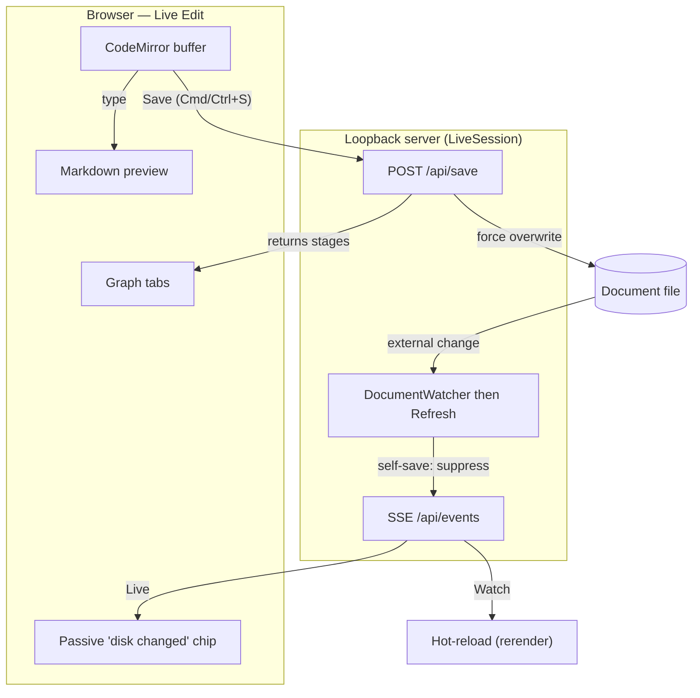

# Live Visualization — Live Edit

> [!NOTE]
> Status: **implemented** (Component 2 of live visualization). Hot Reload (Component 1)
> watches a file and pushes a recompiled report; the File Launcher (Component 3)
> browses and opens scripts. This component makes the report's **Source tab an
> editor** — read-only in Static and Watch (for a consistent look), **editable in
> Live Edit**. In Live Edit you type, the **preview updates as you type**, and
> **Save** (⌘/Ctrl+S or the Save button) writes the buffer to disk and recompiles the
> graphs. Live Edit owns its buffer: it ignores disk hot-reload (a passive chip notes
> when the file changed on disk; refresh to re-sync) and Save is a force-overwrite.
>
> Like the rest of the visualization tooling, this surface is "vibe-coded" (see the
> visualization note's maturity caveat); the core engine stays the reviewed surface.

## Table of contents

- [Goal and scope](#goal-and-scope)
- [Ubiquitous language](#ubiquitous-language)
- [Functionality checklist](#functionality-checklist)
- [Architecture](#architecture)
- [The editor](#the-editor)
- [How the report updates](#how-the-report-updates)
- [Save, dirty, and disk changes](#save-dirty-and-disk-changes)
- [HTTP surface](#http-surface)
- [CLI and launcher](#cli-and-launcher)
- [Key design decisions](#key-design-decisions)
- [Security](#security)
- [Testability](#testability)
- [Follow-ups](#follow-ups)

## Goal and scope

Today the report is a read-only mirror of a file. Live Edit makes the **Source tab
an editor** and closes the write loop: you type in the browser, the **preview**
re-renders **as you type** (client-side, no server), and **Save** writes the buffer
to the file and **recompiles the graphs**. The editor is present in every mode for a
consistent look — read-only in Static and Watch, editable only in Live Edit.

In scope:

- The Source tab is a **code editor in every mode** — read-only in Static and Watch,
  editable in **Live Edit**.
- **Preview-as-you-type**: each edit re-renders the Markdown preview from the buffer
  in the browser, with no server round-trip.
- **Save** (⌘/Ctrl+S **and** a Save button) writes the buffer to the file and
  **recompiles the graphs** — the save response returns fresh stages, updated in
  place. Save is a **force-overwrite**.
- A **dirty** marker on the Source tab, and a **`beforeunload`** prompt when the
  buffer is dirty.
- **Live Edit ignores disk hot-reload**: a passive "**file changed on disk — refresh
  to sync**" chip appears when the file changes under it; an explicit refresh
  re-seeds the editor from disk.
- Wiring the mode end to end: `visualize <script> --live` and the launcher's **Live
  Edit** option (no longer disabled).

Out of scope:

- **Save As** — a fast follow-up (writing to a new path is a separate, root-confined
  concern); this loop is editing + Save to the open file.
- **Compiling the buffer without saving** — Save is the compile trigger; the preview
  already updates live for free.
- Multi-file editing, autosave, collaborative editing, or editing the graphs (they
  stay a read-only projection of the source).

## Ubiquitous language

Reuses the live-visualization language (**session**, **mode**, **report**,
**hot-reload**). New here:

| Term | Meaning |
| --- | --- |
| **Buffer** | The in-browser editor's current text — what you are typing, which may differ from the file on disk. |
| **Preview-as-you-type** | Re-rendering the Markdown **preview** from the buffer on each edit, client-side, without touching disk or the server. |
| **Dirty** | The buffer differs from the last saved content; shown as a marker on the Source tab. |
| **Save** | Writing the buffer to the document file (⌘/Ctrl+S or the Save button) — a force-overwrite — which also recompiles the graphs. |
| **Disk change** | The file changed on disk under a Live session; surfaced as a passive "refresh to sync" chip, never an auto-reload. |

## Functionality checklist

- [x] The Source tab is a code editor (Markdown) in every mode, seeded with the
      file's contents; it is **read-only** in Static and Watch and **editable** in
      Live Edit.
- [x] Typing re-renders the **preview** in place (client-side); the editor text and
      cursor are untouched and no server call is made.
- [x] The graphs **do not** change while typing — they recompile on **Save**.
- [x] **⌘/Ctrl+S** and a **Save** button write the buffer to the file (force
      overwrite), recompile, and update the graph tabs from the response; the dirty
      marker clears.
- [x] The Source tab shows a **dirty** marker whenever the buffer differs from the
      last saved content; leaving/refreshing while dirty triggers a `beforeunload`
      confirmation.
- [x] In Live Edit an external change to the file shows a passive "**file changed on
      disk — refresh to sync**" chip; the editor is **never** auto-reloaded over your
      edits. Refresh re-seeds from disk.
- [x] `visualize <script> --live --root <dir>` opens the editor directly; the
      launcher's **Live Edit** option is enabled and opens the same.

## Architecture

Live Edit reuses the live server, session, watcher, and SSE stream; it adds **one**
write route, **one** `LiveSession` method, and an editor in the Source tab.

- **`LiveSession.Save(source)`** writes the buffer to `DocumentPath` (force
  overwrite), **records the exact bytes written**, recompiles, and returns the
  document payload (`{ mode, path, source, stages }`). It already compiles from a
  provided string via `SerializeDocument`.
- **The server** (both `LiveVisualizationServer` for `--live` and `LauncherServer`
  for the launcher) maps `POST /api/save` to it.
- **The watcher** still calls `Refresh` on a disk change; `Refresh` **suppresses**
  the event when disk == last-saved (the browser's own write) and otherwise pushes
  `reload` — which **Watch** turns into a hot-reload and **Live** turns into the
  passive chip.
- **The frontend** builds a **CodeMirror** editor in the Source tab (editable only in
  Live Edit), re-renders the preview on each edit, and wires Save, the dirty marker,
  the `beforeunload` guard, and the disk-changed chip.

## The editor

The Source tab's left pane is a **CodeMirror 6** editor (Markdown language, line
numbers, the app's light/dark theme) in **every** mode; it is `editable` only when
`mode === "live"`, so the Source tab looks and behaves identically across modes. In
the other modes it is read-only through CodeMirror's `readOnly` facet (not by
disabling the editor), which keeps the pane **focusable and selectable** — a
keyboard user can still reach and scroll the source, and text can be copied. The
right pane stays the live preview; the draggable divider is unchanged. (The
node-detail panel keeps highlight.js for its snippets.)

**Why CodeMirror 6** (a lean, vetted shortlist):

| Option | Fit | Note |
| --- | --- | --- |
| **CodeMirror 6** | Best | MIT, modern, modular, TS-first, ~small bundle; the de-facto lightweight web editor, and its read-only mode is a one-line flag. *(Recommended)* |
| Monaco | Heavy | VS Code's editor — excellent but a large bundle (workers), overkill for one Markdown pane in a single-file report. |
| Ace | Dated | Mature but an older architecture; larger and less TS-friendly than CM6. |

The report is a single inlined file, so CodeMirror is **bundled in now** (it cannot
be lazy-loaded across the single-file boundary), which grows the report bundle —
accepted for a diagnostics tool. A lazy-loaded editor build is a possible
[follow-up](#follow-ups).

## How the report updates

Live Edit keeps the two costs apart so editing feels instant and the graphs stay
meaningful:

1. **Preview — client-side, as you type.** Each edit re-renders the Markdown preview
   from the buffer in the browser (the same `marked` render the Source tab already
   uses). It is instant and never calls the server, so a writer can draft freely.
2. **Graphs — on Save.** The graph tabs recompile only when you Save: `POST
   /api/save` writes the file, the server compiles, and the **response carries the
   fresh `{ stages }`**, which the client applies **in place** (the editor text and
   cursor are left alone). Compiling on every keystroke is deliberately avoided — it
   is the laggy, low-value path.
3. **Disk awareness — passive.** The watcher still streams over SSE. **Watch** mode
   hot-reloads as today. **Live Edit** does **not** reload; it only shows a passive
   "file changed on disk" chip so you can choose to refresh.

## Save, dirty, and disk changes

- **Dirty** is a client notion: the buffer differs from the last **saved** content
  (the seed, then whatever Save last wrote). The Source tab shows a marker (a dot,
  mirroring an editor's unsaved indicator), and a **`beforeunload`** handler prompts
  before a refresh/close/navigation while dirty — the one guard against losing edits.
- **Save** (`POST /api/save { source }`), triggered by **⌘/Ctrl+S** or the **Save
  button** in the status bar (enabled only while dirty), is a **force-overwrite**: it
  writes the buffer to the file regardless of the disk state, then recompiles and
  returns the stages. `LiveSession.Save` records the bytes it wrote; when the watcher
  fires for that write, `Refresh` sees disk == last-saved and **suppresses** the
  event, so a save never bounces back. The dirty marker clears; other open tabs
  (viewers) get one hot-reload.
- **Disk change.** When the watcher fires and disk != last-saved (a real external
  edit), Live Edit shows the passive "**file changed on disk — refresh to sync**"
  chip and otherwise **ignores** it — the buffer is never clobbered. An explicit
  page refresh re-seeds the editor from the file. (Watch mode still hot-reloads.)

## HTTP surface

Adds **one** write route to the existing live surface (loopback-only):

| Method + path | Purpose | Response |
| --- | --- | --- |
| `POST /api/save` | Write the **buffer** (`{ source }`) to the document file (force overwrite) and recompile | `{ mode, path, source, stages }` (or `4xx` with `{ message }` on a write error) |
| `GET /` , `GET /api/document` , `GET /api/events` | (Existing) initial report, current document, SSE stream | Unchanged; Live uses `/api/events` only for the disk-changed chip |

## CLI and launcher

- **CLI.** `--live` stops being a launcher-only placeholder: the bypass rule accepts
  Live (a fully specified `visualize <script> --live --root <dir>` opens the editor
  directly), and a new `IVisualizeRunner.RunLiveAsync` starts a `LiveSession` in
  `live` mode behind a server with the save route — parallel to `RunWatchAsync`. The
  `--mode`/`--live` help text drops "not yet available".
- **Launcher.** The **Live Edit** mode option is enabled (no longer `disabled`), so a
  script opened from the launcher with Live Edit serves an editable report; the
  `LauncherServer` maps the same save route to its active session.

## Key design decisions

### D1 — The editor is present in every mode, editable only in Live Edit

For a consistent Source tab, every mode uses the same CodeMirror editor; `editable`
is just a flag, off in Static and Watch and on in Live Edit. This unifies the source
pane's look and code (one implementation) instead of a read-only `<pre>` in some
modes and an editor in another.

### D2 — Preview compiles client-side as you type; the graphs recompile on Save

Re-rendering the Markdown preview is cheap and local, so it runs on every edit.
Compiling the graphs is the expensive, server-side path, so it runs only on Save —
which also matches a writer's flow (draft, then save to see the compiled structure)
and avoids a laggy per-keystroke recompile. Save returns the fresh stages, so there
is no separate "compile" round-trip.

### D3 — Live Edit owns its buffer; disk changes are passive, never a clobber

The in-browser buffer is the source of truth for a Live session, so Live Edit does
**not** subscribe to hot-reload: an external change shows a passive "refresh to sync"
chip and nothing more, and a `beforeunload` prompt guards a dirty refresh/close.
Save is a **force-overwrite** (last write from the editor wins). This is simpler than
a merge/conflict UI and never silently clobbers the editor; the cost is that you are
blind to disk changes until you notice the chip and refresh — acceptable for a
single-user local tool.

### D4 — Save records what it wrote, to tell a save from an external edit

Writing to disk trips the watcher. Rather than race-y flags, `LiveSession.Save`
remembers the exact content it wrote; `Refresh` compares the current disk content to
it and suppresses the self-triggered event. A genuine external edit differs and is
pushed (a hot-reload for Watch, the chip for Live).

### D5 — One write route on the shared session

Editing is one `LiveSession` method (`Save`) plus one route (`POST /api/save`),
shared by the direct (`LiveVisualizationServer`) and launcher (`LauncherServer`)
paths. No new server, no new session type, and the graphs come back in the save
response — no extra endpoint.

### D6 — Save As is deferred

Writing to a *new* path reintroduces a path surface (a user-chosen target, confined
to the root) that is a feature in itself. To keep this loop focused on editing and
Save-in-place, **Save As is a fast follow-up**. When it lands it will follow the
VS Code model — **switch the editor to the new file** — with the target confined to
the serve root.

## Security

Same posture as Hot Reload and the Launcher, plus the first **write** route:

- **Loopback only.** The server binds `127.0.0.1`; the save route is reachable only
  from the local machine.
- **Save targets exactly the open document.** `/api/save` writes the session's own
  `DocumentPath` — the file already being visualized — never a path from the request
  body. The body carries only the new *content*, so editing cannot write anywhere the
  session was not already pointed. (Save As, when it lands, will confine its target
  to the serve root with the launcher's `LaunchRoot` guard.)

## Testability

- **`LiveSession`** (unit, .NET): `Save(buffer)` writes the file (force overwrite)
  and returns compiled stages for the buffer; after a save, `Refresh` suppresses the
  self-triggered event, while an external change still broadcasts `reload`.
- **Server routes** (integration, .NET): `POST /api/save` on the standalone live
  server and on the launcher's active session writes the document and returns the
  compiled payload; it is live-only (a read-only report returns `404`), and a write
  error returns a message, not a `500`.
- **Live Edit logic** (unit, vitest): the state machine drives dirty/save/disk-change
  through injected ports — the first edit marks dirty and arms the unload guard,
  repeated edits do not re-fire it, Save posts the **latest** edited buffer and
  applies the recompiled stages and clears dirty, a failed save stays dirty, Save is a
  no-op when nothing changed, and a disk change shows the chip without a reload.
- **Editor and Save round-trip** (end to end, Playwright live): CodeMirror and the
  DOM/fetch/`EventSource` ports are browser-integration (excluded from the jsdom unit
  suite), so `visualize --live` over a temp file exercises them for real — type and
  assert the preview updates while the graphs and file are unchanged and the Save
  button enables; click **Save** (and press ⌘/Ctrl+S) and assert the file now matches,
  the graphs updated, and dirty clears; edit the file on disk and assert the chip
  appears while the buffer is preserved.

## Follow-ups

Both are deliberately out of this component and picked up next:

- **Lazy-loaded editor.** CodeMirror is bundled into the single-file report **now**
  (no cross-file lazy-load), which grew the report bundle to ~750 KB (from ~270 KB —
  CodeMirror adds ~480 KB) — accepted for a diagnostics tool. A separate non-inlined
  "editor" build that loads CodeMirror on demand is a possible follow-up if the bundle
  size matters.
- **Save As.** Writes the buffer to a new file and **switches the editor to it** (the
  VS Code model), with the target confined to the serve root. The remaining detail —
  the target-path UX (a confined field vs. the launcher's folder browser) — is settled
  when this is picked up.
