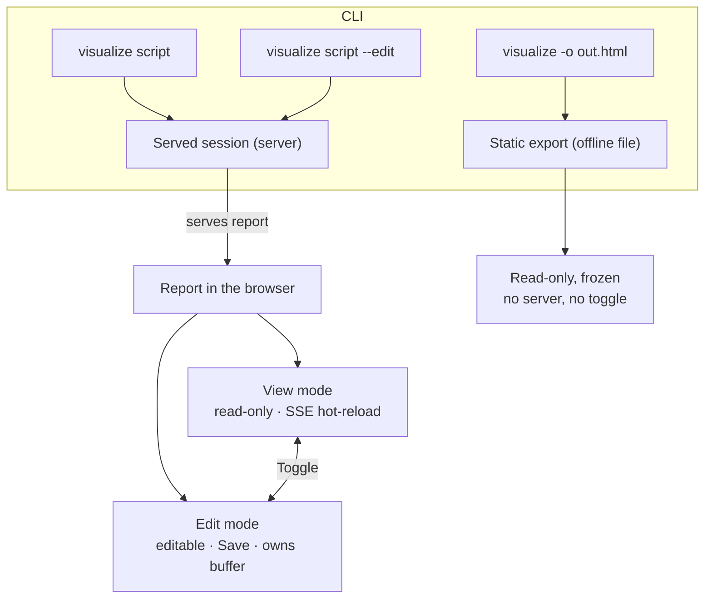

# Live Visualization — View and Edit Modes

> [!NOTE]
> Status: **proposed**. This component reshapes the visualization's three launch
> modes (`static`, `watch`, `live`) into a single **served session** with a runtime
> **View ⇄ Edit** toggle, plus a **static export** for an offline snapshot. Viewing
> and editing stop being launch-time decisions and become a Vim-like switch you flip
> in the browser — the report keeps its buffer, cursor, and undo history across the
> switch. It builds directly on Hot Reload (the **View** mechanism — watch + SSE) and
> Live Edit (the **Edit** mechanism — the editor + Save), unifying how they are
> chosen and presented.

## Table of contents

- [Goal and scope](#goal-and-scope)
- [Ubiquitous language](#ubiquitous-language)
- [Functionality checklist](#functionality-checklist)
- [The model](#the-model)
- [The View ⇄ Edit toggle](#the-view--edit-toggle)
- [Runtime editability (one editor, reconfigured)](#runtime-editability-one-editor-reconfigured)
- [Payload](#payload)
- [CLI and launcher](#cli-and-launcher)
- [Key design decisions](#key-design-decisions)
- [Security](#security)
- [Testability](#testability)
- [Migration and breaking changes](#migration-and-breaking-changes)
- [Follow-ups](#follow-ups)

## Goal and scope

Today the visualization has three launch modes that conflate two independent axes:

|              | read-only | editable |
| ------------ | --------- | -------- |
| offline file | `static`  | —        |
| live server  | `watch`   | `live`   |

`static` and `watch` are both **read** experiences; the only real difference is that
`watch` keeps up with the file. This component collapses the *interaction* axis into
one runtime toggle and keeps the offline artifact as an explicit export:

- **Served session** (the interactive default) — one local server, with a **View ⇄
  Edit** toggle in the browser.
- **Static export** (`-o`) — an offline, read-only, frozen snapshot; no server.

**In scope:** the unified served server, the View/Edit toggle (UI + runtime editor
reconfiguration), the payload change, the new CLI/launcher surface, and reconciling
the Hot Reload and Live Edit notes' mode language. **Out of scope:** the SSE/watch
mechanism itself (Hot Reload) and the editor/Save mechanism itself (Live Edit) — this
note only changes how they are selected and toggled.

## Ubiquitous language

| Term               | Meaning                                                                                                  |
| ------------------ | -------------------------------------------------------------------------------------------------------- |
| **Served session** | A running local server that watches the file, serves the report, and accepts saves. Hosts View and Edit. |
| **View mode**      | Read-only and **auto-updating**: the report hot-reloads on on-disk changes (the old Watch).              |
| **Edit mode**      | Editable: type, Save to disk, the session owns its buffer (the old Live Edit).                           |
| **Toggle**         | The in-report control that switches a served session between View and Edit.                              |
| **Static export**  | The offline, read-only, frozen report written by `-o` (the old Static, now export-only).                 |

"Static" is no longer an interactive mode — it is the export. "Watch" becomes
**View**; "Live" becomes **Edit**.

## Functionality checklist

- [ ] `visualize <script>` serves the report and opens it in **View** (read-only,
      auto-updating); `--edit` opens it in **Edit**.
- [ ] A **toggle** in the report switches View ⇄ Edit at runtime, **without
      reloading** — the buffer, cursor position, scroll, and undo history survive.
- [ ] **View**: the editor is read-only and the report hot-reloads on disk changes;
      no Save button.
- [ ] **Edit**: the editor is editable, Save (⌘/Ctrl-S or the button) writes the file,
      the session owns its buffer (disk changes raise the passive chip, not a reload),
      and the `beforeunload` guard is armed while dirty.
- [ ] Switching **Edit → View while dirty** prompts first (the same guard), since View
      may hot-reload over unsaved edits.
- [ ] `visualize -o <out.html> <script>` writes a **static export** — offline,
      read-only, no server, no toggle.
- [ ] The launcher offers **View / Edit** (default View) and opens a served session.
- [ ] `--watch`, `--live`, and `--mode` are **removed**.

## The model

One server type backs every interactive session (the former Watch and Live servers
become one). It always: watches the file, serves the report and its assets, streams
disk-change events over SSE, and exposes `POST /api/save`. **View vs Edit is a client
concern** — the same server serves both; the client decides whether to edit, save,
and how to react to SSE.

The **static export** path is unchanged in spirit (a self-contained HTML snapshot)
but is reached only through `-o`; it renders read-only with no toggle because there is
no server to save to or watch with.

## The View ⇄ Edit toggle

A **segmented control** — `[ 👁 View | ✎ Edit ]` — sits where the mode badge is today
(the status bar), showing and switching the current mode with one click. It replaces
the passive mode badge on served sessions; a static export shows a plain read-only
indicator instead (no toggle). Native `<button>`s (ARIA `role="group"`, the active one
`aria-pressed="true"`) — no dependency, and rock-solid across browsers.

Switching **Edit → View while the buffer is dirty** routes through the same
confirmation as leaving the page, because View can hot-reload over unsaved edits;
declining keeps you in Edit.

## Runtime editability (one editor, reconfigured)

The switch must not rebuild the editor (that would drop the cursor, scroll, and undo
history). CodeMirror supports exactly this through a **`Compartment`**: the
editability-dependent extensions live in a compartment that is reconfigured on toggle.

- **In the compartment:** `EditorState.readOnly`, the content's `aria-readonly`, and
  the authoring aids that only make sense when editable (close-brackets, the format
  keymap, emphasis auto-surround).
- **Reconfiguring** (View → Edit or back) dispatches a single transaction that swaps
  the compartment's contents; the document, selection, scroll, and history are
  untouched.

The client's Live Edit controller and SSE wiring switch with the mode: **View** listens
for `reload` and re-renders the graphs/preview; **Edit** ignores `reload` (raising the
passive "changed on disk" chip) and enables Save.

## Payload

`report.mode` becomes one of:

| `mode`   | Served? | Client behavior                                    |
| -------- | ------- | -------------------------------------------------- |
| `static` | no      | Read-only, no toggle, no SSE (the offline export). |
| `view`   | yes     | Served; mount the toggle; **start in View**.       |
| `edit`   | yes     | Served; mount the toggle; **start in Edit**.       |

The client treats `view`/`edit` as "served" (mount the toggle, open the SSE stream)
and `static` as the frozen export. There is no separate `watch`/`live` — the server is
one thing; `view`/`edit` only choose the **initial** side of the toggle.

## CLI and launcher

| Command                                   | Result                                     |
| ----------------------------------------- | ------------------------------------------ |
| `visualize`                               | Launcher (browse + open a served session). |
| `visualize <script>`                      | Served session, **View**.                  |
| `visualize <script> --edit`               | Served session, **Edit**.                  |
| `visualize <script> -o <out.html>`        | **Static export** (offline snapshot).      |
| `--root`, `--port`, `--no-open`, `--pick` | Unchanged.                                 |

- **Removed:** `--watch`, `--live`, `--mode`. (`--edit` is the only mode flag; View is
  the default; export is `-o`.)
- **Launcher:** the Static/Watch/Live radios become **View / Edit** (default View);
  opening always starts a served session. (Exporting stays a CLI concern.)
- Internally `LaunchMode` becomes `{ View, Edit }`; the served runner is one method
  with a starting mode; the export keeps the existing `RunStatic` path.

## Key design decisions

### D1 — Static becomes an export, not an interactive mode

`static` and `watch` differ only in whether the view keeps up; folding read-only into
the auto-updating **View** removes a redundant mode. The genuinely different artifact —
a portable, serverless, frozen file — is worth keeping, so it stays as the `-o`
**export** rather than a launch mode. The interactive default becomes a served session
(a running server until Ctrl-C) instead of a one-shot file; the offline file is one
`-o` away.

### D2 — View/Edit is a client toggle over one server

The server always watches, serves, and accepts saves; the client chooses View or Edit.
This makes the toggle instant (no relaunch, no server round-trip) and keeps the backend
simple (one server type). The cost — `/api/save` is reachable on the loopback server
even in View — is acceptable for a local diagnostics tool (see [Security](#security)).

### D3 — Toggle via a CodeMirror `Compartment`, preserving editor state

Reconfiguring a compartment (not rebuilding the editor) is the idiomatic CodeMirror
way to flip read-only/editable at runtime, and it preserves the buffer, cursor, scroll,
and undo history — essential for a Vim-like mode switch.

### D4 — A native segmented control, no new dependency

A two-state View/Edit switch is best served by native buttons (a segmented control):
fully stylable, keyboard- and screen-reader-friendly, and the most cross-browser-stable
option (the browser renders them). Third-party select/menu libraries (Tom Select,
Choices.js, Downshift) add *features* — search, custom option rendering — not
*stability*, so none is warranted here. (A richer picker, if ever wanted, is a separate
optional enhancement; Tom Select — Apache-2.0, vanilla-TS — would be the pick.)

### D5 — Remove `--watch`, `--live`, and `--mode`

With one served session and a runtime toggle, the launch mode collapses to "served
(View by default, `--edit` for Edit)" plus the `-o` export. The old flags no longer map
to anything, so they are removed rather than kept as confusing aliases. This is a
pre-1.0 breaking change (see [Migration](#migration-and-breaking-changes)).

## Security

The served session's `POST /api/save` stays exactly as hardened by Live Edit
(loopback-only, root-confined path). It is now reachable while the client is in View,
but the client never calls it there, and the server was already a local, loopback,
single-user tool. A stricter server-side lock (rejecting saves unless the client
"entered Edit") would add round-trips and state for no real gain on a local tool, so it
is intentionally not done.

## Testability

- **CLI** (unit, .NET): `visualize <script>` runs a served session in View;
  `--edit` starts it in Edit; `-o` exports; the bypass rule accepts the new surface;
  `--watch`/`--live`/`--mode` are gone (parsing them errors).
- **Served server** (integration, .NET): one server serves the report, streams
  `reload`, and accepts `/api/save` — unchanged from Hot Reload + Live Edit, minus the
  per-mode split.
- **Toggle** (end to end, Playwright live): a served session starts in View
  (read-only, no Save); the toggle flips to Edit (editable, Save appears) **preserving
  the buffer and cursor**; typing then toggling to View prompts while dirty; an
  external change hot-reloads in View but only chips in Edit.
- **Toggle control** (unit, vitest): the segmented control renders both states,
  reflects the active one (`aria-pressed`), and calls its handler on click.

## Migration and breaking changes

Pre-1.0, so the flag removal is acceptable. `--watch` → default (View); `--live` →
`--edit`; `--mode static` → `-o`. The launcher's mode names change (Watch → View, Live
→ Edit). Documented in the changelog and the CLI notes.

## Follow-ups

- **Deep-link / remember the mode.** Optionally persist the last-used mode (like the
  theme) or accept it in the URL, so a served session reopens where you left off.
- **Server-side Edit lock.** If the tool ever leaves loopback, gate `/api/save` behind
  an explicit "enter Edit" so View is read-only end to end.
