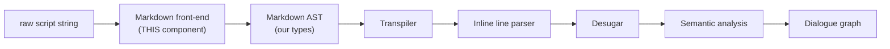
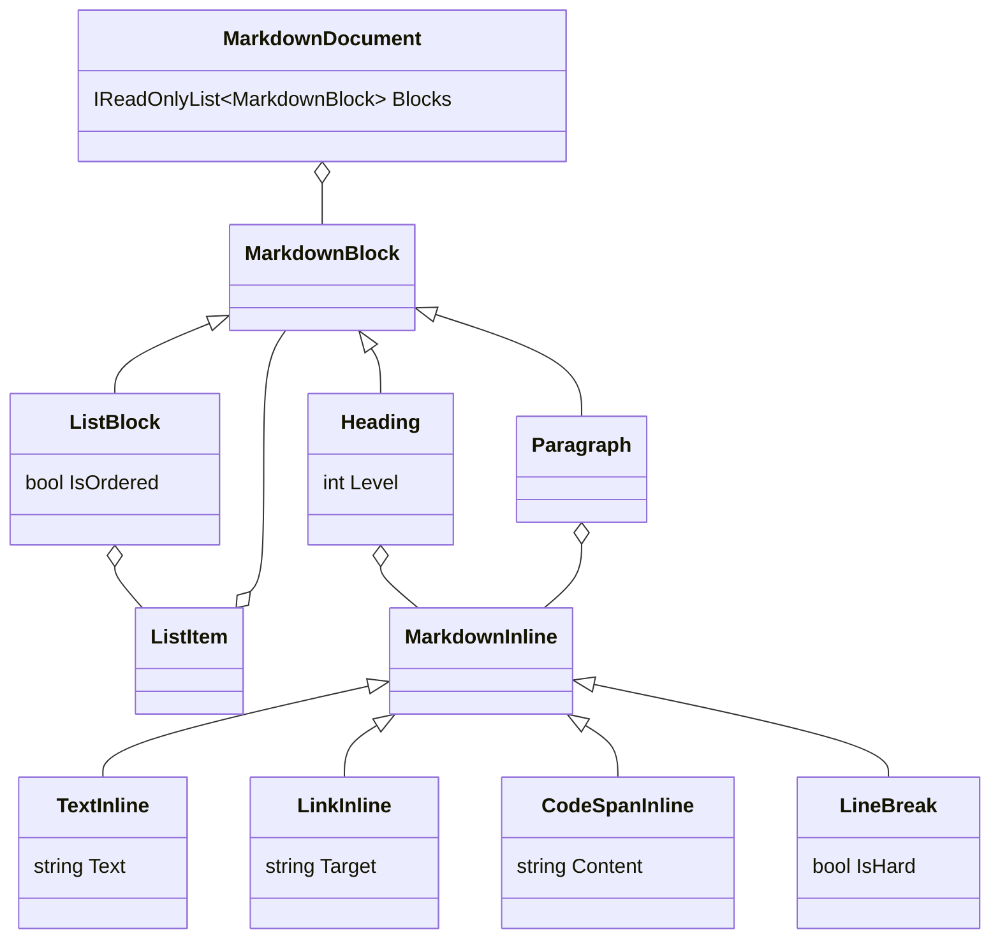

# Implementation note: Markdown front-end

> [!NOTE]
> Status: **proposed** — awaiting review. Not yet implemented.
> Component 1 of the DialogueSystem script compiler.

## Table of contents

- [Implementation note: Markdown front-end](#implementation-note-markdown-front-end)
  - [Table of contents](#table-of-contents)
  - [Goal and scope](#goal-and-scope)
  - [Where it sits](#where-it-sits)
  - [Functionality checklist](#functionality-checklist)
  - [Interfaces and abstractions](#interfaces-and-abstractions)
  - [The Markdown AST model](#the-markdown-ast-model)
  - [Key design decisions](#key-design-decisions)
    - [D1 — Own AST as an anti-corruption layer (chosen)](#d1--own-ast-as-an-anti-corruption-layer-chosen)
    - [D2 — Keep speech text raw](#d2--keep-speech-text-raw-recommended-extract-text-from-source-spans)
    - [D3 — Faithful-to-Markdown boundary](#d3--faithful-to-markdown-boundary)
    - [D4 — Immutability and source spans](#d4--immutability-and-source-spans)
    - [D5 — Comment handling: recognize and discard](#d5--comment-handling-recognize-and-discard)
    - [D6 — Minimal pipeline; unmodeled constructs become raw text](#d6--minimal-pipeline-unmodeled-constructs-become-raw-text)
    - [D7 — Line breaks preserved with a hard/soft flag](#d7--line-breaks-preserved-with-a-hardsoft-flag)
  - [Markdig to AST mapping](#markdig-to-ast-mapping)
  - [Error and boundary cases](#error-and-boundary-cases)
  - [Integration](#integration)
  - [Testability](#testability)
  - [Resolved decisions (from review)](#resolved-decisions-from-review)
  - [Open questions](#open-questions)
  - [Planned follow-up components (out of scope here)](#planned-follow-up-components-out-of-scope-here)

## Goal and scope

Convert a raw dialogue-script string into a small, **DSL-agnostic Markdown
abstract syntax tree (AST)** that later compiler stages consume. This component
owns *syntax only*: it recognizes Markdown structure (headings, lists, paragraphs,
links, code spans, comments) and nothing about dialogue meaning.

**In scope:**

- Parse a string into our own Markdown AST.
- Apply a **narrowed grammar** so only DSL-relevant constructs are modeled, and
  speech text stays raw.
- Hide the third-party parser (Markdig) behind an adapter so it can be swapped.

**Out of scope** (later components):

- Any dialogue semantics: speakers, tags, the `:` split, jumps (`=>`), queries,
  commands, succession, choices-as-graph. These belong to the **transpiler** and
  **inline line parser** that consume this AST.

## Where it sits



The boundary is deliberate: this component stops at a faithful Markdown tree.
Grouping headings into sections, splitting `Speaker: Speech`, and interpreting
`=>`/code spans all happen downstream.

## Functionality checklist

- [x] Parse an arbitrary string into a `MarkdownDocument` without throwing on
      ordinary prose.
- [x] Model ATX headings (`#`..`######`) with level and inline content.
- [x] Model paragraphs with inline content.
- [x] Model unordered and ordered lists, including **nested** lists (choice
      nesting depends on this).
- [x] Model list items as containers of blocks.
- [x] Expose Markdown **links** (`[label](target)`) as inline nodes (jumps need
      the target later).
- [x] Expose **inline code spans** (`` `...` ``) with their raw inner text
      (queries/commands are parsed later).
- [x] **Recognize and strip HTML comments** (`<!-- ... -->`) so they never leak
      into speech; they are discarded, not modeled (D5).
- [x] Keep speech/text **raw**: emphasis and other styling markers are **not**
      interpreted; their literal characters survive.
- [x] Attach a **source span** (start offset + length) to every node for later
      diagnostics; a line/column can be derived from an offset downstream if needed.
- [x] Recognize `#`..`######` **only at line start** as headings; a `#` elsewhere
      in a line stays literal text (tag semantics are decided downstream).
- [x] Accept every list marker (`-`, `+`, `*`, and ordered `1.` / `1)`) as a list;
      preserve the ordered flag but do not reinterpret ordered vs unordered here.
- [x] Preserve in-paragraph **line breaks** as `LineBreak` nodes, keeping the
      **hard vs soft** distinction (two trailing spaces or a backslash is hard).
      Speech-boundary meaning is assigned downstream, not here (D7).
- [x] Behave deterministically on empty input, whitespace-only input, and mixed
      line endings.

## Interfaces and abstractions

| Type | Kind | Responsibility | Collaborators |
| --- | --- | --- | --- |
| `IMarkdownParser` | `internal interface` | Port: `MarkdownDocument Parse(string source)`. The stable seam the rest of the compiler depends on. | consumed by the transpiler |
| `MarkdigMarkdownParser` | `internal sealed class` | Adapter: configures a narrowed Markdig pipeline and converts Markdig's tree to our AST. | Markdig, `MarkdigToMarkdownAstConverter` |
| `MarkdigToMarkdownAstConverter` | `internal sealed class` | Pure translation of Markdig nodes into our AST (no I/O). Holds the source per parse so unmodeled constructs flatten to raw text (D6). Isolated so it is unit-testable and the Markdig dependency is contained. | Markdig types → our AST |
| `MarkdownDocument` + node types | `internal record` | Our minimal, immutable Markdown AST (see next section). | produced here, consumed downstream |
| `SourceSpan` | `internal readonly record struct` | Start-offset + length range into the source for diagnostics. | every node |

All types are `internal`; tests reach them via `InternalsVisibleTo` (see
[Testability](#testability)). The public surface of the library is unchanged by
this component.

## The Markdown AST model

The model stays **faithful to Markdown structure**, not to dialogue structure. It
is intentionally tiny — only the constructs the DSL uses.



Notes:

- **Blocks** are a flat, ordered list under the document. Headings do **not**
  nest their following content; grouping a heading with the blocks beneath it is
  the transpiler's job. This keeps the front-end honest to Markdown.
- **`ListItem` contains blocks** (a paragraph plus an optional nested
  `ListBlock`). That block-in-item nesting is exactly how choice nesting is
  represented.
- **Inlines** are limited to four kinds — text, link, code span, and line break.
  Anything Markdig would treat as emphasis, image, autolink, etc. collapses into
  `TextInline` raw text (see decisions below); recognized HTML comments are
  discarded (D5). A `LineBreak` records an in-paragraph break and its `IsHard`
  flag, with no speech meaning attached here (D7).
- `LinkInline` keeps the **target** and its label as raw text; the label is not
  a place we expect dialogue structure.

## Key design decisions

### D1 — Own AST as an anti-corruption layer (chosen)

We define our own AST and map Markdig into it, rather than exposing Markdig types
downstream.

- **Why:** true swappability (replace only `MarkdigMarkdownParser` +
  `MarkdigToMarkdownAstConverter`), and the narrowed grammar becomes
  **structural** — if a construct is not in the model, it cannot leak downstream.
  Pattern: *Adapter / Anti-Corruption Layer*.
- **Cost:** ~8 small record types plus a converter. Accepted as bounded.

### D2 — Keep speech text raw (recommended: extract text from source spans)

We must preserve the writer's literal characters in speech. The challenge:
Markdig's core parses emphasis, so `I *really* mean it` becomes an emphasis node
and the `*` delimiters are **consumed**.

Two ways to keep text raw:

**Approach 1 — disable unwanted inline parsers.** Remove the emphasis (and image)
inline parsers so `*` is never special.

- Input `I *really* mean it` → one literal run `I *really* mean it` (asterisks
  kept).
- Pro: simple mapping; no emphasis nodes to flatten.
- Con: customizes Markdig; `LiteralInline` may still normalize backslash escapes
  (`\*`) and HTML entities (`&amp;`), so it is *mostly* raw, not byte-exact.

**Approach 2 — take text from source spans.** Keep Markdig stock; for any run we
treat as text, slice the **original source string** using the node's `SourceSpan`
(we already carry spans — see D4) instead of trusting Markdig's transformed text.

- Input `I *really* mean it` → we emit the exact source slice, `*` and all.
- Pro: **byte-exact** raw text — escapes and entities survive untouched. The same
  mechanism flattens any *unmodeled* node (images, etc.) to its raw text (see D6),
  so one rule handles emphasis, images, and surprises uniformly.
- Con: the mapper must coalesce adjacent text fragments and skip the spans of
  nodes it recognizes structurally (links, code spans).

**Decision:** use **Approach 2** as the core mechanism — text is whatever the
source says between recognized structural nodes — and *optionally* also disable
the emphasis parser (Approach 1) to reduce fragment coalescing. Approach 2 is what
makes "raw" actually raw and unifies the unknown-node policy (D6).

Either way this realizes "raw string now, styling seam later": a future
`ISpeechFormatter` (Markdown → BBCode) plugs in downstream without this component
interpreting styling.

### D3 — Faithful-to-Markdown boundary

The AST mirrors Markdown block/inline structure, not dialogue structure. No
`Section`, `Choice`, `Jump`, `Speaker`, or `:` handling here.

- **Why:** keeps this component reusable and independently testable, and gives the
  transpiler a single, well-defined input. Honors single responsibility.

### D4 — Immutability and source spans

All AST nodes are immutable records carrying a `SourceSpan`.

- **Why:** downstream stages are pure transforms; immutability prevents accidental
  shared-state bugs, and spans let later semantic errors point at the original
  script location.
- **Dependency:** requires enabling Markdig precise source locations.

### D5 — Comment handling: recognize and discard

`<!-- ... -->` must be recognized so it never leaks into raw speech
(`Alice: Hello! <!-- warm -->` → speech is `Alice: Hello!`). We **discard**
comments rather than modeling them: there is no downstream consumer today, and
keeping the recognition means nodes can be re-introduced trivially if one appears.

- **Why discard:** simplicity (no `CommentInline` type, no extra mapping/tests);
  comments carry no dialogue meaning. Recognition is required either way, so
  dropping costs nothing extra now.

### D6 — Minimal pipeline; unmodeled constructs become raw text

The input is a *dialogue script*, not a general document, so we run the
**narrowest CommonMark pipeline** — core only, with **no GFM extensions** (no
tables, strikethrough, task lists, autolinks). Consequences:

- A pipe table `| a | b |` in a script is **not** a table; it stays literal text
  the writer typed. Same for other GFM syntax.
- Any construct we do not model (images, stray HTML, etc.) is **flattened to its
  raw source text** via the span mechanism (D2), never silently dropped.

Rationale: in a dialogue script, ambiguous Markdown is far more likely to be text
the writer typed than structural intent. Erring toward raw text preserves speech
and keeps the recognized structural set tiny (document, heading, list/item,
paragraph, link, code span, line break).

### D7 — Line breaks preserved with a hard/soft flag

A paragraph can span several source lines. Markdig reports each in-paragraph break
as a `LineBreakInline` and — following CommonMark — marks it **hard** (two
trailing spaces or a trailing backslash) or **soft** (a plain newline, with
`\n` and `\r\n` already normalized). We map it to a `LineBreak` node that carries
that `IsHard` flag and nothing else.

This layer stays DSL-agnostic: it records *that* a break exists and *which kind*,
but assigns no speech meaning. The transpiler applies the DSL rule — a **hard
break** starts a new speech, a **soft break** is a space-joined continuation of
the same speech, and a **blank line** (already a separate Markdown paragraph) is
the primary speech separator. Keeping the distinction here means the transpiler
never touches Markdig and the rule stays easy to change later. See the DSL
spec's *Succession* section for the author-facing rule.

## Markdig to AST mapping

| Markdig node | Our node | Notes |
| --- | --- | --- |
| `MarkdownDocument` | `MarkdownDocument` | root; map child blocks in order |
| `HeadingBlock` | `Heading` | copy `Level`; map inline content |
| `ParagraphBlock` | `Paragraph` | map inline content |
| `ListBlock` | `ListBlock` | copy `IsOrdered`; map items |
| `ListItemBlock` | `ListItem` | map child blocks (enables nesting) |
| `LiteralInline` | `TextInline` | raw text |
| `EmphasisInline` (if it appears) | `TextInline` | flattened to literal; normally disabled in D2 |
| `LinkInline` | `LinkInline` | keep `Url` as target; label sliced to its raw source text |
| `CodeInline` | `CodeSpanInline` | keep raw inner content; inner grammar parsed later |
| `LineBreakInline` | `LineBreak` | keep the `IsHard` flag; no speech meaning here (D7) |
| `HtmlInline`/`HtmlBlock` comment | *(discarded)* | recognized and dropped so it never enters speech (D5) |
| unmodeled **inline** (image, autolink, other HTML) | `TextInline` (raw source) | flatten via source span; never dropped |
| unmodeled **block** (blockquote, thematic break, fenced code, other HTML) | `Paragraph` of one raw `TextInline` | flatten via source span; never dropped |

Conversion is a straightforward recursive walk; unmodeled nodes flatten to their
raw source slice (D6):

```text
convert(document)      -> MarkdownDocument(children.map(convertBlock))
convertBlock(heading)  -> Heading(level, inlines.map(convertInline))
convertBlock(para)     -> Paragraph(inlines.map(convertInline))
convertBlock(list)     -> ListBlock(ordered, items.map(convertItem))
convertBlock(other)    -> Paragraph([TextInline(sourceSlice(span), span)])
convertItem(item)      -> ListItem(item.children.map(convertBlock))
convertInline(literal) -> TextInline(rawText, span)
convertInline(link)    -> LinkInline(target, sourceSlice(labelSpan), span)
convertInline(code)    -> CodeSpanInline(content, span)
convertInline(break)   -> LineBreak(isHard, span)
convertInline(other)   -> TextInline(sourceSlice(span), span)
convertInline(comment) -> (discarded; excluded from surrounding text)
```

## Error and boundary cases

| Input / situation | Intended behavior |
| --- | --- |
| Empty string | `MarkdownDocument` with zero blocks; never null, never throws. |
| Whitespace-only | Empty document (Markdig produces no blocks). |
| Ordinary prose (no Markdown) | One `Paragraph` of `TextInline`; no errors. |
| `null` source | Throw `ArgumentNullException` at the port boundary (meaningful message). |
| Mixed line endings (`\n`, `\r\n`) | Normalized by Markdig; spans still valid. |
| Unterminated code span `` `foo `` | Follows CommonMark: treated as literal text. Not an error here. |
| Deeply nested lists | Represented faithfully; no artificial depth limit at this layer. |
| Emphasis/bold/image markers in text | Preserved literally as `TextInline` (D2). |
| Bracketed text that is not a link | Follows CommonMark link rules; a valid link becomes `LinkInline`. Downstream decides relevance. |
| Tables, strikethrough, task lists (GFM) | GFM extensions are **not** enabled (D6); they remain literal text. |
| Multiple lines in one paragraph | Each in-paragraph break becomes a `LineBreak` node carrying its `IsHard` flag. No speech meaning is assigned here; the transpiler maps hard→new speech, soft→space (D7). |

This component raises **no DSL diagnostics** (no "unknown speaker", no "dangling
jump") — those belong downstream. Its only thrown error is the null-argument
guard.

## Integration

- **Upstream:** receives the raw script text (file contents). File I/O and the
  `.dialogue.md` convention are the caller's concern, not this component's.
- **Downstream:** the transpiler depends only on `IMarkdownParser` and the AST
  records. It never references Markdig. Swapping parsers is a localized change.
- **Existing code:** additive only. Lives in `src/DialogueSystem/markdown/`,
  namespace `DialogueSystem.Markdown`. No changes to current interfaces.

## Testability

- **Isolation (unit):** feed strings to `IMarkdownParser` /
  `MarkdigToMarkdownAstConverter`
  and assert on the produced AST. No mocks are strictly required because the model
  is pure; the port exists mainly for *downstream* substitutability (the
  transpiler can be tested against a fake `IMarkdownParser` with NSubstitute).
- **Assertion helpers:** add `AssertXxx` helpers (e.g. `AssertParagraph`,
  `AssertHeading`, `AssertTextInline`) and small builders to keep tests readable.
- **Coverage focus:** the mapper's branches (each node kind), the narrowing (D2:
  emphasis stays literal), boundary cases above, and the null guard. Target full
  meaningful coverage via `coverlet`.
- **Boundary tests to cover exhaustively:**
  - `#` heading at line start vs a `#` that appears inline (literal text).
  - Every list marker: `-`, `+`, `*`, and ordered `1.` / `1)`.
  - Deeply **nested lists** (choices within choices, plus succession lines under a
    choice) round-trip to the right block/item nesting.
  - Multiple lines in one paragraph become `LineBreak` nodes; soft breaks (a plain
    newline, either line-ending style) and hard breaks (two trailing spaces or a
    backslash) are told apart by `IsHard`.
- **Access:** add `InternalsVisibleTo("DialogueSystem.Tests")` so tests can see
  the `internal` AST types.
- **Test data:** derive concrete cases from the DSL spec examples (headings,
  nested choices, jump links, code-span queries/commands) — but assert only their
  *Markdown* shape here, not dialogue meaning.

## Resolved decisions (from review)

- **Raw-text mechanism (D2):** extract text from **source spans** (Approach 2),
  optionally also disabling the emphasis parser to reduce fragment coalescing.
- **Comment handling (D5):** **recognize and discard** comments (not modeled), so
  they never leak into speech.
- **Line-break preservation (D7):** map each in-paragraph break to a `LineBreak`
  node with a hard/soft `IsHard` flag; the transpiler decides speech boundaries
  (hard = new speech, soft = space, blank line = new paragraph/speech).
- **Link label fidelity:** flatten a link's label to a single string. The DSL
  never nests structure inside a jump label.
- **Markdig dependency:** adopt **Markdig** (BSD-2-Clause) as the backing parser.
- **Unknown-node policy:** flatten unmodeled constructs to raw text (D6); do not
  silently drop them.

## Open questions

None outstanding — the note is ready for the review gate.

## Planned follow-up components (out of scope here)

- **`.dialogue.md` validator CLI:** a small separate utility that parses a file
  and reports whether it is accepted, raising a clear error with the reason. It
  belongs in its own folder and its own Design → Review → Implement pass. Caveat:
  at the *front-end* level almost any string parses, so this tool only becomes
  valuable as downstream (transpiler/semantic) checks are added — plan it to grow
  with the pipeline.
