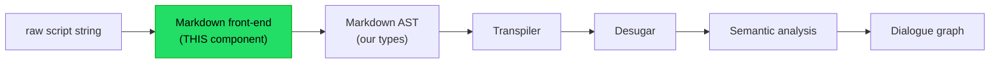
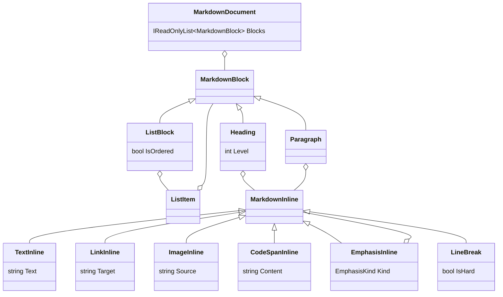

# Implementation note: Markdown front-end

> [!NOTE]
> Status: **implemented**.
> Component 1 of the DialogueDown script compiler.

## Table of contents

- [Implementation note: Markdown front-end](#implementation-note-markdown-front-end)
  - [Table of contents](#table-of-contents)
  - [Goal and scope](#goal-and-scope)
  - [Where it sits](#where-it-sits)
  - [Functionality checklist](#functionality-checklist)
  - [Interfaces and abstractions](#interfaces-and-abstractions)
  - [The Markdown AST model](#the-markdown-ast-model)
  - [Key design decisions](#key-design-decisions)
    - [D1 — Own AST as an anti-corruption layer (chosen)](#d1--own-ast-as-an-anti-corruption-layer-chosen)
    - [D2 — Model emphasis as styling](#d2--model-emphasis-as-styling)
    - [D3 — Faithful-to-Markdown boundary](#d3--faithful-to-markdown-boundary)
    - [D4 — Immutability and source spans](#d4--immutability-and-source-spans)
    - [D5 — Comment handling: recognize and discard](#d5--comment-handling-recognize-and-discard)
    - [D6 — Minimal pipeline; unmodeled constructs become raw text](#d6--minimal-pipeline-unmodeled-constructs-become-raw-text)
    - [D7 — Line breaks preserved with a hard/soft flag](#d7--line-breaks-preserved-with-a-hardsoft-flag)
    - [D8 — Configurable unmodeled-node handling](#d8--configurable-unmodeled-node-handling)
    - [D9 — Discard front matter](#d9--discard-front-matter)
  - [Markdig to AST mapping](#markdig-to-ast-mapping)
  - [Error and boundary cases](#error-and-boundary-cases)
  - [Integration](#integration)
  - [Testability](#testability)
  - [Resolved decisions (from review)](#resolved-decisions-from-review)
  - [Status](#status)
  - [Planned follow-up components (out of scope here)](#planned-follow-up-components-out-of-scope-here)

## Goal and scope

Convert a raw dialogue-script string into a small, **DSL-agnostic Markdown
abstract syntax tree (AST)** that later compiler stages consume. This component
owns *syntax only*: it recognizes Markdown structure (headings, lists, paragraphs,
links, code spans, comments) and nothing about dialogue meaning.

**In scope:**

- Parse a string into our own Markdown AST.
- Apply a **narrowed grammar** so only DSL-relevant constructs are modeled, and
  speech text stays raw.
- Hide the third-party parser (Markdig) behind an adapter so it can be swapped.

**Out of scope** (later components):

- Any dialogue semantics: speakers, tags, the `:` split, jumps (`=>`), queries,
  commands, succession, choices-as-graph. These belong to the **transpiler** and
  **inline line parser** that consume this AST.

## Where it sits



The boundary is deliberate: this component stops at a faithful Markdown tree.
Grouping headings into sections, splitting `Speaker: Speech`, and interpreting
`=>`/code spans all happen downstream.

## Functionality checklist

- [x] Parse an arbitrary string into a `MarkdownDocument` without throwing on
      ordinary prose.
- [x] Model ATX headings (`#`..`######`) with level and inline content.
- [x] Model paragraphs with inline content.
- [x] Model unordered and ordered lists, including **nested** lists (choice
      nesting depends on this).
- [x] Model list items as containers of blocks.
- [x] Expose Markdown **links** (`[label](target)`) as inline nodes (jumps need
      the target later).
- [x] Expose Markdown **images** (``) as inline nodes, so a
      presentation layer can render an image inline in a chat.
- [x] Expose **inline code spans** (`` `...` ``) with their raw inner text
      (queries/commands are parsed later).
- [x] **Recognize and strip HTML comments** (`<!-- ... -->`) so they never leak
      into speech; they are discarded, not modeled (D5).
- [x] **Recognize and discard leading front matter** (a `---`-fenced metadata
      block) so it never enters speech (D9).
- [x] Model **emphasis and strikethrough** (`*italic*`, `**bold**`, `~~struck~~`)
      as styling nodes with parsed children (so queries/jumps nested inside still
      work); a literal `*` or `~` is escaped (`\*`, `\~`), and intraword `_` stays
      literal.
- [x] Attach a **source span** (start offset + length) to every node for later
      diagnostics; a line/column can be derived from an offset downstream if needed.
- [x] Recognize `#`..`######` **only at line start** as headings; a `#` elsewhere
      in a line stays literal text (tag semantics are decided downstream).
- [x] Accept every list marker (`-`, `+`, `*`, and ordered `1.` / `1)`) as a list;
      preserve the ordered flag but do not reinterpret ordered vs unordered here.
- [x] Preserve in-paragraph **line breaks** as `LineBreak` nodes, keeping the
      **hard vs soft** distinction (two trailing spaces or a backslash is hard).
      Speech-boundary meaning is assigned downstream, not here (D7).
- [x] Behave deterministically on empty input, whitespace-only input, and mixed
      line endings.

## Interfaces and abstractions

| Type                            | Kind                              | Responsibility                                                                                                                                                                                                 | Collaborators                            |
| ------------------------------- | --------------------------------- | -------------------------------------------------------------------------------------------------------------------------------------------------------------------------------------------------------------- | ---------------------------------------- |
| `IMarkdownParser`               | `internal interface`              | Port: `MarkdownDocument Parse(string source)`. The stable seam the rest of the compiler depends on.                                                                                                            | consumed by the transpiler               |
| `MarkdigMarkdownParser`         | `internal sealed class`           | Adapter: configures a narrowed Markdig pipeline and converts Markdig's tree to our AST.                                                                                                                        | Markdig, `MarkdigToMarkdownAstConverter` |
| `MarkdigToMarkdownAstConverter` | `internal sealed class`           | Pure translation of Markdig nodes into our AST (no I/O). Holds the source per parse so unmodeled constructs flatten to raw text (D6). Isolated so it is unit-testable and the Markdig dependency is contained. | Markdig types → our AST                  |
| `MarkdownDocument` + node types | `internal record`                 | Our minimal, immutable Markdown AST (see next section).                                                                                                                                                        | produced here, consumed downstream       |
| `SourceSpan`                    | `internal readonly record struct` | Start-offset + length range into the source for diagnostics.                                                                                                                                                   | every node                               |

All types are `internal`; tests reach them via `InternalsVisibleTo` (see
[Testability](#testability)). The public surface of the library is unchanged by
this component.

## The Markdown AST model

The model stays **faithful to Markdown structure**, not to dialogue structure. It
is intentionally tiny — only the constructs the DSL uses.



Notes:

- **Blocks** are a flat, ordered list under the document. Headings do **not**
  nest their following content; grouping a heading with the blocks beneath it is
  the transpiler's job. This keeps the front-end honest to Markdown.
- **`ListItem` contains blocks** (a paragraph plus an optional nested
  `ListBlock`). That block-in-item nesting is exactly how choice nesting is
  represented.
- **Inlines** are six kinds — text, link, image, code span, emphasis, and line
  break. `EmphasisInline` is the only inline that **contains other inlines**
  (italic/bold, with parsed children); anything Markdig would treat as an autolink
  or other unmodeled inline collapses into `TextInline` raw text (see decisions
  below); recognized HTML comments are discarded (D5). A `LineBreak` records an
  in-paragraph break and its `IsHard` flag, with no speech meaning attached here
  (D7).
- `LinkInline` keeps the **target** and its label as **inline nodes**, so a label
  can carry styling and other inlines. `ImageInline` mirrors it — a **source**
  plus an **inline alt** — so a presentation layer can render an image inline in a
  chat.

## Key design decisions

### D1 — Own AST as an anti-corruption layer (chosen)

We define our own AST and map Markdig into it, rather than exposing Markdig types
downstream.

- **Why:** true swappability (replace only `MarkdigMarkdownParser` +
  `MarkdigToMarkdownAstConverter`), and the narrowed grammar becomes
  **structural** — if a construct is not in the model, it cannot leak downstream.
  Pattern: *Adapter / Anti-Corruption Layer*.
- **Cost:** roughly a dozen small record types plus a converter. Accepted as
  bounded.

### D2 — Model emphasis as styling

Emphasis and strikethrough carry meaning in speech, so we **model** them rather
than treating `*`/`_`/`~` as literal text.

Markdig parses `*x*` / `**x**` into an `EmphasisInline` (delimiter count 1 or 2),
and — with the strikethrough extension enabled — `~~x~~` into an `EmphasisInline`
with a `~` delimiter. We map it to our own `EmphasisInline(Kind, Children, Span)`,
where `Kind` is `Italic`, `Bold`, or `Strikethrough`, and we **recurse into the
children** — so a query, jump, image, or nested emphasis inside is parsed, not
frozen as text. For example, `**Hello \`"MainCharacter.Name"\`!**` becomes
`Emphasis(Bold, [Text "Hello ", CodeSpan("\"MainCharacter.Name\""), Text "!"])`,
which the transpiler can render bold *and* resolve the inner query.

Consequences:

- **`*`/`_`/`~` mean styling.** An author who wants a literal asterisk or tilde
  escapes it (`\*`, `\~`), exactly like standard Markdown. Intraword underscores
  (`keep_the_underscores`) stay literal, and a single `~` is not strikethrough —
  only `~~...~~` is.
- **Standard text handling.** `LiteralInline.Content` gives the correctly
  unescaped text and code spans stay raw, so emphasis needs no source-span slicing.
- **No text coalescing.** Adjacent text runs are left as separate `TextInline`s,
  so an escape (`\*`) or an emphasis boundary can split contiguous text into a few
  runs (e.g. `\*x\*` → `*`, `x`, `*`). This is harmless — downstream concatenates
  text runs — and keeps the converter simple.
- **Bold-italic falls out of nesting.** `***x***` and `**_x_**` parse as nested
  emphasis, so no separate "bold-italic" kind is needed.
- **Faithful to Markdown (D3).** Emphasis and strikethrough *are* Markdown
  constructs; the front-end records only *that* text is italic, bold, or
  strikethrough — how it renders (BBCode, etc.) stays a downstream
  `ISpeechFormatter` concern.
- **Enables delimiter-dependent features.** Keeping the emphasis parser on also
  supports Markdig features that rely on its delimiter processing (notably GFM pipe
  tables), which a later configuration component builds on.

Unmodeled constructs are still flattened to raw text by source-span slicing (D6);
that mechanism is unchanged.

### D3 — Faithful-to-Markdown boundary

The AST mirrors Markdown block/inline structure, not dialogue structure. No
`Section`, `Choice`, `Jump`, `Speaker`, or `:` handling here.

- **Why:** keeps this component reusable and independently testable, and gives the
  transpiler a single, well-defined input. Honors single responsibility.

### D4 — Immutability and source spans

All AST nodes are immutable records carrying a `SourceSpan`.

- **Why:** downstream stages are pure transforms; immutability prevents accidental
  shared-state bugs, and spans let later semantic errors point at the original
  script location.
- **Dependency:** requires enabling Markdig precise source locations.

### D5 — Comment handling: recognize and discard

`<!-- ... -->` must be recognized so it never leaks into raw speech
(`Alice: Hello! <!-- warm -->` → speech is `Alice: Hello!`). We **discard**
comments rather than modeling them: there is no downstream consumer today, and
keeping the recognition means nodes can be re-introduced trivially if one appears.

- **Why discard:** simplicity (no `CommentInline` type, no extra mapping/tests);
  comments carry no dialogue meaning. Recognition is required either way, so
  dropping costs nothing extra now.

### D6 — Minimal pipeline; unmodeled constructs become raw text

The input is a *dialogue script*, not a general document, so the pipeline stays
**close to CommonMark core**. Three Markdig extensions are enabled: **pipe
tables** (so a table can be *recognized* and then handled per policy — D8),
**strikethrough** (so `~~...~~` can be *modeled* as styling — D2), and **YAML
front matter** (so a leading `---`-fenced metadata block is recognized and
discarded — D9). No other GFM syntax (task lists, GFM autolinks,
subscript/superscript) is enabled. Consequences:

- Other GFM syntax stays literal text the writer typed.
- Any construct we do not model (blockquotes, thematic breaks, code blocks,
  tables, stray HTML, …) is by **default flattened to its raw source text** via
  the span mechanism (D2), never silently dropped — though the handling policy
  (D8) can instead **ignore** a given kind.

Rationale: in a dialogue script, ambiguous Markdown is far more likely to be text
the writer typed than structural intent. Erring toward raw text preserves speech
and keeps the recognized structural set tiny (document, heading, list/item,
paragraph, link, image, code span, emphasis, line break).

### D7 — Line breaks preserved with a hard/soft flag

A paragraph can span several source lines. Markdig reports each in-paragraph break
as a `LineBreakInline` and — following CommonMark — marks it **hard** (two
trailing spaces or a trailing backslash) or **soft** (a plain newline, with
`\n` and `\r\n` already normalized). We map it to a `LineBreak` node that carries
that `IsHard` flag and nothing else.

This layer stays DSL-agnostic: it records *that* a break exists and *which kind*,
but assigns no speech meaning. The transpiler applies the DSL rule — a **hard
break** starts a new speech, a **soft break** is a space-joined continuation of
the same speech, and a **blank line** (already a separate Markdown paragraph) is
the primary speech separator. Keeping the distinction here means the transpiler
never touches Markdig and the rule stays easy to change later. See the DSL
spec's *Succession* section for the author-facing rule.

### D8 — Configurable unmodeled-node handling

Some unmodeled constructs are authoring aids, not speech — a table of speakers, a
mermaid diagram, a section divider. Leaking them into speech as raw text is noise.
So each **unmodeled node kind** is resolved by a policy to either **`Ignore`**
(drop it, like a comment) or **`AsRawText`** (keep it as literal speech — the
default).

`DefaultUnmodeledNodeHandlingPolicy` ignores `CodeBlock`, `ThematicBreak`, and
`Table` (authoring aids) and keeps `BlockQuote`, `RawHtml`, `Autolink`, and any
`Other` unrecognized construct as raw text (possibly intended content). A caller
can pass a custom `IUnmodeledNodeHandlingPolicy` to `MarkdigMarkdownParser` to
override any kind. The converter classifies each unmodeled node with a static
`MarkdigUnmodeledNodeClassifier`, then drops or flattens it per the policy;
comments stay firmly discarded (D5), outside the policy. Recognizing a `Table`
requires enabling Markdig's pipe-table extension (D6).

See **[Unmodeled Markdown Handling](./Unmodeled%20Markdown%20Handling.md)** for the
full kind list, defaults, and how to plug in a custom policy. A project selects a
policy from a **TOML** config file (`dialogue.toml`); the loader that reads it is
future work.

### D9 — Discard front matter

A script may begin with a `---`-fenced **front matter** block carrying authoring
metadata (title, tags, and the like). It is never speech, so — with Markdig's
YAML front-matter extension enabled — the whole `YamlFrontMatterBlock` is
**firmly discarded**, exactly like a comment (D5), *before* the handling policy
sees it. It is deliberately **not** a policy kind: keeping metadata "as raw text"
would make no sense.

Front matter is only recognized at the very start of the document; a `---` after
content is an ordinary thematic break (handled per the policy — D8).

## Markdig to AST mapping

| Markdig node                                                              | Our node                            | Notes                                                                                      |
| ------------------------------------------------------------------------- | ----------------------------------- | ------------------------------------------------------------------------------------------ |
| `MarkdownDocument`                                                        | `MarkdownDocument`                  | root; map child blocks in order                                                            |
| `HeadingBlock`                                                            | `Heading`                           | copy `Level`; map inline content                                                           |
| `ParagraphBlock`                                                          | `Paragraph`                         | map inline content                                                                         |
| `ListBlock`                                                               | `ListBlock`                         | copy `IsOrdered`; map items                                                                |
| `ListItemBlock`                                                           | `ListItem`                          | map child blocks (enables nesting)                                                         |
| `LiteralInline`                                                           | `TextInline`                        | text with escapes resolved by Markdig                                                      |
| `EmphasisInline`                                                          | `EmphasisInline`                    | `Kind` = `Italic`/`Bold`/`Strikethrough` from delimiter char + count; **recurse** children |
| `LinkInline` (link)                                                       | `LinkInline`                        | keep `Url` as target; **recurse** the label into inline nodes                              |
| `LinkInline` (image)                                                      | `ImageInline`                       | `IsImage` is set; keep `Url` as source and **recurse** the alt into inline nodes           |
| `CodeInline`                                                              | `CodeSpanInline`                    | keep raw inner content; inner grammar parsed later                                         |
| `LineBreakInline`                                                         | `LineBreak`                         | keep the `IsHard` flag; no speech meaning here (D7)                                        |
| `HtmlInline`/`HtmlBlock` comment                                          | *(discarded)*                       | recognized and dropped so it never enters speech (D5)                                      |
| `YamlFrontMatterBlock`                                                    | *(discarded)*                       | leading `---` metadata block, firmly dropped (D9)                                          |
| unmodeled **inline** (autolink, other HTML)                               | `TextInline` (raw source)           | flatten via source span; never dropped                                                     |
| unmodeled **block** (blockquote, thematic break, fenced code, other HTML) | `Paragraph` of one raw `TextInline` | flatten via source span; never dropped                                                     |

Conversion is a straightforward recursive walk; unmodeled nodes flatten to their
raw source slice (D6):

```text
convert(document)      -> MarkdownDocument(children.map(convertBlock))
convertBlock(heading)  -> Heading(level, inlines.map(convertInline))
convertBlock(para)     -> Paragraph(inlines.map(convertInline))
convertBlock(list)     -> ListBlock(ordered, items.map(convertItem))
convertBlock(other)    -> Paragraph([TextInline(sourceSlice(span), span)])
convertItem(item)      -> ListItem(item.children.map(convertBlock))
convertInline(literal) -> TextInline(rawText, span)
convertInline(emph)    -> EmphasisInline(kind, children.map(convertInline), span)
convertInline(link)    -> LinkInline(target, children.map(convertInline), span)
convertInline(image)   -> ImageInline(source, children.map(convertInline), span)
convertInline(code)    -> CodeSpanInline(content, span)
convertInline(break)   -> LineBreak(isHard, span)
convertInline(other)   -> TextInline(sourceSlice(span), span)
convertInline(comment) -> (discarded; excluded from surrounding text)
```

## Error and boundary cases

| Input / situation                                   | Intended behavior                                                                                                                                                        |
| --------------------------------------------------- | ------------------------------------------------------------------------------------------------------------------------------------------------------------------------ |
| Empty string                                        | `MarkdownDocument` with zero blocks; never null, never throws.                                                                                                           |
| Whitespace-only                                     | Empty document (Markdig produces no blocks).                                                                                                                             |
| Ordinary prose (no Markdown)                        | One `Paragraph` of `TextInline`; no errors.                                                                                                                              |
| `null` source                                       | Throw `ArgumentNullException` at the port boundary (meaningful message).                                                                                                 |
| Mixed line endings (`\n`, `\r\n`)                   | Normalized by Markdig; spans still valid.                                                                                                                                |
| Unterminated code span `` `foo ``                   | Follows CommonMark: treated as literal text. Not an error here.                                                                                                          |
| Deeply nested lists                                 | Represented faithfully; no artificial depth limit at this layer.                                                                                                         |
| Emphasis `*italic*` / `**bold**` / `~~struck~~`     | Modeled as `EmphasisInline` (Kind + parsed children); a literal `*` or `~` needs escaping (`\*`, `\~`) (D2).                                                             |
| Escaped `\*` or intraword `keep_the_underscores`    | Stays literal `TextInline` — no emphasis (standard CommonMark).                                                                                                          |
| Unbalanced or single tilde (`~x~`, `~~x~`)          | Stays literal — only balanced `~~...~~` is strikethrough.                                                                                                                |
| `~~~...~~~` at line start                           | A tilde-fenced **code block** (like ```` ``` ````), not strikethrough — handled per the unmodeled-node policy (dropped by default).                                      |
| Image ``                                 | Modeled as `ImageInline` (source + inline alt), like a link; the transpiler decides inline rendering.                                                                    |
| Bracketed text that is not a link                   | Follows CommonMark link rules; a valid link becomes `LinkInline`. Downstream decides relevance.                                                                          |
| Task lists / other GFM (autolinks, sub/superscript) | These extensions are **not** enabled (D6); they remain literal text.                                                                                                     |
| Pipe tables (GFM)                                   | Recognized via the pipe-table extension (D6), then handled per the unmodeled-node policy — dropped by default (D8).                                                      |
| Leading `---`-fenced front matter                   | Recognized and discarded (D9); a `---` after content is a thematic break.                                                                                                |
| Multiple lines in one paragraph                     | Each in-paragraph break becomes a `LineBreak` node carrying its `IsHard` flag. No speech meaning is assigned here; the transpiler maps hard→new speech, soft→space (D7). |

This component raises **no DSL diagnostics** (no "unknown speaker", no "dangling
jump") — those belong downstream. Its only thrown error is the null-argument
guard.

## Integration

- **Upstream:** receives the raw script text (file contents). File I/O and the
  `.dialogue.md` convention are the caller's concern, not this component's.
- **Downstream:** the transpiler depends only on `IMarkdownParser` and the AST
  records. It never references Markdig. Swapping parsers is a localized change.
- **Existing code:** additive only. Lives in `src/DialogueDown/markdown/`,
  namespace `DialogueDown.Markdown`. No changes to current interfaces.

## Testability

- **Isolation (unit):** feed strings to `IMarkdownParser` /
  `MarkdigToMarkdownAstConverter`
  and assert on the produced AST. No mocks are strictly required because the model
  is pure; the port exists mainly for *downstream* substitutability (the
  transpiler can be tested against a fake `IMarkdownParser` with NSubstitute).
- **Assertion helpers:** add `AssertXxx` helpers (e.g. `AssertParagraph`,
  `AssertHeading`, `AssertTextInline`) and small builders to keep tests readable.
- **Coverage focus:** the mapper's branches (each node kind), emphasis modeling
  (D2: italic/bold with recursed children, escape stays literal), boundary cases
  above, and the null guard. Target full meaningful coverage via `coverlet`.
- **Boundary tests to cover exhaustively:**
  - `#` heading at line start vs a `#` that appears inline (literal text).
  - Every list marker: `-`, `+`, `*`, and ordered `1.` / `1)`.
  - Emphasis: italic/bold/**strikethrough** (`~~x~~`), nested bold-italic
    (`***x***`), a code-span query and a link **inside** emphasis, an escaped `\*`,
    a single `~` staying literal, and intraword `keep_the_underscores`.
  - Deeply **nested lists** (choices within choices, plus succession lines under a
    choice) round-trip to the right block/item nesting.
  - Multiple lines in one paragraph become `LineBreak` nodes; soft breaks (a plain
    newline, either line-ending style) and hard breaks (two trailing spaces or a
    backslash) are told apart by `IsHard`.
- **Access:** add `InternalsVisibleTo("DialogueDown.Tests")` so tests can see
  the `internal` AST types.
- **Test data:** derive concrete cases from the DSL spec examples (headings,
  nested choices, jump links, code-span queries/commands) — but assert only their
  *Markdown* shape here, not dialogue meaning.

## Resolved decisions (from review)

- **Emphasis modeling (D2):** enable the emphasis parser (plus the strikethrough
  extension) and model `*italic*` / `**bold**` / `~~struck~~` as an
  `EmphasisInline(Kind, Children)` with **parsed** children; styling meaning is
  decided downstream.
- **Comment handling (D5):** **recognize and discard** comments (not modeled), so
  they never leak into speech.
- **Line-break preservation (D7):** map each in-paragraph break to a `LineBreak`
  node with a hard/soft `IsHard` flag; the transpiler decides speech boundaries
  (hard = new speech, soft = space, blank line = new paragraph/speech).
- **Link label fidelity:** keep a link's label as **inline nodes**, so styling and
  other inlines inside a label are preserved for the transpiler to re-tokenize.
- **Images modeled, not flattened:** expose `` as an `ImageInline`
  (source + inline alt), mirroring links, so the transpiler can render images inline
  in a chat.
- **Markdig dependency:** adopt **Markdig** (BSD-2-Clause) as the backing parser.
- **Unknown-node policy:** flatten unmodeled constructs to raw text (D6); do not
  silently drop them.

## Status

Implemented and crosschecked against this note: every functionality-checklist
item is built and covered, and the decisions above match the shipped code. The
component is feature-complete and ready to merge. No open questions remain.

## Planned follow-up components (out of scope here)

- **`.dialogue.md` validator CLI:** a small separate utility that parses a file
  and reports whether it is accepted, raising a clear error with the reason. It
  belongs in its own folder and its own Design → Review → Implement pass. Caveat:
  at the *front-end* level almost any string parses, so this tool only becomes
  valuable as downstream (transpiler/semantic) checks are added — plan it to grow
  with the pipeline.
