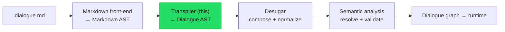
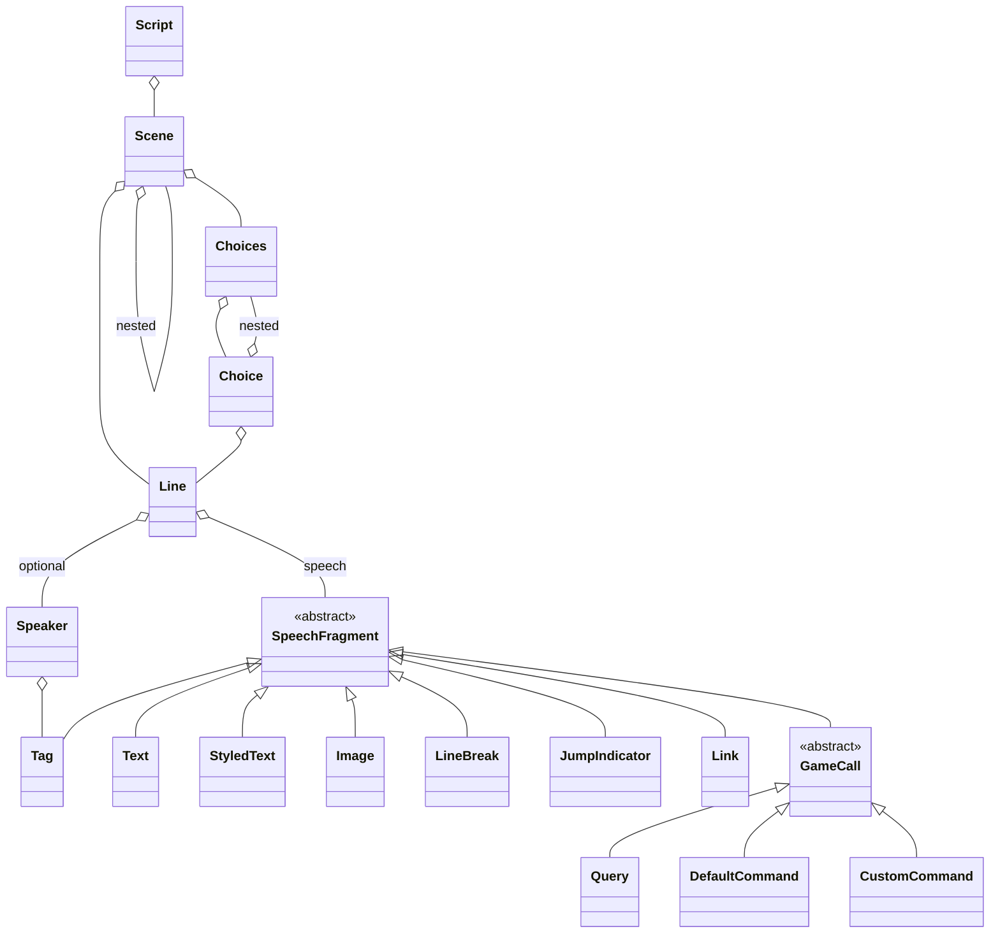

# Implementation note: Markdown to Dialogue AST transpiler

> [!NOTE]
> Status: **proposed**.
> Component 2 of the DialogueDown script compiler.

## Table of contents

- [Implementation note: Markdown to Dialogue AST transpiler](#implementation-note-markdown-to-dialogue-ast-transpiler)
  - [Table of contents](#table-of-contents)
  - [Goal and scope](#goal-and-scope)
  - [Where it sits](#where-it-sits)
  - [Ubiquitous language](#ubiquitous-language)
  - [Two layers: block transpiler + inline parsers](#two-layers-block-transpiler--inline-parsers)
  - [Functionality checklist](#functionality-checklist)
  - [Interfaces and abstractions](#interfaces-and-abstractions)
  - [The Dialogue AST model](#the-dialogue-ast-model)
  - [Key design decisions](#key-design-decisions)
    - [D1 — Own Dialogue AST (anti-corruption layer)](#d1--own-dialogue-ast-anti-corruption-layer)
    - [D2 — Re-tokenize into the dialogue dialect](#d2--re-tokenize-into-the-dialogue-dialect)
    - [D3 — Two layers; pluggable inline mini-parsers](#d3--two-layers-pluggable-inline-mini-parsers)
    - [D4 — Speech is a fragment sequence; hard breaks consumed, soft kept](#d4--speech-is-a-fragment-sequence-hard-breaks-consumed-soft-kept)
    - [D5 — Scenes nest by heading level](#d5--scenes-nest-by-heading-level)
    - [D6 — Choices keep their ordering](#d6--choices-keep-their-ordering)
    - [D7 — GameCall: Query, DefaultCommand, CustomCommand](#d7--gamecall-query-defaultcommand-customcommand)
    - [D8 — Jump tokenized as JumpIndicator + Link](#d8--jump-tokenized-as-jumpindicator--link)
    - [D9 — Tags: a dedicated pluggable parser](#d9--tags-a-dedicated-pluggable-parser)
    - [D10 — Errors: DialogueSyntaxError, friendly messages](#d10--errors-dialoguesyntaxerror-friendly-messages)
  - [Leaf grammars](#leaf-grammars)
  - [Transpiling in pseudocode](#transpiling-in-pseudocode)
  - [Markdown AST to Dialogue AST mapping](#markdown-ast-to-dialogue-ast-mapping)
  - [Error and boundary cases](#error-and-boundary-cases)
  - [Integration](#integration)
  - [Testability](#testability)
  - [Placement in namespaces](#placement-in-namespaces)
  - [Resolved in review](#resolved-in-review)

## Goal and scope

Turn the **Markdown AST** (from the
[Markdown front-end](./Markdown%20Front-End.md)) into a **Dialogue AST** — an
immutable tree that speaks the *dialogue* domain, not Markdown. This is the
compiler's lowering stage: it **re-tokenizes** Markdown structure into dialogue
constructs with **local**, syntax-directed recognition.

**In scope** — recognizing dialogue *shapes* from Markdown structure:

- headings into **Scenes** (nested by level); paragraphs into **Lines**.
- split `Speaker: Speech`; parse the `Name @id #tags:` prefix (unresolved).
- build a Line's **Speech** from inline content as ordered fragments.
- code spans into **Query** / **DefaultCommand** / **CustomCommand**.
- `=>` into a **JumpIndicator**; a Markdown link into a **Link**.
- tags (anywhere they appear) into **Tag**s, via a reusable parser.
- lists into **Choices** / **Choice** (nesting and ordering preserved).

**Deferred downstream** — anything requiring composition across nodes or the
whole document:

- **Desugar** (next stage): assemble a **Jump** from `JumpIndicator + Link`; fill
  the **default speaker** on a Line with none; rewrite a lone **silent command**
  into a default-speaker Line.
- **Semantic analysis** (later): resolve/validate jump targets, bind speaker ids,
  check reserved tags, detect unreachable scenes.
- **Graph compilation** and **runtime**: build and run the dialogue graph.

## Where it sits



The front-end defers to this stage: splitting `Speaker: Speech`, grouping headings
into scenes, and interpreting code spans all happen here. Composing a `Jump`,
filling the default speaker, and rewriting silent commands happen in **Desugar**.

## Ubiquitous language

The Dialogue AST speaks three small, coherent sub-vocabularies. Every type, test,
and doc uses **exactly** these words. The whole tree is the **Dialogue AST**; its
root node type is **Script**.

| Term               | Meaning                                                | Bounded context     |
| ------------------ | ------------------------------------------------------ | ------------------- |
| **Script**         | the whole compiled file (the AST root)                 | theatre             |
| **Scene**          | a section of the script; a Jump's destination          | theatre             |
| **Line**           | one utterance: an optional **Speaker** plus **Speech** | theatre             |
| **Speaker**        | who speaks: name / `@id` / `#tags`, **unresolved**     | theatre             |
| **Speech**         | the words of a Line: an ordered list of fragments      | theatre             |
| **SpeechFragment** | one piece of Speech (see below)                        | theatre             |
| **Text**           | a plain-words fragment                                 | theatre             |
| **StyledText**     | italic / bold / strikethrough (nests fragments)        | theatre             |
| **Image**          | an inline image fragment                               | theatre             |
| **LineBreak**      | a **soft** break kept as a display-wrap hint           | theatre             |
| **Choices**        | the group of options offered at a branch               | interactive fiction |
| **Choice**         | one selectable option                                  | interactive fiction |
| **JumpIndicator**  | the `=>` token that marks a jump                       | interactive fiction |
| **Link**           | a Markdown link: label + **unresolved** target         | interactive fiction |
| **GameCall**       | a game-state hook; a kind of SpeechFragment            | engine              |
| **Query**          | a GameCall that *reads* state and inserts text         | engine              |
| **DefaultCommand** | a `( "…" )` command                                    | engine              |
| **CustomCommand**  | a `Name(args)` command                                 | engine              |
| **Tag**            | a metadata tag (`#name`, `#k=v`, `##reserved`)         | metadata            |

**Downstream terms.** A **Jump** (composed from `JumpIndicator + Link`) is a
**Desugar** concept, not produced here. A **default speaker** is likewise filled
in Desugar.

**Naming guards.** The root is **Script**, never `Dialogue` — the runtime owns
`IDialogue`. `INode` / `IEdge` are the *runtime graph*, never this AST.
**Speaker** and **Speech** are the **unresolved, syntactic** forms that the
semantic analyzer later consumes — the same domain words as `ISpeaker` / `ISpeech`,
separated by namespace.

## Two layers: block transpiler + inline parsers

This component has two cleanly separated layers, mirroring the pipeline's
*Transpiler* and *Inline line parser* stages as internal seams:

1. **Block transpiler** — walks the Markdown block tree and builds the Dialogue
   AST skeleton: `Script`, `Scene` (nested by heading level), `Line` (split at
   hard breaks), `Choices` / `Choice`.
2. **Inline mini-parsers** — for each Line, re-tokenize its inline content into
   a `Speech` of fragments. Small, pure, single-purpose parsers, each **built and
   tested in isolation**, then composed by the block transpiler:

   | Parser                | Input → output                        | Reused for                                   |
   | --------------------- | ------------------------------------- | -------------------------------------------- |
   | `SpeakerPrefixParser` | leading text → `Speaker?` (try-parse) | Line speaker                                 |
   | `GameCallParser`      | code-span text → `GameCall`           | Query / Command                              |
   | `TagParser`           | tag text → `Tag`                      | speaker, link/image labels, anywhere in text |

   Recognizing `=>` (→ `JumpIndicator`) and a Markdown link (→ `Link`) needs no
   grammar and stays in the walker.

Composition over inheritance: the block transpiler depends on the mini-parsers
through narrow interfaces, so each can be swapped or tested alone.

## Functionality checklist

- [ ] **Script** root wraps the document's top-level content.
- [ ] **Scene** from a heading; owns the content beneath it; **nests by level**.
- [ ] **Line** from a paragraph; a paragraph **splits into Lines at hard breaks**.
- [ ] **Speaker split**: try-parse a `Name @id #tags:` prefix; on no match the
      Line has **no speaker** (default filled later in Desugar).
- [ ] **Speech** as ordered **SpeechFragment**s: Text, StyledText, Image, soft
      LineBreak, GameCall, JumpIndicator, Link, Tag.
- [ ] **Soft breaks kept** as `LineBreak` (display-wrap hints); **hard breaks
      consumed** as Line boundaries.
- [ ] **Choices** / **Choice** from a list and its items; **nesting and ordering
      preserved** (`IsOrdered` retained).
- [ ] **Code span** into **Query** (`"…"`) / **DefaultCommand** (`(…)`) /
      **CustomCommand** (`Name(args)`).
- [ ] **`=>`** into **JumpIndicator**; a **link** into **Link** (unresolved).
- [ ] **Tag** recognition via the pluggable `TagParser`, wherever tags appear.
- [ ] Malformed dialogue grammar raises a **`DialogueSyntaxError`** with a
      located, friendly, actionable message.
- [ ] Every node carries a **`SourceSpan`**.

Deferred to **Desugar** (out of scope here): assembling a **Jump**, filling the
**default speaker**, rewriting a **silent command** into a Line.

## Interfaces and abstractions

| Type                        | Responsibility                                                   | Collaborators             |
| --------------------------- | ---------------------------------------------------------------- | ------------------------- |
| `IScriptTranspiler`         | public seam: `Script Transpile(MarkdownDocument, string source)` | Markdown AST, `Script`    |
| `MarkdownToScriptConverter` | block-layer tree walk → Dialogue AST                             | AST nodes, inline parsers |
| `ISpeakerPrefixParser`      | pure `string → Speaker?` (try-parse)                             | `Speaker`, `TagParser`    |
| `IGameCallParser`           | pure `string → GameCall`                                         | `Query`, `*Command`       |
| `ITagParser`                | pure `string → Tag` (and tag-list parsing)                       | `Tag`                     |
| Dialogue AST records        | immutable domain nodes (see model)                               | `SourceSpan`              |

The block walk is hand-written (its input is already a tree). **Superpower**
(Apache-2.0) powers the three leaf parsers — its only blast radius.

## The Dialogue AST model



Every node is an immutable `record` carrying a `SourceSpan`, mirroring the
front-end's AST. `StyledText` is itself a `SpeechFragment` and **nests
`SpeechFragment` children** (so a bold run can itself contain, say, a query). It
holds a `SpeechStyle` (Italic / Bold / Strikethrough) — a Dialogue-side enum,
**not** the Markdown `EmphasisKind`, to keep the AST Markdown-agnostic (D1).

## Key design decisions

### D1 — Own Dialogue AST (anti-corruption layer)

The transpiler emits our **own** dialogue-domain tree, independent of Markdig and
of the Markdown AST. Downstream stages depend on dialogue concepts (Scene, Line,
Query), never on Markdown. Immutable records + `SourceSpan`, like the front-end.

### D2 — Re-tokenize into the dialogue dialect

The transpiler recognizes dialogue **shapes** with **local**, intra-node matching
— decidable from a node (and the text inside it), no other part of the document
needed. It is, in effect, a **lexer for the dialogue dialect**: it emits dialogue
tokens (Speaker, Speech fragments, GameCall, JumpIndicator, Link, Tag) but does
**not compose them across siblings**. Composition and normalization —
assembling a
`Jump` from `JumpIndicator + Link`, filling the default speaker, rewriting a silent
command — belong to **Desugar**; reference resolution belongs to the semantic
analyzer. The AST therefore carries **unresolved** references (a `Link` keeps its
raw target; a `Speaker` keeps its raw name/id/tags), which is the clean seam to
the stages that follow.

### D3 — Two layers; pluggable inline mini-parsers

Following composition and single-responsibility, the component splits into a
**block transpiler** and a set of **pluggable inline mini-parsers** (see
[Two layers](#two-layers-block-transpiler--inline-parsers)). Each mini-parser is
a pure function with no shared state, built and tested in isolation, then injected
into the walker. This keeps grammar concerns (speaker prefix, code span, tags)
out of the tree walk and independently verifiable.

### D4 — Speech is a fragment sequence; hard breaks consumed, soft kept

A `Line`'s `Speech` is an **ordered list of `SpeechFragment`s**, kept granular;
coalescing them into a rendered speech is **downstream** work. Line breaks split
by kind (the front-end already flags each as hard or soft):

- a **hard** break separates speeches, so it is **consumed** here as a `Line`
  boundary and never appears as a fragment — it is pure Markdown syntax with no
  downstream meaning.
- a **soft** break (a manual wrap inside one speech) is **kept** as a `LineBreak`
  fragment, because it can hint downstream display ("wrap here").

### D5 — Scenes nest by heading level

A heading opens a `Scene`; the blocks after it, up to the next heading of the
**same or higher** level, are its content. A **deeper** heading opens a **nested**
`Scene`. This preserves the author's outline and lets a Jump target a heading at
any level. Content before the first heading attaches to the `Script` root.

Heading levels are read **relatively**, so irregular outlines are handled without
error: a lower level later (an `H1` after an `H2`) closes the deeper scene and
opens a new top-level one, and a **skipped** level (an `H1` then an `H3`) simply
nests the deeper heading under the nearest open scene.

### D6 — Choices keep their ordering

A Markdown list becomes **`Choices`**; each item becomes a **`Choice`**, whose
content is whatever the item holds — a `Line`, a nested `Choices` — so nesting is
preserved. The list's **`IsOrdered`** flag is **kept**: an ordered list means the
choices must appear in textual order, while an unordered list leaves later stages
free to shuffle display order. (The DSL spec documents this authoring rule.)

### D7 — GameCall: Query, DefaultCommand, CustomCommand

`GameCallParser` turns a code span's inner text into one of three `GameCall`
records — **`Query`** (`"key"`, reads state and inserts text), **`DefaultCommand`**
(`( "…" )`), or **`CustomCommand`** (`Name(args)`) — instantiated with its parsed
parts here. They are distinct records because a `CustomCommand` carries a name and
argument list that downstream stages scaffold differently from a `DefaultCommand`.
Each `GameCall` **is a** `SpeechFragment`, so it can sit inline in speech. A lone
**silent command** on its own line is **not** rewritten here; that normalization
is a Desugar concern.

### D8 — Jump tokenized as JumpIndicator + Link

A jump is written `=> [label](target)`. Per D2 the transpiler does **not** compose
it: it emits a **`JumpIndicator`** for `=>` and a **`Link`** (label + unresolved
target) for the Markdown link, as adjacent fragments. **Desugar** later recognizes
the `JumpIndicator + Link` pattern and assembles the composed `Jump`. Keeping the
two as separate tokens honors the re-tokenizing boundary and lets `Link` also
model an ordinary inline link. A **bare `Link`** (with no preceding `=>`) is kept
as a meaningful inline link; whether it carries any special dialogue meaning is
left to the semantic analyzer.

### D9 — Tags: a dedicated pluggable parser

Tags have a non-trivial grammar — plain (`#name`), groups (`#k=v`), reserved
(`##name`, `##k=v`), and quoted names (`#"speaker tone"="warm"`). A dedicated,
reusable **`TagParser`** owns it, and a **`Tag`** node captures the parsed form.
The same parser serves everywhere a tag may appear — in a speaker prefix, in a
link or image label, and **anywhere within speech text** — so the rule lives in
one place. (Broadening tag placement beyond speaker declarations extends the DSL;
the spec is updated to match.)

### D10 — Errors: DialogueSyntaxError, friendly messages

Malformed **dialogue grammar** raises **`DialogueSyntaxError`** (the type the
[error model](./README.md#exception-hierarchy) reserves for this stage): a code
span that is neither a valid query nor command, a malformed tag. Messages are
**located** via `SourceSpan`, written in **plain language for writers and
developers alike**, and **suggest the fix** — e.g. *"code spans are only for game
calls; did you mean plain text? put it outside backticks"*, or for a literal
arrow, *"did you mean the text `=>`? write it as part of speech, e.g. `Alice: =>`"*.
The shared exception **base classes** live in `DialogueDown.Common.Errors`; each
component's **concrete** error type lives in that component's namespace.

## Leaf grammars

All three grammars are simple and unambiguous, the sweet spot for Superpower.
They operate on text the front-end hands over verbatim — a code span's `Content`
already has its backticks stripped. Formats follow the
[DSL spec](../Script%20Language/Script%20Language%20DSL%20Specification.md): a
`Name` or tag name is an `Identifier` **or** a quoted `String` (so `Old Man` and
`#"speaker tone"` are valid).

**Speaker prefix** — recognized only if the leading text parses fully as a prefix
ending in `:`; otherwise the Line has no speaker. This "try-parse the whole
prefix" rule keeps `Alice: The time is 3:00` (speaker `Alice`) distinct from
`The time is 3:00` (no speaker).

```ebnf
SpeakerPrefix = { WhiteSpace } , [ SpeakerName ] ,
                { WhiteSpace , "@" , SpeakerId } ,
                { WhiteSpace , Tag } , { WhiteSpace } , ":" ;
SpeakerName   = Identifier | String ;
```

**GameCall** — parsed from a code span's inner content.

```ebnf
GameCall       = Query | DefaultCommand | CustomCommand ;
Query          = QuotedString ;
DefaultCommand = "(" , QuotedString , ")" ;
CustomCommand  = Identifier , "(" , [ ArgList ] , ")" ;
ArgList        = QuotedString , { "," , { WhiteSpace } , QuotedString } ;
QuotedString   = '"' , { AnyCharExcept('"') } , '"' ;
```

**Tag** — reused wherever tags appear (mirrors the DSL's tag grammar).

```ebnf
Tag         = ( "##" | "#" ) , TagName , [ "=" , TagName ] ;
TagName     = Identifier | String ;
```

## Transpiling in pseudocode

```text
transpile(markdownDocument, source):
    return Script(scenes = buildScenes(markdownDocument.blocks))

buildScenes(blocks):
    # group blocks under headings; deeper heading → nested Scene (D5)
    for each block:
        Heading      -> open a Scene at its level
        Paragraph    -> for each line in splitAtHardBreaks(paragraph):  # D4/D7
                            emit convertLine(line)
        List         -> emit Choices(IsOrdered, items -> Choice(...))    # D6

convertLine(inlines):
    speaker, rest = SpeakerPrefixParser.tryParse(leadingText(inlines))  # layer 2
    speech = []
    for each inline in rest:
        Text        -> speech += Text(...)
        Emphasis    -> speech += StyledText(style, convert(children))
        Image       -> speech += Image(..., tags = TagParser.parse(alt))
        SoftBreak   -> speech += LineBreak()          # hard breaks already split
        CodeSpan    -> speech += GameCallParser.parse(content)   # Query/Command
        "=>"  text  -> speech += JumpIndicator()
        Link        -> speech += Link(label, target) # label may carry Tags
        "#…" text   -> speech += TagParser.parse(...)
    return Line(speaker, speech)
```

## Markdown AST to Dialogue AST mapping

| Markdown AST            | Dialogue AST                                 | Notes                            |
| ----------------------- | -------------------------------------------- | -------------------------------- |
| `MarkdownDocument`      | `Script`                                     | root                             |
| `Heading`               | `Scene`                                      | nests by level (D5)              |
| `Paragraph`             | one or more `Line`                           | split at hard breaks (D4/D7)     |
| leading text of a Line  | `Speaker` (optional)                         | try-parse prefix (D3)            |
| `TextInline`            | `Text`                                       | plain words                      |
| `EmphasisInline`        | `StyledText`                                 | style + nested fragments         |
| `ImageInline`           | `Image`                                      | alt text may carry tags (D9)     |
| `LineBreak` (soft)      | `LineBreak`                                  | kept as display hint (D4)        |
| `LineBreak` (hard)      | —                                            | consumed as a Line boundary (D4) |
| `CodeSpanInline`        | `Query` / `DefaultCommand` / `CustomCommand` | via `GameCallParser` (D7)        |
| `TextInline` `=>`       | `JumpIndicator`                              | jump assembled in Desugar (D8)   |
| `LinkInline`            | `Link`                                       | unresolved target (D8)           |
| tag text (any position) | `Tag`                                        | via `TagParser` (D9)             |
| `ListBlock`             | `Choices`                                    | `IsOrdered` kept (D6)            |
| `ListItem`              | `Choice`                                     | keeps nested content             |

## Error and boundary cases

| Case                                                                | Behavior                                                                                                              |
| ------------------------------------------------------------------- | --------------------------------------------------------------------------------------------------------------------- |
| Text with no valid speaker prefix                                   | Line has **no speaker**; not an error (default filled in Desugar)                                                     |
| Colon inside speech (`The time is 3:00`)                            | prefix parse fails → no speaker; colon stays in Speech                                                                |
| Code span that is neither query nor command                         | **`DialogueSyntaxError`** — "code spans are only for game calls…"                                                     |
| Malformed tag (e.g. `#` with no name)                               | **`DialogueSyntaxError`** with the expected form                                                                      |
| Literal `=>` intended as text                                       | authors write it in speech (`Alice: =>`); a bare `=>` is a `JumpIndicator`, and a dangling one is reported in Desugar |
| Empty document                                                      | a `Script` with no scenes                                                                                             |
| Content before the first heading                                    | attaches to the `Script` root                                                                                         |
| Irregular heading order (an `H1` after an `H2`, or a skipped level) | handled without error by relative nesting (D5); a dedicated test covers `H2` then `H1`                                |
| Deeply nested choices                                               | represented faithfully; no depth cap                                                                                  |
| A node dropped by the front-end policy                              | never reaches the transpiler                                                                                          |

## Integration

- **Upstream:** consumes the immutable `MarkdownDocument` plus the original source
  string (for spans and leaf text).
- **Downstream — Desugar:** composes `JumpIndicator + Link` into a `Jump`, fills
  the default speaker, and rewrites silent commands, producing a normalized
  Dialogue AST.
- **Downstream — Semantic analysis:** resolves jump targets, binds speakers, and
  validates tags before the graph compiler builds the runtime graph.
- `SourceSpan` moves to a shared `DialogueDown.Common` home, since both the
  Markdown AST and the Dialogue AST use it.

## Testability

- **Leaf parsers** are pure `string → …` functions: unit-test the speaker prefix,
  game-call, and tag grammars directly, including the malformed cases that must
  raise `DialogueSyntaxError`. Sub-parsers (quoted string, identifier) test in
  isolation.
- **Converter** is tested by feeding small Markdown ASTs (built through the
  front-end parser, or via a shared **Object Mother** factory) and asserting the
  Dialogue AST — a new `DialogueAstAssert` mirrors the front-end's
  `MarkdownAstAssert`.
- Tests use **multi-line raw string literals** for readable script inputs, stay
  independent, and run in **parallel**.

## Placement in namespaces

| Concern                          | Namespace                        |
| -------------------------------- | -------------------------------- |
| AST node records                 | `DialogueDown.Script.Ast`        |
| Transpiler + inline parsers      | `DialogueDown.Script.Transpiler` |
| Shared `SourceSpan`              | `DialogueDown.Common`            |
| Base exception types             | `DialogueDown.Common.Errors`     |
| `DialogueSyntaxError` (concrete) | `DialogueDown.Script.Transpiler` |

## Resolved in review

- **Tag placement** — tags may appear in a speaker prefix, a link or image label,
  and anywhere within speech text; the DSL spec is updated to match (D9).
- **Dangling `=>`** — reported in **Desugar** when composing the Jump, keeping
  this layer a pure re-tokenizer (D8, boundary table).
- **`JumpIndicator`** — the confirmed name for the `=>` token (D8).
- **Bare `Link`** — kept as a meaningful inline link; any special meaning is
  decided later by the semantic analyzer (D8).
