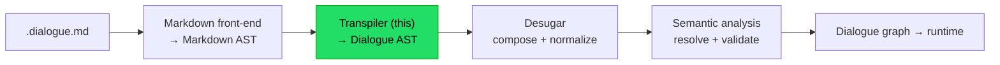
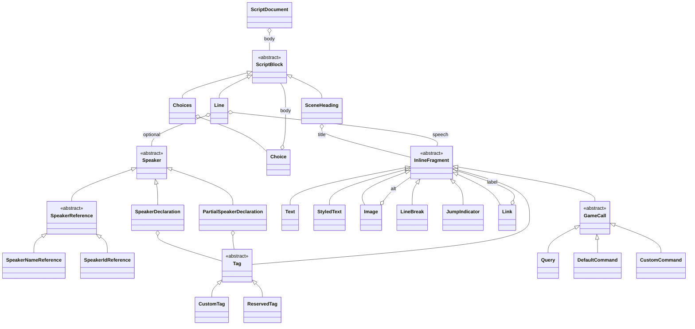

# Implementation note: Markdown to Dialogue AST transpiler

> [!IMPORTANT]
> Status: **implemented**. The full front-to-back path is in place: the parser
> core/combinators, the tag, speaker, and game-call parsers and builders
> (parse-to-data model, D13), the Dialogue AST node set, the inline Speech walker
> with its policy seam (D14), the block transpiler (`BlockBuilder` + `LineBuilder`),
> and the `IScriptTranspiler` seam (`ScriptTranspiler`).
> Component 2 of the DialogueDown script compiler.

## Table of contents

- [Implementation note: Markdown to Dialogue AST transpiler](#implementation-note-markdown-to-dialogue-ast-transpiler)
  - [Table of contents](#table-of-contents)
  - [Goal and scope](#goal-and-scope)
  - [Where it sits](#where-it-sits)
  - [Ubiquitous language](#ubiquitous-language)
  - [Two layers: block transpiler + inline parsers](#two-layers-block-transpiler--inline-parsers)
  - [Functionality checklist](#functionality-checklist)
  - [Interfaces and abstractions](#interfaces-and-abstractions)
  - [The Dialogue AST model](#the-dialogue-ast-model)
  - [Key design decisions](#key-design-decisions)
    - [D1 — Own Dialogue AST (anti-corruption layer)](#d1--own-dialogue-ast-anti-corruption-layer)
    - [D2 — Re-tokenize into the dialogue dialect](#d2--re-tokenize-into-the-dialogue-dialect)
    - [D3 — Two layers; pluggable inline mini-parsers](#d3--two-layers-pluggable-inline-mini-parsers)
    - [D4 — Speech is a fragment sequence; hard breaks consumed, soft kept](#d4--speech-is-a-fragment-sequence-hard-breaks-consumed-soft-kept)
    - [D5 — Headings are flat tokens; scene nesting is deferred](#d5--headings-are-flat-tokens-scene-nesting-is-deferred)
    - [D6 — Choices keep their ordering](#d6--choices-keep-their-ordering)
    - [D7 — GameCall: Query, DefaultCommand, CustomCommand](#d7--gamecall-query-defaultcommand-customcommand)
    - [D8 — Jump tokenized as JumpIndicator + Link](#d8--jump-tokenized-as-jumpindicator--link)
    - [D9 — Tags: a dedicated pluggable parser](#d9--tags-a-dedicated-pluggable-parser)
    - [D10 — Errors: DialogueSyntaxError, friendly messages](#d10--errors-dialoguesyntaxerror-friendly-messages)
    - [D11 — Speaker: declaration vs reference](#d11--speaker-declaration-vs-reference)
    - [D12 — A uniform, span-aware parser abstraction](#d12--a-uniform-span-aware-parser-abstraction)
    - [D13 — Parsing yields data; a builder constructs the AST](#d13--parsing-yields-data-a-builder-constructs-the-ast)
    - [D14 — Inline speech: one walk, a per-context policy, a leaf tokenizer](#d14--inline-speech-one-walk-a-per-context-policy-a-leaf-tokenizer)
  - [Leaf grammars](#leaf-grammars)
  - [Transpiling in pseudocode](#transpiling-in-pseudocode)
  - [Markdown AST to Dialogue AST mapping](#markdown-ast-to-dialogue-ast-mapping)
  - [Error and boundary cases](#error-and-boundary-cases)
  - [Integration](#integration)
  - [Testability](#testability)
  - [Placement in namespaces](#placement-in-namespaces)
  - [Resolved in review](#resolved-in-review)

## Goal and scope

Turn the **Markdown AST** (from the
[Markdown front-end](./Markdown%20Front-End.md)) into a **Dialogue AST** — an
immutable tree that speaks the *dialogue* domain, not Markdown. This is the
compiler's lowering stage: it **re-tokenizes** Markdown structure into dialogue
constructs with **local**, syntax-directed recognition.

**In scope** — recognizing dialogue *shapes* from Markdown structure:

- headings into flat **SceneHeading** tokens; paragraphs into **Lines**.
- split `Speaker: Speech`; parse the `Name @id #tags:` prefix (unresolved).
- build a Line's **Speech** from inline content as ordered fragments.
- code spans into **Query** / **DefaultCommand** / **CustomCommand**.
- `=>` into a **JumpIndicator**; a Markdown link into a **Link**.
- tags (anywhere they appear) into **Tag**s, via a reusable parser.
- lists into **Choices** / **Choice** (nesting and ordering preserved).

**Deferred downstream** — anything requiring composition across nodes or the
whole document:

- **Desugar** (next stage): assemble a **Jump** from `JumpIndicator + Link`
  (degrading a dangling `JumpIndicator` back to plain text); fill
  the **default speaker** on a Line with none; rewrite a lone **silent command**
  into a default-speaker Line.
- **Semantic analysis** (later): **nest `SceneHeading`s into scenes by level**,
  resolve/validate jump targets, bind speaker ids, check reserved tags, detect
  unreachable scenes.
- **Graph compilation** and **runtime**: build and run the dialogue graph.

## Where it sits



The front-end defers to this stage: splitting `Speaker: Speech`, emitting a
`SceneHeading` per heading, and interpreting code spans all happen here. Composing a
`Jump`, nesting headings into scenes, filling the default speaker, and rewriting
silent commands happen later (Desugar and semantic analysis).

## Ubiquitous language

The Dialogue AST speaks three small, coherent sub-vocabularies. Every type, test,
and doc uses **exactly** these words. The whole tree is the **Dialogue AST**; its
root node type is **ScriptDocument**.

| Term                     | Meaning                                                            | Bounded context     |
| ------------------------ | ------------------------------------------------------------------ | ------------------- |
| **ScriptDocument**       | the whole compiled file (the AST root)                             | theatre             |
| **ScriptBlock**          | one piece of the script body (Line, Choices, or SceneHeading)      | theatre             |
| **SceneHeading**         | a heading token; a Scene and a Jump target are built from it later | theatre             |
| **Line**                 | one utterance: an optional **Speaker** plus **Speech**             | theatre             |
| **Speaker**              | who speaks (abstract; unresolved — see below)                      | theatre             |
| **SpeakerDeclaration**   | a prefix that binds metadata: name + optional id + tags            | theatre             |
| **SpeakerReference**     | a prefix that only points at a speaker (abstract)                  | theatre             |
| **SpeakerNameReference** | points at a speaker by bare name                                   | theatre             |
| **SpeakerIdReference**   | points at a speaker by bare `@id`                                  | theatre             |
| **Speech**               | the words of a Line: an ordered list of fragments                  | theatre             |
| **InlineFragment**       | one piece of inline content: in Speech, alt, or label              | theatre             |
| **Text**                 | a plain-words fragment                                             | theatre             |
| **StyledText**           | italic / bold / strikethrough (nests fragments)                    | theatre             |
| **Image**                | an inline image; its **alt is a fragment sequence**                | theatre             |
| **LineBreak**            | a **soft** break kept as a display-wrap hint                       | theatre             |
| **Choices**              | the group of options offered at a branch                           | interactive fiction |
| **Choice**               | one selectable option                                              | interactive fiction |
| **JumpIndicator**        | the `=>` token that marks a jump                                   | interactive fiction |
| **Link**                 | a Markdown link: a **fragment label** + **unresolved** target      | interactive fiction |
| **GameCall**             | a game-state hook; a kind of InlineFragment                        | engine              |
| **Query**                | a GameCall that *reads* state and inserts text                     | engine              |
| **DefaultCommand**       | a `( "…" )` command                                                | engine              |
| **CustomCommand**        | a `Name(args)` command                                             | engine              |
| **Tag**                  | metadata attached to content (abstract; see below)                 | metadata            |
| **CustomTag**            | a project-defined tag; open, opaque metadata                       | metadata            |
| **ReservedTag**          | a built-in tag owned by DialogueDown (a known set)                 | metadata            |

**Downstream terms.** A **Jump** (composed from `JumpIndicator + Link`) is a
**Desugar** concept, not produced here. A **default speaker** is likewise filled
in Desugar.

**Naming guards.** The root type is **ScriptDocument**, not `Script` — a bare
`Script` type would clash with the `Script` namespace, so the root mirrors the
front-end's `MarkdownDocument`. It is never named `Dialogue` — the runtime owns
`IDialogue`. `INode` / `IEdge` are the *runtime graph*, never this AST.
**Speaker** and **Speech** are the **unresolved, syntactic** forms that the
semantic analyzer later consumes — the same domain words as `ISpeaker` / `ISpeech`,
separated by namespace.

## Two layers: block transpiler + inline parsers

This component has two cleanly separated layers, mirroring the pipeline's
*Transpiler* and *Inline line parser* stages as internal seams:

1. **Block transpiler** (`BlockBuilder`) — walks the Markdown block tree and
   builds the Dialogue AST skeleton: `ScriptDocument`, `SceneHeading` (a flat
   marker), `Line` (via `LineBuilder`, split at hard breaks), `Choices` / `Choice`.
   One shared, recursive `Build(blocks)` serves both the document body and each
   choice body (D4).
2. **Inline mini-parsers** — for each Line, re-tokenize its inline content into
   a `Speech` of fragments. Small, pure, single-purpose parsers, each **built and
   tested in isolation**, then composed by the block transpiler:

   | Parser                | Input → output                        | Reused for                                   |
   | --------------------- | ------------------------------------- | -------------------------------------------- |
   | `SpeakerPrefixParser` | leading text → `Speaker?` (try-parse) | Line speaker                                 |
   | `GameCallParser`      | code-span text → `GameCall`           | Query / Command                              |
   | `TagParser`           | tag text → `Tag`                      | speaker, link/image labels, anywhere in text |

   Recognizing `=>` (→ `JumpIndicator`) and a Markdown link (→ `Link`) needs no
   grammar and stays in the walker.

Composition over inheritance: the block transpiler depends on the mini-parsers
through narrow interfaces, so each can be swapped or tested alone.

## Functionality checklist

- [x] **ScriptDocument** root wraps the document's top-level content.
- [x] **SceneHeading** from a heading, as a flat marker; nesting into scenes is deferred.
- [x] **Line** from a paragraph; a paragraph **splits into Lines at hard breaks**.
- [x] **Speaker split**: try-parse a `Name @id #tags:` prefix into a
      **`SpeakerDeclaration`** / **`SpeakerNameReference`** / **`SpeakerIdReference`**
      (D11); on no match the Line has **no speaker** (default filled in Desugar).
- [x] **Speech** as ordered **InlineFragment**s: Text, StyledText, Image, soft
      LineBreak, GameCall, JumpIndicator, Link, Tag.
- [x] **Soft breaks kept** as `LineBreak` (display-wrap hints); **hard breaks
      consumed** as Line boundaries.
- [x] **Choices** / **Choice** from a list and its items; **nesting and ordering
      preserved** (`IsOrdered` retained).
- [x] **Code span** into **Query** (`"…"`) / **DefaultCommand** (`(…)`) /
      **CustomCommand** (`Name(args)`).
- [x] **`=>`** into **JumpIndicator**; a **link** into **Link** (unresolved).
- [x] **Tag** recognition via the pluggable `TagParser`, wherever tags appear.
- [x] Malformed dialogue grammar raises a **`DialogueSyntaxError`** with a
      located, friendly, actionable message.
- [x] Every node carries a **`SourceSpan`**; the `ScriptDocument` root is a plain
  container and does not.

Deferred to **Desugar** (out of scope here): assembling a **Jump**, filling the
**default speaker**, rewriting a **silent command** into a Line.

## Interfaces and abstractions

| Type                              | Responsibility                                                                                                                                                                            | Collaborators                                  |
| --------------------------------- | ----------------------------------------------------------------------------------------------------------------------------------------------------------------------------------------- | ---------------------------------------------- |
| `IScriptTranspiler`               | public seam: `ScriptDocument Transpile(MarkdownDocument, string source)`; `ScriptTranspiler` wraps `BlockBuilder`. `source` is validated and reserved for diagnostics, not read           | Markdown AST, `ScriptDocument`, `BlockBuilder` |
| `BlockBuilder`                    | block-layer tree walk → Dialogue AST; orchestrates dispatch, delegating each line to `LineBuilder`; one shared, recursive `Build(blocks)` for the document body and each choice body (D4) | `LineBuilder`, `InlineBuilder`                 |
| `LineBuilder`                     | one group of inlines → a `Line`: split an optional speaker off the leading text, build the remaining speech, span the group                                                               | `SpeakerBuilder`, `InlineBuilder`              |
| `ScriptNode`                      | base for every Dialogue AST node; carries `Span`                                                                                                                                          | `SourceSpan`                                   |
| `ScriptBlock`                     | base for a script body item: `Line`, `Choices`, `SceneHeading`                                                                                                                            | `ScriptNode`                                   |
| `IParser<T>`                      | the single non-throwing parser contract: `Consume` a prefix (D12)                                                                                                                         | `ParseInput`, `ParseResult`                    |
| composites + Superpower adapter   | `Select` / `SelectMany` / `Optional` / `Repeated`; wrap a `TextParser`                                                                                                                    | `IParser<T>`                                   |
| game-call / tag / speaker parsers | pure text → parsed **data** (no nodes, no spans) (D13)                                                                                                                                    | `…Data` records                                |
| per-node builders                 | parsed data → AST nodes; classify, validate, raise errors (D13): `TagBuilder`, `SpeakerBuilder`, `GameCallBuilder`                                                                        | `…Data`, AST nodes                             |
| `InlineBuilder`                   | inline walk → `InlineFragment`s (a line's Speech, or a label), under an `IInlinePolicy` (D14)                                                                                             | leaf tokenizer, builders, policy               |
| `InlineLeafBuilder`               | a tokenized leaf → an `InlineFragment`: `Text`, `Tag` (via `TagBuilder`), or `JumpIndicator` (D14)                                                                                        | `TagBuilder`                                   |
| `IInlinePolicy`                   | what a context admits and what an unsupported inline becomes: reconstruct-as-text or reject (D14)                                                                                         | `MarkdownInline`, `InlineFragment`             |

The block walk is hand-written (its input is already a tree). **Superpower**
(Apache-2.0) powers the character-level leaves, wrapped behind the `IParser<T>`
contract (D12).

## The Dialogue AST model



Every node is an immutable `record` carrying a `SourceSpan`, mirroring the
front-end's AST — except the **`ScriptDocument`** root, which is a plain container
(no span), mirroring the span-less `MarkdownDocument`. A **`ScriptBlock`** is any
item of a script or scene body — a `Line`, a
`Choices`, or a `SceneHeading` — kept in source order, mirroring the front-end's
`MarkdownBlock`. `StyledText` is itself an `InlineFragment` and **nests
`InlineFragment` children** (so bold text can itself contain, say, a query); it
always wraps at least one fragment, since the source degrades empty styling (like
`****`) to plain text. It holds a `SpeechStyle` (Italic / Bold / Strikethrough) — a
Dialogue-side enum, **not** the Markdown `EmphasisKind`, to keep the AST
Markdown-agnostic (D1).

`Image` and `Link` likewise hold a **fragment sequence** for their alt/label, not
a raw string: a label is inline content, so it can carry `Text` and `Tag`s just
like speech does (D9). The target of a `Link` and the source of an `Image` stay
plain, unresolved strings.

## Key design decisions

### D1 — Own Dialogue AST (anti-corruption layer)

The transpiler emits our **own** dialogue-domain tree, independent of Markdig and
of the Markdown AST. Downstream stages depend on dialogue concepts (Scene, Line,
Query), never on Markdown. Immutable records + `SourceSpan`, like the front-end.

### D2 — Re-tokenize into the dialogue dialect

The transpiler recognizes dialogue **shapes** with **local**, intra-node matching
— decidable from a node (and the text inside it), no other part of the document
needed. It is, in effect, a **lexer for the dialogue dialect**: it emits dialogue
tokens (Speaker, Speech fragments, GameCall, JumpIndicator, Link, Tag) but does
**not compose them across siblings**. Composition and normalization —
assembling a
`Jump` from `JumpIndicator + Link`, filling the default speaker, rewriting a silent
command — belong to **Desugar**; reference resolution belongs to the semantic
analyzer. The AST therefore carries **unresolved** references (a `Link` keeps its
raw target; a `Speaker` keeps its raw name/id/tags), which is the clean seam to
the stages that follow.

### D3 — Two layers; pluggable inline mini-parsers

Following composition and single-responsibility, the component splits into a
**block transpiler** and a set of **pluggable inline mini-parsers** (see
[Two layers](#two-layers-block-transpiler--inline-parsers)). Each mini-parser is
a pure function with no shared state, built and tested in isolation, then injected
into the walker. This keeps grammar concerns (speaker prefix, code span, tags)
out of the tree walk and independently verifiable.

### D4 — Speech is a fragment sequence; hard breaks consumed, soft kept

A `Line`'s `Speech` is an **ordered list of `InlineFragment`s**, kept granular;
coalescing them into a rendered speech is **downstream** work. Line breaks split
by kind (the front-end already flags each as hard or soft):

- a **hard** break separates speeches, so it is **consumed** here as a `Line`
  boundary and never appears as a fragment — it is pure Markdown syntax with no
  downstream meaning.
- a **soft** break (a manual wrap inside one speech) is **kept** as a `LineBreak`
  fragment, because it can hint downstream display ("wrap here").

Splitting at hard breaks can leave an **empty group** (for example, back-to-back
hard breaks). An empty group carries no speech and no speaker, so it is
**dropped** rather than emitting a phantom empty `Line` — an author who wants a
blank must express it explicitly, keeping the mapping explicit over implicit.

### D5 — Headings are flat tokens; scene nesting is deferred

A heading becomes a flat **`SceneHeading`** token carrying its title fragments and
level (1-6); it sits in the body alongside the `Line`s and `Choices` that follow,
**not** as their container. Grouping blocks under a heading into a nested scene is a
**document-wide** computation, and the transpiler stays a faithful, local
tokenizer (D2) — so, like assembling a `Jump` or filling the default speaker,
nesting is left to a later stage. That stage reads the levels to build the scene
tree (handling irregular outlines such as an `H1` after an `H2`, or a skipped
level) and resolves a jump to its target heading. Every heading is a valid jump
target; no level restriction is imposed here.

### D6 — Choices keep their ordering

A Markdown list becomes **`Choices`**; each item becomes a **`Choice`**, whose
content is whatever the item holds — a `Line`, a nested `Choices` — so nesting is
preserved. A choice body is built by the **same** recursive `Build` (D4), so a
choice item may itself carry a speaker prefix (`- Alice: Hi`): a choice can be
attributed dialogue, or fall back to the default speaker when omitted. The list's
**`IsOrdered`** flag is **kept**: an ordered list means the choices must appear in
textual order, while an unordered list leaves later stages free to shuffle display
order. (The DSL spec documents this authoring rule.)

### D7 — GameCall: Query, DefaultCommand, CustomCommand

`GameCallParser` turns a code span's inner text into one of three `GameCall`
records — **`Query`** (`"key"`, reads state and inserts text), **`DefaultCommand`**
(`( "…" )`), or **`CustomCommand`** (`Name(args)`) — instantiated with its parsed
parts here. They are distinct records because a `CustomCommand` carries a name and
argument list that downstream stages scaffold differently from a `DefaultCommand`.
Each `GameCall` **is an** `InlineFragment`, so it can sit inline in speech. A lone
**silent command** on its own line is **not** rewritten here; that normalization
is a Desugar concern.

### D8 — Jump tokenized as JumpIndicator + Link

A jump is written `=> [label](target)`. Per D2 the transpiler does **not** compose
it: it emits a **`JumpIndicator`** for every `=>` and a **`Link`** (a
fragment-sequence label + unresolved target) for the Markdown link. Composing and
validating the jump is a later stage's job — this keeps the transpiler a faithful
tokenizer and lets `Link` also model an ordinary inline link.

A later stage pairs the pattern `JumpIndicator` · *(optional whitespace)* · `Link`
into a `Jump`. The whitespace an author writes between `=>` and the link is kept
as plain text here and **folded into the `Jump`** during pairing — a boundary case
handled downstream, not special-cased in the transpiler. A **dangling
`JumpIndicator`** — a `=>` with no link after it — **degrades to plain text**, so a
prose arrow like `the => arrow` reads literally with no escaping needed and the
neighbouring text coalesces back around it. A **bare `Link`** (no preceding `=>`)
stays a meaningful inline link, its dialogue meaning left to the semantic analyzer.

### D9 — Tags: a dedicated pluggable parser

Tags have a non-trivial grammar — plain (`#name`), groups (`#k=v`), reserved
(`##name`, `##k=v`), and quoted names (`#"speaker tone"="warm"`). A dedicated,
reusable **`TagParser`** owns it. The parsed form splits on the **reserved-vs-
custom** axis into two node types — **`CustomTag`** (project-defined, opaque) and
**`ReservedTag`** (built-in, a known set the semantic analyzer validates) — under
an abstract **`Tag`** base, so downstream handling can match on type. The **group**
form (`=value`) is data, a nullable `Value` on the base, not another subclass. The
same parser serves everywhere a tag may appear — in a speaker prefix, in a link or
image label, and **anywhere within speech text** — so the rule lives in one place.
(Broadening tag placement beyond speaker declarations extends the DSL; the spec is
updated to match.)

### D10 — Errors: DialogueSyntaxError, friendly messages

Malformed **dialogue grammar** raises **`DialogueSyntaxError`** (the type the
[error model](./README.md#exception-hierarchy) reserves for this stage): a code
span that is neither a valid query nor command, a malformed tag. Messages are
**located** via `SourceSpan`, written in **plain language for writers and
developers alike**, and **suggest the fix** — e.g. *"code spans are only for game
calls; did you mean plain text? put it outside backticks"*, or for a literal
arrow, *"did you mean the text `=>`? write it as part of speech, e.g. `Alice: =>`"*.
The shared exception **base classes** live in `DialogueDown.Common.Errors`; each
component's **concrete** error type lives in that component's namespace.

### D11 — Speaker: declaration vs reference

A speaker prefix is one of a few forms, decided by its **shape** (a local,
syntactic call), so the transpiler emits distinct node types and the semantic
analyzer can treat them differently — a reference *resolves* to a known speaker,
a declaration *binds* metadata. Under an abstract **`Speaker`** base:

| Prefix shape                | Node                                       | Meaning                     |
| --------------------------- | ------------------------------------------ | --------------------------- |
| name **+ (id and/or tags)** | **`SpeakerDeclaration`** (Name, Id?, Tags) | binds metadata              |
| bare name (`Alice:`)        | **`SpeakerNameReference`** (Name)          | points at a speaker by name |
| bare `@id` (`@A:`)          | **`SpeakerIdReference`** (Id)              | points at a speaker by id   |
| `@id` **+ tags** (`@A #x:`) | **`PartialSpeakerDeclaration`** (Id, Tags) | references by id, adds tags |

`SpeakerNameReference` and `SpeakerIdReference` share an abstract
**`SpeakerReference`** base. The parser reads the components once, then classifies
(no ordered back-tracking). Metadata (an `@id` or a tag) is what promotes a name to
a **declaration**; a bare name is a **reference** that the semantic analyzer
auto-declares on first use. An `@id` **with** tags is a
**`PartialSpeakerDeclaration`** — it points at a speaker by id and contributes extra
tags, which **Desugar** resolves against the referenced speaker (a no-conflict
merge). Only tags with **neither a name nor an id** (`#tag:`) have nothing to attach
to and are a **`DialogueSyntaxError`**.

### D12 — A uniform, span-aware parser abstraction

Parsing is unified behind one **consume-oriented** contract: every parser reads
part of an input and reports what it produced and how much it consumed. This makes
full consumption a special case rather than a separate mechanism, lets parsers
**compose** (a text run splits into `Text` / `Tag` fragments, and the same tag
parser also serves image alt text), and keeps source-span tracking in one place
instead of each parser re-deriving it.

Every parser — leaf, composite, or a whole grammar — is a single **non-throwing**
contract that consumes a *prefix* and reports what it recognized:

```csharp
interface IParser<T> { ParseResult<T> Consume(ParseInput input); }
```

No parser raises a `DialogueSyntaxError`; turning a failure into an author-facing
diagnostic is the builder's job (see D13), because only the builder holds the
document span. There is deliberately **no separate "full" or "prefix" parser
type**: whether the whole input must be consumed (a code span's game call) or a
leading portion suffices (a line's speaker prefix) is a **consumption policy the
builder applies**, not a property of the parser. A grammar is just a named
`IParser<T>` value (for example `TagParser.Token`), composed from leaves and
combinators.

- **`ParseInput(string Text, int Position)`** — the text to read and the
  absolute `Position` its first character occupies in the source. Parsing always
  begins at the start of `Text`; `Position` is only an anchor, so matches report
  their range in **absolute** coordinates.
- **`ParseResult<T>`** — the non-throwing outcome: either a successful
  **`ParseMatch<T>(T Value, TextRange Range)`** (the value and the range it
  consumed) or a failure carrying a **`ParseError(string Detail)`** with the
  underlying reason for the builder to surface.
- **`TextRange(int Start, int Length)`** — a half-open `[Start, End)` range used
  while parsing. Unlike `SourceSpan` it may be **empty** (`Length` of zero),
  because a parser can match no characters (an absent optional element). It is
  converted to a strict `SourceSpan` only when a match becomes an AST node —
  where `SourceSpan`'s `Length >= 1` guard then rejects "a node from nothing"
  for free.

**Leaves stay in Superpower.** A one-time adapter wraps a Superpower
`TextParser<…>` into an `IParser<T>` and fills in the consumed range — Superpower
keeps doing the character-level work it is good at (identifiers, quoted strings,
literals, a single tag).

**Structure composes** through LINQ query syntax. `Select` and `SelectMany` let a
grammar read `from name in … from id in … select …`, threading the position so
each part's range comes out absolute with *no* manual math; **`Optional`** and
**`Repeated`** round out the minimal set. Composition is why a speaker's tags each
get an exact span for free.

**What parsers produce.** The general currency is `IParser<T>` for *any* `T`.
Parsers do **not** build AST nodes; they produce **parsed data** — plain records
of what was recognized (D13). A positioned sub-part carries its span via
**`Spanned<T>(T Value, SourceSpan Span)`** (built by the span-aware `Select`), so
a list of tags keeps each tag's location. **`ScriptNode`** remains the base of the
Dialogue AST, carrying `Span`; nodes are created later, by the builder.

### D13 — Parsing yields data; a builder constructs the AST

Recognizing syntax and constructing the semantic AST are **separate jobs**.
Fusing them forced each parser to both match text *and* stamp a `SourceSpan` onto
a node — awkward because the parser rarely knows the node's true document span
(for a code span it excludes the backticks the parser never sees), and it made a
tag's grammar exist twice. So the seam is drawn between them:

- **Parsers → parsed data.** Each parser is a pure `text → data` function
  returning span-free records: `TagData(bool IsReserved, Name, Value)`;
  `GameCallData` as `QueryData` / `DefaultCommandData` / `CustomCommandData`;
  `SpeakerPrefixData(Name?, Id?, tags)`. Positions travel with the
  `ParseResult`/`Spanned<T>`, never baked into the data.
- **`DialogueAstBuilder` → the AST.** One place owns construction: it maps parsed
  data to nodes, **classifies** a speaker prefix (declaration vs name/id
  reference, per D11), **validates** (nameless metadata), and stamps the
  **`SourceSpan`** it alone knows — the code span's document location, or a
  sub-part's threaded span. It raises every `DialogueSyntaxError`, with a
  plain-language message plus the parser's technical reason.

This makes parsers trivially testable as data, keeps one grammar per construct,
and puts document-span knowledge and diagnostics in the single component that has
them.

```csharp
// leaves: wrap Superpower once, producing parsed data
IParser<TagData> tag = SuperpowerParser.Wrap(tagGrammar);

// structure: compose with query syntax; positions thread automatically
IParser<SpeakerPrefixData> speakerPrefix =
    from name in nameLeaf.Optional()
    from id   in idLeaf.Optional()
    from tags in tag.Located().Repeated()   // Spanned<TagData> keeps each tag's span
    from _    in colon
    select new SpeakerPrefixData(name, id, tags);

// the builder classifies and constructs, stamping the span it knows
Speaker speaker = builder.BuildSpeaker(speakerPrefix, prefixSpan);
```

### D14 — Inline speech: one walk, a per-context policy, a leaf tokenizer

Speech, emphasis children, and — now that the front-end keeps them as inline
nodes — image alt and link labels are all the **same shape**: a `MarkdownInline`
sequence. One inline walk serves them all.

What each context *admits* differs, so the walk is parameterized by an
**`IInlinePolicy`**. The decision is made on the Markdown input **before** it is
converted, so the policy inspects the `MarkdownInline` directly (`Supports`) rather
than a dialogue kind — asking "is this code span supported here?", not "is the game
call it would become allowed?". It also gates the one in-text construct, a `=>`
jump, through `SupportsJumps`, since a jump lives inside a text piece rather than as
its own inline. Three policies:

- **`AllowAllInlinePolicy`** (speech): admits every inline and treats `=>` as a jump.
- **`LiteralInlinePolicy`** (label / alt, default): admits only text, tags, and
  styling; an unsupported element (code span, link, image, break) is **restored to
  its plain-text form** via `Resolve` — a code span keeps its backticks, a nested
  link its brackets — recursing so deep nesting flattens too. This is approximate:
  a doubled fence `` ``a`` `` comes back as `` `a` ``.
- **`RejectingInlinePolicy`** (label / alt, strict): same admits, but an unsupported
  element is a **`DialogueSyntaxError`** rather than text.

Restoring-to-text vs rejecting is the pluggable point: a writer may type a backtick
or bracket in a label for their own reasons, and the default keeps it as words
rather than failing. (Author-facing *warnings* are a future middle ground, for a
dedicated **Diagnostics** component; the default is silent.)

Parsing and building stay split (D13). The only genuine *parsing* left inside a
line is (a) **re-tokenizing a `TextInline`'s string**, since Markdown treats
`#tag` and `=>` as plain text, and (b) a **code span into a game call**. An
**`InlineLeafTokenizer`** owns (a): a consume-all parser **built dynamically from
the allowed leaf elements** — `Repeated(Or(text, tag, jump)).ConsumeAll()` —
dropping `jump` when the context forbids it. It yields `InlineLeaf`s (`TextLeaf`,
`TagLeaf`, `JumpLeaf`), the terminal inlines that hold no nested children.
`GameCallParser` owns (b).

The **`InlineBuilder`** does the structural walk and construction: it maps each
inline to a fragment, calls the tokenizer for text (building each leaf via
`InlineLeafBuilder`) and `GameCallBuilder` for a code span, **recurses** — emphasis
in the same context, an image alt or a link label under the label policy — and
stamps spans. It *builds* nodes and never re-parses the structure the front-end
already parsed, so no parallel data mirror of the fragment tree is introduced.

```csharp
// the leaf tokenizer is composed from the allowed leaf elements
IParser<IReadOnlyList<Spanned<InlineLeaf>>> tokenizer =
    Repeated(Or(text, tag, jump /* dropped when the context forbids jumps */))
        .ConsumeAll();

// a label admits only text and styling; here it restores an unsupported element
class LiteralInlinePolicy : IInlinePolicy
{
    public bool Supports(MarkdownInline i) => i is TextInline or EmphasisInline;
    public bool SupportsJumps => false;
    public IReadOnlyList<InlineFragment> Resolve(MarkdownInline u) => [new Text(Reconstruct(u), u.Span)];
}

// speech admits everything; the builder is wired with the label policy for recursion
IReadOnlyList<InlineFragment> speech = inlineBuilder.Build(inlines);
```

## Leaf grammars

All three grammars are simple and unambiguous, the sweet spot for Superpower.
They operate on text the front-end hands over verbatim — a code span's `Content`
already has its backticks stripped. Formats follow the
[DSL spec](../Script%20Language/Script%20Language%20DSL%20Specification.md): a
`Name` or tag name is an `Identifier` **or** a quoted `String` (so `Old Man` and
`#"speaker tone"` are valid).

**Speaker prefix** — recognized only if the leading text parses fully as a prefix
ending in `:`; otherwise the Line has no speaker. This "try-parse the whole
prefix" rule keeps `Alice: The time is 3:00` (speaker `Alice`) distinct from
`The time is 3:00` (no speaker).

```ebnf
SpeakerPrefix = { WhiteSpace } , [ SpeakerName ] ,
                { WhiteSpace , "@" , SpeakerId } ,
                { WhiteSpace , Tag } , { WhiteSpace } , ":" ;
SpeakerName   = Identifier | String ;
```

**GameCall** — parsed from a code span's inner content.

```ebnf
GameCall       = Query | DefaultCommand | CustomCommand ;
Query          = QuotedString ;
DefaultCommand = "(" , QuotedString , ")" ;
CustomCommand  = Identifier , "(" , [ ArgList ] , ")" ;
ArgList        = QuotedString , { "," , { WhiteSpace } , QuotedString } ;
QuotedString   = '"' , { AnyCharExcept('"') } , '"' ;
```

**Tag** — reused wherever tags appear (mirrors the DSL's tag grammar).

```ebnf
Tag         = ( "##" | "#" ) , TagName , [ "=" , TagName ] ;
TagName     = Identifier | String ;
```

## Transpiling in pseudocode

```text
transpile(markdownDocument, source):
    validate(source)                 # reserved for diagnostics; not read here
    return ScriptDocument(body = Build(markdownDocument.blocks))

# One shared, recursive walk — used for the document body and each choice body (D4).
Build(blocks):            # flat: headings are tokens, not containers (D5)
    for each block:
        Heading      -> emit SceneHeading(InlineBuilder.build(inlines), level)
        Paragraph    -> for each group in splitAtHardBreaks(paragraph):  # D4/D7
                            if group is empty: skip           # drop phantom lines (D4)
                            else:              emit LineBuilder.build(group)
        List         -> emit Choices(IsOrdered,
                                     items -> Choice(Build(item.blocks)))   # recurse (D6)

# LineBuilder: one group of inlines -> one Line.
LineBuilder.build(group):
    speaker, rest = SpeakerBuilder.build(leadingText(group))   # try-parse; strip the prefix
    span = SourceSpan.Covering(group.first.span, group.last.span)  # covers speaker + speech
    return Line(speaker, buildSpeech(rest, speechPolicy), span)    # D14

buildSpeech(inlines, policy):         # InlineBuilder, gated by the context policy
    speech = []
    for each inline in inlines:
        if not policy.Supports(inline):
            speech += policy.Resolve(inline)             # restore-as-text or reject (D14)
            continue
        Text      -> speech += tokenize(text, policy.SupportsJumps)  # Text / Tag / Jump
        Emphasis  -> speech += StyledText(style, buildSpeech(children, policy))
        Image     -> speech += Image(source, buildSpeech(alt, labelPolicy))
        Link      -> speech += Link(target, buildSpeech(label, labelPolicy))
        CodeSpan  -> speech += GameCallParser.parse(content)     # Query/Command
        SoftBreak -> speech += LineBreak()               # hard breaks already split
    return speech
```

## Markdown AST to Dialogue AST mapping

| Markdown AST            | Dialogue AST                                                            | Notes                                  |
| ----------------------- | ----------------------------------------------------------------------- | -------------------------------------- |
| `MarkdownDocument`      | `ScriptDocument`                                                        | root                                   |
| `Heading`               | `SceneHeading`                                                          | flat marker; nesting deferred (D5)     |
| `Paragraph`             | one or more `Line`                                                      | split at hard breaks (D4/D7)           |
| leading text of a Line  | `SpeakerDeclaration` / `SpeakerReference` / `PartialSpeakerDeclaration` | try-parse prefix (D3, D11)             |
| `TextInline`            | `Text`                                                                  | plain words                            |
| `EmphasisInline`        | `StyledText`                                                            | style + nested fragments               |
| `ImageInline`           | `Image`                                                                 | alt is a fragment sequence (D9)        |
| `LineBreak` (soft)      | `LineBreak`                                                             | kept as display hint (D4)              |
| `LineBreak` (hard)      | —                                                                       | consumed as a Line boundary (D4)       |
| `CodeSpanInline`        | `Query` / `DefaultCommand` / `CustomCommand`                            | via `GameCallParser` (D7)              |
| `TextInline` `=>`       | `JumpIndicator`                                                         | jump assembled in Desugar (D8)         |
| `LinkInline`            | `Link`                                                                  | fragment label, unresolved target (D8) |
| tag text (any position) | `Tag`                                                                   | via `TagParser` (D9)                   |
| `ListBlock`             | `Choices`                                                               | `IsOrdered` kept (D6)                  |
| `ListItem`              | `Choice`                                                                | keeps nested content                   |

## Error and boundary cases

| Case                                                                | Behavior                                                                                                                                                                                              |
| ------------------------------------------------------------------- | ----------------------------------------------------------------------------------------------------------------------------------------------------------------------------------------------------- |
| Text with no valid speaker prefix                                   | Line has **no speaker**; not an error (default filled in Desugar)                                                                                                                                     |
| Colon inside speech (`The time is 3:00`)                            | prefix parse fails → no speaker; colon stays in Speech                                                                                                                                                |
| Styled leading prefix (`*Alice*: Hi`)                               | **no speaker** — the leading inline is emphasis, not text, and the shape is identical to legitimate emphasis-led prose (`*Note*: important`); spoken as styled text. A downstream warning may flag it |
| Empty paragraph or line group (only filtered/ignored inlines)       | dropped upstream so no `Line` is emitted; `LineBuilder` still asserts a non-empty group, failing explicitly if one slips through                                                                      |
| Code span that is neither query nor command                         | **`DialogueSyntaxError`** — "code spans are only for game calls…"                                                                                                                                     |
| Malformed tag (e.g. `#` with no name)                               | **`DialogueSyntaxError`** with the expected form                                                                                                                                                      |
| Prose `=>` not before a link (`the => arrow`)                       | emitted as a `JumpIndicator`; downstream degrades the dangling one back to plain text, so it reads literally (D8)                                                                                     |
| Whitespace between `=>` and its link                                | kept as plain text here; folded into the `Jump` when a later stage pairs `JumpIndicator` + `Link` (D8)                                                                                                |
| Literal `#word` in speech                                           | recognized as a `Tag` (D9); a literal `#word` is not yet expressible — planned: a `` `#` `` symbol-escape at desugar                                                                                  |
| Empty document                                                      | a `ScriptDocument` with an empty body                                                                                                                                                                 |
| Content before the first heading                                    | attaches to the `ScriptDocument` root                                                                                                                                                                 |
| Irregular heading order (an `H1` after an `H2`, or a skipped level) | handled without error by relative nesting (D5); a dedicated test covers `H2` then `H1`                                                                                                                |
| Empty group between hard breaks (back-to-back hard breaks)          | dropped — no phantom empty `Line`; an author writes an intentional blank explicitly (D4)                                                                                                              |
| Deeply nested choices                                               | represented faithfully; no depth cap                                                                                                                                                                  |
| Speaker prefix on a choice item (`- Alice: Hi`)                     | honored — the choice body runs the same `Build`, so it becomes `Choice([Line(Alice, "Hi")])`; omitting the prefix defaults the speaker (D6)                                                           |
| Empty emphasis (`****`)                                             | the source degrades it to plain text, so `StyledText` never has empty children                                                                                                                        |
| A game call / nested link inside a label or alt                     | not admitted there; the default policy restores it to literal text, a strict policy raises a `DialogueSyntaxError` (D14)                                                                              |
| A backslash escape Markdig strips (`\*`, `\#`)                      | a sub-token's span may drift ≤1 char **within** that literal; it does not accumulate across the document (each literal is re-anchored). Accepted for now; skipped tests track the fix                 |
| A node dropped by the front-end policy                              | never reaches the transpiler                                                                                                                                                                          |

## Integration

- **Upstream:** consumes the immutable `MarkdownDocument`. It also takes the
  original source string, but only validates it and holds it as the anchor for
  future diagnostics — the transpile reads text and spans from the Markdown AST,
  not the raw source.
- **Downstream — Desugar:** composes `JumpIndicator + Link` into a `Jump`, fills
  the default speaker, and rewrites silent commands, producing a normalized
  Dialogue AST.
- **Downstream — Semantic analysis:** resolves jump targets, binds speakers, and
  validates tags before the graph compiler builds the runtime graph.
- `SourceSpan` moves to a shared `DialogueDown.Common` home, since both the
  Markdown AST and the Dialogue AST use it.

## Testability

- **Leaf parsers** are pure `string → …` functions: unit-test the speaker prefix,
  game-call, and tag grammars directly, including the malformed cases that must
  raise `DialogueSyntaxError`. Sub-parsers (quoted string, identifier) test in
  isolation.
- **BlockBuilder** is tested by feeding small Markdown ASTs (built through the
  front-end parser, or via a shared **Object Mother** factory) and asserting the
  Dialogue AST — a new `DialogueAstAssert` mirrors the front-end's
  `MarkdownAstAssert`. **LineBuilder** is unit-tested in isolation on inline
  groups (speaker split, empty speech, non-text lead, tags-without-name), so
  BlockBuilder tests stay focused on orchestration.
- Tests use **multi-line raw string literals** for readable script inputs, stay
  independent, and run in **parallel**.

## Placement in namespaces

| Concern                          | Namespace                        |
| -------------------------------- | -------------------------------- |
| AST node records                 | `DialogueDown.Script.Ast`        |
| Transpiler + inline parsers      | `DialogueDown.Script.Transpiler` |
| Shared `SourceSpan`              | `DialogueDown.Common`            |
| Base exception types             | `DialogueDown.Common.Errors`     |
| `DialogueSyntaxError` (concrete) | `DialogueDown.Script.Transpiler` |

## Resolved in review

- **Tag placement** — tags may appear in a speaker prefix, a link or image label,
  and anywhere within speech text; the DSL spec is updated to match (D9).
- **Dangling `=>`** — reported in **Desugar** when composing the Jump, keeping
  this layer a pure re-tokenizer (D8, boundary table).
- **`JumpIndicator`** — the confirmed name for the `=>` token (D8).
- **Bare `Link`** — kept as a meaningful inline link; any special meaning is
  decided later by the semantic analyzer (D8).
