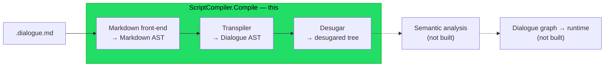
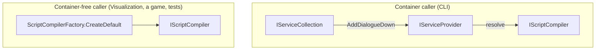

# Implementation note: Script compiler facade

> [!NOTE]
> Status: **proposed** — a design draft, not yet implemented. A cross-cutting
> component that gives the compiler a single public entry point and a dependency
> injection story, so other projects and the CLI invoke compilation through one
> seam instead of hand-wiring stages.

## Table of contents

- [Implementation note: Script compiler facade](#implementation-note-script-compiler-facade)
  - [Table of contents](#table-of-contents)
  - [Goal and scope](#goal-and-scope)
  - [Where it sits](#where-it-sits)
  - [Ubiquitous language](#ubiquitous-language)
  - [Functionality checklist](#functionality-checklist)
  - [Interfaces and abstractions](#interfaces-and-abstractions)
  - [Composition roots](#composition-roots)
  - [Key design decisions](#key-design-decisions)
    - [DD1 — One facade orchestrates the stages, deliberately incomplete](#dd1--one-facade-orchestrates-the-stages-deliberately-incomplete)
    - [DD2 — Public front door, internal internals](#dd2--public-front-door-internal-internals)
    - [DD3 — DI via Microsoft.Extensions.DependencyInjection](#dd3--di-via-microsoftextensionsdependencyinjection)
    - [DD4 — Stateless stages are singletons](#dd4--stateless-stages-are-singletons)
    - [DD5 — Errors propagate until diagnostics land](#dd5--errors-propagate-until-diagnostics-land)
    - [DD6 — CLI adopts the facade now](#dd6--cli-adopts-the-facade-now)
    - [DD7 — Visualization integrates later](#dd7--visualization-integrates-later)
  - [Error and boundary cases](#error-and-boundary-cases)
  - [Integration](#integration)
  - [Testability](#testability)

## Goal and scope

The compiler runs in stages, from raw source to the runtime dialogue graph (see
[Where it sits](#where-it-sits)). Today each caller wires those stages by hand:
the visualizer news up a parser and a transpiler; the CLI holds a placeholder
compiler. This component introduces one **facade** — `IScriptCompiler` — that runs
the stages in order and returns their artifacts, plus a **dependency injection**
story so the facade and its stages are swappable and configurable.

In scope: the facade, its result, a container-free factory, an `AddDialogueDown`
registration extension (in the core project), and wiring the **CLI** onto it.
Deliberately **incomplete**: the pipeline stops after desugar because semantic
analysis and later stages do not exist yet; a `TODO` marks where they slot in.
The **Visualization** rewiring is out of scope for this component and lands later
(it develops in parallel); the design only ensures the seam can serve it.

## Where it sits



The facade wraps the built stages — front-end, transpiler, desugar — behind one
call. The dashed stages are not built yet; they slot in at the same seam as
`CompilationResult` grows.

## Ubiquitous language

| Term                 | Meaning                                                                                                 |
| -------------------- | ------------------------------------------------------------------------------------------------------- |
| **Compiler**         | the whole source-to-runtime process; here realized (partially) by the facade.                           |
| **Compilation**      | one run of the compiler over a source string.                                                           |
| **Stage**            | one phase of the compiler (parse, transpile, desugar, …).                                               |
| **Facade**           | `IScriptCompiler`, the single entry point that runs the stages.                                         |
| **Composition root** | where the object graph is assembled: `AddDialogueDown` (container) or `CreateDefault` (container-free). |

## Functionality checklist

- [ ] **Orchestrate** parse → transpile → desugar and return a `CompilationResult`.
- [ ] **Expose each stage artifact** on the result (internal) for tooling to project.
- [ ] **`CreateDefault()`** builds a fully wired facade with no container.
- [ ] **`AddDialogueDown()`** registers the stages and the facade; resolving
      `IScriptCompiler` from the provider works.
- [ ] **Errors propagate** from a stage (no diagnostics component yet).
- [ ] **CLI `compile`** runs real compilation through the facade.
- [ ] **Deliberately incomplete**: a `TODO` seam marks semantic analysis and the
      later stages.

## Interfaces and abstractions

| Type                          | Visibility                          | Responsibility                                                                                             | Collaborators                                                   |
| ----------------------------- | ----------------------------------- | ---------------------------------------------------------------------------------------------------------- | --------------------------------------------------------------- |
| `IScriptCompiler`             | **public**                          | facade: `CompilationResult Compile(string source)`                                                         | the stages                                                      |
| `ScriptCompiler`              | internal                            | runs parse → transpile → desugar and assembles the result                                                  | `IMarkdownParser`, `IScriptTranspiler`, `IScriptDesugarer`      |
| `CompilationResult`           | **public** (internal stage members) | carries each stage's artifact and the original `Source`; a future home for diagnostics and compiled output | `MarkdownDocument`, `ScriptDocument`, `DesugaredScriptDocument` |
| `ScriptCompilerFactory`       | **public**                          | `CreateDefault()` — a container-free, fully wired facade                                                   | `ScriptCompiler` + default stages                               |
| `AddDialogueDown` (extension) | **public**                          | registers the stages and the facade into an `IServiceCollection`                                           | `IServiceCollection`                                            |

## Composition roots

Two composition roots build the same graph, for two kinds of caller:



## Key design decisions

### DD1 — One facade orchestrates the stages, deliberately incomplete

`ScriptCompiler.Compile(source)` runs the stages in order and returns a
`CompilationResult` holding each artifact:

```text
Compile(source):
    markdown  = parser.Parse(source)
    script    = transpiler.Transpile(markdown, source)
    desugared = desugarer.Desugar(script, source)
    # TODO(semantic-analysis): run semantic analysis, then graph build, as stages land.
    return CompilationResult(source, markdown, script, desugared)
```

Each stage already takes `source` for future diagnostics, so the facade threads it
through. The pipeline **stops after desugar** on purpose: later stages are not
built. The `TODO` is the single place they slot in, and `CompilationResult` grows
one artifact at a time — no caller changes when a stage is added.

### DD2 — Public front door, internal internals

The facade is the library's **public entry point**: a game or Godot integration
must be able to compile a script. So `IScriptCompiler` and `CompilationResult` are
**public**. The stage artifacts (`MarkdownDocument`, `ScriptDocument`,
`DesugaredScriptDocument`) are still under active design, so they stay **internal**
and must not leak into public API.

This is reconciled with precise visibility, needing **no new `InternalsVisibleTo`**:

- `IScriptCompiler` is public; its only method returns the public
  `CompilationResult` — no internal type appears in a public signature.
- `ScriptCompiler` is an **internal class implementing a public interface**; its
  constructor takes the internal stage interfaces. Callers only ever see
  `IScriptCompiler`.
- `CompilationResult` is a public record whose **stage members are `internal`**
  (`Markdown`, `Script`, `Desugared`) and whose constructor is internal (only core
  builds it). Its one **public** member is `Source` (the original text); the CLI
  and external embedders see that shell, while Visualization — already a friend via
  `InternalsVisibleTo` — reads the stage artifacts. Diagnostics and compiled output
  are planned public additions.

The facade and its result live in a new `DialogueDown.Compilation` namespace.

### DD3 — DI via Microsoft.Extensions.DependencyInjection

The stages are **constructor-injected** (the pattern), which makes them swappable
and testable with or without a container. On top of that, core offers **both**
composition roots so no caller is forced to adopt a container it does not want:

- **`AddDialogueDown(this IServiceCollection)`** registers the stage interfaces and
  the facade, for callers that already run a container (the CLI). It lives in the
  `Microsoft.Extensions.DependencyInjection` namespace so it is discoverable
  wherever that `using` already exists.
- **`ScriptCompilerFactory.CreateDefault()`** returns a fully wired facade in one
  call, for container-free callers (Visualization, a game, tests).

Core references only `Microsoft.Extensions.DependencyInjection.Abstractions`,
pinned to the `10.0.x` line to match the CLI's transitive version and avoid a
downgrade. It is a featherweight, first-party package — no container. Core **never
hosts its own container**: a library that news up a `ServiceProvider` internally is
the service-locator anti-pattern. Core provides the recipe and the factory; each
app owns its composition root. This is the seam that later carries configuration
(`IOptions<>`) and alternate stage implementations.

### DD4 — Stateless stages are singletons

The parser, transpiler, desugarer, and facade hold no per-compilation state, so
`AddDialogueDown` registers them as **singletons**. `CreateDefault` likewise
returns one wired instance. Both roots share the same per-stage defaults
(`MarkdigMarkdownParser`, `ScriptTranspilerFactory.CreateDefault()`,
`ScriptDesugarer`) so they cannot drift.

### DD5 — Errors propagate until diagnostics land

A stage throws on malformed input (for example `DialogueSyntaxError`). Until a
diagnostics component exists, the facade **propagates** the exception rather than
collecting it; a `CompilationResult` is returned only on success. The CLI's
existing exception handler already turns these into a clean message and exit code.
Collecting diagnostics into the result (partial compilation) is a planned public
seam on `CompilationResult`.

### DD6 — CLI adopts the facade now

The CLI's placeholder compiler (`IScriptCompiler`, `PendingScriptCompiler`,
`CompilationResult` in `DialogueDown.Cli.Compilation`) was built to be replaced.
It is **retired**: `CliServices` calls `AddDialogueDown()`, and `CompileCommand`
injects core's `IScriptCompiler`. The command body is unchanged in spirit — it
compiles the source and (per its own `TODO`) will later emit output honoring
`--output`.

### DD7 — Visualization integrates later

`CompilationVisualizer` keeps driving the parser and transpiler by hand for now.
It rewires onto the facade in a **later** change (it is a fast-moving area and
develops in parallel). When it does, it projects `CompilationResult`'s stage
artifacts into its tabs and gains the desugared stage for free. This component
only guarantees the seam can serve it, verified by a core test that reads the
internal stage members.

## Error and boundary cases

| Case                    | Behavior                                                              |
| ----------------------- | --------------------------------------------------------------------- |
| `source` is null        | `ArgumentNullException` from the facade (stages also guard).          |
| Empty `source`          | flows through as empty artifacts; a valid `CompilationResult`.        |
| Syntax error in a stage | the stage's exception propagates; no `CompilationResult` is returned. |
| A stage swapped via DI  | the facade runs the substitute; behavior is the caller's.             |

## Integration

- **Core**: new facade, result, factory, and `AddDialogueDown`; core takes the
  `Microsoft.Extensions.DependencyInjection.Abstractions` dependency.
- **CLI**: `CliServices` calls `AddDialogueDown()`; `CompileCommand` injects
  `IScriptCompiler`; the placeholder trio is removed.
- **Visualization** (later): `CompilationVisualizer` delegates to the facade and
  projects the result's stage artifacts.

## Testability

- **`ScriptCompiler`** — unit test with NSubstitute stage doubles: assert it calls
  parse → transpile → desugar in order, threads `source`, and assembles the result
  from each stage's output.
- **`CompilationResult`** — a friend test (in `DialogueDown.Tests`) asserting the
  internal stage artifacts are exposed.
- **`ScriptCompilerFactory.CreateDefault()`** — end-to-end on a real script: the
  result's desugared tree upholds the post-desugar invariants (no `JumpIndicator`
  survives, no line lacks a speaker).
- **`AddDialogueDown()`** — build a provider, resolve `IScriptCompiler`, compile a
  script, and confirm it is a working singleton graph.
- **CLI** — a `compile` smoke test: a real script compiles and returns the success
  exit code; the retired placeholder's "not implemented" test is removed.
