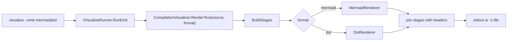

# Visualize CLI — Emit Mermaid and DOT

> [!NOTE]
> Status: **implemented**. A `dialoguedown visualize --emit <format>` option that
> writes each stage's graph as **Mermaid** or **Graphviz DOT** text, reusing the
> renderers that already exist. No frontend change.

## Table of contents

- [Goal & scope](#goal--scope)
- [Functionality checklist](#functionality-checklist)
- [Ubiquitous language](#ubiquitous-language)
- [Design](#design)
- [CLI surface](#cli-surface)
- [Key design decisions](#key-design-decisions)
- [Error & boundary cases](#error--boundary-cases)
- [Integration](#integration)
- [Testability](#testability)

## Goal & scope

The library already renders a display graph as **Mermaid** and **DOT** text
(`MermaidRenderer`, `DotRenderer`), but nothing surfaces them — they are reachable
only through the unused single-graph `HtmlRenderer`. The value of these formats is
**portable embedding**: pasting Mermaid into a GitHub doc, or laying a graph out
with Graphviz. A **CLI emit** delivers exactly that without touching the report
bundle, keeping the self-contained report lean and offline.

This component adds `dialoguedown visualize <script> --emit <format>`, which
compiles the script, renders every stage with the chosen renderer, and writes the
text to `-o <file>` or standard output. It also teaches `MermaidRenderer` the
per-category **colors** the interactive report uses, so an emitted Mermaid diagram
is as legible as the on-screen one.

In scope:

- `--emit mermaid|dot` on `visualize`, writing every stage's text to stdout (or the
  `-o` file), with a clear per-stage delimiter.
- A `RenderText` seam on the visualization engine that maps a format to a renderer
  and joins the stages.
- Per-category `classDef` coloring in `MermaidRenderer`.

Out of scope:

- Any in-browser Mermaid/DOT rendering or a report "rendering mode" — deliberately
  dropped (bundling Mermaid offline costs ~900 KB gzipped; see D1).
- New renderers or diagram formats beyond the two that exist.
- Rendering DOT/Mermaid to an image (that is the user's Graphviz/Mermaid toolchain).

## Functionality checklist

- [x] `visualize <script> --emit mermaid` writes every stage as Mermaid to stdout.
- [x] `visualize <script> --emit dot` writes every stage as DOT to stdout.
- [x] `--emit … -o <file>` writes the same text to a file instead of stdout.
- [x] Stages are separated by a clear, format-appropriate delimiter (a comment
      header naming the stage).
- [x] An unknown `--emit` value fails validation with a helpful message.
- [x] `--emit` requires a `<script>` (no launcher), and rejects combining with
      report-only options that do not apply.
- [x] `MermaidRenderer` emits per-category `classDef`s and tags each node, matching
      the report palette.
- [x] A bad document exits non-zero with the validation message (same as `-o`).

## Ubiquitous language

| Term | Meaning |
| --- | --- |
| **Emit** | Write a stage's graph as text in a target **format**, for embedding elsewhere — distinct from the interactive **report** and the static **export** (`-o` HTML). |
| **Format** | `mermaid` or `dot` — each backed by an `IDisplayRenderer`. |
| **Renderer** | The existing strategy that turns one `DisplayGraph` into one format's text. |

## Design



- **`CompilationVisualizer.RenderText(string source, EmitFormat format)`** builds the
  stages (the same `BuildStages` the report uses) and renders each with the format's
  `IDisplayRenderer`, joining them under a per-stage header comment. One small method
  on the existing facade; the renderers and stage projections are unchanged except
  for the Mermaid color enhancement.
- **`EmitFormat`** is a small enum (`Mermaid`, `Dot`) mapped to a renderer, so adding
  a format later is one arm.
- **CLI**: `VisualizeSettings` gains `--emit <format>`; `VisualizeCommand` routes to a
  new `IVisualizeRunner.RunEmit(file, format, output)` before the served/launcher
  paths (emit is non-interactive, like `-o`). `RunEmit` validates the document, calls
  `RenderText`, and writes to the file or stdout.
- **`MermaidRenderer` colors**: emit one `classDef <cat> fill:…,color:#fff` per
  category present and tag each node `:::cat<category>`. Class names are prefixed
  (`cat…`) so a category like `call` cannot collide with a Mermaid reserved word.

## CLI surface

```bash
# Emit every stage as Mermaid to stdout
dialoguedown visualize scene.dialogue.md --emit mermaid

# Emit DOT to a file
dialoguedown visualize scene.dialogue.md --emit dot -o scene.dot
```

Each stage is introduced by a comment header in the target format, e.g.
`%% Markdown AST` (Mermaid) or `// Markdown AST` (DOT), so a multi-stage emit is
self-describing and a reader can copy one stage out.

## Key design decisions

### D1 — Emit at the CLI, not in the report

Rendering Mermaid **in the browser** would need mermaid.js **bundled** into the
self-contained offline report — measured at **~900 KB gzipped** (npm `mermaid` pulls
in every diagram type plus KaTeX), roughly quintupling the report. The interactive
D3 graph is already the superior on-screen view; the unique value of Mermaid/DOT is
**portable text for embedding**, which a CLI emit delivers at **zero bundle cost**
and keeps the report fully offline. So the report is unchanged and the formats live
at the CLI, next to the existing `-o` export.

### D2 — One `RenderText` seam, renderer per format

`RenderText(source, format)` is the single engine entry point, mapping the format to
its `IDisplayRenderer` and joining stages. This mirrors `RenderHtmlReport`/
`SerializeDocument` on the same facade, reuses `BuildStages`, and keeps the CLI thin
(it only parses the option and writes bytes).

### D3 — Emit is non-interactive, alongside `-o`

`--emit` behaves like `-o`: it requires a `<script>`, never opens a server or the
launcher, and returns a process exit code. It composes with `-o` to choose file vs
stdout. This keeps the mental model simple: interactive report by default, `-o` for
an HTML artifact, `--emit` for graph text.

### D4 — Color Mermaid to match the report

An emitted Mermaid diagram should carry the same category signal as the interactive
graph (Document gray, speech green, call red…), so `MermaidRenderer` gains
per-category `classDef`s. DOT keeps its plain output — Graphviz users typically
restyle at layout time, and DOT node coloring is a possible later addition.

## Error & boundary cases

- **Unknown format** — `--emit yaml` fails `Validate()` with a message listing the
  valid formats (`mermaid`, `dot`).
- **No script** — `--emit` without a `<script>` fails validation (like `-o`).
- **Bad document** — a document that fails `DocumentValidation` writes the problem to
  stderr and exits non-zero, before any text is emitted.
- **Empty stages** — a document that still produces stages emits their headers and
  bodies; an empty graph renders as a valid, if sparse, diagram.

## Integration

- **`VisualizeSettings` / `VisualizeCommand`** (CLI) — one new option, one new route
  arm before the served/launcher paths.
- **`IVisualizeRunner` / `VisualizeRunner`** — a new `RunEmit`, mirroring `RunStatic`;
  a substitute keeps the command unit-testable.
- **`CompilationVisualizer`** — a new `RenderText`; existing methods untouched.
- **`MermaidRenderer`** — colored output; `DisplayGraph`/projections unchanged.
- **README/CHANGELOG** — document `--emit` and restore an accurate mention that the
  CLI (not the report) emits Mermaid/DOT.

## Testability

- **`MermaidRenderer`** (unit, .NET): emits `classDef` per present category and tags
  nodes; class names are prefixed so `call` does not collide; escaping preserved.
- **`RenderText`** (unit, .NET): a small script emits multiple stages with the right
  headers; `mermaid` starts each stage `flowchart`, `dot` each `digraph`; a stub
  compiler proves it reads the seam.
- **`RunEmit`** (unit, .NET): writes to the file when given, else stdout; a bad
  document returns non-zero and writes nothing.
- **`VisualizeSettings.Validate`** (unit, .NET): unknown format and missing-script
  cases fail with messages; valid formats pass.
- **`VisualizeCommand`** (unit, .NET): `--emit` routes to `RunEmit` with the parsed
  format and output, not the served/launcher paths (substituted runner).
