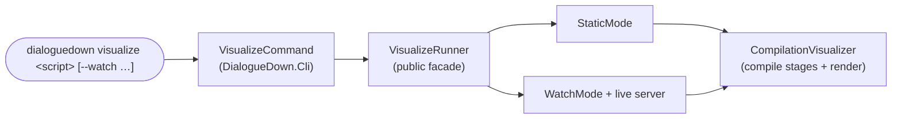

# Implementation note: visualize on the CLI

> [!NOTE]
> Status: **proposed**.
> Make `dialoguedown visualize` render for real by delegating to the visualization
> engine, and retire the hand-rolled `System.CommandLine` entry point — one CLI.
>
> **Maturity caveat.** Like the rest of the visualization work, this is built
> quickly ("vibe-coded") with lighter design review; it is well-tested and works,
> but its abstractions may be refined with real use.

## Table of contents

- [Goal and scope](#goal-and-scope)
- [Where it sits](#where-it-sits)
- [Key design decisions](#key-design-decisions)
- [What changes](#what-changes)
- [Error and boundary cases](#error-and-boundary-cases)
- [Testability](#testability)

## Goal and scope

The `compile`/`visualize` skeleton merged from `main` leaves `visualize` as a stub.
This component makes it **do the visualization** — reusing the engine already on
this branch (`DialogueDown.Visualization` + `DialogueDown.Visualization.Live`) —
and **removes the second, hand-rolled CLI** so there is one entry point.

**In scope:** `dialoguedown visualize <script>` covers the engine's current modes —
**static** (render a self-contained report and open it) and **watch** (loopback
server + hot reload) — with the same options; the old `System.CommandLine`
`VisualizeCli` is deleted.

**Out of scope:** live editing (`--live`) and the file launcher remain their own
later components; the transpiler stays stubbed (see D3).

## Where it sits

`DialogueDown.Cli` gains a reference to `DialogueDown.Visualization.Live` and drives
it through a small public facade. The render library stays web-free; the Live
project keeps the web/server code but stops being its own executable.

## Key design decisions

### D1 — The CLI is the single entry point; the Live project becomes a library

`DialogueDown.Visualization.Live` stops being a `Microsoft.NET.Sdk.Web`
**executable** and becomes a **library** (`Microsoft.NET.Sdk` +
`FrameworkReference Microsoft.AspNetCore.App`, so it can still host the loopback
server). Its `Program.cs`, `VisualizeCli.cs`, and the `System.CommandLine` package
are **removed**. `DialogueDown.Cli` references it and owns the process entry.

### D2 — A small public facade over the run modes

The run logic already exists (`StaticMode`, `WatchMode`) but is `internal`. Expose
a thin **`VisualizeRunner`** facade (public) with `RunStatic(...)` and
`RunWatchAsync(...)` so the CLI drives it without leaking every internal type.
`VisualizeCommand` becomes an **`AsyncCommand`** (watch is long-running) and maps
its settings onto the facade.

### D3 — Visualize compiles via the engine, not the stubbed seam

The report visualizes the **Markdown-AST stage**, which the engine already produces
(`CompilationVisualizer`). So `visualize` uses the engine's own compilation, **not**
the CLI's `IScriptCompiler` stub (which would throw). The `compile` command and its
seam are untouched; when the transpiler lands, the engine grows the Dialogue-AST
stage and the two compile paths can converge. `visualize` therefore no longer
depends on `IScriptCompiler`.

## What changes

| Area | Change |
| --- | --- |
| `DialogueDown.Visualization.Live.csproj` | Web-SDK exe → SDK **library** + `FrameworkReference` ASP.NET; drop `System.CommandLine`; grant internals to `DialogueDown.Cli`. |
| Live project | **Delete** `Program.cs`, `VisualizeCli.cs`; add public `VisualizeRunner`. `StaticMode`/`WatchMode`/server stay. |
| `DialogueDown.Cli` | Reference the Live project. `VisualizeSettings` gains `--watch`, `-o/--output`, `--port`, `--no-open`, `--render-root`. `VisualizeCommand` → `AsyncCommand`, drives `VisualizeRunner`; drop the not-implemented/`IScriptCompiler` path. |
| Tests | Delete `VisualizeCliTests`; keep `StaticMode`/`WatchMode`/server tests; add `VisualizeCommand` tests (static writes + opens; watch starts the server). |
| Live e2e | `serve.mjs`/`serve-renderroot.mjs` run `dialoguedown` (the Cli project) with `visualize … --watch` instead of the Live exe. |

## Error and boundary cases

Same behavior as today, now surfaced through the CLI: a missing file or wrong
extension fails via the shared `ScriptArgument` validation (usage exit code) before
running; a deleted document during watch still shows the banner; `--port` in use
still reports a bind error. Static vs watch is chosen by `--watch`.

## Testability

`CommandAppTester` drives `visualize` with a fake browser launcher: static mode
writes a report and "opens" it; watch mode starts a loopback server (assert the URL
and a reachable report). The engine's own unit tests (`StaticMode`, `WatchMode`,
server, `CompilationVisualizer`) are unchanged. The existing browser e2e keeps
working once its server scripts launch the CLI instead of the retired Live exe.
