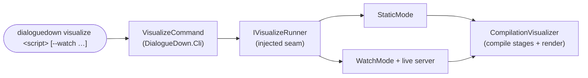

# Implementation note: visualize on the CLI

> [!NOTE]
> Status: **implemented**.
> Make `dialoguedown visualize` render for real by delegating to the visualization
> engine, and retire the hand-rolled `System.CommandLine` entry point — one CLI.
>
> **Maturity caveat.** Like the rest of the visualization work, this is built
> quickly ("vibe-coded") with lighter design review; it is well-tested and works,
> but its abstractions may be refined with real use.

## Table of contents

- [Goal and scope](#goal-and-scope)
- [Where it sits](#where-it-sits)
- [Key design decisions](#key-design-decisions)
- [What changes](#what-changes)
- [Error and boundary cases](#error-and-boundary-cases)
- [Testability](#testability)

## Goal and scope

The `compile`/`visualize` skeleton merged from `main` leaves `visualize` as a stub.
This component makes it **do the visualization** — reusing the engine already on
this branch (`DialogueDown.Visualization` + `DialogueDown.Visualization.Live`) —
and **removes the second, hand-rolled CLI** so there is one entry point.

**In scope:** `dialoguedown visualize <script>` covers the engine's current modes —
**static** (render a self-contained report and open it) and **watch** (loopback
server + hot reload) — with the same options; the old `System.CommandLine`
`VisualizeCli` is deleted.

**Out of scope:** live editing (`--live`) and the file launcher remain their own
later components; the transpiler stays stubbed (see D3).

## Where it sits

`DialogueDown.Cli` gains a reference to `DialogueDown.Visualization.Live` and drives
it through an injected runner seam. The render library stays web-free; the Live
project keeps the web/server code but stops being its own executable.

## Key design decisions

### D1 — The CLI is the single entry point; the Live project becomes a library

`DialogueDown.Visualization.Live` stops being an **executable** and becomes a
**library** — it keeps the `Microsoft.NET.Sdk.Web` SDK (so the ASP.NET types and
implicit usings the server relies on stay available) with `<OutputType>Library</OutputType>`.
Its `Program.cs`, `VisualizeCli.cs`, and the `System.CommandLine` package are
**removed**. `DialogueDown.Cli` references it and owns the process entry.

### D2 — An injectable runner seam over the run modes

The run logic already exists (`StaticMode`, `WatchMode`) but is `internal`. Expose a
public **`IVisualizeRunner`** seam (`RunStatic` / `RunWatchAsync`) with a default
`VisualizeRunner` that takes an `IBrowserLauncher` and hides the server/consent
wiring. `IBrowserLauncher`/`BrowserLauncher` become public so the CLI can register
and substitute them. `VisualizeCommand` is an **`AsyncCommand`** (watch is
long-running) that injects `IVisualizeRunner` and maps its settings onto it — which
also makes the command fully unit-testable with a substitute.

### D3 — Visualize compiles via the engine, not the stubbed seam

The report visualizes the **Markdown-AST stage**, which the engine already produces
(`CompilationVisualizer`). So `visualize` uses the engine's own compilation, **not**
the CLI's `IScriptCompiler` stub (which would throw). The `compile` command and its
seam are untouched; when the transpiler lands, the engine grows the Dialogue-AST
stage and the two compile paths can converge. `visualize` therefore no longer
depends on `IScriptCompiler`.

## What changes

| Area | Change |
| --- | --- |
| `DialogueDown.Visualization.Live.csproj` | Keep the Web SDK but set `OutputType=Library`; drop `System.CommandLine`. |
| Live project | **Delete** `Program.cs`, `VisualizeCli.cs`; add public `IVisualizeRunner`/`VisualizeRunner`; make `IBrowserLauncher`/`BrowserLauncher` public. `StaticMode`/`WatchMode`/server stay. |
| `DialogueDown.Cli` | Reference the Live project. `VisualizeSettings` gains `--watch`, `-o/--output`, `--port`, `--no-open`, `--render-root`. `VisualizeCommand` → `AsyncCommand`, injects `IVisualizeRunner`; drop the not-implemented/`IScriptCompiler` path. Register `BrowserLauncher` + `VisualizeRunner` in DI. |
| Tests | Delete `VisualizeCliTests`; keep `StaticMode`/`WatchMode`/server tests; add `VisualizeRunner` tests (real static/watch) and `VisualizeCommand` tests (a substituted runner). |
| Live e2e | `serve.mjs`/`serve-renderroot.mjs` (and the CI pre-build step) run `dialoguedown` (the Cli project) with `visualize … --watch` instead of the Live exe. |

## Error and boundary cases

Same behavior as today, now surfaced through the CLI: a missing file or wrong
extension fails via the shared `ScriptArgument` validation (usage exit code) before
running; a deleted document during watch still shows the banner; `--port` in use
still reports a bind error. Static vs watch is chosen by `--watch`.

## Testability

Two layers keep it fast and deterministic. At the **command** layer,
`CommandAppTester` drives `visualize` with a **substituted `IVisualizeRunner`**, so
tests assert the dispatch and option mapping (static vs `--watch`, `-o`, `--port`,
`--render-root`) and the missing-file usage error without spawning a server. At the
**engine** layer, `VisualizeRunner` is tested against a fake browser launcher: static
writes a report and "opens" it; watch starts a loopback server and opens a URL, then
stops on cancel. `StaticMode`/`WatchMode`/server/`CompilationVisualizer` unit tests
are unchanged, and the browser e2e runs against the CLI-launched server.
