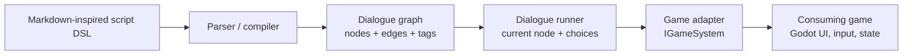

# DialogueSystem overview

DialogueSystem is an engine-agnostic C# library for branching game dialogue. It
keeps dialogue data, graph logic, tags, and game-state integration outside any
specific engine so Godot projects can use the core library through thin
presentation adapters.

> [!NOTE]
> The current codebase contains the early core interfaces and tag registry. The
> parser, runner, effects, and condition system are still design intent, not
> implemented behavior.

## Table of contents

- [Architecture at a glance](#architecture-at-a-glance)
- [Script representations](#script-representations)
- [Current implementation status](#current-implementation-status)
- [Related docs](#related-docs)

## Architecture at a glance

The intended architecture separates five responsibilities:

- **Script DSL:** writer-friendly text format for dialogue, choices, tags,
  jumps, queries, and commands.
- **Parser / compiler:** converts script files into graph objects and validates
  references.
- **Dialogue graph:** stores nodes, edges, speakers, speech, and tags in an
  engine-neutral model.
- **Runner:** advances dialogue state, exposes choices, and triggers game
  interactions.
- **Game adapter:** bridges dialogue commands and queries to the consuming game
  through `IGameSystem`.

## Script representations

Dialogue content moves through three representations:

1. **Script phase** — a Markdown-inspired domain-specific language (DSL) written
   by authors in text files.
2. **Compilation phase** — an abstract syntax tree or intermediate model that
   resolves speakers, tags, choices, jumps, queries, and commands.
3. **Runtime phase** — a directed graph/state machine that the dialogue runner
   can traverse.

For the proposed script syntax, see
[Script language specification](./Script%20Language/Script%20Language%20DSL%20Specification.md).

## Current implementation status

- **Project shape:** `src/DialogueSystem` targets `net8.0` and has no Godot
  dependency.
- **Graph model:** early internal interfaces exist for `INode`, `IEdge`,
  `IDialogue`, `ISpeaker`, `ISpeech`, `ITag`, and `ITaggable`.
- **Tags:** `Tag` and `TagRegistry` provide an initial internal tag model and
  lookup store.
- **Game integration:** `IGameSystem` exposes `Query(string)` and
  `Execute(string)` for game-state reads and side effects.
- **Tests:** the current test project verifies the assembly anchor type. Broader
  parser/runner tests still need to be added as features land.

## Related docs

- [Script language specification](./Script%20Language/Script%20Language%20DSL%20Specification.md)
  — proposed writer-facing syntax for dialogue files.
- [Root README](../README.md) — project purpose, layout, build command, and
  design intent.
