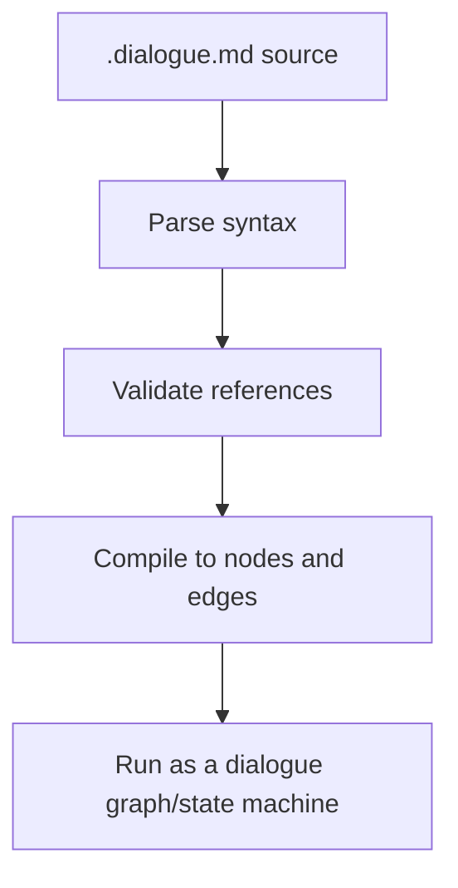
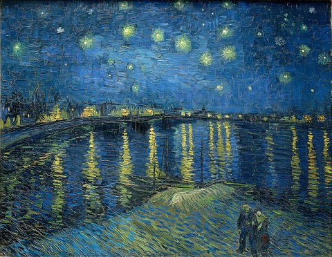

# Script language specification

This specification defines DialogueDown's script language: a Markdown-subset
domain-specific language (DSL) for writing dialogue scripts. The language is
designed to stay readable for writers while still compiling into a precise graph
model for developers.

> [!NOTE]
> DialogueDown is in early development. The script language, compiler model,
> and runtime behavior described here are subject to change as the library
> evolves.

## Table of contents

- [Script language specification](#script-language-specification)
  - [Table of contents](#table-of-contents)
  - [Why Markdown](#why-markdown)
  - [Goals](#goals)
  - [Processing model](#processing-model)
  - [Syntax summary](#syntax-summary)
  - [Text lines](#text-lines)
    - [Speaker](#speaker)
      - [Inline speaker declaration](#inline-speaker-declaration)
      - [Speaker reference](#speaker-reference)
      - [Partial declaration](#partial-declaration)
      - [Default speaker](#default-speaker)
    - [Whitespace around the colon](#whitespace-around-the-colon)
    - [Styling](#styling)
    - [Tags](#tags)
    - [Images](#images)
  - [Game-state integration](#game-state-integration)
    - [Queries](#queries)
    - [Commands](#commands)
  - [Dialogue structure](#dialogue-structure)
    - [Succession](#succession)
    - [Choices](#choices)
    - [Jumps](#jumps)
    - [Comments](#comments)
    - [Front matter](#front-matter)
    - [Authoring aids](#authoring-aids)
  - [Complete example](#complete-example)
  - [File format](#file-format)

## Why Markdown

The script language intentionally uses a Markdown subset instead of a completely
custom text format.

- **Readable source:** Scripts remain easy to read before any compiler or editor
  integration exists.
- **Familiar syntax:** Writers and developers already know headings, lists,
  links, comments, and fenced blocks.
- **Editor support:** Markdown-aware editors provide highlighting, folding,
  outline navigation, snippets, and basic completion with little custom tooling.
- **Linting for free:** Existing Markdown tools can catch broken links, malformed
  headings, long lines, and formatting issues.
- **Git-friendly review:** Dialogue changes stay diffable and reviewable as
  plain text.

## Goals

The DSL is designed to be readable by writers while still compiling into a
precise runtime graph.

- Use plain text that works well in Git diffs and Markdown editors.
- Keep common dialogue terse: `Alice: Hello!`
- Support branching choices, jumps, tags, speaker declarations, game-state
  queries, and game-state commands.
- Preserve a clean boundary between dialogue content and engine-specific
  presentation.

## Processing model



## Syntax summary

| Feature | Example | Purpose |
| --- | --- | --- |
| Text line | `Alice: Hello, Bob!` | Speaker says a line. |
| Default speaker | `Hello from the narrator.` | Use the default speaker. |
| Inline speaker declaration | `Alice @A #main: Hello!` | Declare a speaker. |
| Speaker ID | `@A: Hello!` | Reference a stable speaker ID. |
| Partial declaration | `@A #excited: Hi!` | Reference a speaker and add tags. |
| Tag | `#main` | Attach custom metadata. |
| Reserved tag | `##default` | Mark built-in behavior. |
| Choice | `- Bob: Really?` | Offer a selectable response. |
| Jump | `=> [Play tennis](#play-tennis)` | Connect to another section. |
| Query | `` `"Alice.FavoriteColor"` `` | Call `IGameSystem.Query`. |
| Default command | `` `("Alice joins Art")` `` | Call `IGameSystem.Execute`. |
| Custom command | `` `JoinClub("Alice", "Art")` `` | Execute with arguments. |

## Text lines

A text line is the basic unit of spoken dialogue.

```ebnf
TextLine = [ Speaker , ":" ] , Speech ;
```

Canonical form:

```markdown
Alice: Hello, Bob!
```

### Speaker

A line may name who speaks before the colon. A speaker prefix is either a
**declaration** (which binds a name, an optional id, and tags) or a **reference**
(which only points at a known speaker); omitting the prefix uses the default
speaker.

#### Inline speaker declaration

Inline speaker declarations are a lightweight way to introduce or enrich
speakers directly in script.

```ebnf
SpeakerName          = Identifier | String ;
SpeakerId            = Identifier ;
SpeakerDeclaration   = SpeakerName , [ "@" , SpeakerId ] , Tags ;
```

Example:

```markdown
Alice @A #main: Hello, Bob!
Bob @B #npc: Hello, Alice!
Alice #avatar="alice.png": The weather is nice today!
```

Inline declarations may appear multiple times as long as they don't conflict with
existing speaker identity. Conflicting speaker metadata is a compile-time error.

A prefix counts as a *declaration* only when it binds metadata **with a name** — a
name plus an `@id` and/or tags. A prefix that is **only** a name (`Alice:`) or
**only** an `@id` (`@A:`) is a [speaker reference](#speaker-reference); an `@id`
**with** tags but no name is a [partial declaration](#partial-declaration).

> [!NOTE]
> Speaker tags apply globally to the speaker, not just to the single text line
> where the tag appears.

#### Speaker reference

Speakers can be referenced by name or by stable ID.

```ebnf
SpeakerReference = SpeakerName | "@" , SpeakerId ;
```

Examples:

```markdown
Alice: Hello, Bob!

@A: Hello, Bob!
```

Stable IDs are useful when a character has nicknames, localized names, or
multiple display names.

For long-form stories, keep a central `speakers.json` file so speaker identity
and metadata have a single source of truth.

```json
[
  {
    "name": "Alice",
    "id": "A",
    "tags": ["main"]
  },
  {
    "name": "Bob",
    "id": "B",
    "tags": ["npc"]
  }
]
```

#### Partial declaration

An `@id` **with** tags but no name is a *partial declaration*: it references a
speaker by id and contributes extra tags to them.

```ebnf
PartialSpeakerDeclaration = "@" , SpeakerId , Tags ;
```

```markdown
@A #excited: I can't wait to see the festival!
```

The referenced speaker is resolved and the tags are merged into their metadata (a
no-conflict merge) during compilation. Tags with **neither** a name nor an `@id`
(`#tag:`) have no speaker to attach to and are a compile-time error.

#### Default speaker

When a line omits `Speaker`, the compiler will use the default speaker. If no
default speaker exists, it will use the system speaker.

```markdown
The narrator speaks because no explicit speaker is provided.
```

Mark a speaker as the default speaker with the reserved `##default` tag:

```markdown
Narrator @narrator ##default: The story begins.

This line is also spoken by Narrator.
```

### Whitespace around the colon

Whitespace around the colon is flexible for author comfort. Whitespace before
the colon and *all* whitespace immediately after it is insignificant, so every
line below means the same thing — Alice saying `Hello, Bob!`:

```markdown
Alice:Hello, Bob!

Alice :Hello, Bob!

Alice: Hello, Bob!

Alice :   Hello, Bob!
```

The amount of spacing never changes the speech. This matters because rendered
Markdown collapses consecutive spaces visually, so relying on extra spaces would
be an invisible trap — the author could not see the difference in a preview.

If speech must start with a literal leading space, quote it. Quoting is the
single, explicit way to preserve leading whitespace:

```markdown
Alice: " Hello, Bob!"
```

### Styling

Speech may use standard Markdown emphasis and strikethrough for **styling**:

```markdown
Alice: I *really* mean it.

Alice: This is **very** important.

Alice: That plan is ~~cancelled~~.
```

- `*text*` or `_text_` is **italic**; `**text**` or `__text__` is **bold**;
  `~~text~~` is **strikethrough**. Combine emphasis (`***text***`) for bold italic.
- To type a **literal** asterisk, underscore, or tilde, escape it (`\*`, `\_`,
  `\~`). Underscores inside a word (`snake_case_name`) are never emphasis, and a
  single `~` is not strikethrough — only `~~...~~` is.

Styling can wrap other speech constructs — a query inside bold still resolves:

```markdown
Bob: **Hello `"MainCharacter.Name"`!**
```

The result is a bold *Hello Alice!*.

> [!NOTE]
> This spec defines *what* styling an author can write. How a given style renders
> (color, bold weight, BBCode, plain text, …) is decided by the game's
> presentation layer, not by the compiler.

### Tags

Tags attach metadata that plugins, tools, or runtime systems can interpret.

```ebnf
TagName          = Identifier | String ;
TagGroupName     = Identifier | String ;
Tag              = "#" , TagName ;
TagGroup         = "#" , TagGroupName , "=" , TagName ;
ReservedTag      = "##" , TagName ;
ReservedTagGroup = "##" , TagGroupName , "=" , TagName ;
Tags             = { Tag | TagGroup | ReservedTag | ReservedTagGroup } ;
```

Examples:

```markdown
Alice @A #main: Hello, Bob!

Alice #mood=happy: What a beautiful day.

Alice #"speaker tone"="warm": I'm glad to see you.

Narrator @narrator ##default: The story begins.
```

**Custom tags** (`#...`) are project-defined, opaque metadata. **Reserved tags**
(`##...`) are built-in language tags owned by DialogueDown, drawn from a known
set. A tag that carries a value (`#name=value`) is a **tag group**.

Tags may appear wherever they attach to content: in a **speaker declaration**, in
a **link or image label**, and **anywhere within speech text**. A custom or
reserved tag must never start a line at block scope — a tag always rides along
with the element it annotates, never standing alone as a line.

Currently, the only supported reserved tag is `##default`, which marks a speaker
as the default speaker.

### Images

Embed an image inline in speech with standard Markdown image syntax; it appears
at that position in the line:

```markdown
Alice: Here is the photo you wanted. 
```

Presentation **tags** may be added inside the **alt** text to customize how the
image is shown (size, alignment, or any hint the game defines), using the same
`#tag` / `#group=value` form as speaker tags:

```markdown
Alice: 
```

The compiler keeps the source path and the alt text (including any tags) exactly
as written; the presentation layer decides what the tags mean and how the image
renders.

## Game-state integration

The current `IGameSystem` interface exposes two integration points:

```csharp
public interface IGameSystem
{
    string Query(string query);

    void Execute(string command);
}
```

The DSL will compile query and command syntax into calls to that adapter.

### Queries

A query reads game state and inserts the returned value into speech.

```ebnf
Query = "`" , QuotedString , "`" ;
```

Adapter example:

```csharp
public sealed class GameSystem : IGameSystem
{
    public string Query(string query)
    {
        return query switch
        {
            "Alice.FavoriteColor" => "red",
            _ => string.Empty
        };
    }

    public void Execute(string command)
    {
    }
}
```

Script:

```markdown
Bob: What's your favorite color?

Alice: My favorite color is `"Alice.FavoriteColor"`.
```

Actual speech after query resolution:

```markdown
Bob: What's your favorite color?

Alice: My favorite color is red.
```

### Commands

A command changes game state through `IGameSystem.Execute`.

```ebnf
DefaultCommand = "`" , "(" , QuotedString , ")" , "`" ;
CustomCommand  = "`" , Identifier , "(" , [ Arguments ] , ")" , "`" ;
Command        = DefaultCommand | CustomCommand ;
```

Adapter example:

```csharp
public sealed class GameSystem : IGameSystem
{
    public string Query(string query)
    {
        return string.Empty;
    }

    public void Execute(string command)
    {
        switch (command)
        {
            case "JoinClub(\"Alice\", \"Kung Fu\")":
                JoinClub("Alice", "Kung Fu");
                return;
        }
    }

    private static void JoinClub(string characterName, string clubName)
    {
        // Update game state here.
    }
}
```

Default command:

```markdown
Bob: Of course. You can join. `("Alice joins Kung Fu")`

Alice: Thank you!
```

Custom command:

```markdown
Bob: Of course. You can join. `JoinClub("Alice", "Kung Fu")`

Alice: Thank you!
```

Silent command:

```markdown
Alice: Bob, do you have a minute?

Bob: Yes. What can I do for you?

Alice: I like Chinese martial arts. Can I join the Kung Fu Club?

Bob: Of course.

`JoinClub("Alice", "Kung Fu")`

Alice: Thank you!
```

Under the hood, a silent command will compile to a command-only text line spoken
by the default speaker.

```markdown
@default: `JoinClub("Alice", "Kung Fu")`
```

The compiler will emit a special node for each game-system call. The node shape
and runtime execution contract are outside this document's scope.

## Dialogue structure

Dialogue sections become graph nodes and edges. Linear lines create succession
edges. Choices and jumps create branches.

### Succession

When one text line follows another, the second line is the only successor of the
first line. Separate successive speeches with a **blank line** so that each
speech is its own Markdown paragraph.

```markdown
Alice @A #main: Hello, Bob!

Bob @B #npc: Hello, Alice!
```

The script language follows standard Markdown line-break rules, so a Markdown
preview groups lines into speeches exactly as the compiler does:

- A **blank line** starts a new speech. This is the primary, most readable way to
  separate successive speeches.
- A **soft break** (a plain newline with no blank line) keeps both lines in the
  same speech. Use it to wrap one long speech across several source lines.
- A **hard break** starts a new speech without a blank line, for a compact
  layout. Make a break hard in either of the two standard Markdown ways: end the
  line with two or more trailing spaces, or end it with a backslash (`\`).

A soft break wraps a single speech across source lines; it is still one speech:

```markdown
Alice: This is a single long speech that the author wrapped across
several source lines for readability. It is still spoken as one speech.
```

A hard break separates two speeches without a blank line. The trailing backslash
below is one of the two hard-break forms; two trailing spaces is the other:

```markdown
Alice: Hello, Bob!\
Bob: Hello, Alice!
```

### Choices

Use `-` to offer selectable responses.

```markdown
Alice: The weather is nice today!
- Bob: Is it really?
- Bob: Yes, I agree.
```

Choices can be nested, but deep nesting becomes hard to scan. Prefer jumps when
branches split and later merge again.

```markdown
Alice: The weather is nice today!
- Bob: Is it really?
    - Alice: Yes. Let's play tennis!
- Bob: Yes, I agree.
    - Alice: Wonderful. Let's play tennis!
```

Choice **ordering** follows the list type. An **ordered** list (`1.`, `2.`, …)
means the choices must be presented in that textual order. An **unordered** list
(`-`) leaves later stages free to shuffle the display order — useful when the
options should appear in a random order.

### Jumps

A jump is `=>` followed by a Markdown-style link.

```ebnf
Jump = "=>" , MarkdownLink ;
```

Use same-file anchors for local dialogue and relative paths for cross-file
dialogue.

```markdown
=> [Play tennis](#play-tennis)
=> [Meet Bob](chapter-02.md#meet-bob)
```

Example:

```markdown
## Greetings

Alice: The weather is nice today!
- Bob: Is it really?
    - Alice: Yes. Let's play tennis!
        => [Play tennis](#play-tennis)
- Bob: Yes, I agree.
    - Alice: Wonderful. Let's play tennis!
        => [Play tennis](#play-tennis)

## Play tennis

Alice: Tennis is fun!

Bob: Yes, I agree.
```

### Comments

Because the DSL is Markdown-inspired, use Markdown-compatible HTML comments for
author notes.

```markdown
Alice @A #main: Hello, Bob! <!-- Alice speaks in a warm tone. -->

Bob @B #npc: Hello, Alice!
```

### Front matter

A script may open with a **front matter** block — a `---`-fenced section of
metadata (title, tags, author, and the like) at the very top of the file. It is
never spoken and is **always discarded**, like a comment. Unlike authoring aids,
this is not configurable: metadata is never speech.

Only a block at the document start is front matter; a `---` later in the script
is a thematic break (an authoring aid).

```markdown
---
title: Reunion
tags: [chapter-1, intro]
---

Alice: Hello, Bob!
```

### Authoring aids

Markdown constructs that organize the script rather than say something —
**tables**, **fenced code blocks** (including diagrams like mermaid), and
**thematic breaks** (`---`) — are treated as author-only aids and are **dropped
from speech by default**, much like comments. Use them freely to document
speakers, sketch scene relationships, or divide sections.

```markdown
<!-- A table of who appears in this scene — never spoken. -->

| Speaker | Mood  |
| ------- | ----- |
| Alice   | happy |
| Bob     | shy   |

Alice: Nice to see you, Bob!
```

> [!NOTE]
> Which unmodeled constructs are dropped versus kept as literal speech is
> configurable per project in a `dialogue.toml` file. See the internal
> *Unmodeled Markdown Handling* note for the defaults and how to override them.

## Complete example

```markdown
---
title: Gallery Visit
speakers: speakers.json
---

<!-- A short gallery scene that exercises the whole language. -->

## Gallery

Narrator @narrator ##default: Alice visits Bob's photography gallery.

- Alice @A #main: Bob, this is *your* photo. I love it! 
    => [Discuss Bob's photo](#discuss-bobs-photo)
- Alice: Look, this is **Christina's** painting. 
    => [Discuss Christina's painting](#discuss-christinas-painting)

## Discuss Bob's photo

Bob @B #mood=happy: Thank you. I'm glad you like it. `IncreaseAffection("Bob", "Alice")`

Alice: My favorite colour is `"Alice.FavoriteColor"`. May I join the Photography Club?

- Bob: Yes — welcome aboard!
    - Alice: Wonderful, thank you!
- Bob: Not ~~yet~~ quite.

`("Alice joins Photography")`

## Discuss Christina's painting

Bob: This is the night view of the Huangpu River.
It is *beautiful*, especially at dusk.

Alice: I love this painting too. The colours are **amazing**.

Christina @C: I learned colour theory in the Art Club.

`IncreaseAffection("Christina", "Alice")`

Alice: I'd like to join the Art Club and give painting a try.

`JoinClub("Alice", "Art")`
```

## File format

Save dialogue scripts with the `.dialogue.md` extension.

This keeps the file readable as Markdown while making it clear that the file is
dialogue source, not ordinary project documentation.

Example filenames:

- `chapter-01.dialogue.md`
- `intro.dialogue.md`
- `npc/shopkeeper.dialogue.md`

Use normal Markdown tooling for editing and review. The compiler will treat these
files as DialogueDown script files.
