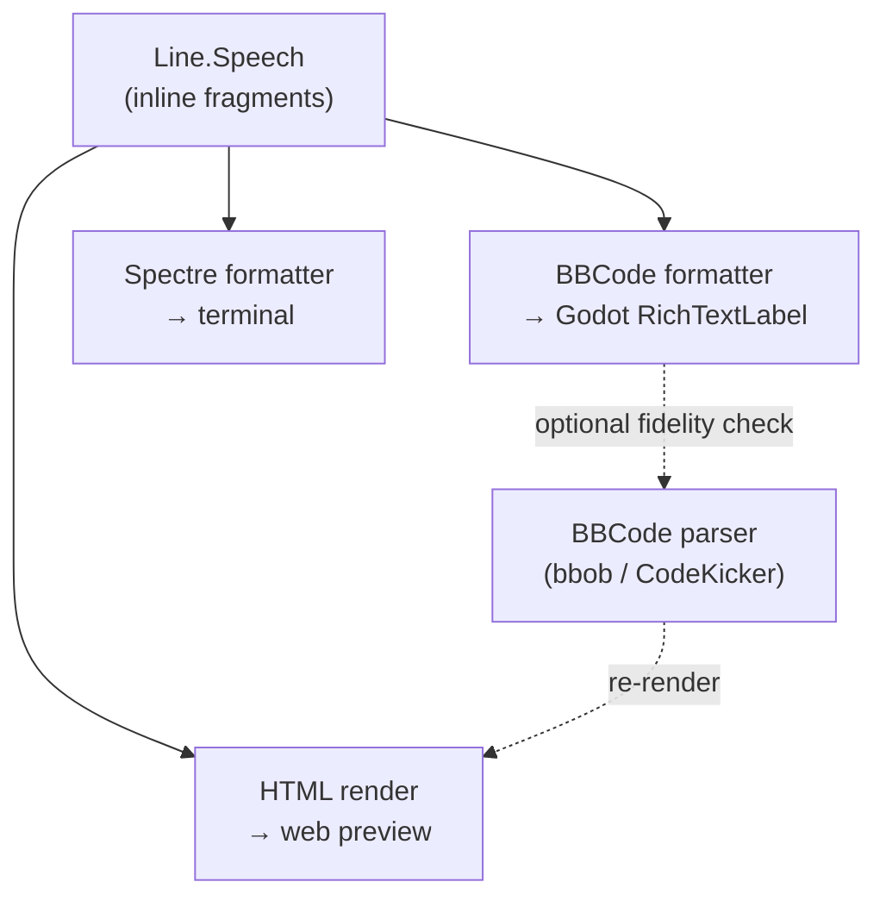

# BBCode Rendering

> [!NOTE]
> Status: **surveyed — not yet adopted**. This note records a preliminary
> library survey and a proposed architecture for rendering a line's styled
> speech as [BBCode](https://en.wikipedia.org/wiki/BBCode) (and for the terminal
> and web previews). No code is merged. It captures the directions considered,
> the tradeoffs found, and enough guidance to implement whichever surfaces the
> project adopts.

The compiler produces a Dialogue AST whose lines carry **inline fragments** —
plain text, styled runs, links, images, and game constructs. Something
downstream has to turn those fragments into *displayed* text. The primary
consumer is Godot, whose `RichTextLabel` renders **BBCode** natively; the
[Interactive Playthrough](./Interactive%20Playthrough.md) previews additionally
want to show styled speech in a terminal and in a browser. This note surveys how
to serve all three from one seam.

## Table of contents

- [Goal and scope](#goal-and-scope)
- [The key framing: two opposite directions](#the-key-framing-two-opposite-directions)
- [What the AST gives us](#what-the-ast-gives-us)
- [Emit target: Godot BBCode](#emit-target-godot-bbcode)
- [Rendering surfaces and their libraries](#rendering-surfaces-and-their-libraries)
  - [Web (JavaScript/TypeScript)](#web-javascripttypescript)
  - [Terminal (.NET)](#terminal-net)
- [Tradeoffs discovered](#tradeoffs-discovered)
- [Evaluation and recommendation](#evaluation-and-recommendation)
- [Implementation guidance](#implementation-guidance)
  - [The seam: `ISpeechFormatter`](#the-seam-ispeechformatter)
  - [Reproduce a BBCode formatter (Godot)](#reproduce-a-bbcode-formatter-godot)
  - [Reproduce a Spectre formatter (terminal)](#reproduce-a-spectre-formatter-terminal)
  - [Reproduce an HTML render (web)](#reproduce-an-html-render-web)
  - [Optional: parse BBCode back](#optional-parse-bbcode-back)
- [Open questions if adopted](#open-questions-if-adopted)

## Goal and scope

Give the project **one way** to turn a line's inline fragments into displayed
text on three surfaces — Godot (BBCode), the terminal preview, and the web
preview — without duplicating the styling logic per surface, and without pulling
a rendering dependency into the engine-agnostic core.

Out of scope: animation and typewriter effects, per-game theming, and the
runtime that walks the graph. This note is about *formatting one line's
fragments*, not about playing a script.

## The key framing: two opposite directions

"Support BBCode" bundles two operations that are inverses. Separating them
avoids over-tooling, because they need very different amounts of code.

| Direction | What it is | Where it is needed | Tooling weight |
| --- | --- | --- | --- |
| **Emit** (AST → BBCode) | Inline fragments → a BBCode string | Feeding Godot `RichTextLabel` — the real consumer | **None** — a small visitor |
| **Render** (BBCode → display) | A BBCode string → HTML / terminal styling | The web and terminal previews | A parser library helps |

The important consequence: for the project's *own* previews we already hold the
AST, so a preview can render the fragments **directly** to terminal markup or
HTML — it does not have to round-trip through BBCode. A BBCode *parser* is only
needed if a preview should consume the exact BBCode string Godot receives, as a
fidelity check on the emitter. That single decision determines whether any
parsing dependency is taken at all.



## What the AST gives us

The inline surface a formatter must handle (see
[Markdown to Dialogue AST Transpiler](./Markdown%20to%20Dialogue%20AST%20Transpiler.md)):

| Fragment | Carries | Notes |
| --- | --- | --- |
| `Text` | literal words | escape target-specific metacharacters |
| `StyledText` | a `SpeechStyle` (`Italic`, `Bold`, `Strikethrough`) + nested children | styles nest, so bold-inside-italic is two wrappers |
| `LineBreak` | — | a soft break hint |
| `Link` | label + target | |
| `Image` | alt + source | |
| `GameCall`, `Jump`, `JumpIndicator`, `Tag` | game/flow constructs | no direct visual equivalent; map to custom tags or resolve before rendering |

Styling records only *that* text is italic/bold/strikethrough; how it renders
"stays a downstream `ISpeechFormatter` concern"
([Markdown Front-End](./Markdown%20Front-End.md), the script language
[spec](../../guide/script-language.md)). This note fills in that seam.

## Emit target: Godot BBCode

Godot's [`RichTextLabel`](https://docs.godotengine.org/en/stable/tutorials/ui/bbcode_in_richtextlabel.html)
renders BBCode when `bbcode_enabled` is set. The fragment-to-tag mapping is
direct, so emitting is a plain visitor with **no library**:

| Fragment | BBCode | Note |
| --- | --- | --- |
| `Text` | the literal | escape `[` as `[lb]` |
| `StyledText` Italic / Bold / Strikethrough | `[i]…[/i]` / `[b]…[/b]` / `[s]…[/s]` | recurse into children |
| `Link` | `[url=target]label[/url]` | |
| `Image` | `[img]source[/img]` | |
| `LineBreak` | newline | |
| `GameCall` / `Jump` / `Tag` | custom BBCode tags | Godot supports custom tags and `RichTextEffect`s |

Godot's custom-tag and `RichTextEffect` support means the game-specific
fragments have a natural home: emit `[jump=scene]…[/jump]`-style tags and let the
game's presentation layer interpret them.

## Rendering surfaces and their libraries

Libraries only matter on the **render** side (BBCode → display), and only if a
preview consumes BBCode rather than the AST. The survey below is a snapshot of
the ecosystem at the time of writing; re-check maintenance before adopting.

### Web (JavaScript/TypeScript)

**Recommendation: [`@bbob/*`](https://github.com/JiLiZART/BBob) (bbob).** It is
the only actively maintained, TypeScript-native, framework-agnostic option, and
its AST + plugin architecture fits custom tags (`jump`, `call`) and can even
re-serialize back to BBCode.

| Library | Maintained | License | Size (gz) | Custom tags | TS | AST |
| --- | --- | --- | --- | --- | --- | --- |
| **`@bbob/html` + `preset-html5`** | Active | MIT | ~5.5 KB | `.extend()` | Yes | Yes |
| `js-bbcode-parser` | Quiet | MIT | ~0.7 KB | regex only | No | No (XSS-unsafe) |
| `bbcode-to-react` | Stale (2018) | MIT | ~4.3 KB | class-based | No | React-only |
| `xbbcode` | Dead (2016) | MIT | ~1 KB | template | No | No |

Notes: bbob is lazy-loadable, which suits the preview's code-splitting. One
caveat — its stock `url` tag does not strip a `javascript:` scheme, so override
that tag or pair the output with a sanitizer.

### Terminal (.NET)

The CLI already uses [Spectre.Console](https://spectreconsole.net/) (see
[Command-Line Interface](./Command-Line%20Interface.md)). Spectre has its *own*
markup (`[bold]…[/]`), **not** BBCode, and no OSS bridge between the two exists.
Two clean paths:

- **Emit only** (AST is the source): write a Spectre formatter — the same
  visitor pattern as the BBCode one with a different string table. **No new
  dependency.**
- **Parse BBCode** (preview consumes the emitted string):
  [`CodeKicker.BBCode.Core`](https://www.nuget.org/packages/CodeKicker.BBCode.Core)
  is the only viable library — MIT, `net8.0`, a real AST with a
  `SyntaxTreeVisitor`, zero dependencies — then a small visitor maps its nodes
  to Spectre markup.

| Library | Maintained | License | `net8.0` | AST + visitor |
| --- | --- | --- | --- | --- |
| **Spectre.Console** (incumbent) | Active | MIT | Yes | render target |
| **`CodeKicker.BBCode.Core`** (only if parsing) | Active | MIT | Yes | Yes |
| `CodeKicker.BBCode` | Dead (2017) | MIT | No (net35) | Yes |
| `BBCodeParser` | Dead (2018) | none listed | — | — |

`CodeKicker.BBCode.Core` risk: a single maintainer with low community signal —
mitigated by its MIT license and small, vendorable source.

## Tradeoffs discovered

- **Emit is the real work; parsing is optional.** The valuable, reusable code is
  the fragment visitor. A parser is a convenience for one specific preview mode
  (BBCode fidelity), not a core need.
- **The core must stay engine-agnostic.** A BBCode formatter is pure string
  building and belongs in the core behind an interface; a Spectre formatter
  depends on Spectre and must live in the CLI/preview project, not in
  `DialogueDown`.
- **Markup dialects differ in closing syntax.** BBCode closes by name
  (`[/b]`); Spectre closes generically (`[/]`) and combines styles in one tag
  (`[bold red]`). A shared emitter cannot target both verbatim — hence one small
  formatter per dialect over a shared traversal.
- **Escaping is per-target and mandatory.** Literal `[` becomes `[lb]` for Godot
  and `[[` for Spectre. Getting this wrong silently corrupts output, so it is the
  first thing to test.
- **Security lives on the render side.** BBCode→HTML must guard against
  `javascript:` URLs and unescaped text; emitting BBCode has no such exposure.

## Evaluation and recommendation

1. **Build the emit seam first.** An `ISpeechFormatter` in the core with a
   `BBCodeSpeechFormatter` covers the primary Godot use case and needs no
   dependency.
2. **Add a Spectre formatter in the preview/CLI project** for the terminal
   preview — again a small visitor, no new dependency.
3. **Render the web preview from the AST** (or its JSON projection) directly.
   Reach for **`@bbob/*`** only if the preview should consume the emitted BBCode
   string; reach for **`CodeKicker.BBCode.Core`** only for the analogous .NET
   BBCode-parsing case. Both are MIT and AST-based.
4. **Keep Spectre.Console** as the terminal renderer as-is.

Net: two or three tiny formatters over a shared traversal, and **zero required
third-party libraries** — a parser enters only if BBCode fidelity-checking is
later wanted.

## Implementation guidance

Enough to reproduce each piece. All code below is **proposed**, not implemented.

### The seam: `ISpeechFormatter`

One interface in the core turns a line's fragments into a string for a target.
It is the single place styling decisions live.

```csharp
// proposed — in the engine-agnostic core
public interface ISpeechFormatter
{
    string Format(IReadOnlyList<InlineFragment> speech);
}
```

Each surface provides an implementation. A shared abstract visitor can walk the
fragment tree and call small `abstract` hooks (`OpenStyle`, `CloseStyle`,
`EscapeText`, …) that each formatter fills in, so the traversal is written once.

### Reproduce a BBCode formatter (Godot)

A visitor that appends tags. No dependency.

```csharp
// proposed
public sealed class BBCodeSpeechFormatter : ISpeechFormatter
{
    public string Format(IReadOnlyList<InlineFragment> speech)
    {
        var sb = new StringBuilder();
        Write(sb, speech);
        return sb.ToString();
    }

    private static void Write(StringBuilder sb, IReadOnlyList<InlineFragment> fragments)
    {
        foreach (var fragment in fragments)
        {
            switch (fragment)
            {
                case Text t:
                    sb.Append(t.Content.Replace("[", "[lb]"));
                    break;
                case StyledText s:
                    var tag = s.Style switch
                    {
                        SpeechStyle.Italic => "i",
                        SpeechStyle.Bold => "b",
                        SpeechStyle.Strikethrough => "s",
                        _ => null,
                    };
                    if (tag is not null) sb.Append('[').Append(tag).Append(']');
                    Write(sb, s.Children);
                    if (tag is not null) sb.Append("[/").Append(tag).Append(']');
                    break;
                case LineBreak:
                    sb.Append('\n');
                    break;
                // Link, Image, GameCall, Jump, Tag → their BBCode / custom tags
            }
        }
    }
}
```

### Reproduce a Spectre formatter (terminal)

The same traversal, a different string table, and Spectre's generic close `[/]`.
Escape literal `[` with Spectre's `Markup.Escape` (or `[[`). Lives in the
CLI/preview project so the core takes no Spectre dependency.

| Fragment | Spectre markup |
| --- | --- |
| `Text` | `Markup.Escape(content)` |
| `StyledText` Italic / Bold / Strikethrough | `[italic]…[/]` / `[bold]…[/]` / `[strikethrough]…[/]` |
| `LineBreak` | newline |

### Reproduce an HTML render (web)

The preview already has the fragments (or their JSON). Render them straight to
elements — `<em>`, `<strong>`, `<del>`, `<a>` — escaping text. Only if the
preview must consume the emitted BBCode string, use bbob with a custom preset:

```ts
// proposed — only if consuming BBCode, not the AST
import bbobHTML from '@bbob/html'
import presetHTML5 from '@bbob/preset-html5'
import { TagNode } from '@bbob/plugin-helper'

const ddPreset = presetHTML5.extend((tags) => ({
  ...tags,
  jump: (n) => TagNode.create('a', { class: 'dd-jump', 'data-scene': n.attrs?.jump ?? '' }, n.content),
  url:  (n, { render }) => {
    const href = n.attrs ? String(Object.values(n.attrs)[0]) : render(n.content ?? [])
    return TagNode.create('a', { href: /^javascript:/i.test(href) ? '#' : href }, n.content)
  },
}))

const html = bbobHTML('[b]Hi[/b] [jump=scene_1]Go[/jump]', ddPreset())
```

### Optional: parse BBCode back

Only for a fidelity check that a preview shows exactly what Godot would. In .NET,
`CodeKicker.BBCode.Core` parses to a `SequenceNode`; subclass `SyntaxTreeVisitor`
and emit Spectre markup or HTML. In the web client, bbob's parser yields the same
AST it renders from. Skip this entirely if previews render from the fragments.

## Open questions if adopted

- **Scope of the first formatter.** Ship BBCode-for-Godot alone, or land the
  Spectre and HTML formatters together so the previews and the engine share the
  seam from day one?
- **Where the seam lives.** `ISpeechFormatter` in the core is clean for BBCode
  and HTML-from-AST; the Spectre formatter must sit outside the core. Confirm the
  project boundary (core interface, edge implementations) matches the
  architecture rules.
- **Custom-tag vocabulary.** Which BBCode tags represent `GameCall` / `Jump` /
  `Tag`, and are they resolved before rendering or passed through for the game to
  interpret?
- **Fidelity check.** Is round-tripping through a BBCode parser worth a
  dependency, or is rendering previews from the AST sufficient?
