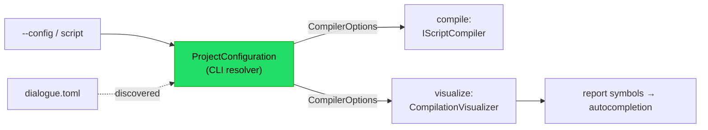

# Implementation note: CLI configuration

> [!IMPORTANT]
> Status: **implemented**. Threads a project's
> [`CompilerOptions`](./Configuration.md) — built from a `dialogue.toml` by the
> [configuration loader](./Configuration%20Loader.md) — through the `dialoguedown`
> CLI, so `compile` and `visualize` honor configured speakers. The report's editor
> autocompletion offers the configured speakers too, including ones declared in
> `dialogue.toml` but not yet used in the script.

## Table of contents

- [Goal and scope](#goal-and-scope)
- [Where it sits](#where-it-sits)
- [Ubiquitous language](#ubiquitous-language)
- [Functionality checklist](#functionality-checklist)
- [Interfaces and abstractions](#interfaces-and-abstractions)
- [Key design decisions](#key-design-decisions)
  - [DD1 — Resolve config in the CLI; pass the core options down](#dd1--resolve-config-in-the-cli-pass-the-core-options-down)
  - [DD2 — Discover `dialogue.toml` by walking up from the script](#dd2--discover-dialoguetoml-by-walking-up-from-the-script)
  - [DD3 — A compiler factory seam keeps `compile` config-aware and testable](#dd3--a-compiler-factory-seam-keeps-compile-config-aware-and-testable)
  - [DD4 — Thread options into visualize through a configured visualizer](#dd4--thread-options-into-visualize-through-a-configured-visualizer)
  - [DD5 — Surface configured speakers in the completion symbols](#dd5--surface-configured-speakers-in-the-completion-symbols)
- [Error and boundary cases](#error-and-boundary-cases)
- [Integration](#integration)
- [Testability](#testability)
- [Deferred](#deferred)

## Goal and scope

The [Configuration](./Configuration.md) component made the compiler configurable and
the [configuration loader](./Configuration%20Loader.md) reads a `dialogue.toml` into a
`CompilerOptions`, but **nothing wires them into the CLI**: `dialoguedown compile` and
`dialoguedown visualize` always build the compiler with `CompilerOptions.Default`. This
component closes that last gap — a project's `dialogue.toml` reaches the compiler behind
both commands, so configured speakers appear in a compiled script, in the visualization report,
and in the report editor's **autocompletion**.

**In scope:** a `--config` option on both commands, automatic discovery of a
`dialogue.toml`, threading the resolved `CompilerOptions` into the `compile` compiler and
the `visualize` report (static export, `--emit`, and the served/live session), and a
user-guide page documenting it. **Out of scope:** other config knobs (deferred in the
Configuration note), and any change to the `dialogue.toml` schema or the loader.

## Where it sits

The CLI is the composition root that already wires the loader's inputs and the
visualizer. It gains one new step — **resolve the options** — between reading the
command line and building the compiler.

The resolver is the only new type that depends on `DialogueDown.ConfigurationLoader`; it
hands the rest of the CLI a plain `CompilerOptions` (a core type), so the visualization
assemblies never take a TOML dependency.

## Ubiquitous language

| Term                      | Meaning                                                                                                                      |
| ------------------------- | ---------------------------------------------------------------------------------------------------------------------------- |
| **Project configuration** | The `dialogue.toml` for a script's project, read into a `CompilerOptions`.                                                   |
| **Config resolution**     | Choosing which `CompilerOptions` a command uses: an explicit `--config`, an auto-discovered `dialogue.toml`, or the default. |
| **Configured visualizer** | A `CompilationVisualizer` built over a compiler configured with a project's options.                                         |

## Functionality checklist

- [x] Both `compile` and `visualize` accept `--config <path>` naming a `dialogue.toml`.
- [x] With no `--config`, the CLI discovers the nearest `dialogue.toml` by walking up from
      the script's directory (bounded by `--root` for `visualize`); absent, it uses
      `CompilerOptions.Default`.
- [x] An explicit `--config` path that is missing fails with a clear usage error; a
      malformed file surfaces the loader's located error.
- [x] `compile` builds its compiler from the resolved options.
- [x] `visualize` — static export, `--emit`, the served/live session, and the launcher —
      builds its report from the resolved options.
- [x] Configured speakers appear in the report's completion symbols — including ones a
      line never uses — so the editor's speaker autocompletion offers them.
- [x] The user guide documents `dialogue.toml` and `--config`.

## Interfaces and abstractions

| Type                                     | Visibility        | Responsibility                                                                               | Collaborators                                |
| ---------------------------------------- | ----------------- | -------------------------------------------------------------------------------------------- | -------------------------------------------- |
| `ProjectConfiguration`                   | internal (CLI)    | Resolve `CompilerOptions` from `--config` or a discovered `dialogue.toml`                    | `TomlConfigurationLoader`, `CompilerOptions` |
| `Func<CompilerOptions, IScriptCompiler>` | internal (CLI)    | The compile command's compiler factory seam (default: `ScriptCompilerFactory.CreateDefault`) | `CompileCommand`                             |
| `CompilationVisualizer(CompilerOptions)` | public (new ctor) | Build a visualizer over a configured compiler                                                | `ScriptCompilerFactory`                      |
| `IVisualizeRunner` / `ILauncherRunner`   | public (extended) | Carry `CompilerOptions` into each run mode and the launcher                                  | `CompilationVisualizer`, `LiveSession`       |
| `SpeakerTable.Symbols`                   | internal (core)   | Expose every bound speaker so configured ones complete unused                                | `SymbolProjection`                           |
| `CompileSettings` / `VisualizeSettings`  | internal (CLI)    | Add the `--config` option and validate its path                                              | Spectre.Console.Cli                          |

A malformed `dialogue.toml` surfaces at compile time; the CLI's exception handler renders the
loader's located `DialogueConfigurationException` as a clean, located message.

## Key design decisions

### DD1 — Resolve config in the CLI; pass the core options down

Only the CLI knows the command line and the working directory, so config **resolution**
(discovery + loading) lives there, in a small `ProjectConfiguration` type that references
`DialogueDown.ConfigurationLoader`. Everything downstream — the compiler factory, the
visualizer, the live session — receives a plain `CompilerOptions`, which is a core type
they already depend on. This keeps the TOML dependency at the outermost layer and leaves
the engine-agnostic core and the visualization assemblies unaware of the file format, the
same boundary the loader's architecture test guards.

### DD2 — Discover `dialogue.toml` by walking up from the script

Zero-config is the common case, so the CLI **discovers** a `dialogue.toml` rather than
requiring a flag — following the convention every established tool uses. `tsc`,
clang-format, Prettier, Black/Ruff, and EditorConfig all search from the input **upward**
to the nearest config. The CLI walks **up from the script's directory** to the first
`dialogue.toml` (nearest wins), so one config at a project root serves scripts nested in
subfolders — the normal project layout. An explicit `--config <path>` overrides discovery
and is the escape hatch for a config that lives elsewhere. For `visualize`, the walk is
**bounded by `--root`** when set: the served root is the security boundary, so discovery
never reads a config above what the user chose to serve. Precedence: **`--config` › nearest
`dialogue.toml` (walking up) › `CompilerOptions.Default`.** A `dialogue.toml` is itself the
project marker, so there is no separate EditorConfig-style `root = true` stop.

### DD3 — A compiler factory seam keeps `compile` config-aware and testable

`CompileCommand` currently takes an injected `IScriptCompiler` singleton built at startup
with default options — too early to know the resolved config. It instead takes a
**compiler factory** (`Func<CompilerOptions, IScriptCompiler>`, default
`ScriptCompilerFactory.CreateDefault`) and builds the compiler *after* resolving options.
A test still substitutes the factory to return a mock compiler and asserts both the
compile call and that the resolved options flowed through — preserving the current
mock-based command test.

### DD4 — Thread options into visualize through a configured visualizer

The visualize modes each construct `new CompilationVisualizer()` (default compiler). A new
public `CompilationVisualizer(CompilerOptions)` ctor builds the visualizer over
`ScriptCompilerFactory.CreateDefault(options)`, and the `IVisualizeRunner` methods gain a
`CompilerOptions` parameter that the command supplies and each mode forwards — static
export, `--emit`, and the served session (through `LiveSession`'s existing
`CompilationVisualizer?` seam). One options value flows to every visualize path.

### DD5 — Surface configured speakers in the completion symbols

The report's editor completions come from `SymbolProjection.Project(SemanticModel)`, which
read the **compiled semantic model**, not the raw script text. But the projection walked only
the speakers a line *uses* (the desugared tree), so a speaker configured in `dialogue.toml`
yet never spoken would not complete — defeating the point of declaring a cast up front. So
the speaker table exposes its full set through `SpeakerTable.Symbols` (every distinct named or
`@id`'d speaker it bound, from the script or from configuration), and `SymbolProjection` unions
those in after the document-order script speakers. Configured speakers then flow
`CompilerOptions → SemanticModel.Speakers → SymbolProjection → report symbols → editor
completions`, used or not, with no change to the web client. This is the note's one change to
the core (`SpeakerTable`), kept additive: a read-only view that leaves `Resolve` untouched.

## Error and boundary cases

| Case                                                               | Behavior                                                                       |
| ------------------------------------------------------------------ | ------------------------------------------------------------------------------ |
| No `--config`, no `dialogue.toml` found                            | `CompilerOptions.Default` (unchanged behavior).                                |
| `--config` path does not exist                                     | Usage error naming the missing file; no compile.                               |
| Discovered or `--config` file is malformed                         | The loader's located `DialogueConfigurationException` surfaces as a CLI error. |
| `dialogue.toml` beside the script and a different `--config` given | `--config` wins.                                                               |
| `visualize` launcher with no script                                | Discover by walking up from the browse root; else default.                     |
| Nearest `dialogue.toml` sits above `--root` in `visualize`         | Not discovered — the walk stops at `--root`; use `--config` to point at it.    |
| Empty / speaker-less `dialogue.toml`                               | `CompilerOptions.Default` (loader's behavior); nothing configured.             |

## Integration

- **CLI** (`DialogueDown.Cli`): references `DialogueDown.ConfigurationLoader`; adds
  `ProjectConfiguration`, the `--config` option, the compiler-factory registration, and an
  exception-handler case rendering a `DialogueConfigurationException` as a located message.
- **Core** (`DialogueDown`): adds the additive `SpeakerTable.Symbols` view so configured
  speakers can complete unused (`Resolve` and existing behavior are untouched).
- **Visualization** (`DialogueDown.Visualization`): adds the public
  `CompilationVisualizer(CompilerOptions)` ctor; `SymbolProjection` unions in
  `SpeakerTable.Symbols`.
- **Live** (`DialogueDown.Visualization.Live`): `IVisualizeRunner`, `ILauncherRunner`, and
  their modes take a `CompilerOptions`; the served session and each launcher-opened report
  build a configured `LiveSession`.
- **Docs**: a new `docs/guide/configuration.md` page (registered in the guide `toc.yml` and
  index), cross-linked to the script-language guide.
- **Architecture**: unchanged boundaries — the CLI already sits outside the core; only the
  CLI gains the loader reference.

## Deferred

| Item                            | Note                                                                                                                                                                                                                            |
| ------------------------------- | ------------------------------------------------------------------------------------------------------------------------------------------------------------------------------------------------------------------------------- |
| Per-file launcher configuration | The launcher resolves one `CompilerOptions` from its browse root and applies it to every report it opens. A file in a subtree with its own `dialogue.toml` would want per-file discovery; deferred until the launcher needs it. |

## Testability

- **`ProjectConfiguration`**: resolves an explicit `--config`, a discovered `dialogue.toml`,
  and the default; a missing explicit path errors; a malformed file surfaces the located
  error. Driven with a temp directory and raw-string TOML.
- **`compile`**: substitutes the compiler factory, asserts the resolved options reach it and
  the source is compiled; a `--config` file changes the options passed.
- **`visualize`**: the runner receives the resolved options for the static, emit, served,
  and launcher routes (extending the existing routing tests).
- **Autocompletion**: `SpeakerTable.Symbols` enumerates configured and script speakers once
  each; a visualizer built from options carrying an unused configured speaker still emits it
  in the report's `SymbolSet`.
- **Docs**: markdownlint and link checks over the new guide page.
