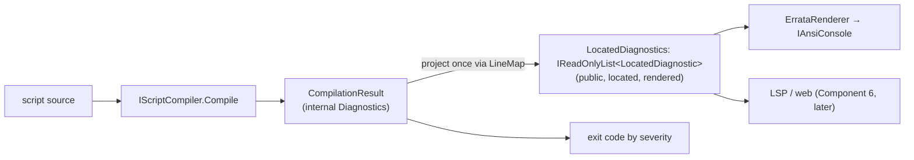

# Implementation note: CLI diagnostic rendering

> [!IMPORTANT]
> Status: **implemented** — Component 5 of the diagnostics subsystem
> ([#43](https://github.com/pengzhengyi/godot-dialoguedown/issues/43)).
> Components 1–4 **collect** located diagnostics and recover; this component makes them
> **visible** to script authors on the `dialoguedown` CLI, and exposes the compilation mode there
> (the CLI half of [#110](https://github.com/pengzhengyi/godot-dialoguedown/issues/110)). It builds
> on the [Diagnostics and Validation](Diagnostics%20and%20Validation.md) note (DD6, DD7, DD9).

## Table of contents

- [Goal and scope](#goal-and-scope)
- [Ubiquitous language](#ubiquitous-language)
- [Components](#components)
- [Functionality checklist](#functionality-checklist)
- [Interfaces and abstractions](#interfaces-and-abstractions)
- [Key design decisions](#key-design-decisions)
  - [DR1 — A public, located diagnostic view; internals stay internal](#dr1--a-public-located-diagnostic-view-internals-stay-internal)
  - [DR2 — The engine locates and renders text; the CLI owns presentation](#dr2--the-engine-locates-and-renders-text-the-cli-owns-presentation)
  - [DR3 — One `file(line,column)` location language, ready for multi-file](#dr3--one-filelinecolumn-location-language-ready-for-multi-file)
  - [DR4 — A `LineMap` value object, built once per compile](#dr4--a-linemap-value-object-built-once-per-compile)
  - [DR5 — Exit codes follow sysexits](#dr5--exit-codes-follow-sysexits)
  - [DR6 — `--mode` selects a collecting compilation mode](#dr6----mode-selects-a-collecting-compilation-mode)
  - [DR7 — Rich rendering via the Errata library](#dr7--rich-rendering-via-the-errata-library)
- [Dependencies](#dependencies)
- [Error and boundary cases](#error-and-boundary-cases)
- [Integration](#integration)
- [Testability](#testability)
- [Recorded decisions](#recorded-decisions)

## Goal and scope

Turn the compiler's collected, offset-based diagnostics into a **public, located,
human-readable view**, render that view as **errata** on the `dialoguedown compile` command —
every problem at once, each pointing at `source(line,column)` — set a meaningful process **exit
code**, and let the author choose the **compilation mode** with `--mode`.

Before this component, `compile` ignored the collected diagnostics: a script with a bad
jump or a duplicate anchor still exited `0` and printed nothing. This component closes that gap so
authoring against DialogueDown gives real feedback.

**In scope:** offset→line/column mapping; a public diagnostic view carrying the rendered message
and location; the CLI errata renderer and its data-error exit code; a `compile --mode` option.

**Out of scope (deferred):** the LSP and web-report projections (Component 6,
[#121](https://github.com/pengzhengyi/godot-dialoguedown/issues/121)); the config-file `mode`
key and the visualization mode tab (the rest of
[#110](https://github.com/pengzhengyi/godot-dialoguedown/issues/110)); a `--mode fail-fast` CLI
option (needs a public fail-fast reporting seam — see DR6); promoting warnings to errors (a
planned per-run toggle).

## Ubiquitous language

| Term | Meaning |
| --- | --- |
| **Located diagnostic** | one collected `Diagnostic` resolved to a `source(line,column)` position and a final message string — the public unit a consumer renders. |
| **Errata** | the CLI's rendering of the located diagnostics for one compile — rich source-context blocks (via the [Errata](https://github.com/spectreconsole/errata) library) or the one-line fallback, plus a summary. Rendering stays confined to the CLI (per the umbrella note's DD7). |
| **`LineMap`** | the value object that turns a source **offset** into a one-based **line and column**. |
| **`source(line,column)`** | the shared location format, already used for configuration errors (`ConfigurationSourceLocation`) — reused here so a script location reads the same as a config location. |

## Components

The work splits into two cleanly bounded passes; 5a has no CLI dependency and 5b consumes it.

- **5a — the located diagnostic view (engine-side).** A `LineMap`, message rendering (fill the
  descriptor's format with its arguments), and a **public** projection exposed on
  `CompilationResult`. Engine-agnostic, so the CLI now and the LSP/web later share one view.
- **5b — the CLI errata renderer (CLI-side).** The `compile` command renders the view through
  Spectre.Console, sorted by position with a summary line, returns a data-error exit code when the
  report has errors, and gains a `--mode` option.

## Functionality checklist

- [x] Map any source offset to a one-based `(line, column)`; a span to a start/end position.
- [x] Expose a public, immutable located-diagnostic view on `CompilationResult` (code, severity,
      message, location) without leaking internal `Diagnostic`/`SourceSpan`/enums.
- [x] Render each diagnostic with **source context** (Errata: the offending line, a caret under
      the span, code and message) when interactive; fall back to a greppable
      `file(line,column): severity CODE: message` one-liner when not — errors red, warnings yellow,
      info cyan, sorted by position then code, with user text safely escaped.
- [x] Print a summary line (e.g. `2 errors, 1 warning`); print nothing for a clean compile.
- [x] Follow each diagnostic with a **doc link** to its entry on the hosted
      [Error codes](../../guide/error-codes.md) page (`#dlg<code>`) — a per-diagnostic note in the
      Errata block, or an inline line after the one-liner — clickable where the terminal supports it
      and plain, copy-pasteable text otherwise.
- [x] Return `Success` for no errors (warnings/info still succeed), `DataError` when errors exist;
      align malformed-config errors to `DataError` too.
- [x] `compile --mode <stage-boundary|best-effort>` overrides `CompilerOptions.Mode` only when
      given (else inherit the resolved mode); an invalid value is a usage error.

## Interfaces and abstractions

| Type | Responsibility | Collaborators |
| --- | --- | --- |
| `LineMap` (value object, engine) | precompute line starts from source; `Locate(offset) → LinePosition` (called twice for a span's start and end) | `SourceSpan`, `LinePosition` |
| `LinePosition` (public readonly struct) | a one-based `(Line, Column)`; `ToString()` → `line,column` | — |
| `LocatedDiagnostic` (public record) | one located diagnostic: `Code`, `Severity`, `Category`, `Message`, `Start`, `End` (line/column), and the half-open character range `StartOffset`/`EndOffset` | `LinePosition`, `DiagnosticSeverity`, `DiagnosticCategory` (public) |
| `CompilationResult.LocatedDiagnostics` (public) | the located diagnostics for the compile, projected once (cached) from the internal bag | `LineMap`, `LocatedDiagnostic` |
| `ErrataRenderer` (CLI) | render the located diagnostics to an `IAnsiConsole`: Errata blocks with source context when interactive, else the one-line fallback, plus a summary; each diagnostic carries a doc link | `IAnsiConsole`, Errata, `LocatedDiagnostic`, `DiagnosticDocumentation`, the source text |
| `DiagnosticDocumentation` (CLI) | map a `DLG####` code to its hosted Error codes deep link (`…/error-codes.html#dlg<code>`) | — |
| `CompileCommand` (CLI) | compile, render errata, choose the exit code; parse `--mode` | `ErrataRenderer`, `CompilerOptions` |

## Key design decisions

### DR1 — A public, located diagnostic view; internals stay internal

`Diagnostic`, `SourceSpan`, and `DiagnosticDescriptor` are internal and, per the existing
`CompilationResult` remark, "still under active design." Rather than make them public, project to
a small, stable public **`LocatedDiagnostic`** (code string, public severity, rendered message,
line/column start/end, and the half-open character range `StartOffset`/`EndOffset`). Consumers
depend on the projection, not the evolving internals — the same seam serves the CLI now and the
LSP/web later (Component 6). The **offsets** are exposed alongside line/column because a tool
indexes the source directly by character: the errata renderer underlines the exact range (via
Errata's `TextSpan`), and an editor maps them to a selection. They are plain integers, not the
internal `SourceSpan`, so the internal type stays free to evolve. One internal type is deliberately
**promoted to public**: `DiagnosticSeverity` (`Error`/`Warning`/`Info`), because it *is* the view's
contract; its members get explicit numeric values so ordering is a documented, stable API.
`Diagnostic`, `SourceSpan`, and the descriptor stay internal. `LocatedDiagnostics` returns an
**immutable**, array-backed `IReadOnlyList<LocatedDiagnostic>`, built once on first access and cached.

### DR2 — The engine locates and renders text; the CLI owns presentation

Message composition (filling `MessageFormat` with `MessageArguments`) and offset→line/column
resolution happen **once, in the engine's projection**, so every consumer shares identical text
and locations. Formatting uses `CultureInfo.InvariantCulture` — the report is invariant-English
for now, and culture becomes an explicit projection input if localization lands — so "identical
text" does not silently depend on the host's ambient culture. The CLI adds only **presentation**:
layout, color, sorting, and the summary. This honors the umbrella note's DD7 (errata rendering
confined to the CLI) while keeping the shared substance engine-side, so the LSP and web overlays
do not each re-implement formatting.

### DR3 — One `file(line,column)` location language, ready for multi-file

DialogueDown will compile **multiple files** in the future, so a location is fundamentally
`(file, line, column)`, not just `(line, column)`. Configuration errors already render as
`source(line,column)` through the public `ConfigurationSourceLocation` — the .NET/Roslyn shape
(see the survey in [DR7](#dr7--rich-rendering-via-the-errata-library)) — so script diagnostics
reuse it: `file(line,column): severity CODE: message`.

Today the engine compiles **one** source string and does not know its path, so the **file** is
supplied by the CLI (it knows the script path) and the engine's `LocatedDiagnostic` carries only
`line,column`. This is the multi-file **seam**: when multi-source compilation lands, the located
diagnostic gains a source identifier and the engine fills the file dimension itself — the location
language and the rendered format do not change. `LinePosition.ToString()` yields `line,column`;
the CLI forms `file(line,column)`.

### DR4 — A `LineMap` value object, built once per compile

`LineMap` precomputes the offsets of each line start (offset `0`, then each offset immediately
after a `\n`) and binary-searches an offset to its line; the column is `offset − lineStart + 1`.
It is built once from `result.Source` during projection and reused — O(n) to build, O(log n) per
lookup. Precise, testable semantics:

- **Valid offsets are `0..source.Length`, inclusive of `Length`.** An offset is a *position*
  (a caret *between* characters), not a *character index*: a document of length `n` has `n + 1`
  caret positions — before the first character, between each pair, and **after the last** (offset
  `n`). Two things need that end position. First, a `SourceSpan` is **half-open `[Start, End)`**,
  so a span reaching the end has `End == Length`, and the projection locates **both** ends (the
  view carries a start and end, and Errata underlines the range). Second, a **zero-width synthetic
  span** at the end of the source has `Start == End == Length` (e.g. a filled-in default speaker),
  and its caret sits there. So `Locate` accepts `Length` even though no character lives at that
  index. An offset `< 0` or `> Length` is a genuine **broken compiler span**: `LineMap` throws
  rather than clamping, so the bug surfaces instead of hiding.
- **Line and column are one-based**, counted in UTF-16 code units (matching how spans index the
  string, and the LSP convention).
- **`\n` ends a line**; the next line starts at the following offset. A `\r` is an **ordinary
  character** on its line, so in a `\r\n` pair the `\r` is that line's last column and the `\n` is
  the newline — a diagnostic almost never points at either, but the rule is total and unambiguous.
- **End of source:** `"abc"` → offset 3 is `(1,4)`; `"abc\n"` → offset 4 is `(2,1)`; `""` → offset
  0 is `(1,1)`.

### DR5 — Exit codes follow sysexits

`ExitCodes` gains `DataError = 65` (EX_DATAERR): "the input data was incorrect." `compile` returns
it when the report contains an error, `Success` otherwise (a warning-only compile still succeeds).
For consistency, a malformed-configuration error — also invalid input — moves from the generic
`Error` (1) to `DataError`, so every "your input is wrong" outcome shares one code. Genuine
unexpected faults keep `Error`.

### DR6 — `--mode` selects a collecting compilation mode

`compile` gains `--mode <stage-boundary|best-effort>` (kebab-case). It is a **nullable override**:
omitted, the command inherits the resolved `CompilerOptions.Mode` (so a future config-file `mode`
is not clobbered); given, it sets `CompilerOptions.Mode`. An unknown value is a usage error.

**Fail-fast is intentionally not a CLI mode.** Fail-fast is an *embedding* contract — it throws a
`DiagnosticException` at the first error for a host that wants to stop immediately — which is at
odds with errata, whose whole purpose is to render the collected set. The exception is internal
and the CLI has no visibility into it, so surfacing it well would need a public exception seam;
that is deferred (a tracked follow-up) rather than bolted on here. The two collecting modes cover
the CLI's needs: `stage-boundary` (default) stops at the first stage that erred, `best-effort`
runs every stage. `visualize` is unaffected — it forces best-effort by design.

### DR7 — Rich rendering via the Errata library

Diagnostics read best with **source context** — the offending line shown, a colored caret under
the exact span, the code and message beside it — the way modern compilers render errors. Rather
than hand-roll that, the CLI uses **[Errata](https://github.com/spectreconsole/errata)**, a
Spectre.Console-family library (MIT, net8.0, inspired by Rust's Ariadne) that renders exactly this
from a source plus labeled character/line ranges. It composes with the existing Spectre.Console
dependency and the app's `IAnsiConsole`.

A survey of how compilers format a located diagnostic informs the fallback:

| Compiler | One-line format |
| --- | --- |
| GCC / Clang | `file:line:column: severity: message` — colon-separated, the Unix/GNU standard |
| **MSVC / Roslyn (.NET)** | `file(line,column): severity CODE: message` — matches our existing config errors |
| Rust / Ariadne | a multi-line block: `error[CODE]: message`, `--> file:line:column`, source snippet with `^` underlines and labels |
| TypeScript | `file(line,column): error TSxxxx: message` |

**Decisions:**

- **Interactive output** renders through Errata — the rich Ariadne-style block with a source
  snippet and caret, one section per diagnostic, sorted by position then code. Its header shows the
  **category and severity together** — `syntax error`, `semantic warning` — because Errata's header
  holds one label; combining them keeps both visible (the color still conveys severity) and teaches
  the author the category. The greppable one-liner stays clean (the `DLG####` code already encodes
  the category).
- **Non-interactive output** (piped, `--no-color`, CI) falls back to the greppable one-liner
  `file(line,column): severity CODE: message` — the MSVC/Roslyn shape, consistent with config
  errors. `LocatedDiagnostic` (code, severity, category, message, line/column, and character
  offsets) carries everything both paths need: the one-liner uses the line/column, and Errata
  underlines the exact range from the offsets (a `TextSpan`) over the source text the CLI already
  read.
- Errata is a **CLI-only** dependency: the engine stays engine-agnostic and rendering stays
  confined to the CLI (DD7). Its Spectre.Console requirement (`>= 0.55.0`) is satisfied by the
  CLI's `0.57.2`, so there is no version conflict. The fallback one-liner still exists on its own
  merits (CI/greppable output), so the design does not hard-depend on Errata.

## Dependencies

| Package | Scope | Why | License |
| --- | --- | --- | --- |
| [`errata`](https://www.nuget.org/packages/errata) | `DialogueDown.Cli` only | rich, Ariadne-style diagnostic rendering with source snippets and carets | MIT |

No new engine dependencies: 5a is pure BCL. The `errata` reference is added only to the CLI; its
Spectre.Console requirement (`>= 0.55.0`) is satisfied by the CLI's `0.57.2` (verified).

## Error and boundary cases

- **Zero-width (synthetic) span:** start equals end; the CLI shows a single `source(line,column)`
  caret position, not a range.
- **Offset past `source.Length`:** a broken compiler span — `LineMap` throws (see DR4), never
  clamps, so the defect is not silently mislocated.
- **Multi-line span:** the report carries both start and end positions; the CLI shows the start.
- **`\r\n` vs `\n`:** columns count UTF-16 code units after the last line start; a `\r` occupies a
  column on its line and `\n` ends it (see DR4).
- **Empty source:** one line, column 1; an empty script yields no diagnostics.
- **A message containing `[` or `]`:** rendered through Spectre's *interpolated* markup, which
  escapes interpolated values, so a diagnostic's own text can never inject console markup.
- **No diagnostics:** the errata renderer prints nothing and `compile` returns `Success`.
- **Warnings (or info) only:** rendered in their color; exit stays `Success` because `HasErrors`
  is false.

## Integration

- **`CompilationResult`** gains a public `LocatedDiagnostics` projected (once, cached) from the internal bag using a `LineMap`
  built from `Source`; the internal `Diagnostics` list stays internal.
- **`CompileCommand`** compiles, hands `LocatedDiagnostics` to `ErrataRenderer`, then returns
  `DataError` when `HasErrors`, else `Success` — replacing today's unconditional `Success`.
- **`CompileSettings`** gains `--mode`; `CompileCommand` maps it onto `CompilerOptions.Mode`.
- **`CliServices`** registers `ErrataRenderer` (or it is a static writer over `IAnsiConsole`).

## Testability

- **`LineMap`** (unit): offsets across lines, first/last columns, `\r\n`, empty source, the
  end-of-source positions from DR4 (`"abc"`→`(1,4)`, `"abc\n"`→`(2,1)`), a throw for offsets past
  `Length`, and span→range.
- **`LocatedDiagnostic` projection** (unit): the result exposes located reports whose messages are
  the descriptors' formats filled with their arguments (invariant culture), at the right positions.
- **`ErrataRenderer`** (unit, Spectre `TestConsole`): the fallback one-liner renders sorted
  `file(line,column): severity CODE: message` lines with the right colors and a correct summary; a
  message containing `[`/`]` is escaped, not interpreted; an empty report writes nothing. The rich
  Errata path is smoke-tested (it renders a source snippet without throwing); its exact glyphs are
  the library's concern, not ours.
- **`CompileCommand`** (integration, `CommandAppTester`): a clean script → `Success`, no errata; an
  error script → errata plus `DataError`; a warning-only script → errata plus `Success`; `--mode`
  threads to the compile and, when omitted, inherits the resolved mode; an invalid mode → usage
  error.

## Recorded decisions

Resolved while finalizing the design (headless), including the design-review pass:

1. **Naming.** The public view type is **`LocatedDiagnostic`** (matching the ubiquitous language),
   exposed as **`CompilationResult.LocatedDiagnostics`** (built once, cached). `Errata` /
   `ErrataRenderer` name the CLI rendering.
2. **Sort key.** Order by **position then code** — a compiler-like reading order — over
   severity-first.
3. **Config `mode` key.** **Deferred** to the rest of
   [#110](https://github.com/pengzhengyi/godot-dialoguedown/issues/110), keeping this component
   CLI-focused and cleanly bounded.
4. **Fail-fast is not a CLI mode** (DR6). It is a throwing embedding contract, incompatible with
   errata and invisible to the CLI (internal exception); a public fail-fast reporting seam is a
   tracked follow-up. `--mode` offers the two collecting modes.
5. **Public severity, invariant text** (DR1/DR2). `DiagnosticSeverity` is promoted to public with
   explicit values as the view's contract; messages render under `InvariantCulture`. `Diagnostic`,
   `SourceSpan`, and the descriptor stay internal.
6. **Consistent data-error exit** (DR5). Malformed configuration joins script errors under
   `DataError` (65), so every invalid-input outcome shares one exit code.
7. **Rich rendering via Errata** (DR7). Interactive output uses the Errata library
   (Ariadne-style source snippets + carets); non-interactive output falls back to the
   `file(line,column): severity CODE: message` one-liner. Errata is a CLI-only, MIT dependency
   (v0.16.0), whose Spectre.Console requirement is satisfied by the CLI's `0.57.2`.
8. **Multi-file-ready location** (DR3). The location language is `file(line,column)`; the engine is
   single-source today (the CLI supplies the file), and `LocatedDiagnostic` gains a source
   identifier when multi-source compilation lands — the format is unchanged.
