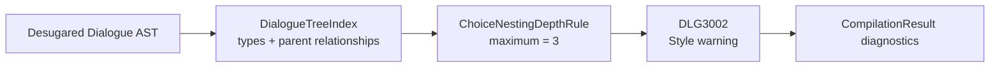

# Choice nesting diagnostic

> [!NOTE]
> Status: **implemented**
> ([issue #132](https://github.com/pengzhengyi/godot-dialoguedown/issues/132)).
> Add a style warning when a choice branch becomes difficult to scan, while
> keeping nested choices valid.

## Table of contents

- [Goal and scope](#goal-and-scope)
- [Functionality checklist](#functionality-checklist)
- [Ubiquitous language](#ubiquitous-language)
- [Writer-facing behavior](#writer-facing-behavior)
- [Prior art](#prior-art)
- [Architecture](#architecture)
- [Interfaces and responsibilities](#interfaces-and-responsibilities)
- [Key design decisions](#key-design-decisions)
- [Error and boundary cases](#error-and-boundary-cases)
- [Integration](#integration)
- [Testability](#testability)
- [Implementation crosscheck](#implementation-crosscheck)
- [Alternatives not chosen](#alternatives-not-chosen)
- [Open questions](#open-questions)

## Goal and scope

Warn when a branch reaches a fourth level of nested choices. Deep nesting is
valid, but it becomes difficult to scan, review, and redraw as the dialogue
changes. The diagnostic should gently suggest moving the branch into a new scene
and jumping to it instead.

This is a structural style rule over the desugared Dialogue AST. It does not
reject the script, change choice semantics, limit the number of options at one
level, or introduce public/TOML rule configuration.

## Functionality checklist

- [x] Add `DLG3002` as a `Style` diagnostic with `Warning` severity.
- [x] Treat a top-level `Choices` group as nesting level 1.
- [x] Allow levels 1 through 3 without a diagnostic.
- [x] Report the first group at level 4 on each over-nested branch.
- [x] Avoid duplicate reports for deeper descendants of the same branch.
- [x] Apply equally to ordered and unordered choices.
- [x] Point at the start of the first over-limit choice group.
- [x] Register the rule in every default compiler composition root.
- [x] Keep the default threshold behind an internal rule seam for future
      configuration.
- [x] Update the generated error-code reference and writer-facing guidance.

## Ubiquitous language

| Term | Meaning |
| --- | --- |
| **Choice group** | One `Choices` block: the options offered together at one branch. |
| **Choice nesting level** | The number of `Choices` groups on the path from the document body to the current group, including the current group. |
| **Recommended maximum** | The deepest level that produces no diagnostic: 3. |
| **First over-limit group** | A choice group at level 4 whose nearest enclosing choice group is still within the recommended maximum. |
| **Choice branch** | One path through nested choice groups. Separate sibling paths are separate branches. |

## Writer-facing behavior

The first three levels remain unremarked:

```markdown
- Level 1
    - Level 2
        - Level 3
```

The first group beyond that recommendation reports `DLG3002`:

```markdown
- Level 1
    - Level 2
        - Level 3
            - Level 4
```

Descriptor:

| Field | Value |
| --- | --- |
| Code | `DLG3002` |
| Title | `Deeply nested choice branch` |
| Category | `Style` |
| Severity | `Warning` |
| Message | `This branch reaches choice nesting level {0}; the recommended maximum is {1}. Consider moving this branch into a new scene and jumping to it instead.` |

The message is advisory rather than absolute. A writer may deliberately keep the
nesting, but the warning makes the readability tradeoff visible.

`DLG3001` remains reserved for the planned **dropped unmodeled Markdown**
diagnostic recorded in the parent
[Diagnostics and Validation](./Diagnostics%20and%20Validation.md) design.

## Prior art

The surveyed interactive-fiction languages keep nested choices legal:

| Tool | Depth diagnostic | Where related diagnostics point | Relevant author guidance |
| --- | --- | --- | --- |
| [Ink](https://github.com/inkle/ink/blob/master/Documentation/WritingWithInk.md) | No maximum-depth diagnostic; nesting is unlimited. | The specific loose-end content that violates flow termination. | Its official guide says deep sub-nesting becomes hard to read and manipulate and recommends diverting to a new stitch. |
| [Yarn Spinner](https://docs.yarnspinner.dev/write-yarn-scripts/scripting-fundamentals/options) | No maximum-depth diagnostic; nested options are legal. | Not applicable for depth. | Nodes and [jumps](https://docs.yarnspinner.dev/write-yarn-scripts/scripting-fundamentals/jumps) provide the structural alternative for extracting a branch. |
| [ChoiceScript](https://github.com/dfabulich/choicescript/blob/main/web/scene.js) | No maximum-depth diagnostic. | The exact line where choice indentation or fall-through becomes invalid. | Its structural errors ask for explicit `*goto` or `*finish` when choice flow would fall through. |
| [Ren'Py](https://github.com/renpy/renpy/blob/master/renpy/lexer.py) | No maximum-depth diagnostic. | The offending indented line for structural indentation errors. | No compiler guidance about extracting deep menu branches was found. |

This precedent supports preserving unbounded choice semantics rather than
rejecting deep branches. DialogueDown separately chooses `Warning` as its policy:
the structure remains valid, but the authoring concern is actionable enough to
surface prominently.

Mainstream nesting rules provide the stronger precedent for reporting location:

| Tool | Report location | Repeat behavior |
| --- | --- | --- |
| [ESLint `max-depth`](https://github.com/eslint/eslint/blob/main/lib/rules/max-depth.js) | The first token of each over-limit construct. | Reports every deeper descendant. |
| [Checkstyle `NestedIfDepth`](https://github.com/checkstyle/checkstyle/blob/master/src/main/java/com/puppycrawl/tools/checkstyle/checks/coding/NestedIfDepthCheck.java) | The offending `if` keyword. | Reports every deeper descendant. |
| [PMD `AvoidDeeplyNestedIfStmts`](https://github.com/pmd/pmd/blob/main/pmd-java/src/main/java/net/sourceforge/pmd/lang/java/rule/design/AvoidDeeplyNestedIfStmtsRule.java) | The first over-limit `if` statement. | Stops below that violation; independent siblings still report. |
| [Sonar S134](https://github.com/SonarSource/sonar-java/blob/master/java-checks/src/main/java/org/sonar/java/checks/NestedIfStatementsCheck.java) | The first over-limit control-flow keyword, with enclosing keywords as secondary locations. | Reports only the first crossing; independent siblings still report. |
| [detekt `NestedBlockDepth`](https://github.com/detekt/detekt/blob/main/detekt-rules-complexity/src/main/kotlin/dev/detekt/rules/complexity/NestedBlockDepth.kt) | The enclosing function name. | One aggregate report per function. |

DialogueDown is a construct-level rule, not a whole-scene complexity score, so
it follows the PMD/Sonar shape:

- point at the first over-limit choice marker rather than the whole group. The
  Dialogue AST does not retain the Markdown bullet's exact token span, so an
  empty span at the group's start is the closest precise equivalent without
  underlining the full list.
- report once for that over-nested subtree, but report independent sibling
  branches separately.
- include both the actual depth and recommended maximum in the message, as
  ESLint and Checkstyle do.
- use `DLG3002`, because the parent diagnostics design already reserves
  `DLG3001` for dropped unmodeled Markdown.

Verified sources:

- [ESLint `max-depth`](https://eslint.org/docs/latest/rules/max-depth)
- [Checkstyle `NestedIfDepth`](https://checkstyle.org/checks/coding/nestedifdepth.html)
- [PMD `AvoidDeeplyNestedIfStmts`](https://pmd.github.io/pmd/pmd_rules_java_design.html#avoiddeeplynestedifstmts)
- [detekt `NestedBlockDepth`](https://detekt.dev/docs/rules/complexity/#nestedblockdepth)

## Architecture



The existing structural validator remains the owner of the pass. The tree index
records parent relationships while it performs its existing single traversal.
The rule walks the ancestors of each `Choices` node and counts only `Choices`
ancestors.

## Interfaces and responsibilities

| Type | Responsibility |
| --- | --- |
| `DiagnosticCatalog` | Own `DLG3002`, its message format, category, and default severity. |
| `DialogueTreeIndex` | Preserve parent relationships by node identity and lazily yield nearest-first ancestors. |
| `ChoiceNestingDepthRule` | Count choice-group ancestors and report the first over-limit group on each branch. |
| `StructuralValidatorFactory` | Create the same built-in structural rule set for the container-free and DI composition roots. |

## Key design decisions

### D1 — This is a style warning

The script remains valid. Its runtime meaning is unambiguous. The concern is
writer readability, so the descriptor belongs in the `DLG3xxx` style range.
`Warning` matches the existing multiple-jumps advisory: the script compiles, but
the structure is suspect enough to call attention to.

`Info` is too quiet for a threshold that represents an actionable authoring
recommendation. Future rule-severity configuration may demote or disable the
diagnostic for a project that deliberately uses deeper trees.

### D2 — The recommended maximum is 3

A top-level choice group is level 1. Two nested follow-up groups remain readable
in source, while a fourth indentation level is a useful point to suggest
extracting a scene.

The rule accepts the maximum through an internal constructor and validates that
it is positive. The default compiler uses 3. This leaves a clean seam for future
configuration without expanding `CompilerOptions` or `dialogue.toml` for one
rule today.

### D3 — Report once at the first violation

For one branch, count its enclosing `Choices` groups. Report when that zero-based
count equals the maximum nesting level. The writer-facing level is the enclosing
count plus 1, so a maximum of 3 reports the first group at level 4.

Do not report level-5 or level-6 descendants: they are consequences of the same
structural choice and would repeat the same advice.

If two sibling branches independently reach level 4, report both. Each requires
a separate refactoring decision.

### D4 — Point at the nested group, not the whole branch

A `Choices` span may cover several lines. Use an empty source span at
`Choices.Span.Start` so terminal and editor renderers point at the first marker
without underlining the whole nested block.

### D5 — Extend the shared index instead of walking twice

`DialogueTreeIndex` already exists so every structural rule shares one traversal.
Its static `Build` factory delegates mutable traversal to a scoped private
builder, which collects nodes and parent relationships before returning the
immutable query object. This keeps build-only mutation out of the finished
index.

Nodes are records, so structurally equal nodes may compare equal. The parent map
must therefore use reference identity. An ancestor query keeps that detail
inside the index and gives future structural rules a reusable tree-context seam;
it lazily yields the nearest parent first.

### D6 — Keep the wording gentle and actionable

The diagnostic says **Consider moving** rather than commanding the writer to
refactor. It names the alternative already documented in the script-language
guide: introduce a scene and jump to it.

## Error and boundary cases

| Case | Behavior |
| --- | --- |
| No choices | No diagnostic. |
| One wide group with many options | No diagnostic; breadth is not nesting. |
| Levels 1–3 | No diagnostic. |
| Level 4 | Report once at the start of that group. |
| Levels 5+ below an already reported group | No additional diagnostic on that branch. |
| Two separate branches reach level 4 | Report once for each branch. |
| Ordered and unordered groups | Treat identically. |
| Non-choice nodes between groups | Do not affect the choice nesting count. |
| Warning under any compilation mode | Collect it without halting compilation. |
| Non-positive rule maximum | Throw `ArgumentOutOfRangeException` as a developer usage error. |

## Integration

- Add the descriptor to the central `DiagnosticCatalog`; the generated
  error-code page then gains the public reference entry through its existing
  catalog projection.
- Add the rule to the structural validator's default registry. Introduce
  `StructuralValidatorFactory` so `ScriptCompilerFactory` and
  `AddDialogueDown` create validators with the same built-in rule set.
- Keep the script-language specification's existing guidance that deep nesting
  becomes difficult to scan and jumps are preferable when branches split and
  rejoin, without coupling the language reference to a diagnostic code or
  threshold.
- Do not add CLI switches, TOML keys, suppressions, automatic fixes, or
  visualization-specific behavior in this component. Existing diagnostic
  renderers consume `DLG3002` automatically.

## Testability

- **Rule unit tests:** exact boundary, first violation, no descendant duplicate,
  separate sibling violations, ordered choices, and custom internal thresholds.
- **Tree-index tests:** parent and ancestor relationships use reference identity
  and preserve the document tree.
- **Composition tests:** both default construction paths include the rule through
  one shared factory.
- **Compiler integration:** a four-level Markdown choice script produces one
  located `DLG3002` warning at the first level-4 marker; the same script still
  completes successfully.
- **Documentation tests:** the catalog remains unique and the generated
  error-code reference includes the descriptor.

Use multi-line raw string literals for nested script fixtures so indentation and
choice depth are visible.

## Implementation crosscheck

| Bucket | Result |
| --- | --- |
| **Achieved** | `DLG3002`, the level-4 threshold, first-crossing and sibling behavior, point location, ordered/unordered parity, shared default registration, compiled documentation examples, and writer guidance all match the design. |
| **Changed** | The final index uses a scoped private builder and a lazy nearest-first ancestor sequence; the rule compares the enclosing-choice count directly with `maximumNestingLevel` and adds 1 only when reporting the human level. |
| **Not implemented** | Public/TOML threshold, severity, suppression, and automatic-fix configuration remain deliberately out of scope for the later rule-configuration design. |

## Alternatives not chosen

| Alternative | Why not |
| --- | --- |
| `Info` severity | Too easy to overlook for an actionable readability smell; future configuration can demote it. |
| Reject depth 4 as an error | Deep nesting is valid and may be intentional. |
| Report every level above 3 | Repeats one structural concern and creates noisy diagnostics. |
| Add `MaxChoiceNestingDepth` to public/TOML options now | Introduces a broad configuration surface for one rule before the planned rule-configuration design. |
| Walk the AST recursively inside the rule | Duplicates traversal and withholds a useful ancestry seam from other structural rules. |
| Measure indentation in Markdown | Couples the rule to source formatting instead of the compiler's normalized choice structure. |

## Open questions

None.
