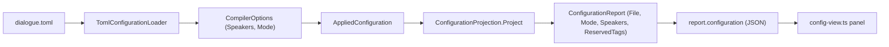
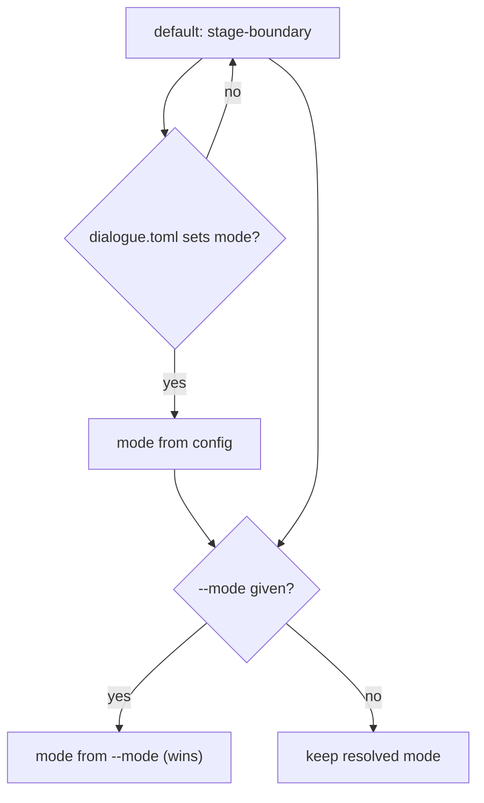

# Compilation mode configuration

> [!NOTE]
> **Status: implemented.** This completed the remaining scope of
> [#110](https://github.com/pengzhengyi/godot-dialoguedown/issues/110): the
> compilation `mode` is settable in `dialogue.toml` and shown in the
> visualization's Config tab. The CLI `--mode` option shipped earlier
> (see [CLI Configuration](./CLI%20Configuration.md)).

## Table of contents

- [Goal and scope](#goal-and-scope)
- [Ubiquitous language](#ubiquitous-language)
  - [Two settable modes; fail-fast is an embedding contract](#two-settable-modes-fail-fast-is-an-embedding-contract)
- [Functionality checklist](#functionality-checklist)
- [Component A — the `dialogue.toml` loader](#component-a--the-dialoguetoml-loader)
- [Component B — the Config tab](#component-b--the-config-tab)
  - [Display: project the configured mode](#display-project-the-configured-mode)
  - [The visualization always renders stage-boundary](#the-visualization-always-renders-stage-boundary)
  - [Edit, create, and autocomplete](#edit-create-and-autocomplete)
- [Precedence and data flow](#precedence-and-data-flow)
- [Error and boundary cases](#error-and-boundary-cases)
- [Testability](#testability)

## Goal and scope

`CompilerOptions.Mode` (the `CompilationMode` enum) chooses **how far a compile
proceeds after an error**. Today it is settable only in code or through the CLI
`--mode` option. This feature adds the two remaining channels named in
[#110](https://github.com/pengzhengyi/godot-dialoguedown/issues/110):

1. **Configuration** — a `dialogue.toml` project can set the mode, so it applies
   to every compile of that project without repeating a CLI flag.
2. **Visualization** — the Config tab **displays**, **edits**, **creates**, and
   **autocompletes** the mode, matching how it already treats speakers.

Out of scope: changing the mode's runtime semantics; making the visualizer itself
honor a non-default mode (it deliberately always renders `stage-boundary` — see
[below](#the-visualization-always-renders-stage-boundary)); and exposing
`fail-fast` as a settable value (it stays a code-level embedding contract —
see [below](#two-settable-modes-fail-fast-is-an-embedding-contract)).

## Ubiquitous language

The word *mode* is overloaded here; this note keeps two distinct terms and never
blurs them:

| Term | Type | Meaning |
| --- | --- | --- |
| **Compilation mode** | `CompilationMode` — `stage-boundary`, `best-effort`, `fail-fast` | How far a compile proceeds after an error. **This feature configures it.** |
| **Visualization mode** | `VisualizationMode` — `static`, `view`, `edit` | How a report is *shown*. Already exists as `report.mode`. Untouched. |

The configured setting keeps **one name — `mode` — across TOML, the CLI, and the
tab**, as [#110](https://github.com/pengzhengyi/godot-dialoguedown/issues/110)
requires. In the client payload it lives under `configuration`, so
`report.configuration.mode` (compilation) never collides with the top-level
`report.mode` (visualization).

### Two settable modes; fail-fast is an embedding contract

The enum has three values, but only two are author-facing *settings*:

| Value | Settable via CLI / config / tab? | Role |
| --- | --- | --- |
| `stage-boundary` | ✅ (the default) | Recover within a stage; halt at the stage boundary once that stage reported an error. |
| `best-effort` | ✅ | Recover through every stage and collect everything — the fullest diagnostics picture. |
| `fail-fast` | ❌ | The embedder's **load-or-throw** contract — see below. |

`fail-fast` is **kept**, but it answers a different question from the other two.
Two orthogonal axes hide inside "mode":

- **Recovery depth** — how far to collect after an error: first error only,
  to the stage boundary, or through everything.
- **Delivery** — how to hand the outcome back: *return* a `CompilationResult`, or
  *throw*.

`stage-boundary` and `best-effort` differ only on recovery depth, and both
**return** a result for a surface to render. `fail-fast` differs on **both**: it
recovers nothing and **throws** a `DiagnosticException` carrying the first error.
That makes it the idiomatic primitive for an **embedder** — a Godot import plugin
or a runtime loader that wants "give me the compiled dialogue, or throw so I abort
the import/boot" — rather than a reporting surface that renders a *collection* of
diagnostics.

So the CLI, `dialogue.toml`, and the tab expose exactly `stage-boundary` and
`best-effort`. Selecting `fail-fast` there would be both **lossier** (it surfaces
one error and drops the warnings it had collected) and **unrenderable** (a throw
yields no `CompilationResult` for a surface to display). Anything else — including
`fail-fast` — is a configuration error.

## Functionality checklist

**Component A — loader:**

- [x] A top-level `mode = "stage-boundary" | "best-effort"` key sets
      `CompilerOptions.Mode`.
- [x] An absent `mode` leaves the built-in default (`stage-boundary`).
- [x] An unknown value, `fail-fast`, or a non-string `mode` value is rejected with
      a **located** `DialogueConfigurationException`.
- [x] Unrelated or misspelled root keys (including a dotted `mode.x`) are ignored,
      not misread as `mode`, so the format stays forward-compatible.
- [x] `mode` and `[[speakers]]` coexist in one file.

**Component B — Config tab:**

- [x] The tab **displays** the project's configured compilation mode (the value
      the CLI and embedders honor), above the speakers table, with a defaulting
      label when unset.
- [x] A tooltip states that `mode` governs the project's compilation, while the
      visualization always renders `stage-boundary`.
- [x] Editing `mode` in the TOML editor and saving rewrites `dialogue.toml` and
      recompiles, exactly like editing speakers.
- [x] **Autocompletion** suggests the `mode` key at the document's top level and
      its two values after `mode =`.
- [x] The created-config starter scaffolds a commented `mode` example that
      explains the same visualization caveat.

## Component A — the `dialogue.toml` loader

A new reader mirrors `ConfiguredSpeakerReader`, keeping `TomlConfigurationLoader`
a thin composition root.

| Type | Responsibility | Collaborators |
| --- | --- | --- |
| `ConfiguredModeReader` (internal) | Read the top-level `mode` key of a parsed `DocumentSyntax` into a `CompilationMode?` (null when absent); validate the value; reject a malformed one with a located error. | `DocumentSyntax.KeyValues`, `DialogueConfigurationException`, `TomlLocation` |
| `TomlConfigurationLoader.Parse` (public, existing) | Compose speakers **and** mode into `CompilerOptions`. | `ConfiguredSpeakerReader`, `ConfiguredModeReader` |

The reader scans `document.KeyValues` (the root-level key/values that precede any
table header) for a `mode` key, resolving quoted-vs-bare keys and rejecting dotted
keys with the same `KeyName` logic the speaker reader uses. It maps the string
through a small closed dictionary — **the same two kebab-case values the CLI's
`CompileSettings` accepts** — so the two channels never drift.

`Parse` composes the readers' results onto `CompilerOptions.Default` with `with`
expressions, so an empty config still returns the shared `Default` instance:

```csharp
DocumentSyntax document = new TomlDocumentParser(sourceName).Parse(toml);
IReadOnlyList<ConfiguredSpeaker> speakers = new ConfiguredSpeakerReader().Read(document);
CompilationMode? mode = new ConfiguredModeReader().Read(document);

var options = CompilerOptions.Default;
if (speakers.Count > 0) { options = options with { Speakers = speakers }; }
if (mode is { } resolved) { options = options with { Mode = resolved }; }
return options;
```

## Component B — the Config tab

The tab is a CodeMirror TOML editor (left) beside a projected panel (right),
served by the live server; edits POST back, rewrite `dialogue.toml`, and
recompile. Mode threads through the same seams speakers already use.

### Display: project the configured mode

`ConfigurationReport` gains the configured compilation mode, projected from the
retained `AppliedConfiguration.Options.Mode`. The panel shows it as a small
labeled row **above the speakers table** (for example, **Mode: best-effort**),
defaulting the label to `stage-boundary` when unset.



### The visualization always renders stage-boundary

`CompilationVisualizer.ForVisualization` forces `stage-boundary` for the compile
it renders, independent of the project's configured mode. This is deliberate, and
worth stating precisely because the tab *displays* a mode it does not *render in*.

The pipeline is `parse → transpile → (checkpoint) → desugar → validate → analyze`,
and the transpiler is the only stage that reports before the checkpoint today. Two
facts decide what the tabs show:

- `ShouldHalt` is `mode == stage-boundary && HasErrors`.
- `IsComplete` is true only when analysis produced a semantic model.

On a **broken** script the two settable modes diverge sharply:

| Mode | Pipeline on a broken script | Result | `IsComplete` |
| --- | --- | --- | --- |
| `stage-boundary` | halts at the checkpoint | `Halted` — later artifacts never built | `false` |
| `best-effort` | runs desugar/validate/analyze on the transpiler's **recovered** output | `Complete` (all four artifacts) | `true` |

The visualizer projects **all four** stage graphs when `IsComplete`, and otherwise
shows the stages that ran and marks the rest **unavailable** (disabled tabs) with
a reason (see [Unavailable Stage Tabs](./Unavailable%20Stage%20Tabs.md)). So if the
visualizer honored `best-effort`, a broken script would *always* draw the
desugared and semantic graphs from the transpiler's recovered, unreliable material
— a graph that looks authoritative but is reconstructed from a known-broken parse.
Pinning to `stage-boundary` keeps the render **honest**: it shows only the stages
built on reliable input and disables the rest with a reason, instead of presenting
post-error noise as analysis. (`fail-fast` cannot be rendered at all — it throws —
so some coercion is unavoidable regardless; `ForVisualization` is where it lives.)

This is the split to make explicit to the reader, in the tab tooltip and the
starter template:

> The **`mode`** here controls how this **project** compiles — it applies to the
> `dialoguedown` CLI and to embedded/runtime builds. It does **not** change the
> visualization: the report always renders in **stage-boundary** so every stage it
> shows is built from reliable input, and stages after an error appear as
> unavailable rather than reconstructed from partial, post-error material.

Keeping the visualizer's render depth independent of the project's compile policy
is intentional: how much the *report* shows is a presentation concern, not a
consequence of a project-wide setting. Letting an author explore a broken script's
later stages in the report is a genuine future want, but it belongs as a
viewer-local toggle rather than a coupling to the configured mode — tracked
separately, not built here.

### Edit, create, and autocomplete

The client mirrors the speaker seams:

- `model.ts` — `ConfigReport` gains an optional `mode` field.
- `config-view.ts` — render the mode row (with the tooltip above) from
  `configuration.mode`.
- `config-completions.ts` — add two client-side sources: a **top-level `mode`
  key** suggestion (at a root key position, outside any table) and its **two
  values** after `mode =`. The value list is a stable client-side constant, like
  the speaker structural keys.
- `ConfigStarter.Template` — add a commented `# mode = "stage-boundary"` line with
  a short comment carrying the same visualization caveat, so a newly created
  config teaches the key without changing the resolved default.

## Precedence and data flow

Resolution is **CLI `--mode` > `dialogue.toml` `mode` > built-in default**, the
order every surveyed compiler uses (rustc, tsc, ESLint, MSBuild). The CLI already
implements it: `CompileCommand` resolves the configured options, then overrides
`Mode` **only when `--mode` was given**. Component A simply makes the middle tier
non-empty; **no CLI change is needed**.



## Error and boundary cases

| Case | Behavior |
| --- | --- |
| `mode` absent | Default `stage-boundary`; no error. |
| `mode = "best-effort"` | `CompilerOptions.Mode = BestEffort`. |
| `mode = "fail-fast"` | Located error: not an author-facing mode. |
| `mode = "turbo"` (unknown) | Located error naming the two valid values. |
| `mode = 42` (non-string) | Located error: must be a string. |
| Duplicate `mode` keys | Tomlyn reports a syntax error; surfaced located. |
| Dotted or misspelled root key (`mode.x`, `modes`) | Ignored — not read as `mode`; unrelated root keys stay lenient for forward-compatibility. |
| `mode` + `[[speakers]]` | Both applied. |

## Testability

- **Component A** — `ConfiguredModeReaderTests` (xUnit) covers each row of the
  table above; `TomlConfigurationLoaderTests` gains coexistence and
  default-return cases. Pure unit tests, no I/O.
- **Component B** —
  - `ConfigurationProjectionTests` (xUnit): the report carries the configured
    mode, including the distinction between the forced-`stage-boundary` render and
    the configured-mode *display*.
  - `config-view.test.ts` and `config-completions.test.ts` (Vitest): the mode row
    and its tooltip render; the key and value completions fire only in the right
    positions.
  - **Playwright e2e is a judgment call.** Add a `mode` case to
    `config-edit.spec.ts` only if it covers behavior the Vitest and xUnit tests
    cannot (a real save→recompile round-trip through the server) *and* stays cheap
    and non-brittle. Otherwise the unit coverage stands on its own and e2e is
    skipped.
