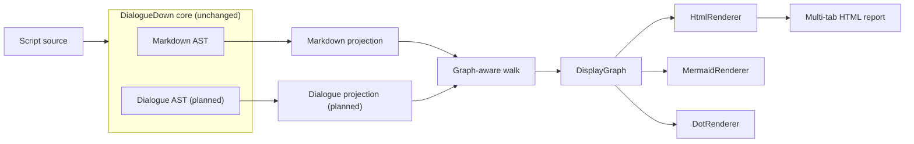

# Compilation Visualization

> [!NOTE]
> Status: **implemented**. This note defines a diagnostic visualization component
> that renders each compiler stage's intermediate representation as a
> human-readable tree or graph. It is developed in parallel with the main compiler
> work and syncs from `main` as new stages land.
>
> **Maturity caveat.** Unlike the core library, this component was built quickly
> ("vibe-coded") with lighter design review. It is well-tested and works, but its
> abstractions are not yet battle-hardened and may be refined as it sees real use.

Full-process transparency is a goal of DialogueDown: a reader should be able to
*see* what the compiler produced at each step. This component renders those
intermediate representations — the **Markdown AST** today, the **Dialogue AST**
next, and later the runtime graph — in a format that is readable by developers
and non-developers alike, and interactive where it helps.

## Table of contents

- [Goal and scope](#goal-and-scope)
- [Ubiquitous language](#ubiquitous-language)
- [Functionality checklist](#functionality-checklist)
- [Component plan](#component-plan)
- [Architecture](#architecture)
- [Interfaces and abstractions](#interfaces-and-abstractions)
- [Key design decisions](#key-design-decisions)
- [Error and boundary cases](#error-and-boundary-cases)
- [Integration](#integration)
- [Testability](#testability)

## Goal and scope

Render the compiler's **intermediate representations** as node–edge diagrams a
human can read. Every IR today is a **tree** (the Markdown AST, the Dialogue AST);
a later stage — the runtime dialogue graph — is a **directed graph that may
contain cycles**. The display model and the traversal are therefore
**graph-capable from the start**, with a tree handled as the acyclic case.

**In scope:**

- A **unified projection seam** so every IR — tree or graph — is presented through
  one interface, without bespoke rendering code per IR type.
- A stage-agnostic pipeline: any IR → one display model → one or more output
  formats.
- A **Markdown AST** visualization (this stage exists on `main` today).
- An interactive **HTML** report with one tab per available stage, usable offline.
- A **detail panel**: clicking a node shows its attributes and the **source
  snippet** it was produced from, with a rendered Markdown preview.
- Secondary text formats (**Mermaid**, **DOT**) from the same display model.
- A seam for the **Dialogue AST** visualization, activated once the transpiler
  lands on `main`, and for the runtime graph after it.

**Out of scope (for now):**

- Rendering the runtime dialogue graph — a later stage. The model anticipates it
  (cycles, shared nodes), but no runtime-graph projection ships yet.
- Editing or round-tripping — this is read-only diagnostics.
- Shipping the visualizer inside the core NuGet package (see
  [D1](#d1--a-separate-project-keeps-the-core-pure)).
- The CLI and live/hosted delivery of the report — the `dialoguedown visualize`
  command and the loopback server wrap this component and have their own notes;
  this note covers the render/model core they build on.

**Delivery reality.** The Markdown AST stage ships today. The transpiler's
Dialogue AST has since landed on `main`; its `DialogueAstProjection` is added as a
second stage the same way — one small projection, with no change to the walk,
model, or renderers.

## Ubiquitous language

One concept, one name — used here, in code, and in tests.

| Term | Meaning |
| --- | --- |
| **Stage** | A compilation phase that produces an IR (Markdown AST, Dialogue AST, runtime graph, …). |
| **IR** | Intermediate representation — the tree or directed graph a stage produces (e.g. `MarkdownDocument`). |
| **Node projection** | The unified seam (`INodeProjection<TNode>`): for one IR node, its `Label`, `Attributes`, and out-neighbors. One small implementation per IR family. |
| **Display node** | One node prepared for display: an `Id`, a short `Label`, optional `Attributes` (key–value extras such as span or kind), the optional `Source` snippet it was produced from, and an optional `Category`. Renderer-agnostic. |
| **Category** | A stable, cross-stage semantic group name (for example `call`, `speech`) that the renderer maps to a color. Corresponding concepts in different stages share a category, so they share a color. |
| **Display edge** | A directed link between display nodes, with a `Kind` — a normal **child** edge, or a **reference** edge back to an already-seen node (how a cycle or shared node is shown). |
| **Display graph** | A titled diagram for one stage: a `Title`, its display nodes, and its display edges. A **tree** is the acyclic, single-parent case. |
| **Walk** | The graph-aware traversal that builds a display graph from an IR root plus a projection, using a visited set so cycles terminate. |
| **Renderer** | Turns a display graph into one output format (HTML, Mermaid, DOT). |
| **Report** | The assembled multi-tab HTML across every available stage. |

## Functionality checklist

- [x] A unified `INodeProjection<TNode>` seam describes any IR node (label,
      attributes, out-neighbors), with extension-method ergonomics
      (`ir.ToDisplayGraph()`).
- [x] A graph-aware **walk** builds a display graph from any IR root and its
      projection, using a **visited set** so cycles terminate — a revisited node
      becomes a **reference edge** rather than infinite recursion.
- [x] A **Markdown AST** projection maps every node type (`MarkdownDocument`,
      `Heading`, `Paragraph`, `ListBlock`, `ListItem`, `TextInline`, `LinkInline`,
      `ImageInline`, `CodeSpanInline`, `EmphasisInline`, `LineBreak`) to a
      labeled display node with useful attributes (span, kind, target, etc.).
- [x] An **HTML renderer** emits an interactive, collapsible view with a detail
      panel: clicking a node (a generous hit area, not just the dot) shows its
      attributes and the source snippet it was produced from, with a rendered
      Markdown preview. Arrow keys navigate; on-screen zoom controls (+/−, click
      the ratio to reset) and a resizable panel round it out. The whole report is
      one self-contained file, so it works offline.
- [x] A **semantic color scheme**: each node carries a cross-stage category that
      the renderer maps to a color, shown on nodes, the panel, and an interactive
      legend that counts each type, highlights it on hover, and toggles it
      (dimming) on click.
- [x] A **lineage focus**: hovering a graph node spotlights its lineage — the node,
      its ancestors (path to the root), and its visible descendants (subtree) — and
      fades the rest so its place in the tree stands out. It is opacity-only, so it
      composes with the semantic tab's scene-backbone emphasis (bold strokes) and the
      selection and category states rather than fighting them.
- [x] A **Source tab** shows the whole document as raw Markdown beside a live
      preview (split, editor-style), with working in-document anchor links.
- [x] A **report** facade compiles a source string and assembles a **Source tab**
      (the document with a live preview) and one **tab per stage** into a single
      self-contained HTML page.
- [x] **Mermaid** and **DOT** renderers (fast-follow extras) emit graph text from
      the same display graph.
- [x] A **Dialogue AST** projection seam (landed with the transpiler).
- [x] Handles empty input, deep nesting, cycles, and special characters safely
      (escaping).

## Component plan

The work is split into three components, delivered in sequence as separate,
atomic commits on the `feat/visualization` branch. This note is the shared design
record; the components are sequenced by dependency:

1. **Display model and walk** — `DisplayNode`, `DisplayEdge`, `DisplayGraph`, the
   `INodeProjection<TNode>` seam, and the graph-aware `Walk`. Pure, no
   dependencies, no core changes. The foundation everything else builds on.
2. **Renderers** — the `IDisplayRenderer` strategy and its concretes:
   `HtmlRenderer` (interactive, bundled JS) first, then `MermaidRenderer` and
   `DotRenderer` as extras.
3. **Compilation report** — the Markdown AST projection (and later the Dialogue
   AST projection) plus the `CompilationVisualizer` facade that runs the stages
   and assembles the multi-tab report. This is where the core seam is consumed.

## Architecture

The core idea is a **single walk, many renderers**. Each stage is projected into
one shared display graph; renderers are thin formatters over that model. The core
compiler is untouched, and a new output format is one small class.



The walk is one generic routine over the projection seam. A visited set keyed by
node identity keeps it finite even for cyclic graphs; a tree simply never
revisits:

```text
DisplayGraph Walk<TNode>(TNode root, INodeProjection<TNode> projection):
    graph = empty display graph
    visited = {}                       # node identity -> display node id

    DisplayNode Visit(node):
        if node in visited:            # cycle or shared node
            return visited[node]       # caller adds a reference edge
        display = DisplayNode(projection.Describe(node))
        visited[node] = display
        graph.Add(display)
        for neighbor in projection.Neighbors(node):
            child = Visit(neighbor)
            kind = (neighbor was already visited) ? Reference : Child
            graph.AddEdge(display -> child, kind)
        return display

    Visit(root)
    return graph
```

A projection supplies `Describe` (label + attributes) and `Neighbors` (the
out-edges) for its IR family; the walk supplies the graph-aware mechanics.

## Interfaces and abstractions

| Type | Responsibility | Collaborators |
| --- | --- | --- |
| `DisplayNode` | Immutable display node: `Id`, `Label`, `Attributes`, optional `Source` snippet, optional `Category`. | built by the walk |
| `DisplayEdge` | Directed edge with a `Kind` (child or reference). | built by the walk |
| `DisplayGraph` | Titled diagram: `Title` + display nodes + display edges. A tree is the acyclic case. | produced by the walk |
| `NodeDescription` | What a projection reports for one node: its `Label`, `Attributes`, optional `Source`, and optional `Category`. | `INodeProjection`, walk |
| `INodeProjection<TNode>` | The unified seam: `Title`, `Describe(node)`, and `Neighbors(node)` for one IR family. | `GraphWalk` |
| `GraphWalk` | Generic graph-aware traversal: `Walk(root, projection) → DisplayGraph`, with cycle-safe visited tracking. | every projection |
| `MarkdownAstProjection` | `INodeProjection` over `MarkdownDocument` and its node types; titled "Markdown AST". | `IMarkdownParser` |
| `IDisplayRenderer` | Turns a `DisplayGraph` into one output format (string). | `DisplayGraph` |
| `HtmlRenderer` / `MermaidRenderer` / `DotRenderer` | Concrete renderers per format. | `DisplayGraph` |
| `CompilationVisualizer` | Facade: compile a source string, run each available projection, assemble a multi-tab report. | parser, projections, renderers |

Extension methods (e.g. `markdownDocument.ToDisplayGraph()`) wrap the matching
projection, so callers get a unified, ergonomic entry without naming the
projection type.

## Key design decisions

### D1 — A separate project keeps the core pure

The core `DialogueDown` library is deliberately minimal and engine-agnostic
(only Markdig; the README stresses "no engine deps, reusable, unit-testable").
The visualizer lives in a **separate `DialogueDown.Visualization` project** that
references the core via `ProjectReference`. Rendering concerns and any
visualization dependencies stay out of the shipped core package.

Because the AST types are `internal`, the core grants
`InternalsVisibleTo` to both `DialogueDown.Visualization` and its test project
`DialogueDown.Visualization.Tests` (which reads the internal AST to build test
fixtures) — the same mechanism the core test project already uses. These grants
are the only change to the core, and they add no runtime dependency.

### D2 — The visualization layer owns traversal via a unified projection

Traversal lives entirely in the visualization layer. Each IR family implements one
small `INodeProjection<TNode>` — `Describe` (label + attributes) and `Neighbors`
(out-edges) — and the generic `Walk` turns any projected IR into a display graph.
Extension methods (`ir.ToDisplayGraph()`) give a uniform call site.

This is the **unified interface** the design needs: adding a stage is one
projection, not a bespoke graph-building routine, and the core AST records stay
pure — traversal is not their responsibility, and the core is never modified.

### D3 — A graph model with a cycle-safe walk; a tree is the acyclic case

The display model is a **graph** (nodes + directed edges), not strictly a tree,
because a later IR (the runtime dialogue graph) has cycles and shared nodes. The
walk carries a **visited set** keyed by **reference identity**: the first visit
creates a display node; a revisit emits a **reference edge** back to it instead of
recursing. Reference identity (not value equality) is essential — the AST nodes are
records with value-based equality, so two distinct nodes that happen to hold equal
content must still appear as separate nodes. This keeps traversal finite and the
diagram readable for graphs, while a tree — which never revisits — falls out as the
simple acyclic case with only child edges.

### D4 — One display model, pluggable renderers (Strategy)

The walk produces a single renderer-agnostic **display graph**; renderers are
**Strategy** implementations of `IDisplayRenderer`. Adding a format is one new
class, and every stage automatically gets every format. This is the "thin wrapper
over a good library" shape: the model is tiny, and each renderer is a formatter.

### D5 — Interactive HTML via D3 and Pico.css, built as one self-contained file

The flagship format is an interactive, collapsible **HTML** view built on
**D3.js** — the gold standard for readable, expand/collapse, zoom/pan trees, and
extensible to graph layouts when the runtime graph arrives. D3 does the layout and
interaction, so the .NET code never hand-rolls rendering. **Pico.css** styles the
page chrome for a clean, modern light/dark look with almost no custom CSS, and a
**System / Light / Dark** toggle in the header — a select with a sun / moon / monitor
icon (Feather Icons, MIT) reflecting the choice — lets the reader override the OS
preference (remembered in `localStorage`).

A **detail panel** sits beside the graph. Clicking a node shows its attributes and
the **source snippet** it was produced from (sliced from the node's span), with a
rendered **Markdown preview** of that snippet via **marked**, and **Tippy.js**
gives each node a rich hover tooltip. This is what makes the view legible to
non-developers: you can see exactly which text became which node.

The client is a small **TypeScript** application (in `web/`) that **Vite** builds
and inlines into **one self-contained HTML file** — every script and stylesheet
embedded, no CDN, no external requests — so the report opens with no server and
works fully offline, even air-gapped. The libraries are npm dependencies pinned by
`package-lock.json` and tree-shaken into the bundle: D3 v7.9.0 (ISC), Pico.css
v2.1.1 (MIT), marked v12.0.2 (MIT), and Tippy.js v6.3.7 (MIT, which bundles
Popper); `web/NOTICE.md` records versions and licenses. The .NET side embeds this
built file and injects only the per-report data — the source and each stage —
into its data slot.

The tradeoff is deliberate: the bundle pins specific, reviewed library versions
(updated by bumping `package.json` and rebuilding) rather than floating to the
latest, in exchange for a reproducible, zero-network, offline-first artifact.

### D6 — Mermaid and DOT as fast-follow text formats

HTML lands first. From the same display graph, **Mermaid** (`flowchart` text —
already used in these docs, renders on GitHub) and **DOT** (Graphviz) follow as
extras. Both are pure string formatting over a graph and need no heavy dependency;
if a fluent DOT builder is later wanted, `DotNetGraph` (MIT) is the vetted choice.

### D7 — One self-contained page: a Source tab, then one tab per stage

The report is a **single self-contained HTML page**: a **Source** tab (the input
document) first, then one tab **per stage** (Markdown AST, later Dialogue AST, …).
One artifact opens in any browser, needs no server, and reads well for
non-developers.

### D8 — Semantic categories drive a stable, cross-stage color scheme

Color carries meaning here, so it must be **consistent and cross-stage**. The
projection tags each node with a **category** — a small, stable vocabulary
(`document`, `structure`, `speech`, `text`, `choice`, `jump`, `media`, `call`,
`styling`, `break`) — and the renderer owns the palette that maps a category to a
color. This keeps domain knowledge (what a node *means*) in the projection and
presentation (what color it *is*) in the renderer.

The categories are chosen so **corresponding concepts across stages share one**,
and therefore share a color: a Markdown `CodeSpanInline` and the runtime **game
call** it compiles to are both `call` (red), so a reader can trace a concept by
color from one stage to the next. Only the *color* is shared across stages — the
human label is stage-local: the per-stage **legend** is labeled with that stage's
own node types (the Markdown AST legend reads "Code span", never the future "game
call"), and the detail panel marks the node with a color **dot**. The legend is
interactive: each row counts how many nodes of that type are present, and clicking
a row toggles it — dimming its label and every node of that category in the graph,
so a reader can focus on one kind at a time. A category is optional, so a node
without one falls back to a neutral color. Hovering a legend row highlights every
node of that category (a gentle pop and a bold label), so a reader can spot where
a kind occurs at a glance.

### D9 — A Source tab pairs the raw document with a live preview

The first tab shows the **input** itself: the whole source document in a
**CodeMirror** editor on the left (read-only in **View**, editable in **Edit**,
toggled in place — see the View and Edit Modes note), with theme-adaptive Markdown
highlighting, beside a **live rendered preview** on the right, split like an editor's
side-by-side preview (a draggable divider re-proportions the two). This grounds the
stage graphs in the text a writer actually authored — you read the document, then see
what each compiler
stage made of it.

Preview **anchor links work**: headings carry GitHub-style ids (via marked's
`gfm-heading-id` extension), so a `[…](#slug)` link scrolls to its heading within
the preview. Front matter is shown as a labeled metadata block, not a heading,
matching the node-snippet previews. The source is not a compiler stage, so it is
modeled separately: the .NET side injects a `{ source, stages }` payload and the
frontend prepends the Source tab only when a source is present (a bare
single-graph render has none). The Source tab has no node-detail panel — that
belongs to the graph tabs — so it takes the full width.

## Error and boundary cases

| Case | Intended behavior |
| --- | --- |
| Empty source | Compiles to an empty document; the display graph is a lone root with no edges; renderers show an empty-but-valid diagram. |
| Deeply nested inlines (nested emphasis, nested lists) | The walk recurses; renderers must not assume shallow depth. |
| Cyclic or shared-node graph IR (future runtime graph) | The visited set stops re-expansion; a revisited node becomes a **reference edge** to its first occurrence, so traversal terminates and the diagram stays finite. |
| Special characters in labels (`<`, `>`, `&`, quotes, newlines) | Each renderer escapes for its format (HTML entities, Mermaid/DOT quoting) so output stays valid and safe. |
| A stage that fails to compile | Planned for when more than one stage exists: the report will show the stages that compiled and surface the error for the failing one. With today's single Markdown stage, a compile failure has nothing else to show, so it propagates as an exception. |
| A stage that fails to render in the browser | The client guards each tab independently: a render error shows an inline message for that stage instead of blanking the whole page. |
| A stage not present on `main` yet (Dialogue AST) | Its tab is simply absent until the stage exists; no dead UI. |

Visualization is **read-only diagnostics**: it must never mutate the IR and should
not throw for well-formed compiler output. Genuinely malformed *usage* (e.g. a
null tree) uses standard .NET argument exceptions, consistent with the project's
error model.

## Integration

- **Obtaining the IR.** The Markdown stage exposes `IMarkdownParser.Parse(string)`,
  returning `MarkdownDocument`. The projection consumes that seam;
  `InternalsVisibleTo` makes the internal parser and nodes reachable from the
  visualization project.
- **One projection per stage.** The Markdown AST view ships today; now that the
  transpiler's Dialogue AST has landed on `main`, a `DialogueAstProjection` adds it
  as a second stage with no change to the walk, model, or renderers.
- **Entry point.** The `dialoguedown` CLI's `visualize` command wraps the same
  `CompilationVisualizer` facade — rendering a static report, watching and
  hot-reloading it, or opening the launcher to browse for a script (see the CLI
  and Live Visualization notes).
- **README.** The project README carries a short "full-process transparency"
  section linking here, and lists the visualization project in its layout.

## Testability

Testing is lighter than the core library but still real; high coverage is the
target where it is cheap.

- **Unit — display model and walk.** `Walk` and the display model are pure and
  fully unit-testable: given a small projected IR, assert the resulting display
  graph's nodes, edges, and child order. A small synthetic **cyclic** projection
  asserts the walk terminates and emits a reference edge.
- **Unit — projection.** For each Markdown node type, assert it projects to the
  expected labeled display node (mirror the source layout: one test file per
  projection).
- **Unit — renderers.** Assert the rendered string for a tiny display graph, and
  assert escaping of special characters. Snapshot-style assertions on small,
  readable inputs (multi-line raw string literals).
- **End-to-end.** A few tests take a real script string, run
  `CompilationVisualizer`, and assert the report contains the expected stage tabs
  and node labels — enough to prove the whole pipeline wires up.

Tests build the IR via the existing test factories where possible and keep unit
tests independent, so the runner parallelizes them.

### Frontend quality gates and tests

The client is a self-contained **TypeScript + Vite** project under `web/`, with a
test pyramid and quality gates run locally (`npm run check`) and in CI (the
**Frontend** job):

- **Typecheck** — `tsc --noEmit` over the strict-mode TypeScript modules.
- **ESLint** (`typescript-eslint`) and **Stylelint** (`stylelint-config-standard`)
  lint the sources and stylesheet; **Prettier** enforces formatting.
- **Unit (Vitest + jsdom)** — the pure and DOM-light modules (text, palette,
  legend, detail panel, zoom controls, resizer, source view, highlighter) are
  unit-tested at 100% coverage. This is the broad base of the pyramid.
- **End-to-end (Playwright + Chromium)** — the actual built report is loaded in a
  real browser and driven: the Source tab renders and its preview anchor links
  scroll to their headings, tabs switch, nodes render, clicking shows source and
  preview, hovering shows a tooltip, the legend dims, zoom works, and arrow keys
  navigate. A **`@axe-core/playwright`** pass asserts no accessibility violations
  on both tabs — including **color-contrast**, which a real browser can measure
  (jsdom cannot).
- **Build freshness** — CI rebuilds the single-file report and fails if the
  committed `web/dist/report.html` is stale (`git diff --exit-code`), so the
  embedded UI can never drift from its sources.

The Vite build targets **ES2022**, so the report runs on current evergreen
browsers without legacy transpilation.
