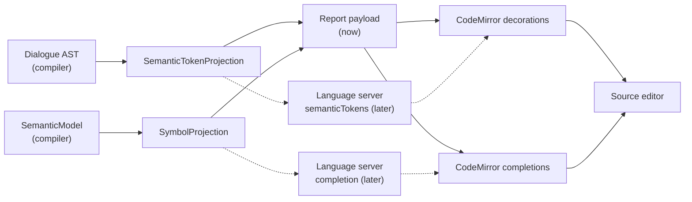

# Compiler-Projected Editor Semantics

> [!NOTE]
> Status: **proposed / draft** — awaiting review. Unifies syntax highlighting
> ([#115](https://github.com/pengzhengyi/godot-dialoguedown/issues/115)) and completion
> alignment ([#118](https://github.com/pengzhengyi/godot-dialoguedown/issues/118)) under one
> principle: the **compiler is the single source of truth** for the dialogue grammar, and the
> editor *renders* what the compiler projects rather than re-lexing the language itself.

## Goal and scope

The `visualize` report's source editor gains two dialogue-aware features — **syntax
highlighting** and **grammar-correct completions** — without re-implementing DialogueDown's
lexical grammar in TypeScript. Both are driven by **projections of the compiler's own parse**,
carried in the report payload beside the diagnostics and symbols already there, and rendered by
the browser. One grammar, in C#; the client only draws.

This is the same pattern the diagnostics overlay established
([#134](https://github.com/pengzhengyi/godot-dialoguedown/pull/134)): a pure `.NET` projection
into an editor-shaped artifact, a payload transport today, and an LSP transport later — the
projection and the rendering are reused unchanged when the language server arrives.

**In scope:**

- A **semantic-token projection** in `.NET`: walk the Dialogue AST and emit positioned tokens,
  each carrying a kind (`speakerName`, `speakerId`, `tag`, `reservedTag`, `separator`,
  `jumpIndicator`), carried in the payload.
- **Highlighting**: render those tokens as CodeMirror decorations, layered over the editor's
  existing Markdown highlighting and themed for light and dark.
- **Completions from compiler symbols**: source the editor's completion list from the payload's
  compiler-resolved `SymbolSet`, and **retire the client-side symbol scanner and its
  grammar-shaped triggers** — resolving #118's "ghost completions" at the root.

**Out of scope (deferred, seams left open):**

- **Instant, per-keystroke highlighting** via a client lexer
  ([#139](https://github.com/pengzhengyi/godot-dialoguedown/issues/139)). Projected highlighting
  refreshes on recompile (save and hot-reload); zero-latency coloring is a later UX layer, and
  the `feat/source-syntax-highlighting` worktree is its prior attempt.
- **A real language server.** The projections are LSP-shaped so a future
  `textDocument/semanticTokens` and `textDocument/completion` server publishes the same data;
  that server ships with the VS Code extension.
- **Finer sub-tokens** (splitting a tag's `=value`, the `@`/`#` sigils). The legend starts
  coarse (one token per concept) and can grow.

## Ubiquitous language

| Term | Meaning |
| --- | --- |
| **Semantic token** | A positioned token — a source `range` plus a `kind` from the legend — projected from the AST for highlighting. The LSP `semanticTokens` concept. |
| **Token legend** | The stable vocabulary of token kinds the projection emits. A future LSP server publishes it as the semantic-tokens legend. |
| **Token projection** | The pure mapping from the Dialogue AST to semantic tokens. The reusable seam. |
| **Completion symbol** | A completable name from the compiler's resolved `SymbolSet` — a speaker, an `@id`, a `#tag`, or a jump target. |
| **Source of truth** | The compiler. The editor renders projections; it never re-lexes or re-scans the dialogue grammar. |
| **Transport** | How a projection reaches the editor: the report **payload** now; a **language server** later. |

## Functionality checklist

- [ ] `.NET` projects the Dialogue AST into semantic tokens (kind + zero-based range).
- [ ] The payload carries the tokens, for both a complete and a halted compile.
- [ ] The editor highlights each dialogue token distinctly, layered over Markdown highlighting,
      readable in light and dark themes.
- [ ] Highlighting refreshes on recompile (save and hot-reload) and never re-lexes in the browser.
- [ ] Front matter, fenced code, headings, and Markdown link destinations are not
      mis-highlighted as dialogue tokens.
- [ ] Completions are sourced only from the compiler's `SymbolSet`; the client scanner is removed.
- [ ] Completions never offer a token shape the compiler rejects (no ghosts), and offer
      compiler-valid shapes the old scanner missed (leading underscores, quoted names).
- [ ] Empty, incomplete, and malformed source never crashes the editor.
- [ ] The static export stays self-contained and offline-capable; `web/dist/report.html` is rebuilt.

## Interfaces and abstractions

| Type / seam | Responsibility | Collaborators |
| --- | --- | --- |
| `SemanticToken` (`.NET`, new) | A positioned token: a zero-based `Range` and a `TokenKind`. | `LspRange`, `TokenKind` |
| `TokenKind` (`.NET`, new) | The token legend enum: `SpeakerName`, `SpeakerId`, `Tag`, `ReservedTag`, `Separator`, `JumpIndicator`. | — |
| `SemanticTokenProjection` (`.NET`, new) | Walk the Dialogue AST and emit `SemanticToken`s; the reusable seam. | `ScriptDocument` AST, `LineMap` |
| `CompilationVisualizer.BuildContent` (`.NET`) | Project `result.Script` into tokens and include them in the payload. | `SemanticTokenProjection`, `DisplayGraphJson` |
| `DisplayGraphJson.SerializeReport` (`.NET`) | Serialize the tokens into the payload's `semanticTokens` field. | `SemanticToken` |
| `Report.semanticTokens` (TS) | The document's semantic tokens; absent ⇒ none. | highlighting extension |
| `semantic-tokens.ts` (TS, new) | Convert payload tokens to CodeMirror `Decoration.mark` ranges (range → offset), themed by kind. | `@codemirror/view`, `source-view.ts` |
| `editor-completions.ts` (TS, changed) | Source completions from the payload `SymbolSet`; triggers detect cursor context only. | `Report.symbols` |
| `dialogue-symbols.ts` scanner (TS, **removed**) | The client-side grammar scan — retired; the compiler's symbols replace it. | — |

### Reusing `LspRange`

The diagnostics overlay already defined `LspRange`/`LspPosition` (zero-based line/character) in
`DialogueDown.Visualization.Diagnostics`. Semantic tokens reuse them, so both projections speak
one range vocabulary. The `LineMap` over the source converts an AST span's offsets to a range,
exactly as the diagnostics path does.

### Token payload shape

The payload carries the readable per-token form (a range and a kind), mirroring how the
diagnostics payload carries readable `LspDiagnostic`s rather than LSP's compact wire encoding. A
future LSP server encodes these into the `semanticTokens` delta array against the published
legend.

```ts
/** A positioned dialogue token, projected from the compiler's parse. */
export interface SemanticToken {
    range: LspRange; // zero-based (LSP), reused from the diagnostics model
    kind: TokenKind;
}

export type TokenKind =
    | "speakerName"
    | "speakerId"
    | "tag"
    | "reservedTag"
    | "separator"
    | "jumpIndicator";

export interface Report {
    // …existing fields…
    semanticTokens?: SemanticToken[];
}
```

## Key design decisions

### D1 — The compiler is the single source of truth

Both features derive from one grammar — the compiler's — instead of a second grammar in the
browser. Highlighting comes from projected tokens; completions come from projected symbols. A
grammar change touches the `.NET` parser and flows to the editor automatically, so the editor
and the compiler can never disagree. This is the durable idea; the two features are its
application.

### D2 — Semantic tokens projected from the Dialogue AST

The transpiled **Dialogue AST** already carries a `SourceSpan` on every node, and the
visualization's `DialogueAstProjection` already walks it. `SemanticTokenProjection` reuses that
walk and maps the dialogue-bearing node types to tokens:

| AST node | Token(s) |
| --- | --- |
| `SpeakerNameReference` | `speakerName` (its span) |
| `SpeakerIdReference` | `speakerId` (its span, includes `@`) |
| `SpeakerDeclaration` | `speakerName`, and `speakerId` when an `@id` is present — split from the one span |
| `PartialSpeakerDeclaration` | `speakerId` (its span) |
| `CustomTag` | `tag` (its span, includes `#` and any `=value`) |
| `ReservedTag` | `reservedTag` (its span, includes `##`) |
| `JumpIndicator` | `jumpIndicator` (its span, the `=>`) |
| between a line's speaker and speech | `separator` (the `:`, derived) |

Two cases need a derived sub-span rather than a bare node span: a `SpeakerDeclaration` packs
`Name @id` in a single span (its tags are child nodes), so the `@id` is split out by locating the
`@`; and the `:` **separator** is not an AST node, so it is derived as the colon between the
speaker prefix and the speech. Everything else is a node's own span.

### D3 — Tokens layer over Markdown highlighting

The projection emits only the **dialogue-specific** tokens Markdown does not understand. Headings,
emphasis, lists, links, images, and inline code keep the editor's existing Markdown highlighting;
the decoration overlay adds dialogue colors on top. Because tokens come from AST nodes, they land
only on real dialogue constructs — front matter, fenced code, and link destinations are never
mis-colored, which the AST-node origin guarantees rather than a regex having to avoid them.

### D4 — Transport is the payload now, LSP later



Tokens ride the existing payload and live channel (`/api/save`, `/api/document`, SSE hot-reload),
refreshed on recompile through the same push the diagnostics overlay uses. Only the wire changes
when the language server arrives; the projection and the CodeMirror rendering stay put.

### D5 — Completions from compiler symbols, not a client scan

The payload already carries the compiler's resolved `SymbolSet` (speakers, ids, tags, jump
targets — issue #71). The completion sources read **only** that. The old client scanner offered
token shapes the compiler rejects (unquoted `Marie-Claire`) and missed valid ones (leading
underscores) because it re-implemented the grammar loosely; sourcing the list from the compiler's
own symbols makes those mismatches impossible **by construction**, which is exactly what #118
asks for.

The completion **triggers** (`matchBefore` for `@`, `#`, `](#`, and a line-leading speaker) stay,
but only as **cursor-context detectors** — they decide *where* a completion is offered, not
*which tokens are valid*. Since the offered list is compiler-correct, a liberal trigger boundary
cannot produce a ghost, so the triggers no longer carry a grammar contract.

### D6 — Deprecate the client scanner; defer the instant lexer

`dialogue-symbols.ts`'s `scanDialogueSymbols` (and the semantic-source merge that layered a live
scan over the payload symbols) is removed: its sole purpose was the client grammar this replaces.
The **instant per-keystroke lexer** (#139) and its cross-language conformance corpus are deferred
— once highlighting is compiler-projected, maintaining a second TypeScript grammar is low value,
and autosave-on-idle ([#140](https://github.com/pengzhengyi/godot-dialoguedown/issues/140)) will
shrink the recompile gap further.

### D7 — Highlight the Dialogue AST, not the Desugared AST

Tokens come from the **transpiled Dialogue AST**, which reflects what the writer typed. The
Desugared AST fills synthetic nodes (a default speaker on a speaker-less line) that have no source
text; highlighting those would color positions the writer never wrote. The Dialogue AST has no
synthetic nodes, so every token maps to real text.

## Error and boundary cases

| Case | Intended behavior |
| --- | --- |
| Synthetic node (zero-width span) | No token emitted — there is no text to color. |
| Halted compile | The Dialogue AST is still produced (it is carried on a halted result), so highlighting works even when a later stage errors. |
| Malformed / incomplete line | Only the nodes the transpiler produced are tokenized; no crash. |
| Range past the current buffer (dirty edit) | The overlay reflects the last compile; CodeMirror clamps stale ranges until the next recompile refreshes them. |
| Empty document | No tokens; the overlay is empty. |
| Overlapping tokens | Not possible — tokens are disjoint AST-node spans. |

## Integration

- **`.NET`:** `CompilationVisualizer.BuildContent` projects `result.Script` into
  `SemanticToken[]` and passes them to `SerializeReport`/`SerializeDocument`, which gain a
  `semanticTokens` field; `HtmlTemplate.RenderPage` threads them through. Both complete and halted
  results carry tokens.
- **TypeScript:** `model.ts` gains `Report.semanticTokens`; a new `semantic-tokens.ts` converts
  them to CodeMirror decorations (range → offset, kind → class) and exposes the extension;
  `source-view.ts` mounts it and exposes `setSemanticTokens` on its handle. `editor-completions.ts`
  drops the scanner and reads `Report.symbols`; `dialogue-symbols.ts` is removed. The app pushes
  tokens on load, on a View-mode hot-reload, and after each Edit-mode save — the diagnostics path.
- **Live server:** unchanged — the report is already serialized through the same seam.

## Testability

- **`.NET` unit** (`SemanticTokenProjectionTests`, `TokenKind`): each dialogue node maps to the
  right kind and zero-based range; a `SpeakerDeclaration` with an id splits into `speakerName` +
  `speakerId`; the separator is derived; synthetic (zero-width) nodes emit nothing; a halted
  compile still yields tokens.
- **`.NET`** (`CompilationVisualizerTests`, `DisplayGraphJsonTests`): a compile's tokens reach the
  payload's `semanticTokens` field; an empty document carries an empty array.
- **TS unit** (`semantic-tokens.test.ts`): payload tokens convert to decorations at the right
  offsets and classes; completion tests assert the list comes from `Report.symbols` with no
  scanner.
- **End-to-end:** a static report colors each dialogue token distinctly in light and dark; a live
  edit re-highlights after recompile; completions offer only compiler symbols (a just-typed but
  compiler-rejected name is not offered).

## Open questions

None outstanding — the approach (AST-projected tokens, Dialogue AST, coarse legend, drop the
client scan) is agreed. Two small choices are settled as noted: the `:` separator and a
`SpeakerDeclaration`'s `@id` are derived sub-spans (D2), and finer sub-tokens (a tag's `=value`,
the sigils) are deferred to a later legend expansion.
