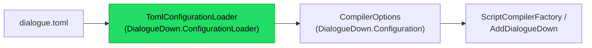

# Implementation note: Configuration loader

> [!IMPORTANT]
> Status: **approved — implementation in progress**. The **edge** that reads a
> project's `dialogue.toml` and produces a [`CompilerOptions`](./Configuration.md)
> for the compiler. It lives in its own satellite assembly so the engine-agnostic
> core stays free of a TOML dependency: the core keeps taking a plain options
> object, and this loader is the optional, file-backed way to build one.

## Table of contents

- [Implementation note: Configuration loader](#implementation-note-configuration-loader)
  - [Table of contents](#table-of-contents)
  - [Goal and scope](#goal-and-scope)
  - [Where it sits](#where-it-sits)
  - [Ubiquitous language](#ubiquitous-language)
  - [The `dialogue.toml` schema](#the-dialoguetoml-schema)
  - [Functionality checklist](#functionality-checklist)
  - [Interfaces and abstractions](#interfaces-and-abstractions)
  - [Key design decisions](#key-design-decisions)
    - [DD1 — A satellite assembly with Tomlyn, not a core dependency](#dd1--a-satellite-assembly-with-tomlyn-not-a-core-dependency)
    - [DD2 — Map Tomlyn's untyped model, not a fixed POCO](#dd2--map-tomlyns-untyped-model-not-a-fixed-poco)
    - [DD3 — Reserved as typed keys, custom as shorthand with a structured escape hatch](#dd3--reserved-as-typed-keys-custom-as-shorthand-with-a-structured-escape-hatch)
    - [DD4 — Validate at the edge, fail with a location](#dd4--validate-at-the-edge-fail-with-a-location)
  - [Error and boundary cases](#error-and-boundary-cases)
  - [Integration](#integration)
  - [Testability](#testability)
  - [Deferred](#deferred)

## Goal and scope

The [Configuration](./Configuration.md) component keeps the core **binding-agnostic**:
the compiler takes a `CompilerOptions` object and never reads a file. This component
is the **edge** that turns a project's `dialogue.toml` into that object — parsing,
**partitioning** each speaker's keys into custom and reserved tags, and **validating**
before anything reaches the compiler.

**In scope:** a `TomlConfigurationLoader` that reads a TOML file (or string) into a
`CompilerOptions`, the `dialogue.toml` **speakers** schema, edge validation, and a
`DialogueConfigurationException` with source locations. **Out of scope (deferred):**
non-speaker configuration sections (unmodeled-node handling, runtime), and any config
format other than TOML — see [Deferred](#deferred).

## Where it sits

The loader is a satellite assembly between a project's config file and the core's
options; it depends on the core, never the reverse — an architecture test guards this
direction.



A consumer that wants file-backed config references
`DialogueDown.ConfigurationLoader`; a consumer that builds `CompilerOptions` in code
(or from another source) does not, and the core never takes a TOML dependency.

## Ubiquitous language

| Term                     | Meaning                                                                                                                |
| ------------------------ | ---------------------------------------------------------------------------------------------------------------------- |
| **Configuration loader** | The component that reads `dialogue.toml` into a `CompilerOptions`.                                                     |
| **Structural key**       | A speaker key the schema defines directly: `name`, `id`, `tags`.                                                       |
| **Reserved key**         | Any other speaker key — a reserved tag (`default`, and future `voice`, …), validated against `ReservedTagNames.Known`. |
| **Tag shorthand**        | A custom tag written as a DSL-style string, `"name"` or `"name=value"`.                                                |
| **Edge validation**      | Rejecting a malformed or invalid config here, before it reaches the compiler.                                          |

## The `dialogue.toml` schema

```toml
# dialogue.toml

[[speakers]]
name    = "Narrator"          # required
id      = "narrator"          # optional stable id
default = true                # a reserved tag (typed key) -> ReservedTag("default")
tags    = ["main", "mood=happy", { name = "a=b", value = "c" }]   # custom tags
```

A `[[speakers]]` entry maps to one `ConfiguredSpeaker`:

- **`name`** (required, non-empty string) → `Name`.
- **`id`** (optional string) → `Id`.
- **`tags`** (optional array) → `CustomTags`. Each element is either a **shorthand
  string** (`"name"` or `"name=value"`, split at the first `=`) or an **inline table**
  (`{ name = "…", value = "…" }`, `value` optional) — the escape hatch for a name that
  itself contains `=`. Both forms become `ConfiguredTag(name, value?)`.
- **every other key** is a **reserved tag**: a `true` boolean → a name-only
  `ConfiguredTag(key)`; a string → `ConfiguredTag(key, value)`. `false` (or omitted)
  contributes nothing. The key must be in `ReservedTagNames.Known`.

So `default = true` marks the default speaker exactly as the DSL's `##default` does,
and the author writes typed keys rather than tag strings.

## Functionality checklist

- [ ] `TomlConfigurationLoader.Parse(toml)` and `.Load(path)` build a `CompilerOptions`
      from a `[[speakers]]` array.
- [ ] Structural keys (`name`, `id`, `tags`) map to their `ConfiguredSpeaker` fields.
- [ ] Custom `tags` accept a shorthand string (split at the first `=`) or an inline
      table (`{ name, value }`), for full DSL parity including a name containing `=`.
- [ ] Every other key partitions into a **reserved tag** (bool → name-only, string →
      valued), validated against `ReservedTagNames.Known`.
- [ ] Edge validation rejects: missing/empty `name`, a wrong-typed key, an unknown
      reserved key, an inline-table tag without a `name`, and **more than one** `default`.
- [ ] A `DialogueConfigurationException` reports the message and source location
      (path, line, column), for both TOML syntax errors and schema violations.
- [ ] Empty or speaker-less config yields `CompilerOptions.Default` (no speakers).
- [ ] An architecture test guards the direction: the core does not depend on the
      loader, and the loader depends only on the core (and Tomlyn).

## Interfaces and abstractions

| Type                             | Visibility | Responsibility                                   | Collaborators             |
| -------------------------------- | ---------- | ------------------------------------------------ | ------------------------- |
| `TomlConfigurationLoader`        | public     | `Parse(toml)` / `Load(path)` → `CompilerOptions` | Tomlyn, `CompilerOptions` |
| `DialogueConfigurationException` | public     | a config error with a source location            | `TomlConfigurationLoader` |

Internally the loader maps Tomlyn's untyped `TomlTable` model to `ConfiguredSpeaker`s
and validates as it goes; those mapping helpers stay internal.

## Key design decisions

### DD1 — A satellite assembly with Tomlyn, not a core dependency

The loader is its own project (`DialogueDown.ConfigurationLoader`) depending on the
core plus **Tomlyn**, so the engine-agnostic core never takes a TOML dependency (its
guiding constraint). Tomlyn is the de-facto .NET TOML library — by the same author as
Markdig (already used here), used by the .NET SDK, permissively licensed, and its
parser yields **precise line/column diagnostics**, which is what edge validation
needs. The project is format-named-agnostic (`ConfigurationLoader`, not `.Toml`) since
TOML is the one decided format; the entry type `TomlConfigurationLoader` names the
format at the API.

### DD2 — Map Tomlyn's untyped model, not a fixed POCO

A speaker's **reserved keys are open-ended** (`default`, later `voice`, …), so a fixed
POCO cannot capture them. The loader deserializes to Tomlyn's `TomlTable` model and
traverses each `[[speakers]]` entry itself, partitioning keys and keeping the token
spans for error locations. This trades a little mapping code for control over
partitioning and diagnostics.

### DD3 — Reserved as typed keys, custom as shorthand with a structured escape hatch

The schema honors the two-list tag model. **Reserved tags are typed keys**
(`default = true`), so a bad reserved name is caught at the edge against the shared
`ReservedTagNames.Known`, and a multi-word reserved name comes free from TOML key
quoting. **Custom tags are DSL-shorthand strings** (`"mood=happy"`, split at the first
`=`), so an author reuses the script syntax — which already covers multi-word names
and valued tags. For the one case shorthand cannot express — a tag **name** that
contains `=` — a custom tag may instead be an **inline table** (`{ name, value }`),
giving full parity with the DSL's quoted tags (TOML 1.1 allows the mixed array). The
loader maps both forms to `ConfiguredTag`, and the core's builder turns them into AST
tags.

### DD4 — Validate at the edge, fail with a location

The loader is where a config is proven well-formed, so it rejects everything the
compiler would otherwise mishandle — missing name, wrong types, an unknown reserved
key, two defaults — as a `DialogueConfigurationException` carrying the path, line, and
column. The compiler downstream can then trust its `CompilerOptions`.

## Error and boundary cases

| Case                                                          | Behavior                                                                 |
| ------------------------------------------------------------- | ------------------------------------------------------------------------ |
| Malformed TOML                                                | `DialogueConfigurationException` from Tomlyn's diagnostic (line/column). |
| Missing or empty `name`                                       | `DialogueConfigurationException`.                                        |
| Wrong-typed key (`default` not bool, `tags` not string array) | `DialogueConfigurationException`.                                        |
| Unknown reserved key (not `name`/`id`/`tags`, not in `Known`) | `DialogueConfigurationException`.                                        |
| Inline-table tag without a `name`                             | `DialogueConfigurationException`.                                        |
| More than one `default = true`                                | `DialogueConfigurationException`.                                        |
| `default = false` or omitted                                  | contributes no reserved tag.                                             |
| Empty file / no `[[speakers]]`                                | `CompilerOptions.Default` (no speakers).                                 |
| `Load` on a missing file                                      | the underlying IO exception (a usage error, not a config error).         |

## Integration

- **Core** (`DialogueDown`): unchanged — it takes a `CompilerOptions`. The loader
  reuses `CompilerOptions`, `ConfiguredSpeaker`, `ConfiguredTag`, and the now-public
  `ReservedTagNames`.
- **Loader** (`DialogueDown.ConfigurationLoader`): the new satellite; `TomlConfigurationLoader`
  produces a `CompilerOptions` a caller hands to `ScriptCompilerFactory.CreateDefault`
  or `AddDialogueDown`.
- **CLI / consumers** (later): a `--config dialogue.toml` option can call the loader
  and pass the result to the compiler.
- **Architecture**: a test asserts the core does not depend on the loader and the
  loader depends only on the core (and Tomlyn), guarding the satellite direction.

## Testability

- **Parsing**: valid TOML → the expected `CompilerOptions` (names, ids, partitioned
  tags), with multi-line raw-string TOML so the input's shape is visible.
- **Validation**: each error case above gets a test asserting the thrown
  `DialogueConfigurationException` and its reported location.
- **Round-trip**: a loaded `CompilerOptions` compiles — `ScriptCompilerFactory.CreateDefault(options)`
  resolves a speaker-less line to the configured default.
- **Architecture**: the dependency-direction test above (core ⊄ loader; loader → core
  only), extending the existing assembly-boundary suite.
- Construction goes through a small TOML test helper; the loader is stateless and
  unit-tested in isolation.

## Deferred

| Item                                                 | Note                                                                                     |
| ---------------------------------------------------- | ---------------------------------------------------------------------------------------- |
| Non-speaker config (`[markdown.unmodeled]`, runtime) | Other top-level sections, tracked with their own components.                             |
| Config formats other than TOML                       | TOML is the decided format; the project name leaves room but no other loader is planned. |
| Duplicate-name detection at the edge                 | The speaker binder already reports speaker conflicts; edge de-duplication can follow.    |
