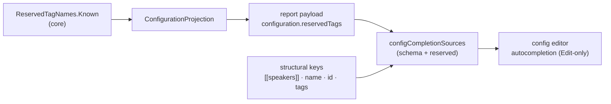

# Implementation note: Configuration tab — Autocompletion

> [!NOTE]
> Status: **implemented**. This is **Stage 2b** of the Configuration tab:
> **autocompletion** for the editable `dialogue.toml`. When editing the config in the
> report, the TOML editor suggests the schema it expects — the `[[speakers]]` table
> header and the `name` / `id` / `tags` keys — and the reserved tag names DialogueDown
> owns (today just `default`). It builds on
> [Configuration Tab — Live Edit](./Configuration%20Tab%20-%20Live%20Edit.md)
> (Stage 2a), which made the editor editable and gave it the Source editor's
> affordances; this note only adds the completion source.

## Table of contents

- [Goal and scope](#goal-and-scope)
- [Ubiquitous language](#ubiquitous-language)
- [Functionality checklist](#functionality-checklist)
- [Where it sits](#where-it-sits)
- [Interfaces and abstractions](#interfaces-and-abstractions)
- [Key design decisions](#key-design-decisions)
  - [DD1 — Schema completion, not a document scan](#dd1--schema-completion-not-a-document-scan)
  - [DD2 — Reserved tag names ship from the core; structural keys are the client's schema](#dd2--reserved-tag-names-ship-from-the-core-structural-keys-are-the-clients-schema)
  - [DD3 — Context decides what to suggest](#dd3--context-decides-what-to-suggest)
  - [DD4 — Wire it Edit-only, mirroring the Source editor](#dd4--wire-it-edit-only-mirroring-the-source-editor)
- [Error and boundary cases](#error-and-boundary-cases)
- [Integration](#integration)
- [Testability](#testability)

## Goal and scope

Stage 2a made the Config tab's `dialogue.toml` editable and gave it code folding,
search, and the rest of the Source editor's affordances — but not autocompletion.
Stage 2b adds it: as you type the config, the editor suggests what belongs there.

Unlike the Source editor's completions — speaker names, `@id`s, `#tag`s, and jump
targets **scanned from the document** — the config's vocabulary is a small, fixed
**schema**: the `[[speakers]]` table and its `name` / `id` / `tags` keys, plus the
reserved tag names the compiler recognizes (`default`). So Stage 2b is
schema-driven, not document-derived.

**In scope:**

- a **`[[speakers]]`** completion when starting a table header;
- the **`name` / `id` / `tags`** keys, offered at a key position inside a
  `[[speakers]]` table;
- the **reserved tag names** (`default` today) offered beside those keys;
- wiring the completion **Edit-only** into the config editor, reusing CodeMirror's
  `autocompletion` and the Tab-to-accept habit from the Source editor.

**Out of scope:**

- Completing **values** (e.g. suggesting existing speaker ids after `id =`), or
  free-form tag names — the schema completion is for **keys and headers**.
- **Validation** of the TOML against the schema (a later concern); this only
  *suggests*, it does not flag mistakes.
- Any change to how the config is **saved or recompiled** (that is Stage 2a).

## Ubiquitous language

| Term | Meaning |
| --- | --- |
| **Schema completion** | Suggestions drawn from the fixed config schema (table + keys) rather than from the document's own text. |
| **Structural key** | A `dialogue.toml` speaker key the config format defines: `name`, `id`, `tags`. |
| **Reserved tag name** | A tag name DialogueDown owns and recognizes (`##name`), from the core's `ReservedTagNames` — `default` today. |
| **Key position** | A place in the TOML where a bare key is expected: the start of a line inside a table, before any `=`. |

## Functionality checklist

- [x] Typing a table header (a line starting with `[`) suggests **`[[speakers]]`**.
- [x] At a **key position** inside a `[[speakers]]` table, the editor suggests **`name`**, **`id`**, **`tags`**, and the **reserved tag names** (`default`).
- [x] Suggestions do **not** appear in value positions (after `=`), in comments, or inside strings.
- [x] Completion is **Edit-only** — the read-only View editor never opens a completion.
- [x] **Tab** and **Enter** accept a suggestion (the Source editor's habit); Escape dismisses.
- [x] The reserved tag names come from the compiler's source of truth, so they never drift from what the loader accepts.
- [x] The config editor does not auto-close `[`, so a `[[speakers]]` header (typed or accepted) stays clean.

## Where it sits

The editor already has the completion **infrastructure** (Stage 2a added the
`autocompletion` extension's home — the Edit-only compartment). Stage 2b supplies
the **sources**: a couple of CodeMirror `CompletionSource`s that read the TOML around
the cursor and offer the schema, and the reserved tag names carried in the payload.

## Interfaces and abstractions

| Type | Responsibility | Collaborators |
| --- | --- | --- |
| `configCompletions(reservedTags)` (`config-completions.ts`, new) | the config editor's completion extension: `[[speakers]]` at a header, and keys + reserved tags at a key position | `autocompletion`, `completionKeymap` |
| `tableHeaderCompletions` / `speakerKeyCompletions` (`CompletionSource`s) | the two context-aware sources, mirroring `editor-completions.ts` | `CompletionContext` |
| `ConfigReport.reservedTags` (`model.ts`) | the reserved tag names from the payload, `string[]` | `ConfigReport` |
| `ConfigurationReport.ReservedTags` (.NET) | project `ReservedTagNames.Known` into the payload | `ReservedTagNames` |
| `createConfigView(config, { … })` | pass the reserved tags into the editor's completion when editable | `config-completions.ts` |

## Key design decisions

### DD1 — Schema completion, not a document scan

The Source editor completes from a `DialogueSymbolSource` — a live scan of the
document (plus the analyzer's symbols). The config has no such open-ended vocabulary:
its keys and table are a fixed schema. So Stage 2b's sources return **constant**
option lists (filtered by the typed prefix), not scanned ones. This keeps the config
completion simple and predictable, and means it needs no symbol seam — though one
could be added later if value completion (existing ids, say) is ever wanted.

### DD2 — Reserved tag names ship from the core; structural keys are the client's schema

The reserved tag names are a **closed vocabulary the compiler owns**
(`ReservedTagNames.Known`), and the loader rejects any other reserved key. To keep the
editor's suggestions from ever drifting from what the loader accepts, the reserved tag
names travel **in the report payload** (`configuration.reservedTags`), projected from
`ReservedTagNames.Known` — the same source-of-truth discipline Stage 1 used for the
configured speakers.

The **structural keys** (`[[speakers]]`, `name`, `id`, `tags`) are the TOML shape the
configuration loader parses. They are stable and few, and live naturally in the
visualization layer's config code as a small constant — shipping them from the loader
would be ceremony for no benefit.

### DD3 — Context decides what to suggest

A single completion that offers everything everywhere would be noise. The two sources
read the line around the cursor:

- **Table header** — the line (trimmed) starts with `[`: offer `[[speakers]]`.
- **Key position** — the cursor is at the start of a line (only whitespace before it),
  there is no `=` yet, and the nearest table header above is `[[speakers]]`: offer the
  structural keys and the reserved tag names.

Everywhere else — value positions (after `=`), comments (`#…`), and inside strings —
the sources return `null`, so no tooltip opens. Finding "the nearest table header
above" is a short backward line scan, the config analog of the Source editor's
context checks (a leading `#` is a heading, `](#` is a jump).

### DD4 — Wire it Edit-only, mirroring the Source editor

The completion lives in the config editor's **editable compartment** — the same place
Stage 2a keeps the read-only/editable toggle and `closeBrackets`. So it is active only
in Edit and vanishes in View, exactly like the Source editor's `dialogueAutocompletion`.
It reuses CodeMirror's `autocompletion` and `completionKeymap`, and adds **Tab** as a
second accept key (the VS Code habit the Source editor already established), so the two
editors feel the same.

One adjustment fell out of this: the config editor **stops auto-closing `[`**. TOML
table headers are `[[table]]`, so auto-closing the bracket both fights a writer typing
a header and leaves a stray `]` when a `[[speakers]]` completion is accepted over the
auto-inserted pair. So `closeBrackets` in the config editor closes only braces and
quotes, not `[`.

## Error and boundary cases

| Case | Behavior |
| --- | --- |
| **No reserved tags in the payload** (older payload, or none defined) | The reserved-tag suggestions are simply empty; the structural keys still complete. |
| **Cursor in a value / comment / string** | The sources return `null`; no completion opens. |
| **A non-speaker table** (a future `[[…]]` kind) | The key source only fires under `[[speakers]]`, so it stays quiet elsewhere — correct until more tables exist. |
| **Read-only (View) editor** | The completion extension is not in the read-only compartment, so nothing suggests. |
| **A key already typed in full** | The half-typed token is excluded from its own suggestions (as the Source editor does), so a complete key does not suggest itself back. |

## Integration

- **.NET** — `ConfigurationProjection` adds `ReservedTags` (from `ReservedTagNames.Known`)
  to `ConfigurationReport`; `DisplayGraphJson`/the payload already carry the `configuration`
  section, so this rides along.
- **Web** — `model.ts` gains `configuration.reservedTags`; `config-view.ts` passes it into a
  new `config-completions.ts` extension, added to the editor's editable compartment.
- No change to Stage 2a's edit/save/recompile flow, or to the Source editor.

## Testability

- **.NET unit** — the projected `ConfigurationReport` carries the reserved tag names from
  `ReservedTagNames.Known`.
- **Web unit (vitest)** — each `CompletionSource` in isolation: a `[` header offers
  `[[speakers]]`; a key position under `[[speakers]]` offers `name` / `id` / `tags` and the
  reserved tags; a value position, comment, or non-speaker table offers nothing.
- **Live e2e (Playwright)** — in the config editor, typing `[` suggests `[[speakers]]`, and a
  new key line under a speaker suggests `id` / `tags` / `default`; Tab accepts.
