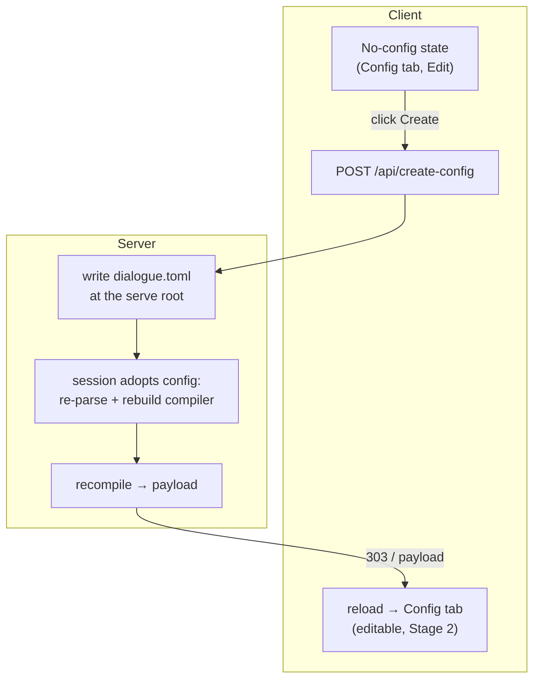

# Implementation note: Configuration tab — Create New

> [!NOTE]
> Status: **implemented**. This is **Stage 3** of the Configuration tab: when a
> compile found no `dialogue.toml`, the Config tab offers a **call to action** to
> create one, right where the reader already sees the no-config state. Creating it
> writes a friendly starter file, recompiles, and drops the reader into the editable
> Config tab from [Stage 2](./Configuration%20Tab%20-%20Live%20Edit.md). Read the
> [Configuration Tab](./Configuration%20Tab.md) (Stage 1) and
> [Configuration Tab — Live Edit](./Configuration%20Tab%20-%20Live%20Edit.md)
> (Stage 2a) notes first; this one builds on both, plus the
> [File Launcher](./Live%20Visualization%20-%20File%20Launcher.md)'s create-file flow.

## Table of contents

- [Goal and scope](#goal-and-scope)
- [The design fork: in-place create vs launcher redirect](#the-design-fork-in-place-create-vs-launcher-redirect)
- [Ubiquitous language](#ubiquitous-language)
- [Functionality checklist](#functionality-checklist)
- [Where it sits](#where-it-sits)
- [Interfaces and abstractions](#interfaces-and-abstractions)
- [Key design decisions](#key-design-decisions)
  - [DD1 — Create in place, reusing the launcher's write-and-recompile mechanism](#dd1--create-in-place-reusing-the-launchers-write-and-recompile-mechanism)
  - [DD2 — The call to action lives in the no-config state, in Edit only](#dd2--the-call-to-action-lives-in-the-no-config-state-in-edit-only)
  - [DD3 — The server owns the path: `dialogue.toml` at the serve root](#dd3--the-server-owns-the-path-dialoguetoml-at-the-serve-root)
  - [DD4 — Write a friendly starter template, not an empty file](#dd4--write-a-friendly-starter-template-not-an-empty-file)
  - [DD5 — The session adopts the new config; the client reloads onto the Config tab](#dd5--the-session-adopts-the-new-config-the-client-reloads-onto-the-config-tab)
  - [DD6 — Never overwrite: an existing file is a conflict, not a clobber](#dd6--never-overwrite-an-existing-file-is-a-conflict-not-a-clobber)
- [Error and boundary cases](#error-and-boundary-cases)
- [Integration](#integration)
- [Testability](#testability)

## Goal and scope

Stage 1 shows the applied `dialogue.toml` read-only; Stage 2 makes it editable. But
a project that has **no** `dialogue.toml` yet has nothing to edit — the Config tab
shows a friendly explanation and stops there. A writer who wants to declare speakers
must leave the report, hand-author a TOML file in the right place with the right
name, and restart. Stage 3 removes that cliff: the no-config state grows a **Create
`dialogue.toml`** button that writes a starter file, recompiles, and lands the writer
in the editable Config tab — schema autocompletion and all.

**In scope (Stage 3):**

- a **call to action** in the Config tab's no-config state (Edit only) that creates a
  `dialogue.toml`;
- a served-server route that writes the file at the **serve root**, adopts it into the
  running session, recompiles, and returns the fresh payload;
- a **friendly starter template** so the new file teaches the schema instead of
  opening blank;
- the same create flow on the **launcher** server, so a launched session behaves the
  same;
- landing the writer on the now-editable **Config tab** after creation.

**Out of scope:**

- choosing an arbitrary folder or name for the new file (it is always `dialogue.toml`
  at the serve root — see [DD3](#dd3--the-server-owns-the-path-dialoguetoml-at-the-serve-root));
- creating a config from the **static** export (there is no server to write with) or
  in **View** (creating is an edit — see [DD2](#dd2--the-call-to-action-lives-in-the-no-config-state-in-edit-only));
- deleting or renaming a config file.

## The design fork: in-place create vs launcher redirect

Stage 1's scope note framed this stage as *"reuse the launcher's create-file flow to
write one at the project root."* Taken literally, the button would **navigate to the
launcher** and let the reader create the file there. That reading runs into three
walls:

1. the launcher's create route writes **`.dialogue.md` scripts**, not `dialogue.toml`
   — it would have to learn a second file kind;
2. a direct served session (`visualize scene.dialogue.md`) has **no launcher** to
   redirect to; and
3. it swaps "create a config" for "pick or create a script," a jarring context
   change for what should be a one-click affordance.

So this note reads *"reuse the launcher's create-file flow"* at the level of its
**mechanism**, not its UI: the launcher already knows how to **write a new file under
a confined root, then serve and recompile it** (`LaunchRoot` confinement, a `create`
route, `409` on conflict, a session started on the result). Stage 3 reuses that
mechanism **in place** — a button in the Config tab posts to a create route, the
server writes the file and recompiles, and the reader stays in the report. The
alternative (a literal launcher redirect) is recorded here as considered and turned
down for the reasons above.

## Ubiquitous language

| Term | Meaning |
| --- | --- |
| **No-config state** | The Config tab when the compile found no `dialogue.toml`: a friendly explanation that the built-in defaults are in play (Stage 1, DD6). |
| **Create call to action** | The **Create `dialogue.toml`** button added to the no-config state in Edit mode. |
| **Starter template** | The commented TOML a newly created file is seeded with, teaching the `[[speakers]]` schema. |
| **Serve root** | The folder the server hosts (the document's own folder by default, or a broadened render/launch root). The new config is written here — the "project root." |
| **Adopt** | A running session gaining a config file it did not start with: it points at the new file, re-parses it, and rebuilds its compiler so later saves and reloads apply it. |

## Functionality checklist

- [ ] In Edit, the no-config state shows a **Create `dialogue.toml`** button.
- [ ] In View, the no-config state shows the explanation with a quiet "switch to Edit
      to add one" hint — no create button.
- [ ] Clicking the button writes `dialogue.toml` at the serve root with the starter
      template and recompiles.
- [ ] After creation, the reader lands on the **editable Config tab** showing the new
      file, with the configured speakers refreshed.
- [ ] Creating when a `dialogue.toml` already exists (a race, or a stale page) is a
      **conflict**: the file is left untouched, and the reader is told to reload.
- [ ] The launcher's served sessions behave identically.
- [ ] The static export shows the plain no-config explanation (no server, no button).

## Where it sits

The create route joins the served server beside `POST /api/save` (Stage 2a) and the
launcher server beside its `POST /api/create` for scripts. The client button lives in
the Config tab's no-config pane; everything else — confinement, adoption, recompile —
is server-side.

## Interfaces and abstractions

- **`POST /api/create-config`** (served server and launcher server) — takes no path
  from the request. The server derives `<serve-root>/dialogue.toml`, refuses to
  overwrite an existing one (`409`), writes the starter template, adopts it, and
  returns the recompiled document payload (now carrying `configuration.file`).
- **`LiveSession.CreateConfig()`** — writes the starter `dialogue.toml` at the serve
  root, sets the session's config path, rebuilds the visualizer with the parsed
  options (the same rebuild `SaveConfig` does), and returns the fresh payload. This is
  the **adopt** step: after it, the session's later `SaveConfig` and hot reloads apply
  the file.
- **Client no-config pane** (`config-view.ts`) — in Edit, `renderNoConfigExplanation`
  gains a create button wired to the route; on success the client reloads onto the
  Config tab.
- **Confinement** reuses the launcher's `LaunchRoot`/serve-root machinery: the target
  path is composed **server-side** from the known serve root, never from a
  request-supplied string, so the [path-injection](./Live%20Visualization%20-%20File%20Launcher.md)
  barrier holds.

## Key design decisions

### DD1 — Create in place, reusing the launcher's write-and-recompile mechanism

A button in the Config tab posts to a create route; the server writes the file and
recompiles; the reader never leaves the report. This reuses the launcher's proven
**write-under-a-confined-root → start/recompile → `409` on conflict** mechanism
without its script-picker UI. It works in **every** served session — direct or
launched — because it depends only on the server already hosting the document, not on
a launcher being present. See
[the design fork](#the-design-fork-in-place-create-vs-launcher-redirect) for why the
literal launcher redirect was turned down.

### DD2 — The call to action lives in the no-config state, in Edit only

Creating a file is a **write**, so the button appears only when the session is
editable (Edit mode) — the same rule that gates the config editor itself. The
no-config state already exists (Stage 1, DD6); Stage 3 adds the button to it and flips
it with the View⇄Edit toggle, exactly as the editor's read-only state flips. In View,
the pane keeps the friendly explanation and adds a quiet "switch to Edit to add one"
hint rather than a dead button. The **static** export never shows it — there is no
server to write with.

### DD3 — The server owns the path: `dialogue.toml` at the serve root

The new file is always named `dialogue.toml` and always written at the **serve root**
— the folder the server already hosts, and the "project root" the reader's phrasing
points at. Two reasons:

- **Discovery finds it.** Config resolution walks **up** from the document's folder
  (nearest `dialogue.toml` wins). The serve root is at or above the document, so a file
  written there is exactly what the next compile discovers — no surprise about which
  file won.
- **Security.** The path is composed **server-side** from the known serve root
  (`Path.Combine(root, "dialogue.toml")`), never from anything in the request. The
  client sends no path at all, so the [path-injection](./Live%20Visualization%20-%20File%20Launcher.md)
  class of bug cannot arise here.

For the common single-file session the serve root **is** the document's own folder, so
the file lands right beside the script.

### DD4 — Write a friendly starter template, not an empty file

An empty editor is a poor welcome. The new file is seeded with a short, **commented**
scaffold that teaches the schema — a `[[speakers]]` example with `name`, `id`, `tags`,
and the `##default` reserved tag — so a writer edits a worked example rather than
facing a blank pane. Stage 2b's autocompletion then guides the rest. The template is
commented so the file compiles to the same defaults until the writer fills it in,
keeping "create" side-effect-free on the resolved speakers until they choose to edit.

### DD5 — The session adopts the new config; the client reloads onto the Config tab

A served session holds **one** `LiveSession` for its lifetime, and its compiler was
built at startup **without** a config. So creating the file on disk is not enough — the
session must **adopt** it: set its config path and rebuild its visualizer with the
parsed options (the same rebuild `SaveConfig` performs). Once adopted, the server
re-renders **with** the config.

For the client, the session gains a *second editable document* after it starts — the
config — which startup wires (`configLive`) only when `configuration.file` is present. Rather
than build that wiring dynamically, the client **reloads** after a successful create
(the launcher's create flow likewise navigates to a fresh report). The reload re-fetches
a now-config-aware page, so `configLive` is wired the normal way and the Config tab is
the Stage 2 editor. The reader **lands on the Config tab** (a one-shot signal survives
the reload) so a fresh create flows straight into editing rather than the default Source
tab. A no-reload in-place swap is a possible later refinement, not v1.

### DD6 — Never overwrite: an existing file is a conflict, not a clobber

If a `dialogue.toml` already exists when the create route runs — a race, or a page that
went stale after another window created one — the server leaves it untouched and returns
`409 Conflict`. The client turns that into "a configuration already exists — reload to
edit it," never a silent overwrite. This mirrors the launcher's create route, which
`409`s on an existing script rather than clobbering it.

## Error and boundary cases

| Case | Behavior |
| --- | --- |
| Create in **View** | No button; the explanation invites switching to Edit. |
| Create in the **static** export | No button (no server). |
| `dialogue.toml` **already exists** | `409`; file untouched; client says "reload to edit it." |
| Serve root **not writable** | The write fails; the route returns `400` with the message; the button re-enables so the reader can retry or fix permissions. |
| Malformed **starter template** | Cannot happen — the template is a fixed, valid constant compiled into the build. |
| **Launcher** session | Same route, same behavior; the file is written at the launch root. |

## Integration

- **Served server** (`LiveVisualizationServer`) gains `POST /api/create-config`
  alongside `/api/save`; **launcher server** (`LauncherServer`) gains the same beside
  its script `create` route.
- **`LiveSession.CreateConfig()`** performs the adopt-and-recompile; it shares the
  visualizer-rebuild helper with `SaveConfig`.
- **Launcher config editing** was a Stage 2a gap this stage closes as a prerequisite:
  the launcher now threads the resolved config path into its sessions and routes config
  saves (`target: "config"`) to `SaveConfig`, so a config created — or already present —
  in a launched session is editable, not just displayed.
- **`config-view.ts`** renders the create button in the no-config pane (Edit only) and
  reloads onto the Config tab on success; the reloaded payload carries
  `configuration.file`, so `main.ts` wires the config editor the normal way. A small
  `config-create.ts` module owns the POST, the one-shot "open Config" flag, and the
  reload, injected so it is unit-testable.
- **The config file name** is one constant, `ConfigurationFile.DefaultName`, shared by
  CLI discovery (`ProjectConfiguration.FileName`) and this create flow.
- **No core change.** The engine and the configuration loader are untouched; the file
  is written and parsed with the existing `TomlConfigurationLoader`.

## Testability

- **.NET (`DialogueDown.Visualization.Live.Tests`)** — `LiveSession.CreateConfig()`
  writes the file at the serve root, adopts it, and the next payload carries the config;
  the create route returns `409` when the file exists and `400` when the root is not
  writable; the launcher route behaves the same.
- **Web unit (Vitest)** — the no-config pane renders the button in Edit and the hint in
  View; a stubbed `fetch` drives the success (reload requested, Config tab flagged) and
  the `409` (conflict message) paths.
- **Live e2e (Playwright)** — from a served session with no config, in Edit: click
  **Create**, confirm the reader lands on the editable Config tab with the starter
  template and the configured speakers, and that the file exists on disk.
