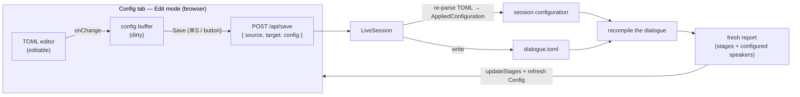

# Implementation note: Configuration tab — Live Edit

> [!NOTE]
> Status: **implemented**. This is **Stage 2a** of the Configuration tab: the
> project's `dialogue.toml` is **editable** in a served session. In Edit mode the
> Config tab's TOML is a real editor; **Save** writes the file and recompiles so every
> tab — the graphs *and* the Config tab's own configured speakers — refreshes. TOML
> **autocompletion** is the sibling Stage 2b, in its own note. Read the
> [Configuration Tab](./Configuration%20Tab.md) (Stage 1) and
> [Live Visualization — Live Edit](./Live%20Visualization%20-%20Live%20Edit.md)
> notes first; this one extends both.

## Table of contents

- [Goal and scope](#goal-and-scope)
- [The reframing: one compile, two editable inputs](#the-reframing-one-compile-two-editable-inputs)
- [Ubiquitous language](#ubiquitous-language)
- [Functionality checklist](#functionality-checklist)
- [Where it sits](#where-it-sits)
- [Interfaces and abstractions](#interfaces-and-abstractions)
- [Key design decisions](#key-design-decisions)
  - [DD1 — The config is a second editable input to the one dialogue compile](#dd1--the-config-is-a-second-editable-input-to-the-one-dialogue-compile)
  - [DD2 — One document is dirty at a time; navigation lock guarantees it](#dd2--one-document-is-dirty-at-a-time-navigation-lock-guarantees-it)
  - [DD3 — Save carries a target; the client owns which document is active](#dd3--save-carries-a-target-the-client-owns-which-document-is-active)
  - [DD4 — Saving the config re-parses it and recompiles the dialogue](#dd4--saving-the-config-re-parses-it-and-recompiles-the-dialogue)
  - [DD5 — Reuse the Live Edit surface, generalized to the active document](#dd5--reuse-the-live-edit-surface-generalized-to-the-active-document)
  - [DD6 — Configured speakers refresh on Save, not as you type](#dd6--configured-speakers-refresh-on-save-not-as-you-type)
- [Error and boundary cases](#error-and-boundary-cases)
- [Integration](#integration)
- [Testability](#testability)

## Goal and scope

Stage 1 shows the applied `dialogue.toml` read-only. Stage 2a closes the write loop
for it: in **Edit** mode the Config tab's left pane becomes a real TOML editor, and
**Save** (⌘/Ctrl-S or the button) writes `dialogue.toml` and **recompiles** — so the
graphs *and* the Config tab's own configured speakers reflect the new configuration.

**In scope (Stage 2a):**

- the Config TOML editor is **editable in Edit**, read-only in View — like the Source
  editor;
- typing marks the Config tab **dirty**, with the `beforeunload` guard and the
  **navigation lock** it already shares with the Source tab;
- **Save** writes `dialogue.toml`, recompiles the dialogue, and refreshes every tab
  (stages **and** the configured speakers); **Discard** restores the last saved TOML;
- the **server** gains a second **save target** (the config file) and re-parses the
  saved TOML into the configuration the session compiles with;
- the **client** gains a second **editable document** (the config buffer), reusing the
  existing dirty / Save / discard / nav-lock machinery.

**Out of scope:**

| Deferred to | What |
| --- | --- |
| **Stage 2b** (own note) | TOML **autocompletion** (reserved tag names, `[[speakers]]` / `name` / `id` / `tags` keys). |
| **Stage 3** (own note) | Editing when there is **no** `dialogue.toml` — the no-config state's *create a config file* flow. Stage 2a only edits an **existing** config file. |
| A later pass | **Preview-as-you-type** for the speakers (they refresh on Save — see [DD6](#dd6--configured-speakers-refresh-on-save-not-as-you-type)), and **watching** `dialogue.toml` for external hot-reload (deferred — Stage 2a stays edit-and-Save only). |

## The reframing: one compile, two editable inputs

The tempting mental model — "the session now has two documents" — is misleading. A
served session compiles exactly **one** thing: the **dialogue** script. The config is
not a second thing to compile; it is a second **input** to that one compile, shaping
its speaker table. So Stage 2a is better framed as:

> One dialogue compile, with **two editable inputs** — the dialogue source and the
> config source. Saving **either** input rewrites its file and recompiles the
> **dialogue**.

This reframing drives the design: there is still one recompile (of the dialogue), one
report, one View⇄Edit toggle, and one Save surface. What multiplies is only *which
file a Save writes* and *which buffer is dirty* — not the compile itself.

## Ubiquitous language

| Term | Meaning |
| --- | --- |
| **Editable document** | A file the session lets you edit and save: the **dialogue document** (the compile input) or the **config document** (`dialogue.toml`, a compile input that shapes speakers). |
| **Active document** | The editable document the toggle and Save currently act on — decided by the active tab (Source → dialogue, Config → config). |
| **Save target** | Which file a Save writes: `document` (the dialogue) or `config` (`dialogue.toml`). |
| **Recompile** | Re-running the **dialogue** compile after either input is saved, producing a fresh report (stages + configured speakers). |
| **Dirty** | An editable document has unsaved edits. At most **one** document is dirty at a time ([DD2](#dd2--one-document-is-dirty-at-a-time-navigation-lock-guarantees-it)). |

The word **document** stays reserved for the *dialogue* compile input, as it is today;
the config is always named the **config document** so the two never blur.

## Functionality checklist

- [x] In **Edit**, the Config tab's TOML is an editable CodeMirror; in **View** it is read-only — the same reconfigure-in-place editor the Source tab uses.
- [x] Editing the TOML marks the **Config tab dirty** (its own marker) and arms the `beforeunload` guard.
- [x] **Save** (⌘/Ctrl-S from any tab, or the Save button) writes `dialogue.toml`, recompiles the dialogue, refreshes the stages **and** the configured speakers, and clears dirty.
- [x] **Discard** restores the last saved TOML into the editor.
- [x] The **navigation lock** blocks leaving the Config tab while its TOML is dirty (save or discard first) — the same rule the dialogue already follows.
- [x] The **configured speakers** refresh on Save (a server recompile), not per keystroke; the stale pane is signposted while dirty.
- [x] Editing applies only when a `dialogue.toml` **exists**; the no-config state stays read-only (creation is Stage 3).
- [x] Save is a **force-overwrite** (the config file is not watched, so there is no self-save to suppress).

## Where it sits

Today `ServeMode` builds one `LiveSession(dialoguePath, mode, new
CompilationVisualizer(configuration))` and watches only the dialogue path
(`ServeMode.cs:59-62`). The configuration is read once at startup and baked into the
visualizer. Stage 2a lets a Save **replace** that configuration from the edited TOML
and recompile, and teaches the save route which file it is writing.

## Interfaces and abstractions

**Server (`DialogueDown.Visualization.Live`):**

| Type / route | Change | Why |
| --- | --- | --- |
| `POST /api/save` (`SaveRequest`) | gains a `Target` (`document` \| `config`), defaulting to `document`; the route dispatches to `Save` or `SaveConfig` and returns 400 on a config-parse failure | the route must know which file to write and how to recompile; the default keeps the dialogue save unchanged |
| `LiveSession` | learns the **config path** (from `AppliedConfiguration.File`) and gains `SaveConfig(source)` beside `Save(source)`; on a config save it re-parses the TOML and **rebuilds its `CompilationVisualizer`** with the new configuration, then recompiles the document | one session owns both editable inputs to its one compile; rebuilding the visualizer is simpler than mutating it and reuses the existing constructor |
| `TomlConfigurationLoader.Parse` | made **public** so the edited buffer parses in memory; `Visualization.Live` references the configuration loader (a clean edge — the loader stays a core-only leaf, so no cycle) | the server must turn the saved TOML into `CompilerOptions` without a disk round-trip |
| `ConfigurationFile` / `AppliedConfiguration` | reused as-is; a config save rebuilds them from the new TOML via `TomlConfigurationLoader.Parse` + `AppliedConfiguration.FromFile` | keep one parser and one applied-configuration model |

**Client (`web/src`):**

| Type | Change | Why |
| --- | --- | --- |
| `config-view.ts` (`createConfigView`) | an **editable** mode: `{ editable, onChange, onToggleFullscreen }` returning a handle with `setEditable` / `setContent` / `updateSpeakers` / `setStale`, mirroring `source-view.ts` | the config editor becomes a live editor, refreshes its speakers on save, and signposts staleness |
| `live-edit-ui.ts` | becomes a `portsFor(document)` factory over shared Save/Discard chrome: each document gets its own save `target`, dirty marker (its own tab), content sink, and post-save hook | one Save surface, one dirty concept, targeting whichever document is edited |
| `live-edit.ts` | **unchanged** — a second `createLiveEdit` instance is created for the config, each fed its document's ports | the single-document state machine already generalizes by instantiation, so no code change |
| `view-edit.ts` (`createModeController`) | flips **both** editors' editability and routes each editor's changes to its own state machine; leaving Edit discards whichever document is dirty | one View⇄Edit toggle drives both editors |
| `app.ts` / `main.ts` | `app.ts` exposes the config handle and per-tab dirty markers; `main.ts` builds the two `createLiveEdit` instances and a save/discard dispatcher over the active (dirty) document | the config joins the same edit loop; fixes a Stage 1 slip where the dialogue's dirty marker landed on the (now first) Config tab |

## Key design decisions

### DD1 — The config is a second editable input to the one dialogue compile

There is no second compile and no second report. A served session compiles the
dialogue; the config file is an input that shapes the speaker table. So Stage 2a adds
a second **editable input**, not a second document to visualize. Saving the config
re-parses `dialogue.toml`, replaces the configuration the session compiles with, and
**recompiles the dialogue** — yielding one fresh report whose stages and configured
speakers both reflect the change. This keeps one toggle, one report, and one recompile
path; only the *save target* and the *dirty buffer* multiply.

### DD2 — One document is dirty at a time; navigation lock guarantees it

The existing **navigation lock** already blocks leaving a tab while its editor is
dirty (`app.ts` tab-switch guard; `main.ts` `confirmNavigation`). Extending it so the
Config tab is also nav-locked while its TOML is dirty yields a strong invariant: **at
most one editable document is dirty at any moment.** You cannot edit the config while
the dialogue has unsaved edits, or vice versa — you must save or discard first.

That invariant removes the hardest part of a two-input editor: a Save never has to
reconcile two dirty buffers. Whenever the config is saved, the dialogue on disk equals
what the report shows, so the server safely recompiles the dialogue **from disk** with
the new config. No need to co-submit both buffers or diff them.

### DD3 — Save carries a target; the client owns which document is active

`POST /api/save` gains a `target` (`document` | `config`), defaulting to `document`
so the dialogue save is byte-for-byte unchanged. The **client** decides the target
from the active tab: Save on the Config tab targets `config`, Save on the Source tab
(or ⌘S from a graph tab while the dialogue is the dirty document) targets `document`.
One route, one Save button, one shortcut — the target is a field, not a second API.

### DD4 — Saving the config re-parses it and recompiles the dialogue

A config save writes `dialogue.toml` (force-overwrite), then rebuilds the session's
`AppliedConfiguration` from the new text with the **same** `TomlConfigurationLoader`
the CLI uses, **rebuilds the `CompilationVisualizer`** with it (simpler than mutating
it — the constructor already configures the compiler from the options), and recompiles
the dialogue. The save response is the same recompiled report the dialogue save
returns, so the client applies it the same way (`updateStages` plus refreshing the
Config tab's speakers).

Malformed TOML is handled like a broken dialogue save: the write is a force-overwrite,
and the recompile then surfaces a **`problem`** event (the loader's
`DialogueConfigurationException` message) while the edits stay in the buffer and the
report is not replaced. Mirroring the dialogue keeps one save behavior across both
inputs.

### DD5 — Reuse the Live Edit surface, generalized to the active document

Stage 2a adds **no new** Save button, dirty concept, discard flow, `beforeunload`
guard, or toggle. It generalizes the existing Live Edit surface from "the Source
buffer" to "the **active** editable document" without touching the state machine
(`live-edit.ts`): the shared chrome becomes a `portsFor(document)` factory in
`live-edit-ui.ts`, and each document is a second instance of the same
`createLiveEdit` machine, fed its own ports. The View⇄Edit toggle still flips the
whole report; the Save/dirty/discard UI follows whichever editor is active. The config
editor is a second instance of the same editable-CodeMirror seam (`source-view.ts`),
so it inherits the theme, gutter, selection, and read-only reconfiguration for free.

### DD6 — Configured speakers refresh on Save, not as you type

The Source tab re-renders its Markdown **preview** on every keystroke, entirely in the
browser. The Config tab **cannot** do the same for its right pane: resolving TOML into
configured speakers is .NET logic (`TomlConfigurationLoader` → `ConfiguredSpeaker`),
not shipped to the client. So while you type TOML, the editor updates but the speakers
pane is **stale** until Save recompiles.

To keep the staleness from ever surprising a writer, the speakers pane is
**signposted while the config is dirty**: a quiet inline hint (for example *"Unsaved
changes — save to refresh the speakers"*) marks the pane as out of date and tells the
reader that Save is what updates it. It is a calm cue, not an alarm, and it clears the
moment the recompiled report arrives. Preview-as-you-type would need either a
client-side TOML→speaker resolver or a debounced server "dry-run" compile; both are
deferred.

## Error and boundary cases

| Case | Behavior |
| --- | --- |
| **Malformed TOML on save** | The write is a force-overwrite; the recompile then fails to load the config, a `problem` event surfaces the loader's message, the buffer keeps the edits, and the report is not replaced (mirrors a broken dialogue save). |
| **Save config while the dialogue is dirty** | Cannot happen — the nav-lock ([DD2](#dd2--one-document-is-dirty-at-a-time-navigation-lock-guarantees-it)) requires the dialogue be saved or discarded before the Config tab can be edited. |
| **No `dialogue.toml` (no-config state)** | The editor stays read-only; there is nothing to save. Creating a config file is Stage 3. |
| **Config save that removes all speakers** | A valid compile with an empty speaker table; the speakers pane shows its empty-state note, as in Stage 1. |
| **External change to `dialogue.toml` on disk** | Not watched in Stage 2a — the config file is not hot-reloaded, so an external edit is not reflected until the next save or reload. Watching it (mirroring the dialogue's View-hot-reload / Edit-chip) is deferred. |

## Integration

- **View⇄Edit toggle** (`view-edit.ts`) flips both editors' editability; unchanged in
  shape, it now reconfigures the config editor too.
- **Live Edit UI** (`live-edit-ui.ts`, `live-edit.ts`) drives the dirty marker, Save,
  discard, and `beforeunload` for the active document; the Save POST carries the target.
- **Navigation lock** (`app.ts`, `main.ts`) extends to the config's dirty state.
- **Server** (`LiveSession`, `LiveVisualizationServer`, `ServeMode`) gains the config
  path, the `SaveConfig` path, and the `target`-aware save route; the recompile reuses
  `CompilationVisualizer` with a re-parsed `AppliedConfiguration`.

No compiler-core change: the core still only knows `CompilerOptions`. Stage 2a lives
entirely in the tooling layer, exactly like Stage 1.

## Testability

- **.NET unit** — `LiveSession` config-save writes `dialogue.toml`, re-parses it, and
  the recompiled payload carries the new configured speakers; a malformed TOML save
  yields a `problem` and leaves the report unchanged; the save route dispatches by target.
- **Web unit (vitest)** — `createConfigView` editable mode forwards edits via
  `onChange` and reconfigures read-only on `setEditable`; the config buffer's
  dirty/save/discard; the nav-lock reports dirty while the config has unsaved edits.
- **Live e2e (Playwright)** — toggle to Edit on the Config tab, edit the TOML, Save →
  the speakers pane refreshes with the change; the dirty marker and nav-lock block a
  tab switch until save/discard; Discard restores the saved TOML.
