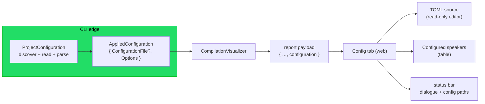

# Implementation note: Configuration tab

> [!NOTE]
> Status: **proposed** — a design draft, not yet implemented. This is **Stage 1**
> of the Configuration tab: a **read-only display** of the configuration a compile
> applied. It adds a first tab (before Source) that shows the project's
> `dialogue.toml` beside its resolved **configured speakers**, and surfaces the
> config file's path in the status bar. Editing the config and creating a new one
> are later stages with their own notes (see [Goal and scope](#goal-and-scope)).

## Table of contents

- [Goal and scope](#goal-and-scope)
- [Where it sits](#where-it-sits)
- [Ubiquitous language](#ubiquitous-language)
- [Functionality checklist](#functionality-checklist)
- [Interfaces and abstractions](#interfaces-and-abstractions)
- [Key design decisions](#key-design-decisions)
  - [DD1 — The report carries the applied configuration as a document](#dd1--the-report-carries-the-applied-configuration-as-a-document)
  - [DD2 — Config is the first tab, with a gear icon](#dd2--config-is-the-first-tab-with-a-gear-icon)
  - [DD3 — Reuse the source split: TOML left, configured speakers right](#dd3--reuse-the-source-split-toml-left-configured-speakers-right)
  - [DD4 — TOML highlighting via the official legacy-modes mode](#dd4--toml-highlighting-via-the-official-legacy-modes-mode)
  - [DD5 — A second status-bar path for the config file](#dd5--a-second-status-bar-path-for-the-config-file)
  - [DD6 — No config file is a first-class, friendly state](#dd6--no-config-file-is-a-first-class-friendly-state)
  - [DD7 — Read the state through intention-revealing predicates](#dd7--read-the-state-through-intention-revealing-predicates)
- [Error and boundary cases](#error-and-boundary-cases)
- [Integration](#integration)
- [Testability](#testability)

## Goal and scope

The report shows every compiler stage but never the **configuration** that shaped
them — the `dialogue.toml` that seeds configured speakers. A reader cannot see
which speakers the compile assumed, or even whether a config file was found. This
stage adds a **Configuration tab** that answers both: the raw `dialogue.toml` on
the left, its resolved configured speakers on the right, and the config file's path
in the status bar beside the dialogue file's.

**In scope (Stage 1 — read-only display):**

- a **first tab** named *Config*, before *Source*, with a gear icon;
- a two-column split: the `dialogue.toml` **source** (read-only, TOML-highlighted)
  on the left, the resolved **configured speakers** on the right;
- **two paths** in the status bar — the dialogue file and the config file;
- a friendly **no-config** state when the compile found no `dialogue.toml`;
- the **.NET seam** that carries the applied configuration (path, raw text, and
  resolved speakers) into the report payload, across the static, served, and
  launcher report modes.

**Out of scope — later stages, each with its own design note:**

| Stage | What |
| --- | --- |
| **2 — Editing** | the View⇄Edit toggle acts on the config buffer: edit the TOML with autocompletion, dirty state, navigation lock, and Save→recompile. This is the heavy one — today a served session has a *single* editable document (the dialogue file); the config file is a *second* editable document. |
| **3 — Create** | a call to action, when no `dialogue.toml` exists, that reuses the launcher's create-file flow to write one at the project root. |

Live-watching the config file for hot-reload is deferred to the editing stage.

## Where it sits

Configuration is resolved once, at the edge, then flows as a **document** (path +
raw text + resolved options) into the visualizer, which projects it into the report
payload the client renders. Discovery does not move: the CLI still finds the
nearest `dialogue.toml`; it just stops discarding the path and text.

Today the CLI resolves `CompilerOptions` and drops the path (`OptionsForScript` in
`VisualizeCommand.cs`); the visualizer never learns where the config came from or
what it said. This stage threads a small **applied configuration** through instead
of throwing that information away.

## Ubiquitous language

| Term | Meaning |
| --- | --- |
| **Applied configuration** | What a compile applied: an optional **configuration file** plus the resolved `CompilerOptions`. Always present when the report has a configuration context. |
| **Configuration file** | A found `dialogue.toml`: its **path** and its raw **source** text — always present together (a file has both) or absent together (no file). |
| **Configured speaker** | A speaker supplied by configuration (`ConfiguredSpeaker`): a name, an optional id, and custom/reserved tags. The resolved right-hand view. |
| **Config tab** | The first report tab: the applied configuration shown as TOML source beside its configured speakers. |
| **No-config state** | What the tab and status bar show when the compile found no `dialogue.toml`: the applied configuration has no file, so the compiler ran on its built-in defaults. |

The word **source** is overloaded: `Report.source` is the *dialogue* text; the
configuration file's `source` is the *TOML* text. They are always namespaced
(`report.source` vs `report.configuration.file.source`), never bare.

## Functionality checklist

- [ ] A **Config** tab appears first (before Source) with a gear icon and a tooltip; the report still opens on Source.
- [ ] Its left pane shows the `dialogue.toml` text in a **read-only**, TOML-highlighted editor.
- [ ] Its right pane lists the **configured speakers** (name, @id, tags), tags shown as chips **colored** to distinguish reserved from custom.
- [ ] The status bar shows **two** paths: the dialogue file and the config file.
- [ ] When no `dialogue.toml` was found, the tab shows a plain-language, writer-facing explanation, the speaker list is empty with a note, and the config path reads a no-config label — no error, no empty code block.
- [ ] The report payload carries a `configuration` section (optional `file` of path+source, plus speakers) in the static, served, and launcher modes.
- [ ] Existing tab-count assertions and snapshots are updated for the new first tab.

## Interfaces and abstractions

**.NET:**

| Type | Visibility | Responsibility | Collaborators |
| --- | --- | --- | --- |
| `AppliedConfiguration` | internal (Visualization) | the applied config: `ConfigurationFile? File`, `CompilerOptions Options`, and the `IsConfiguredFromFile` / `UsesDefaultConfiguration` predicates | `ConfigurationFile`, `CompilerOptions` |
| `ConfigurationFile` | internal (Visualization) | a found `dialogue.toml`: `Path`, `Source` (both required) | — |
| `ProjectConfiguration.ResolveApplied(...)` | public (CLI) | discover + read + parse into an `AppliedConfiguration` (parallels `Resolve`) | `TomlConfigurationLoader` |
| `ConfiguredSpeakerProjection` | internal (Visualization) | project `CompilerOptions.Speakers` → the display rows (name, id, tags with reserved/custom) | — |
| `CompilationVisualizer` render methods | public (Visualization) | accept the `AppliedConfiguration` and pass it to the payload | `DisplayGraphJson` |
| `DisplayGraphJson.SerializeReport/Document` | internal (Visualization) | add a `configuration` field to the payload | — |

**Web:**

| Type | Responsibility | Collaborators |
| --- | --- | --- |
| `ConfigReport` (in `model.ts`) | `{ file?: { path, source }, speakers: ConfiguredSpeakerView[] }` on `Report` | `Report` |
| `ConfiguredSpeakerView` | `{ name, id?, tags: { name, value?, reserved }[] }` | — |
| `createConfigView(config)` (`config-view.ts`) | build the split: read-only TOML editor + speakers table with colored tag chips | `initSplitDivider`, CodeMirror, `colorOf` |
| `addTab(..., icon?)` (`app.ts`) | gain an optional leading icon so Config shows a gear | — |
| `initPathDisplay` / footer | show a second (config) path | `path-display.ts` |

## Key design decisions

### DD1 — The report carries the applied configuration as a document

The visualizer is *told* the applied configuration; it does not re-discover it. The
CLI, which already resolves `CompilerOptions`, also keeps the **path** and the raw
**text** it read and bundles them into an `AppliedConfiguration { ConfigurationFile?
File, CompilerOptions Options }`, where `ConfigurationFile { string Path, string
Source }` holds both values **together and non-null**. That travels through the
render methods into a new `configuration` field on the payload.

The two levels of optionality each name exactly one domain fact, so no illegal state
is representable:

- `AppliedConfiguration` **absent** from the payload → the report has no
  configuration context at all (a bare library render) → **no Config tab**.
- `AppliedConfiguration.File` **null** (`UsesDefaultConfiguration`) → there *is* a
  context but no `dialogue.toml` was found → the **no-config state**
  ([DD6](#dd6--no-config-file-is-a-first-class-friendly-state)); `Options` is still present (the defaults).
- `File` **present** (`IsConfiguredFromFile`) → a real file, so path and source are
  **both** there — grouping them kills the "path without source" combination a pair
  of nullables would allow.

The types live in **`DialogueDown.Visualization`**, not the engine-agnostic core:
they carry a file path and raw TOML text — tooling concerns the core deliberately
avoids (it has no TOML dependency and no file paths). The CLI already references the
visualization layer, so it builds the applied configuration there.

### DD2 — Config is the first tab, with a gear icon

The tab is inserted before Source in `build()`. `addTab` gains an optional leading
**icon** (a Feather `settings` gear, matching the report's existing Feather icons);
Source and stage tabs pass none, so they are unchanged. Config is first in **order**
but **not** the default-active tab — the report still opens on **Source**, so a
reader who just wants the dialogue is undisturbed, and the config is one click away.

### DD3 — Reuse the source split: TOML left, configured speakers right

The Config tab is the same two-column shape as the Source tab, so it reuses the
split machinery: `initSplitDivider` for the draggable divider and the same layout
variables. A dedicated `config-view.ts` builds a **read-only** CodeMirror on the
left (the config is display-only this stage) and, on the right, a **configured
speakers** table that reuses the Semantic tab's `.table-panel` / `.semantic-table`
styling so the two "resolved semantics" views read as one visual language.

The table columns are **Name · @id · Tags**. Unlike the Semantic tab — which joins
tags into one plain-text cell and spends a whole column on the `default` flag — the
config table renders each tag as a small **chip**, colored to tell **reserved** tags
(like `default`) from **custom** ones at a glance. Reserved chips take a distinct
accent; custom chips take the neutral `tag` palette color. Because chips need
per-tag markup rather than a plain-text cell, the speakers table is a small,
dedicated renderer sharing the table CSS, not a raw `createTablePanel` call.

### DD4 — TOML highlighting via the official legacy-modes mode

TOML highlighting uses **`@codemirror/legacy-modes/mode/toml`** wrapped in
`StreamLanguage.define(...)`. It is the official CodeMirror family package (MIT),
minimal, and sufficient for a config file; there is no official Lezer `lang-toml`,
and community grammars are less maintained. This is the one new web dependency.

### DD5 — A second status-bar path for the config file

The footer today shows one document path (`#doc-path`). Config adds a **second**
path entry for the `dialogue.toml`, built from the same `path-display` helper
(directory ellipsised, filename always shown, click-to-copy, hover for the full
path), so both paths read and behave identically. When there is no config file, the
config path shows a no-config label rather than a real path.

### DD6 — No config file is a first-class, friendly state

A missing `dialogue.toml` is completely normal — most scripts don't need one — so
the tab treats it as an ordinary state, not an error, and explains it in a writer's
terms. Everything degrades from one signal: `AppliedConfiguration.File` is null.

- The left pane shows a short, plain-language explanation instead of an empty code
  block — what happened and what a config file would give them, for example: *"This
  project has no `dialogue.toml`, so your script compiled with the built-in defaults.
  Add one to declare speakers that every script can use — their ids, tags, and a
  default speaker."*
- The right pane shows an empty configured-speakers table with a matching note
  (*"No configured speakers yet."*).
- The status bar's config path shows a plain label such as *"No config file"* rather
  than a broken path.

The wording is writer-facing and explanatory, never jargon like "config not
specified". Stage 3 turns the left pane's explanation into an actionable *create a
config file* call to action.

### DD7 — Read the state through intention-revealing predicates

Call sites never poke at `File is null` directly. `AppliedConfiguration` exposes
named predicates that say what the state *means*, so the two states read the same
everywhere and the nullable field stays an implementation detail:

- `IsConfiguredFromFile` — a `dialogue.toml` was found and applied (`File` present);
- `UsesDefaultConfiguration` — none was found, so the compile ran on the built-in
  defaults (the no-config state).

The web side mirrors them with small predicate helpers (for example
`isConfiguredFromFile(configuration)`), so neither the .NET renderer nor the client
scatters raw null checks. This keeps the "is there a config file?" decision in one
named place and lets the field shape change without touching every reader.

## Error and boundary cases

| Case | Behavior |
| --- | --- |
| **No `dialogue.toml` found** | `UsesDefaultConfiguration` holds; the tab still shows (defaults applied) and renders the no-config state ([DD6](#dd6--no-config-file-is-a-first-class-friendly-state)). |
| **Config file present but empty / no `[[speakers]]`** | `File` is present (real path + text), so the left shows the file text; the right shows an empty speakers table with a note. Distinct from *no file*: there is a real config path. |
| **Config file with speakers** | Left shows the TOML; right lists each configured speaker with its @id and colored tag chips. |
| **Malformed TOML** | The loader already throws `DialogueConfigurationException` before a report is built, so a broken config fails the compile up front — out of scope for this display stage (a later stage may surface it inline). |
| **Served in-memory session (no dialogue path)** | A configuration context still exists, so the Config tab shows — with the no-config state when there is no file. |
| **Bare library render (no configuration context)** | No `AppliedConfiguration`, so no `configuration` payload and no Config tab — the same rule as the optional Source tab. |

## Integration

- **CLI (`VisualizeCommand`)** builds an `AppliedConfiguration` from
  `ProjectConfiguration` and passes it into every report path (`RunStatic`,
  `RunServedAsync`, launcher), replacing the bare `CompilerOptions` hand-off.
- **`CompilationVisualizer`** render/serialize methods take the applied
  configuration and add a `configuration` field to the payload via `DisplayGraphJson`.
- **Web `main.ts`/`app.ts`** read `report.configuration`, build the Config tab
  first, and add the second status path.
- **Later stages** build on this seam: editing (Stage 2) makes the left editor
  writable and adds a config Save target; create (Stage 3) uses the no-config
  state's call to action.

No compiler-core change: the core still knows only `CompilerOptions`. The path and
raw text live entirely in the tooling layer.

## Testability

- **.NET unit** — `ProjectConfiguration.ResolveApplied` returns the right applied
  configuration for: an explicit `--config`, a discovered `dialogue.toml` (a `File`
  with matching path + text), and nothing found (`File` null, `CompilerOptions.Default`).
  The configured-speaker projection maps names, ids, and custom/reserved tags. Payload
  serialization includes `configuration` when present and omits it when absent, and the
  `file` when present.
- **Web unit (vitest)** — `createConfigView` renders the TOML text read-only and the
  speakers table with reserved-vs-custom chip colors; the no-config state renders the
  explanatory message and an empty table; the second path shows and, when the file is
  absent, the no-config label.
- **Static e2e (Playwright)** — the Config tab is first, has the gear icon, shows the
  TOML and speakers, and shows both paths; a no-config fixture shows the friendly
  state; the report still opens on Source. Existing tab-count assertions move from 2→3
  (static) and 5→6 (live/launcher).
- Construction goes through the existing object-mother/fixture helpers so a shape
  change touches one place.
