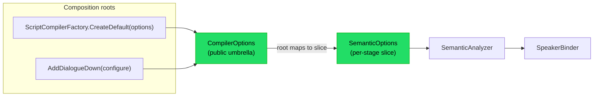

# Implementation note: Configuration

> [!IMPORTANT]
> Status: **approved — implementation in progress**. Configuration is a
> **cross-cutting concern**: the seam through which a consumer tunes how DialogueDown
> compiles a script, without editing the script itself. This note establishes the
> seam and its first knob — a **configured default speaker** — and lists the further
> knobs it will grow to carry.

## Table of contents

- [Implementation note: Configuration](#implementation-note-configuration)
  - [Table of contents](#table-of-contents)
  - [Goal and scope](#goal-and-scope)
  - [Where it sits](#where-it-sits)
  - [Ubiquitous language](#ubiquitous-language)
  - [Functionality checklist](#functionality-checklist)
  - [Interfaces and abstractions](#interfaces-and-abstractions)
  - [Key design decisions](#key-design-decisions)
    - [DD1 — A plain immutable options record, not `IOptions<T>`](#dd1--a-plain-immutable-options-record-not-ioptionst)
    - [DD2 — A `Configuration` foundation namespace](#dd2--a-configuration-foundation-namespace)
    - [DD3 — Per-stage option slices, mapped by the root](#dd3--per-stage-option-slices-mapped-by-the-root)
    - [DD4 — Default-speaker precedence, and a unified configured default](#dd4--default-speaker-precedence-and-a-unified-configured-default)
  - [Error and boundary cases](#error-and-boundary-cases)
  - [Integration](#integration)
  - [Testability](#testability)
  - [Deferred knobs](#deferred-knobs)
  - [Configuration format (deferred)](#configuration-format-deferred)

## Goal and scope

Today every default is hardcoded in the two composition roots
(`ScriptCompilerFactory.CreateDefault` and the `AddDialogueDown` DI registration),
so a consumer cannot tune the compiler without swapping a whole pipeline stage.
This component introduces a **configuration seam** — an immutable **`CompilerOptions`**
umbrella that the composition roots map into small **per-stage option slices**, each
handed to the one stage that reads it — and proves it with one real knob.

**First knob — a configured default speaker.** A consumer may name a **fallback
default speaker** (for example, `"Narrator"`). When a script declares no in-file
default, speakerless lines resolve to that speaker instead of the anonymous one.

**In scope:** the `CompilerOptions` umbrella and its first slice (`SemanticOptions`),
both composition roots mapping the umbrella into that slice for the semantic analyzer,
and the configured-default-speaker behavior with its precedence. **Out of scope
(deferred, tracked as issues):** every other knob the survey surfaced — DSL syntax
tokens, the Markdig pipeline, slug normalization, the live server, the CLI, and a
config-provided **speaker registry** (see [Deferred knobs](#deferred-knobs)).
Reading options from a file is an application concern left to the consumer; the core
stays binding-agnostic. The project's config format is settled as **TOML**
(`dialogue.toml`) — see [Configuration format](#configuration-format-deferred) — but the
loader that reads it is a separate, future component.

## Where it sits

Configuration is not a pipeline stage; it is a value the composition roots build and
hand to the stages.



`CompilerOptions` and its slices live in a new **`DialogueDown.Configuration`**
foundation namespace (a dependency leaf, like `Common`), so both the semantic analyzer
(upstream) and the compilation orchestrator (downstream) may depend on them without
breaking the core's one-directional layering — a boundary an architecture test guards
(see [Integration](#integration)).

## Ubiquitous language

| Term                           | Meaning                                                                                                          |
| ------------------------------ | ---------------------------------------------------------------------------------------------------------------- |
| **Compiler options**           | The immutable `CompilerOptions` value that configures one compile; carries the knobs and sensible defaults.      |
| **Option slice**               | A small per-stage options value (e.g. `SemanticOptions`) the umbrella maps to, so a stage sees only its knobs.   |
| **Configured default speaker** | A default-speaker **name** supplied through `CompilerOptions`, used when the script declares no in-file default. |
| **In-file default**            | A speaker the script itself marks default with the reserved `##default` tag.                                     |
| **Anonymous default**          | The nameless fallback speaker the binder synthesizes when nothing else names a default (today's behavior).       |
| **Default-speaker precedence** | The order the binder picks the default: **in-file `##default` › configured default › anonymous**.                |

## Functionality checklist

- [ ] A **`CompilerOptions`** immutable umbrella record carries the compiler's knobs
      with sensible defaults and a shared `Default` instance.
- [ ] The umbrella maps to a per-stage **`SemanticOptions`** slice, so the analyzer
      depends only on the knobs it uses.
- [ ] Both composition roots accept options:
      `ScriptCompilerFactory.CreateDefault(CompilerOptions?)` and `AddDialogueDown`
      (both an `Action<CompilerOptions>` and a direct `CompilerOptions` overload),
      defaulting to `CompilerOptions.Default`.
- [ ] The root hands the **`SemanticAnalyzer`** its slice, which passes the configured
      default speaker to the **`SpeakerBinder`**.
- [ ] An **architecture test** asserts `DialogueDown.Configuration` is a foundation
      leaf with no dependency on other core layers.
- [ ] With **no `##default` and a configured default name**, speakerless lines resolve
      to a named default speaker; if that name also appears in the script, they are the
      **same speaker** (unified, referable).
- [ ] With **no `##default` and no configured default**, the **anonymous default**
      still applies (unchanged behavior).
- [ ] An **in-file `##default` always wins** over a configured default.
- [ ] A blank or whitespace-only configured name is treated as **unset** (anonymous).

## Interfaces and abstractions

| Type                    | Visibility | Responsibility                                                                                                       | Collaborators                         |
| ----------------------- | ---------- | -------------------------------------------------------------------------------------------------------------------- | ------------------------------------- |
| `CompilerOptions`       | public     | immutable options umbrella: `DefaultSpeakerName` (nullable), a `Default` instance, and a mapping to each stage slice | composition roots, option slices      |
| `SemanticOptions`       | internal   | the per-stage slice the analyzer reads (the configured default-speaker name)                                         | `CompilerOptions`, `SemanticAnalyzer` |
| `ScriptCompilerFactory` | public     | `CreateDefault(CompilerOptions? options = null)` maps the umbrella to each stage's slice                             | `CompilerOptions`, stages             |
| `AddDialogueDown`       | public     | `AddDialogueDown(Action<CompilerOptions>?)` and `AddDialogueDown(CompilerOptions)` build and register options        | `CompilerOptions`, stages             |
| `SemanticAnalyzer`      | internal   | reads its `SemanticOptions` slice, passes the configured default to the binder                                       | `SemanticOptions`, `SpeakerBinder`    |
| `SpeakerBinder`         | internal   | applies default-speaker precedence when choosing the default                                                         | `SpeakerSymbol`                       |

`CompilerOptions` is **public** because it is the consumer-facing contract; the slices
and the stages that read them stay internal.

## Key design decisions

### DD1 — A plain immutable options record, not `IOptions<T>`

`CompilerOptions` is a plain immutable `record` in the core (the public umbrella over
the per-stage slices in [DD3](#dd3--per-stage-option-slices-mapped-by-the-root)), not
`Microsoft.Extensions.Options`. This is the documented best practice for reusable
libraries: an engine consumer (Godot, a test, a console tool) uses it with **no DI
container and no forced `Microsoft.Extensions.Options` dependency**, while the
`AddDialogueDown` extension remains an optional adapter that can bind
`IConfiguration` for app consumers. The core exposes only its own contract and leaks
no third-party abstraction.

### DD2 — A `Configuration` foundation namespace

`CompilerOptions` and its slices live in `DialogueDown.Configuration`, a new
**dependency leaf** (no dependency on other core layers), because both the semantic
analyzer (upstream) and the compilation orchestrator (downstream) must read it. Placing
it in `Compilation` would force `Semantics` to depend on `Compilation` — a backward
dependency the core-layering architecture tests forbid. A dedicated namespace (over
folding it into the `Common` grab-bag) names the cross-cutting concern and gives the
deferred knobs a home.

### DD3 — Per-stage option slices, mapped by the root

Each stage receives its **own small options slice**, not the whole umbrella. The public
`CompilerOptions` maps to an internal per-stage value — here `SemanticOptions`, carrying
just the configured default-speaker name — and the composition root hands each stage
only its slice. A stage's constructor therefore names exactly the knobs it depends on
(interface segregation): the analyzer takes `SemanticOptions`, never sees an unrelated
Markdig or CLI knob, and cannot accidentally couple to one.

The alternative — passing the whole `CompilerOptions` to every stage — is simpler by
one type but lets any stage read any knob and carries the whole bag as tramp data. A
third option, an **ambient/global** configuration context (the build-system style), was
rejected outright: it hides dependencies and defeats test isolation, against this repo's
"clean and isolated over global mutation" grain. Slices keep configuration **explicit**
and each stage's surface honest, with the mapping in one place (the umbrella and the
root), so adding a stage's knob stays a local change.

### DD4 — Default-speaker precedence, and a unified configured default

The binder chooses the default speaker in this order: an **in-file `##default`**, else
the **configured default**, else the **anonymous** default. A configured name that
also appears in the script resolves to the **same speaker symbol** (it is referable
and unified), so `Narrator: Hi` lines and speakerless lines share one identity — a
name denotes one speaker (DDD). A configured name absent from the script becomes an
**implicit named speaker** used only as the default. This slots cleanly into the
binder's existing `Build()` step, which already falls back
`_defaultSpeaker ?? anonymous`; the configured default simply sits between those two.

## Error and boundary cases

| Case                                                | Behavior                                                                             |
| --------------------------------------------------- | ------------------------------------------------------------------------------------ |
| `DefaultSpeakerName` null / empty / whitespace      | treated as unset → anonymous default (unchanged).                                    |
| Configured default, name **not** in the script      | an implicit named default speaker is used for speakerless lines.                     |
| Configured default, name **is** in the script       | unified with that speaker; it becomes the default (referable).                       |
| Configured default **and** an in-file `##default`   | the in-file default wins; the configured name is ignored.                            |
| Configured default plus the usual speaker conflicts | conflict rules are unchanged; the default choice does not bypass the name invariant. |
| `null` options passed to a composition root         | falls back to `CompilerOptions.Default` (no configured default).                     |

## Integration

- **Core** (`DialogueDown`): a new `DialogueDown.Configuration` namespace holds
  `CompilerOptions` and its `SemanticOptions` slice. The `SemanticAnalyzer` gains a
  `SemanticOptions` parameter (defaulting to the slice of `CompilerOptions.Default`,
  preserving its current construction) and passes the configured default speaker to
  `SpeakerBinder.Bind`.
- **Composition roots**: `ScriptCompilerFactory.CreateDefault(CompilerOptions?)` and
  `AddDialogueDown` (an `Action<CompilerOptions>` and a direct `CompilerOptions`
  overload) build the umbrella and map it to each stage's slice; both keep
  parameterless overloads that use `CompilerOptions.Default`.
- **Architecture tests**: a `Configuration_IsAFoundationLeaf` test asserts the
  namespace has no dependency on other core layers, mirroring the `Common` layering
  test.
- **CLI / visualization** (later): a `--default-speaker` option and server knobs can
  map onto `CompilerOptions` once those deferred knobs land.

## Testability

- **`CompilerOptions`**: unit-test the defaults, `Default` instance, blank-name
  normalization, and the mapping to the `SemanticOptions` slice.
- **`SpeakerBinder`**: the four precedence cases each get a test — in-file default
  wins; configured default when no in-file; unified when the configured name is in the
  script; anonymous when neither is present.
- **`SemanticAnalyzer`**: one test that the slice reaches the binder (the configured
  default appears in the resolved model).
- **Composition roots**: a test that `CreateDefault(options)` and a configured
  `AddDialogueDown` produce a compiler whose model honors the configured default,
  over the real pipeline.
- **Architecture**: the `Configuration_IsAFoundationLeaf` test above.
- Construction goes through the shared test factory; inputs are multi-line raw string
  literals so the parsed shape is visible.

## Deferred knobs

The survey surfaced further knobs; each becomes its own later component and a tracked
issue rather than riding in this seam:

| Knob                                                      | Where                                 | Note                                                                                                                                                                                                                                                                 |
| --------------------------------------------------------- | ------------------------------------- | -------------------------------------------------------------------------------------------------------------------------------------------------------------------------------------------------------------------------------------------------------------------- |
| Config-provided **speaker registry** (ex-`speakers.json`) | `SemanticOptions`, binder             | Generalizes this component's configured default: config supplies named/`@id`'d speakers the binder treats as declared, inline as `[[speakers]]` in `dialogue.toml`, with the default flagged `default = true`. The plain default-name knob composes forward into it. |
| Configurable `##default` **tag name**                     | `ReservedTagNames`, binder, validator | Reserved-tag vocabulary; a natural next step on this same seam.                                                                                                                                                                                                      |
| Missing-default **strict mode** (error vs anonymous)      | binder                                | An authoring-strictness policy.                                                                                                                                                                                                                                      |
| DSL **syntax tokens** (`@`, `:`, `=>`, `#`/`##`)          | parser, tokenizer                     | Deep and risky; touches the grammar.                                                                                                                                                                                                                                 |
| **Markdig** pipeline features                             | Markdown front-end                    | Front-end parser options.                                                                                                                                                                                                                                            |
| **Slug** normalization (trim/collapse)                    | `Slug`                                | Anchor policy.                                                                                                                                                                                                                                                       |
| Live-server **port / host / debounce**                    | `DialogueDown.Visualization.Live`     | A different assembly's settings.                                                                                                                                                                                                                                     |
| **CLI** output paths / defaults                           | `DialogueDown.Cli`                    | Command-layer policy.                                                                                                                                                                                                                                                |

## Configuration format (deferred)

The **format** for reading these knobs from disk is already settled as **TOML** — a
`dialogue.toml` at the project root, decided in the
[Unmodeled Markdown Handling](./Unmodeled%20Markdown%20Handling.md#configuration-format)
note (explicit `[section]` headers, comments, a published standard, first-class .NET
parsing via Tomlyn). This component adds no loader: it keeps the core binding-agnostic
and takes a `CompilerOptions` object directly. The loader that reads `dialogue.toml`
and builds `CompilerOptions` is a separate, future component.

When it lands, the deferred speaker registry lives **inline** as a `[[speakers]]`
array-of-tables (no separate speakers file for now — a referenced file can be added later
if casts grow). The **default speaker is one registry entry flagged `default = true`**:

```toml
# dialogue.toml

[[speakers]]
name    = "Narrator"
id      = "narrator"
default = true          # the default speaker — at most one, as with in-script ##default

[[speakers]]
name = "Alice"
id   = "A"
tags = ["main"]
```

A `default = true` flag keeps every speaker in **one registry** (a name denotes one
speaker), marks the default with a **typed** field rather than a stringly-typed
`##default` tag or a separate name reference, and leaves `tags` for plain content tags. It
carries the same "at most one default" rule as the in-script `##default`, enforced by the
loader. Because the default is itself a registry speaker, it is inherently referable and
unified (per [DD4](#dd4--default-speaker-precedence-and-a-unified-configured-default)).

Today's `DefaultSpeakerName` knob is the **degenerate, registry-less case** — a bare
default name with no `@id` or tags — and composes forward: once the registry lands, the
default resolves from the `default = true` entry instead. This supersedes the earlier
`speakers.json` sketch in the language guide, which a later doc pass should reconcile.
