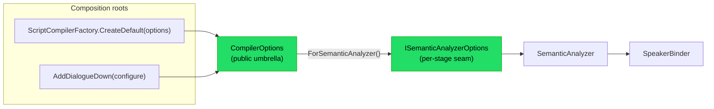

# Implementation note: Configuration

> [!IMPORTANT]
> Status: **implemented**. Configuration is a
> **cross-cutting concern**: the seam through which a consumer tunes how DialogueDown
> compiles a script, without editing the script itself. This note establishes the
> seam and its first knob — a **configured speaker registry**, whose default is one
> entry marked with the reserved default tag — and lists the further knobs it will
> grow to carry.

## Table of contents

- [Implementation note: Configuration](#implementation-note-configuration)
  - [Table of contents](#table-of-contents)
  - [Goal and scope](#goal-and-scope)
  - [Where it sits](#where-it-sits)
  - [Ubiquitous language](#ubiquitous-language)
  - [Functionality checklist](#functionality-checklist)
  - [Interfaces and abstractions](#interfaces-and-abstractions)
  - [Key design decisions](#key-design-decisions)
    - [DD1 — A plain immutable options record, not `IOptions<T>`](#dd1--a-plain-immutable-options-record-not-ioptionst)
    - [DD2 — A `Configuration` foundation namespace](#dd2--a-configuration-foundation-namespace)
    - [DD3 — Per-stage options behind an interface seam](#dd3--per-stage-options-behind-an-interface-seam)
    - [DD4 — A configured speaker registry with layered default precedence](#dd4--a-configured-speaker-registry-with-layered-default-precedence)
    - [DD5 — Configured speakers as edge data, bridged to the AST](#dd5--configured-speakers-as-edge-data-bridged-to-the-ast)
  - [Error and boundary cases](#error-and-boundary-cases)
  - [Integration](#integration)
  - [Testability](#testability)
  - [Deferred knobs](#deferred-knobs)
  - [Configuration format](#configuration-format)

## Goal and scope

Today every default is hardcoded in the two composition roots
(`ScriptCompilerFactory.CreateDefault` and the `AddDialogueDown` DI registration),
so a consumer cannot tune the compiler without swapping a whole pipeline stage.
This component introduces a **configuration seam** — an immutable **`CompilerOptions`**
umbrella that the composition roots separate into a small **per-stage options view**,
handed to the one stage that reads it — and proves it with one real knob.

**First knob — a configured speaker registry.** A consumer may supply speakers
(`CompilerOptions.Speakers`) the compiler binds alongside a script's own. One entry may
carry the reserved **default** tag; when a script declares no in-file default,
speakerless lines resolve to that configured default instead of the anonymous one, and
a configured speaker whose name also appears in the script is the **same speaker**.

**In scope:** the `CompilerOptions` umbrella (a `Speakers` registry), the
`ISemanticAnalyzerOptions` seam it exposes, both composition roots threading the
umbrella into the semantic analyzer, and the configured-speaker binding with
default-speaker precedence. **Out of scope (deferred, tracked as issues):** every other
knob the survey surfaced — DSL syntax tokens, the Markdig pipeline, slug normalization,
the live server, and the CLI (see [Deferred knobs](#deferred-knobs)). Reading options
from a file is handled by the separate
[configuration loader](./Configuration%20Loader.md); the core stays binding-agnostic and
takes a `CompilerOptions` directly. The project's config format is settled as **TOML**
(`dialogue.toml`) — see [Configuration format](#configuration-format).

## Where it sits

Configuration is not a pipeline stage; it is a value the composition roots build and
hand to the stages.



`CompilerOptions` and the per-stage options it exposes live in a new
**`DialogueDown.Configuration`** foundation namespace (a dependency leaf, like
`Common`), so both the semantic analyzer (upstream) and the compilation orchestrator
(downstream) may depend on them without breaking the core's one-directional layering — a
boundary an architecture test guards (see [Integration](#integration)).

## Ubiquitous language

| Term                           | Meaning                                                                                                                      |
| ------------------------------ | ---------------------------------------------------------------------------------------------------------------------------- |
| **Compiler options**           | The immutable `CompilerOptions` value that configures one compile; carries the configured `Speakers` and defaults.           |
| **Per-stage options**          | A small per-stage view (`ISemanticAnalyzerOptions`) the umbrella exposes, so a stage sees only the options it reads.         |
| **Configured speaker**         | A speaker supplied through `CompilerOptions.Speakers` (a `ConfiguredSpeaker`) the binder seeds alongside a script's own.     |
| **Configured default**         | The one configured speaker marked with the reserved `default` tag; the fallback when the script declares no in-file default. |
| **In-file default**            | A speaker the script itself marks default with the reserved `##default` tag.                                                 |
| **Anonymous default**          | The nameless fallback speaker the binder synthesizes when nothing else names a default (today's behavior).                   |
| **Default-speaker precedence** | The order the binder picks the default: **in-file `##default` › configured default › anonymous**.                            |

## Functionality checklist

- [x] A **`CompilerOptions`** immutable umbrella record carries the configured
      `Speakers` with a shared `Default` instance.
- [x] The umbrella exposes a per-stage **`ISemanticAnalyzerOptions`** view
      (`ForSemanticAnalyzer()`), so the analyzer depends only on the options it uses.
- [x] Both composition roots accept options:
      `ScriptCompilerFactory.CreateDefault(CompilerOptions?)` and
      `AddDialogueDown(this IServiceCollection, CompilerOptions?)`, defaulting to
      `CompilerOptions.Default`.
- [x] The root constructs the **`SemanticAnalyzer`** from that view; the analyzer seeds
      the **`SpeakerBinder`**'s configured layer with the configured speakers.
- [x] An **architecture test** asserts `DialogueDown.Configuration` is a foundation
      leaf with no dependency on other core layers.
- [x] With **no `##default` and a configured default**, speakerless lines resolve to
      that speaker; if its name also appears in the script, they are the **same
      speaker** (unified, referable).
- [x] With **no `##default` and no configured default**, the **anonymous default**
      still applies (unchanged behavior).
- [x] An **in-file `##default` always wins** over a configured default.

## Interfaces and abstractions

| Type                       | Visibility | Responsibility                                                                                           | Collaborators                                 |
| -------------------------- | ---------- | -------------------------------------------------------------------------------------------------------- | --------------------------------------------- |
| `CompilerOptions`          | public     | immutable options umbrella: the configured `Speakers`, a `Default` instance, and `ForSemanticAnalyzer()` | composition roots, `ISemanticAnalyzerOptions` |
| `ConfiguredSpeaker`        | public     | a config-supplied speaker: name, optional id, and tags partitioned into custom and reserved              | `CompilerOptions`, `ConfiguredTag`            |
| `ConfiguredTag`            | public     | a config tag: a name and optional value, serving a custom or reserved tag                                | `ConfiguredSpeaker`                           |
| `ReservedTagNames`         | public     | the closed vocabulary of reserved tag names (`default`, …) that config validates against                 | loader, binder, tag validator                 |
| `ISemanticAnalyzerOptions` | internal   | the per-stage view the analyzer reads (the configured speakers)                                          | `CompilerOptions`, `SemanticAnalyzer`         |
| `SemanticAnalyzerOptions`  | internal   | the default `ISemanticAnalyzerOptions` over the configured speakers                                      | `CompilerOptions`                             |
| `ScriptCompilerFactory`    | public     | `CreateDefault(CompilerOptions? = null)` wires the stages from the options                               | `CompilerOptions`, stages                     |
| `AddDialogueDown`          | public     | `AddDialogueDown(this IServiceCollection, CompilerOptions? = null)` registers the stages                 | `CompilerOptions`, stages                     |
| `SemanticAnalyzer`         | internal   | constructed from `ISemanticAnalyzerOptions`; seeds the binder's configured layer                         | `ISemanticAnalyzerOptions`, `SpeakerBinder`   |
| `ConfiguredSpeakerBuilder` | internal   | bridges a `ConfiguredSpeaker` to the AST `SpeakerDeclaration` the binder consumes                        | `ConfiguredSpeaker`, `SpeakerDeclaration`     |
| `SpeakerBinder`            | internal   | binds configured and script speakers in two layers with default precedence                               | `SpeakerSymbol`                               |

`CompilerOptions`, `ConfiguredSpeaker`, `ConfiguredTag`, and `ReservedTagNames` are
**public** — the consumer-facing contract and the shared reserved-tag vocabulary; the
per-stage view and the stages that read it stay internal.

## Key design decisions

### DD1 — A plain immutable options record, not `IOptions<T>`

`CompilerOptions` is a plain immutable `record` in the core (the public umbrella over
the per-stage view in [DD3](#dd3--per-stage-options-behind-an-interface-seam)), not
`Microsoft.Extensions.Options`. This is the documented best practice for reusable
libraries: an engine consumer (Godot, a test, a console tool) uses it with **no DI
container and no forced `Microsoft.Extensions.Options` dependency**, while the
`AddDialogueDown` extension remains an optional adapter that can bind
`IConfiguration` for app consumers. The core exposes only its own contract and leaks
no third-party abstraction.

### DD2 — A `Configuration` foundation namespace

`CompilerOptions` and the per-stage options it exposes live in
`DialogueDown.Configuration`, a new **dependency leaf** (no dependency on other core
layers), because both the semantic analyzer (upstream) and the compilation orchestrator
(downstream) must read it. Placing it in `Compilation` would force `Semantics` to depend
on `Compilation` — a backward dependency the core-layering architecture tests forbid. A
dedicated namespace (over folding it into the `Common` grab-bag) names the cross-cutting
concern and gives the deferred knobs a home.

### DD3 — Per-stage options behind an interface seam

Each stage receives its **own small options view**, not the whole umbrella. The public
`CompilerOptions` exposes an internal per-stage seam — here `ISemanticAnalyzerOptions`,
carrying just the configured speakers — through `ForSemanticAnalyzer()`, and the
composition root constructs each stage from its view. A stage's constructor therefore
names exactly the options it depends on (interface segregation): the analyzer takes
`ISemanticAnalyzerOptions`, never sees an unrelated Markdig or CLI knob, and cannot
accidentally couple to one. Making the view an **interface** (over a concrete slice
record) adds a seam the analyzer's tests mock directly, keeping the analyzer unaware of
`CompilerOptions` entirely.

The alternative — passing the whole `CompilerOptions` to every stage — is simpler by
one type but lets any stage read any knob and carries the whole bag as tramp data. An
**ambient/global** configuration context (the build-system style) was rejected
outright: it hides dependencies and defeats test isolation, against this repo's "clean
and isolated over global mutation" grain. The seam keeps configuration **explicit** and
each stage's surface honest, with the mapping in one place (the umbrella's
`ForSemanticAnalyzer`), so adding a stage's view stays a local change.

### DD4 — A configured speaker registry with layered default precedence

Configuration supplies a **registry** of speakers, not a bare default name. The binder
binds them in **two layers** — the configured speakers first, then the script's own —
sharing one name/`@id` map, so a configured speaker whose name also appears in the
script converges on a **single identity** (a name denotes one speaker, DDD). The
default is chosen by **layer precedence**: an **in-file `##default`** wins, else the
**configured default** (the configured speaker marked with the reserved `default` tag),
else the **anonymous** fallback — the configured layer's default sitting between the
in-file and anonymous ones.

Marking the configured default with the **reserved `default` tag**, rather than a
separate default-name field, keeps every speaker in one registry and reuses the same
`##default` vocabulary the DSL already carries, so the configured default is inherently
referable and unified.

### DD5 — Configured speakers as edge data, bridged to the AST

A `ConfiguredSpeaker` is **plain, unvalidated data** — a name, an optional id, and its
tags already partitioned into `CustomTags` and `ReservedTags` — mirroring the
transpiler's `SpeakerPrefixData` precedent. Two typed tag lists (over one flag per
reserved tag) let the reserved vocabulary grow — `default` today, `voice` later —
without the record's shape churning. The semantic stage turns each `ConfiguredSpeaker`
into an AST `SpeakerDeclaration` through an internal `ConfiguredSpeakerBuilder`, the one
place that knows the declaration's shape (as `SpeakerBuilder` does for a parsed prefix);
the binder then treats a configured speaker exactly like a declared one. Validation
lives at the **edge** (the configuration loader), so the data reaching the binder is
already well-formed, and the binder keeps its single concern: speaker semantics.

## Error and boundary cases

| Case                                              | Behavior                                                                 |
| ------------------------------------------------- | ------------------------------------------------------------------------ |
| No configured speakers (empty registry)           | anonymous default (unchanged).                                           |
| A configured speaker, not marked default          | seeded into the binder; usable if referenced, but not the default.       |
| Configured default, name **not** in the script    | that configured speaker is the default for speakerless lines.            |
| Configured default, name **is** in the script     | unified with that speaker; it becomes the default (referable).           |
| Configured default **and** an in-file `##default` | the in-file default wins; the configured default yields.                 |
| Two configured speakers marked default            | rejected as a speaker conflict (also caught earlier at the loader edge). |
| `null` options passed to a composition root       | falls back to `CompilerOptions.Default` (empty registry).                |

## Integration

- **Core** (`DialogueDown`): the `DialogueDown.Configuration` namespace holds
  `CompilerOptions`, `ConfiguredSpeaker`, `ConfiguredTag`, `ReservedTagNames`, and the
  `ISemanticAnalyzerOptions` seam. The `SemanticAnalyzer` takes an
  `ISemanticAnalyzerOptions` and seeds `SpeakerBinder`'s configured layer through
  `ConfiguredSpeakerBuilder`.
- **Composition roots**: `ScriptCompilerFactory.CreateDefault(CompilerOptions?)` and
  `AddDialogueDown(this IServiceCollection, CompilerOptions?)` build the analyzer from
  `options.ForSemanticAnalyzer()`; both default to `CompilerOptions.Default`.
- **Configuration loader** (`DialogueDown.ConfigurationLoader`): the separate satellite
  that reads a `dialogue.toml` into a `CompilerOptions` — see
  [Configuration loader](./Configuration%20Loader.md).
- **Architecture tests**: a `Configuration_IsAFoundationLeaf` test asserts the
  namespace has no dependency on other core layers, mirroring the `Common` layering
  test.
- **CLI / visualization** (later): a `--config` option and server knobs can map onto
  `CompilerOptions` once those deferred knobs land.

## Testability

- **`CompilerOptions`**: unit-test the `Default` instance and that `ForSemanticAnalyzer`
  exposes the configured speakers.
- **`SpeakerBinder`**: the precedence cases each get a test — in-file default wins;
  configured default when no in-file; unified when a configured name is in the script;
  anonymous when neither is present.
- **`ConfiguredSpeakerBuilder`**: a configured speaker maps to the expected declaration
  (name, id, reserved and custom tags).
- **`SemanticAnalyzer`**: the configured speakers reach the binder (they appear in the
  resolved model), driven through a mocked `ISemanticAnalyzerOptions`.
- **Composition roots**: `CreateDefault(options)` and a configured `AddDialogueDown`
  produce a compiler whose model honors the configured default, over the real pipeline.
- **Architecture**: the `Configuration_IsAFoundationLeaf` test above.
- Construction goes through the shared test factory; inputs are multi-line raw string
  literals so the parsed shape is visible.

## Deferred knobs

The survey surfaced further knobs; each becomes its own later component and a tracked
issue rather than riding in this seam:

| Knob                                                 | Where                                 | Note                                                            |
| ---------------------------------------------------- | ------------------------------------- | --------------------------------------------------------------- |
| Configurable `##default` **tag name**                | `ReservedTagNames`, binder, validator | Reserved-tag vocabulary; a natural next step on this same seam. |
| Missing-default **strict mode** (error vs anonymous) | binder                                | An authoring-strictness policy.                                 |
| DSL **syntax tokens** (`@`, `:`, `=>`, `#`/`##`)     | parser, tokenizer                     | Deep and risky; touches the grammar.                            |
| **Markdig** pipeline features                        | Markdown front-end                    | Front-end parser options.                                       |
| **Slug** normalization (trim/collapse)               | `Slug`                                | Anchor policy.                                                  |
| Live-server **port / host / debounce**               | `DialogueDown.Visualization.Live`     | A different assembly's settings.                                |
| **CLI** output paths / defaults                      | `DialogueDown.Cli`                    | Command-layer policy.                                           |

## Configuration format

The **format** for reading these knobs from disk is settled as **TOML** — a
`dialogue.toml` at the project root, decided in the
[Unmodeled Markdown Handling](./Unmodeled%20Markdown%20Handling.md#configuration-format)
note (explicit `[section]` headers, comments, a published standard, first-class .NET
parsing via Tomlyn). The separate
[configuration loader](./Configuration%20Loader.md) reads it into a `CompilerOptions`,
so the core stays binding-agnostic and takes a `CompilerOptions` object directly.

The speaker registry lives **inline** as a `[[speakers]]` array-of-tables (no separate
speakers file for now — a referenced file can be added later if casts grow). The
**default speaker is one registry entry flagged `default = true`**:

```toml
# dialogue.toml

[[speakers]]
name    = "Narrator"
id      = "narrator"
default = true          # the default speaker — at most one, as with in-script ##default

[[speakers]]
name = "Alice"
id   = "A"
tags = ["main"]
```

A `default = true` flag keeps every speaker in **one registry** (a name denotes one
speaker), marks the default with a **typed** field rather than a stringly-typed
`##default` tag or a separate name reference, and leaves `tags` for plain content tags. It
carries the same "at most one default" rule as the in-script `##default`, enforced by the
loader. Because the default is itself a registry speaker, it is inherently referable and
unified (per [DD4](#dd4--a-configured-speaker-registry-with-layered-default-precedence)).

This supersedes the earlier `speakers.json` sketch in the language guide, which a later
doc pass should reconcile.
