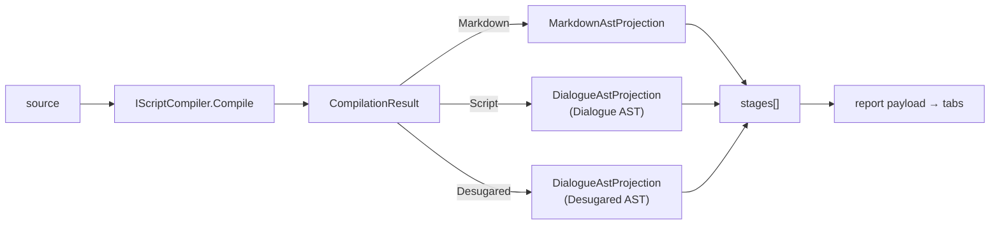

# Desugared AST Visualization Tab

> [!NOTE]
> Status: **implemented** (an enhancement to
> [Compilation Visualization](./Compilation%20Visualization.md) and the successor to
> [Dialogue AST Visualization Tab](./Dialogue%20AST%20Visualization%20Tab.md)). The
> report shows the **desugared** Dialogue AST as a third graph tab, sourced through
> the [`IScriptCompiler`](./Script%20Compiler%20Facade.md) seam; synthetic
> zero-width-span nodes render as inserted; and the View/Edit toggle stays enabled on
> every tab (a node can be edited from a graph tab — see
> [Node Editing](./Live%20Visualization%20-%20Node%20Editing.md)).
>
> Like the rest of the visualization tooling, this surface is "vibe-coded" (see the
> visualization note's maturity caveat); the core engine stays the reviewed surface.

## Table of contents

- [Goal & scope](#goal--scope)
- [Functionality checklist](#functionality-checklist)
- [Ubiquitous language](#ubiquitous-language)
- [Design](#design)
- [Node mapping](#node-mapping)
- [Key design decisions](#key-design-decisions)
- [Error & boundary cases](#error--boundary-cases)
- [Testability](#testability)

## Goal & scope

The report shows the **Markdown AST** and the **Dialogue AST**. The desugarer now
normalizes that Dialogue AST — assembling jumps and filling a default speaker — so
the report should show that stage too, as a third **Desugared AST** tab, letting a
reader see how the tree is normalized before semantic analysis.

Two things stand in the way, and both are folded into this component:

1. The visualizer wires the parser and transpiler **by hand** and never runs the
   desugarer, so it has no desugared tree to project. The
   [`IScriptCompiler`](./Script%20Compiler%20Facade.md) seam already runs all three
   stages and exposes each artifact to the visualization project; switching to it
   yields the desugared tree for free and removes duplicated wiring.
2. The desugarer inserts a **synthetic** `DefaultSpeaker` at a **zero-width span**.
   Slicing that empty span yields `""`, which renders as a misleading empty Source
   block. A synthetic node has no source, and the report should say so.

In scope:

- Switch `CompilationVisualizer` to depend on `IScriptCompiler` and project the
  three artifacts it returns.
- Project the desugared Dialogue AST as the third stage, reusing the Dialogue AST
  projection (taught the two desugar-only node types).
- Render a synthetic (zero-width-span) node correctly: no source slice, and a clear
  "inserted" note in the detail panel.
- A source occurrence of a speaker-less line so the synthetic node is exercised.
- **Freeze the View/Edit toggle on read-only tabs** — a related consistency fix,
  folded in because the new tab is affected too: the mode toggle only governs the
  Source editor, so it is disabled on every graph tab (Markdown/Dialogue/Desugared
  AST), where content is always read-only.

Out of scope:

- Any change to the graph walk, display model, graph renderers, or the tab/legend
  front-end beyond the detail panel's synthetic-node note.
- Semantic analysis (resolving `DefaultSpeaker`/`Jump` targets) — a later stage.

## Functionality checklist

- [x] `CompilationVisualizer` obtains stages through `IScriptCompiler.Compile`, not
      a hand-wired parser/transpiler.
- [x] `LocalImageReferences` uses the same seam (one dependency, no direct parser).
- [x] A third stage, **Desugared AST**, appears after Dialogue AST.
- [x] The Dialogue AST projection labels the two desugar-only nodes —
      `DefaultSpeaker` and `Jump` — and yields a `Jump`'s label children.
- [x] A zero-width-span node carries **no** source and shows an **inserted** note in
      the detail panel instead of an empty Source/Preview block.
- [x] A speaker-less line in the sample source produces a visible synthetic default
      speaker in the Desugared AST tab.
- [x] The View/Edit toggle is **disabled** on every graph tab and re-enables on the
      Source tab, with a tooltip explaining that editing applies to the Source tab.

## Ubiquitous language

Reuses the [Compilation Visualization](./Compilation%20Visualization.md) language
(**stage**, **projection**, **stage description**, **category**) and the
[Desugar](./Desugar.md) language (**desugared AST**, **default speaker**, **jump**).
New or sharpened here:

| Term | Meaning |
| --- | --- |
| **Desugared AST** | The desugarer's normalized Dialogue AST (`DesugaredScriptDocument` wrapping a `ScriptDocument`): jumps assembled, a `DefaultSpeaker` filled on speaker-less lines. |
| **Synthetic node** | A node a stage **inserts**, with no originating source text — marked by a **zero-width span** (`SourceSpan.IsEmpty`). The `DefaultSpeaker` is the first. |
| **Compiler seam** | `IScriptCompiler.Compile(source)` → `CompilationResult`, whose per-stage artifacts (`Markdown`, `Script`, `Desugared`) are `internal` and visible to the visualization project. |

## Design

- **`CompilationVisualizer`** drops its `IMarkdownParser`/`IScriptTranspiler` fields
  for a single `IScriptCompiler` (default `ScriptCompilerFactory.CreateDefault()`).
  `BuildStages` calls `Compile(source)` once and projects `result.Markdown`,
  `result.Script`, and `result.Desugared` into three stages. `LocalImageReferences`
  reads `result.Markdown` from the same seam.
- **`DialogueAstProjection`** gains a constructor that takes the **tab title and
  description**, so one class renders both the "Dialogue AST" and "Desugared AST"
  tabs — they are the same AST vocabulary at two pipeline points. It also learns the
  two desugar-only nodes (`DefaultSpeaker`, `Jump`).
- **Synthetic rendering** lives in two small places: the projection omits the source
  slice for an empty span (passing `null`), and the detail panel shows an
  **inserted** note when a node has no source.

## Node mapping

The Desugared AST reuses every existing Dialogue AST mapping (see the
[Dialogue AST tab](./Dialogue%20AST%20Visualization%20Tab.md#node-mapping)) and adds
the two nodes the desugarer produces:

| Desugar-only node | Label | Category | Source |
| --- | --- | --- | --- |
| `DefaultSpeaker` | Speaker (default) | speech | **none** — synthetic, zero-width span |
| `Jump` | Jump | jump | the assembled `=>`…link text; children are the jump's label fragments |

## Key design decisions

### D1 — Source stages through the compiler seam

The visualizer no longer news up a parser and transpiler; it depends on
`IScriptCompiler` and projects the `CompilationResult`. This is the reason the
seam's stage artifacts were made `internal`-but-friend-visible (see the facade
note), it deletes duplicated wiring, and it is what makes the desugared tree
available at all. Tests inject a stub `IScriptCompiler`.

### D2 — One projection for both AST tabs

The Dialogue AST and the Desugared AST are the **same node vocabulary** — the
desugared tree is a `ScriptDocument` with two extra node kinds. So one
`DialogueAstProjection`, parameterized by tab title and description, renders both;
`BuildStages` constructs it twice with the two labels. This keeps a single mapping
of node → label/category/source, so the two tabs stay visually continuous by
construction. `DefaultSpeaker` and `Jump` are valid Dialogue AST nodes (they live in
`Script.Ast`), so teaching the projection about them is honest, not a special case.

### D3 — A synthetic node shows "inserted", not empty source

A `DefaultSpeaker` is inserted by the desugarer and maps to **no source** — its span
is zero-width. The projection detects `SourceSpan.IsEmpty` and passes `source: null`
rather than an empty slice, so the misleading empty Source/Preview block disappears.
The detail panel, seeing a node with no source, shows a muted **"Inserted by the
compiler — no source"** line in its place. Within these projections a node lacks
source **only** when it is synthetic (every real node slices a non-empty span), so
"no source ⇒ inserted" is a sound signal; the node's zero-width `span` attribute
(`[n, n)`) still shows where it was inserted.

### D4 — "Desugared AST", parallel with the siblings

The tab is named **Desugared AST** to sit in the series "Markdown AST → Dialogue AST
→ Desugared AST", each an *X AST*. The stage description names what desugaring did
(assembled jumps, filled the default speaker).

### D5 — The View/Edit toggle stays enabled on every tab

The mode toggle governs the whole session, and — since
[node editing](./Live%20Visualization%20-%20Node%20Editing.md) made the graph tabs'
inspector editable — a reader can begin editing a node while looking at a graph. So the
toggle is **interactive on every tab**, not confined to the Source tab: switching to Edit
on a graph tab is a real action (the inspector's node editor becomes editable), so it is no
longer a misleading no-op. Navigation is instead guarded by the **one dirty document** rule
— switching tabs or nodes while there are unsaved edits prompts to Save or Discard first —
so a stale graph is never shown beside unsaved edits.

## Error & boundary cases

- **Zero-width span** — handled by D3 (no source, inserted note). This is the
  default-speaker case and the motivating bug.
- **Dangling jump** (`=>` with no following link) — the desugarer already degrades
  it to a plain `Text` `"=>"`, so it surfaces as **Text**, not a `Jump`; no special
  visualization handling is needed.
- **Unsupported node** — the projection still throws `ArgumentException` for a node
  type it does not know, so a future AST addition fails loudly rather than rendering
  a blank node.

## Testability

- **Projection** (unit, .NET): `DefaultSpeaker` → label "Speaker (default)",
  category speech, **null** source, zero-width span attribute; `Jump` → label
  "Jump", category jump, its label fragments as children; the title/description
  constructor drives both tab labels.
- **Build stages** (unit, .NET): `BuildStages` returns three stages titled
  `Markdown AST`, `Dialogue AST`, `Desugared AST`, each with a non-empty
  description; a stub `IScriptCompiler` proves the seam is the source of the stages.
- **Synthetic occurrence** (unit, .NET): a speaker-less line compiles to a Desugared
  AST stage containing a "Speaker (default)" node with no source.
- **Report** (e2e, Playwright): a real report shows four tabs (Source, Markdown AST,
  Dialogue AST, Desugared AST); selecting the synthetic default-speaker node shows
  the inserted note and no editor.
- **Toggle enabled on every tab** (e2e): the View/Edit toggle stays interactive on a
  graph tab (so a node can be edited there), not only on Source.
