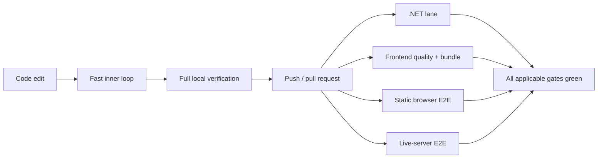

# Development Cycle Optimization

> [!NOTE]
> Status: **implemented on the optimization branch — awaiting merge**.
> Increments 1 and 3–9 are built and measured. Increment 2 was deliberately
> skipped because Release coverage changed the sequence-point denominator.

DialogueDown's verification remains comprehensive, but avoidable orchestration
work delays feedback: repeated project evaluation, duplicate test execution,
browser provisioning before fast checks, and a monolithic frontend CI job. This
note improves cycle time without weakening tests, analyzers, coverage, generated
bundle verification, or end-to-end behavior.

## Table of contents

- [Goal and scope](#goal-and-scope)
- [Ubiquitous language](#ubiquitous-language)
- [Measured baseline](#measured-baseline)
  - [CI baseline](#ci-baseline)
  - [Local baseline](#local-baseline)
- [Success metrics](#success-metrics)
- [Implementation results](#implementation-results)
- [Safety invariants](#safety-invariants)
- [Target verification flow](#target-verification-flow)
- [Optimization increments](#optimization-increments)
  - [1. Launch the built CLI directly in live E2E](#1-launch-the-built-cli-directly-in-live-e2e)
  - [2. Reuse the Release build for coverage](#2-reuse-the-release-build-for-coverage)
  - [3. Install only Chromium's headless shell](#3-install-only-chromiums-headless-shell)
  - [4. Cancel stale CI runs](#4-cancel-stale-ci-runs)
  - [5. Run frontend CI lanes in parallel](#5-run-frontend-ci-lanes-in-parallel)
  - [6. Add an analyzer-free local .NET build](#6-add-an-analyzer-free-local-net-build)
  - [7. Add targeted local .NET test commands](#7-add-targeted-local-net-test-commands)
  - [8. Add targeted local frontend test commands](#8-add-targeted-local-frontend-test-commands)
  - [9. Evaluate frontend quality caches independently](#9-evaluate-frontend-quality-caches-independently)
- [Approval-gated follow-ups](#approval-gated-follow-ups)
- [Boundary cases and rollback](#boundary-cases-and-rollback)
- [Testability and measurement](#testability-and-measurement)
- [Implementation discipline](#implementation-discipline)
- [Final scope](#final-scope)

## Goal and scope

Reduce the time between a code edit and trustworthy feedback while preserving
the project's current quality gates. Optimize process startup, repeated work,
cache use, and CI job structure before changing test coverage or application
behavior.

In scope:

- local .NET and frontend feedback loops;
- the `.NET` and `Frontend` CI jobs;
- Playwright static/live startup and provisioning;
- coverage orchestration;
- VS Code tasks and contributor commands directly affected by the changes;
- repository agent/contributor guidance affected by new fast/full workflows;
- measurement and documentation of each increment's speedup.

Out of scope without a separate approval:

- deleting tests or reducing assertions;
- changing application/runtime semantics;
- large test-suite rewrites;
- conditional omission of frontend checks based on changed paths;
- changing branch protection or required checks;
- changing coverage thresholds or analyzer policy.

## Ubiquitous language

| Term | Meaning |
| --- | --- |
| **Inner loop** | The smallest command used repeatedly while editing one behavior. |
| **Full verification** | Every required build, analyzer, unit, browser, live-integration, generated-bundle, and coverage check. |
| **Cold run** | A run without relevant project outputs or tool caches. Package-manager download caches may remain. |
| **Warm run** | A repeat run with unchanged dependencies and reusable outputs/caches. |
| **CI wall time** | Elapsed time from job start to completion, not the sum of parallel runner-minutes. |
| **Time to first failure** | Time until the earliest deterministic failing gate reports. |
| **Optimization increment** | One independently measurable, reversible change with its own commit. |
| **Behavioral equivalence** | The same test inventory, assertions, coverage policy, and shipped artifacts pass before and after an increment. |

## Measured baseline

Baseline commit: `4a97605` (`main`). Measurements were refreshed on July 18,
2026, after synchronizing the optimization branch. CI values average four
successful GitHub Actions runs; local values are diagnostic measurements on the
development Mac and are most useful for before/after ratios on the same machine.

### CI baseline

| Job | Average wall time | Recent range |
| --- | ---: | ---: |
| Frontend | **158 s** | 152–166 s |
| .NET | **83 s** | 75–88 s |

The frontend job controls the overall CI duration.

| Frontend step | Average | Share of frontend job |
| --- | ---: | ---: |
| Live Playwright E2E | **41.8 s** | 26% |
| Typecheck/lint/format/Vitest | **28.5 s** | 18% |
| Install Playwright browser | **24.5 s** | 16% |
| Build CLI for live E2E | **19.5 s** | 12% |
| Static Playwright E2E | **19.0 s** | 12% |

The five steps above account for about 84% of frontend wall time.

| .NET step | Average |
| --- | ---: |
| Collect coverage | **28.5 s** |
| Build | **18.2 s** |
| Test | **8.8 s** |
| Set up .NET | **8.5 s** |
| Restore | **6.8 s** |
| Restore local tools | **5.5 s** |

Coverage currently runs the full test suite again and implicitly rebuilds it in
Debug after the explicit Release build and Release test pass.

### Local baseline

| Command or operation | Measured time |
| --- | ---: |
| Release CLI build before live E2E | 46.2 s |
| Live Playwright E2E (cold) | 157.6 s |
| Live Playwright E2E (warm median of three) | 84.5 s |
| Six concurrent `dotnet run` startup probes | 70.82 s |
| Six concurrent built-DLL startup probes | 2.91 s |
| `npm run check` (pre-sync diagnostic) | 40.5 s |
| Vitest cold/warm (pre-sync diagnostic) | 49.1 s / 15.7 s |
| Static Playwright E2E (pre-sync diagnostic) | 36.8 s |
| Current coverage pass | 101.9 s |
| Release/no-build coverage experiment | 53.4 s |
| Clean Release solution build, analyzers on/off | 48.1 s / 23.6 s |

The local runtime differs from CI (Node 26 vs Node 20; .NET SDK 10 vs SDK 8), so
absolute local/CI values are not compared directly. Each implementation
increment refreshes its own baseline and compares before/after runs in the same
environment.

## Success metrics

Every increment reports:

```text
time reduction = baseline - optimized
reduction ratio = time reduction / baseline
speedup factor = baseline / optimized
```

Track:

- CI green-run wall time;
- time to first failure;
- local cold and warm time for the affected command;
- test count and pass/fail outcome;
- line-coverage percentage;
- generated report/launcher drift;
- retry, timeout, or flaky-test changes;
- runner-minute tradeoffs when adding parallel jobs.

An increment is retained when it is behaviorally equivalent and either:

- saves at least 5 seconds; or
- reduces its target path by at least 20%.

If the before/after warm-run ranges overlap, collect five additional warm runs
and compare medians. If the ranges still overlap, treat the result as timing
noise and revert the increment.

The timing threshold does not apply when an increment removes recurring churn
whose value is primarily reliability (for example, cancelling an obsolete CI
run).

## Implementation results

| Increment | Result | Local measurement | CI measurement |
| --- | --- | --- | --- |
| 1. Direct built-CLI launch | **Achieved** | Warm live E2E: 84.48 s → 28.29 s; 56.19 s / 66.5% reduction; 2.99× speedup | Frontend wall: 158 s → 144 s; 14 s / 8.9%; combined CLI-build + live-E2E: 61.3 s → 47.0 s; 23.3%; three green runs |
| 2. Release/no-build coverage | **Skipped** | Warm coverage: 127.64 s → 95.96 s; 24.8% faster, but valid sequence-point lines changed 3,601 → 2,828 | Not pushed; exact Debug coverage retained by approval |
| 3. Headless-shell-only Chromium | **Achieved** | Fresh install: 67.21 s → 19.67 s; 47.54 s / 70.7%; 3.42× speedup; installed data 65.5% smaller | Browser install: 24.5 s → 17.0 s; 30.6%; frontend wall from Increment 1: 144 s → 128 s; 11.1%; three green runs |
| 4. Stale-run cancellation | **Achieved** | Not a timing target | A rapid second push cancelled only the obsolete run for the same PR; the survivor and two reruns passed |
| 5. Parallel frontend lanes | **Achieved** | The split exposed and eliminated a shared semantic-autocomplete fixture race | Frontend wall: 128 s → 87 s; 41 s / 32.0%; 1.47×; runner time 179 s, below the 237 s ceiling; three green runs |
| 6. Analyzer-free local build | **Achieved** | Clean: 18.64 s → 11.64 s; 37.6%; 1.60×. Warm edit: 10.12 s → 6.27 s; 38.0%; 1.61× | CI keeps analyzers enabled |
| 7. Targeted .NET tests | **Achieved with change** | Full: 27.70 s. Project: 7.74 s (72.1%, 3.58×). Filter: 6.96 s (74.9%, 3.98×). Watch was slower and omitted | Full solution test remains the gate |
| 8. Targeted frontend tests | **Achieved** | Vitest file: 14.28 s → 4.16 s (70.9%, 3.43×). Static spec: 29.70 s → 10.74 s (63.8%, 2.77×). Live spec: 48.15 s → 24.95 s (48.2%, 1.93×) | Full frontend lanes remain the gate |
| 9a–9d. Frontend caches | **Achieved** | Warm TypeScript 57.3% faster; ESLint 55.9%; Stylelint 29.8%; Prettier 83.5%. Every cache invalidation was tested | CI starts cold; caches target the local repeated loop |

Increment 1 had one non-reproducing local cold launcher timeout. It then passed
an isolated retry, one full retry, one clean-output run, three consecutive warm
runs, and three CI runs without retry. The incident remains recorded for the
final flakiness crosscheck.

## Safety invariants

1. **No quality gate disappears silently.** Initial increments preserve all
   current tests, analyzers, coverage thresholds, accessibility checks, and
   generated-bundle checks.
2. **Build before no-build.** Commands using `--no-build`/`--no-restore` must
   depend on an explicit successful build of the same configuration.
3. **One change, one measurement.** Do not combine optimizations before each has
   an isolated before/after result.
4. **Fast is additive locally.** A fast inner-loop profile supplements rather
   than replaces full verification.
5. **Flakiness is regression.** A speed improvement that introduces retries,
   intermittent failures, shared-state races, or stale generated output is
   rejected.
6. **Generated files remain authoritative.** `dist/report.html` and
   `dist/launcher.html` must match their sources.
7. **The benchmark cannot tune itself.** Do not loosen timeouts, remove waits, or
   reduce coverage merely to improve the measured number.

## Target verification flow



The CI lanes are independent unless one consumes another lane's artifact.
Parallelism should reduce wall time without hiding a failure.

## Optimization increments

The implementation evaluated these increments in order. Each retained increment
ran its targeted benchmark and the full relevant suite before commit.

### 1. Launch the built CLI directly in live E2E

**Problem:** CI explicitly builds `DialogueDown.Cli`, then six Playwright
web-server launchers invoke `dotnet run --project ...`, repeating MSBuild/project
evaluation and contending on the same project graph.

**Design:** Make the live-E2E command own one explicit Release CLI build before
Playwright starts. Resolve that build's CLI DLL and run:

```text
dotnet path/to/DialogueDown.Cli.dll <arguments>
```

Keep one shared launcher helper so all seven fixtures derive the DLL path and
arguments consistently. A clean `npm run e2e:live` must perform the one build;
the seven server processes must never build independently. This makes a stale or
missing DLL impossible on the supported entry point.

**Result:** the six-server baseline startup probe fell from 70.82 seconds to
2.91 seconds (67.91 seconds / 95.9% reduction; 24.3× startup speedup). The later
semantic-autocomplete isolation added a seventh direct-DLL server without
reintroducing project builds.

**Acceptance:**

- all 36 live E2E tests pass without retries;
- a clean `npm run e2e:live` builds the CLI exactly once;
- process-tree teardown still stops each server;
- local and CI live-E2E wall time is reported.

### 2. Reuse the Release build for coverage

**Problem:** coverage invokes `dotnet test` without `Release`, `--no-build`, or
`--no-restore`; it rebuilds/tests Debug after Release was already verified.

**Design:** Keep the existing normal Release test pass initially, then collect
coverage from the already-built Release binaries:

```bash
dotnet test DialogueDown.sln \
  --configuration Release \
  --no-build \
  --no-restore \
  --settings coverage.runsettings \
  --collect:"XPlat Code Coverage"
```

**Result:** Release/no-build coverage was faster, but it changed valid
sequence-point lines from 3,601 to 2,828 while retaining the same 203 files and
207 classes. The exact Debug-scope alternative was not faster. The increment was
skipped and the original coverage policy remains.

**Acceptance:**

- all test projects and tests execute under coverage;
- the generated Cobertura report contains the same intended production scope;
- line coverage remains at or above the existing 90% floor;
- normal test and coverage results remain green.

Removing the separate normal test pass is a later approval-gated decision.

### 3. Install only Chromium's headless shell

**Problem:** all tests are headless, but CI downloads both full Chrome
(177 MiB) and Chromium's headless shell (114 MiB).

**Design:** Install only the headless shell:

```bash
npx playwright install --with-deps --only-shell chromium
```

**Result:** local fresh installation fell from 67.21 seconds to 19.67 seconds
(70.7%; 3.42×) and installed data fell 65.5%. CI provisioning median fell from
24.5 seconds to 17.0 seconds (30.6%; 1.44×).

**Acceptance:**

- all 59 static and 36 live tests launch Chromium successfully;
- no test requires headed Chrome;
- CI browser-provisioning and green-run time are reported.

The official pinned Playwright container is approval-gated and considered only
if browser provisioning still exceeds 15 seconds after this increment.

### 4. Cancel stale CI runs

**Problem:** a new push—or the report-bundle sync workflow's corrective
commit—can leave an obsolete CI run consuming resources and reporting after its
replacement.

**Design:** Add workflow concurrency grouped by pull request or branch:

```yaml
concurrency:
  group: ci-${{ github.event.pull_request.number || github.ref }}
  cancel-in-progress: true
```

Main, independent pull requests, and different branches must not cancel each
other.

**Acceptance:**

- a newer commit cancels only the older run for the same PR/ref;
- separate PRs continue independently;
- the newest run completes all applicable checks;
- cancellation does not leave a required check pending.

**Result:** a rapid follow-up push cancelled only the obsolete same-PR run. The
surviving run and two reruns passed.

### 5. Run frontend CI lanes in parallel

**Problem:** quality, static E2E, CLI build, and live E2E execute serially in one
158-second job, although most work is independent.

**Design:** Split into three self-contained lanes:

- **Frontend quality** — checkout, Node setup, `npm ci`,
  typecheck/lint/format/Vitest, two-page Vite build, committed-bundle
  verification;
- **Frontend static E2E** — checkout, Node setup, `npm ci`, Chromium
  provisioning, and 59 static tests;
- **Frontend live E2E** — checkout, Node + .NET setup, `npm ci`, one Release CLI
  build, Chromium provisioning, and 36 live tests launched from the built DLL.

All three start without `needs` dependencies. Quality failures can therefore
report without waiting for browser provisioning. Preserve stable check names
and report total runner-minutes as well as wall time.

**Result:** frontend wall median fell from 128 seconds to 87 seconds (32.0%;
1.47×). Against the synchronized original baseline, it fell from 158 seconds to
87 seconds (44.9%; 1.82×). Runner median rose to 179 seconds (39.8%) but stayed
below the approved 237-second ceiling. The first CI run exposed a shared
semantic-autocomplete document race; isolating that fixture produced three
green runs.

**Acceptance:**

- every verification responsibility belongs to exactly one lane; setup steps
  may repeat where lane isolation requires them and count toward runner time;
- each lane passes three consecutive CI runs;
- combined test counts remain 293 Vitest + 59 static + 36 live;
- frontend wall time improves without increased retries/flakes;
- total frontend runner time stays at or below 237 seconds unless separately
  approved;
- generated bundles are still verified before merge.

### 6. Add an analyzer-free local .NET build

**Problem:** analyzer execution doubles the clean local build in the measured
environment, even while a contributor is making a small edit.

**Design:** Add one clearly named local build command/task using
`RunAnalyzers=false`. Keep existing analyzer-enabled `build`, `test`, and
`verify: all`, and document that the fast build is an inner-loop compilation
check only.

The analyzer-free build is never used for CI or the final pre-PR verification.

**Result:** clean build fell from 18.64 seconds to 11.64 seconds (37.6%; 1.60×);
warm edit build fell from 10.12 seconds to 6.27 seconds (38.0%; 1.61×).

**Acceptance:**

- the fast build compiles the full solution;
- the full profile remains unchanged in coverage and analyzer enforcement;
- docs state exactly when the fast build is appropriate;
- before/after cold and warm timings are reported.

### 7. Add targeted local .NET test commands

**Problem:** invoking the solution-wide test task for one changed behavior pays
test-host and unrelated-project cost.

**Design:** Add documented/VS Code entry points for:

- one test project;
- one fully qualified test/filter; and
- `dotnet watch test` for a selected project.

Do not alter xUnit parallelization or replace the full test task.

**Acceptance:**

- each entry point executes only its intended scope;
- watch mode reruns after a source/test edit;
- the full solution test inventory remains green;
- startup and first-rerun timings are reported separately.

**Result:** project and filtered commands were retained. `dotnet watch test`
measured slower than a direct project run and was omitted.

### 8. Add targeted local frontend test commands

**Problem:** frontend contributors run broad unit/browser suites when one
Vitest file or one Playwright scenario would answer the current question.

**Design:** Add documented/package/VS Code entry points for:

- Vitest watch and one test file;
- one static Playwright file or `--grep` scenario; and
- one live Playwright spec when the built CLI is available.

Retain `npm run check`, static E2E, live E2E, and `verify: all` as the full gate.
Do not override Vitest's worker/pool defaults: the measured default warm run
(15.7 seconds) outperformed tested thread/fixed-worker variants.

**Acceptance:**

- each command executes only its intended test scope;
- Vitest watch reruns after a source/test edit;
- static/live targeted commands preserve their required setup;
- full frontend verification remains green;
- process startup and first-rerun timings are reported.

**Result:** file/title-scoped tasks were retained. Interactive Vitest watch is
available, but no non-TTY speed claim is recorded.

### 9. Evaluate frontend quality caches independently

**Problem:** TypeScript, ESLint, Stylelint, and Prettier repeat unchanged-file
analysis across local runs.

**Design:** Treat each tool as its own sub-increment and commit:

| Subincrement | Tool-native mechanism |
| --- | --- |
| 9a | TypeScript `--incremental` with a project-local build-info file |
| 9b | ESLint `--cache` |
| 9c | Stylelint `--cache` |
| 9d | Prettier `--cache` |

For each sub-increment:

- use content-aware/tool-managed invalidation;
- place its data under one ignored project cache directory;
- keep CI behavior unchanged initially;
- benchmark and accept/reject it before starting the next tool; and
- document Node-version drift (local Node 26 vs CI Node 20) without claiming a
  runtime-version speedup.

**Acceptance:**

- each accepted cache independently meets the stopping threshold;
- editing one relevant input invalidates that tool's result;
- deleting that cache restores a valid cold run;
- no cache file is committed; and
- `npm run check` and all frontend tests remain green after every accepted
  sub-increment.

**Result:**

| Cache | Warm before | Warm after | Reduction | Speedup |
| --- | ---: | ---: | ---: | ---: |
| TypeScript | 4.82 s | 2.06 s | 57.3% | 2.34× |
| ESLint | 3.24 s | 1.43 s | 55.9% | 2.27× |
| Stylelint | 3.05 s | 2.14 s | 29.8% | 1.43× |
| Prettier | 16.87 s | 2.78 s | 83.5% | 6.07× |

## Approval-gated follow-ups

These affect which tests run or materially restructure the test suite. They are
not authorized merely by approving the low-risk optimization sequence.

### Remove the separate non-coverage .NET test pass

Coverage already executes every test, so one pass may be redundant. Removing it
changes CI diagnostics and makes the instrumented pass the only test execution.
Consider only after increment 2 proves equivalent test discovery, failure
reporting, and coverage across repeated runs.

### Gate frontend CI by changed paths

Skipping the frontend lane can save the full frontend duration for docs-only
changes, but an incorrect path map can omit integration coverage. Any proposal
must enumerate every source/configuration path that can affect visualization or
the live server and account for required-check behavior.

### Rebalance the browser-test pyramid

The static suite has 59 tests, many loading a large self-contained report to assert one
control or visual detail. Moving suitable cases to Vitest could materially
reduce browser time, but it is a larger test refactor. It requires a separate
coverage matrix identifying:

- critical browser journeys and accessibility checks to retain;
- component/DOM behavior safe to move to Vitest;
- assertions that depend on real layout, CodeMirror, D3, or browser APIs;
- before/after defect-detection equivalence.

Do not switch the whole Vitest suite from jsdom to `happy-dom`; CodeMirror
compatibility needs a focused experiment. The default Vitest scheduler was
faster than tested thread/worker overrides.

### Use a Playwright container

The official image can avoid host browser/system-dependency provisioning, but
image-pull time and .NET setup inside the container may replace rather than
remove that cost. Consider a pinned image matching `@playwright/test` only when
increment 3 leaves browser provisioning above 15 seconds. Measure it in a
separate increment before adoption.

### Change branch protection or required checks

Only `.NET` is currently required. Any change to required frontend checks,
aggregator checks, or branch protection is repository policy and needs explicit
approval.

## Boundary cases and rollback

| Risk | Required handling |
| --- | --- |
| Built CLI DLL missing or stale | The live E2E setup fails before Playwright with the expected build command. |
| Headed browser test added later | Remove `--only-shell` or install the full browser when that test is introduced. |
| Parallel jobs duplicate setup | Report runner-minutes; retain the split only when wall-time value justifies the cost. |
| Concurrent tests share files/ports | Preserve current fixture isolation; any collision or flake rejects the change. |
| Cache returns stale results | Use tool-native content-aware caches and add all cache paths to ignores. |
| Cancellation crosses PRs/branches | Fix the concurrency key before merging. |
| Optimization is within timing noise after the extended-run rule | Revert it rather than retain complexity without demonstrated value. |

Every increment is reversible as one commit.

## Testability and measurement

### Local benchmark protocol

For the affected command:

1. record the runtime/tool versions;
2. run one cold measurement after removing only relevant project artifacts;
3. run three warm measurements;
4. report the warm median and cold result;
5. preserve logs and test counts until the increment is accepted;
6. run full verification after the targeted benchmark.

Avoid benchmarking while another build/test process is competing for the same
CPU or project outputs.

### CI benchmark protocol

For each CI-affecting increment:

1. use GitHub Actions job/step timestamps, not console-estimated test duration;
2. collect three successful runs for every CI-affecting increment (job reruns on
   the same commit are acceptable);
3. compare against the four-run baseline in this note;
4. report wall time, runner-minutes, retries, and test counts;
5. treat a flaky or retried pass as a failed optimization result.

### Verification matrix

| Surface | Targeted check | Full check |
| --- | --- | --- |
| Live server launch | `npm run e2e:live` | Frontend CI live lane |
| Browser provisioning | Static and live Playwright | Both frontend E2E lanes |
| CI concurrency | Two rapid commits in a test PR | Latest run completes all lanes |
| Frontend split | Each lane independently | Combined inventory and generated diff |
| Analyzer-free .NET build | Fast full-solution build | Existing analyzer-enabled build |
| Targeted .NET tests | Project/filter/watch commands | Existing full solution test |
| Targeted frontend tests | Vitest/Playwright scoped commands | Existing `npm run check` + E2E |
| Frontend caches | Cold/repeat/invalidation commands | Existing uncached-equivalent checks |

## Implementation discipline

Future optimization changes keep the same discipline:

- synchronize from `origin/main` before implementation;
- make one independently measurable change per commit;
- characterize behavior before changing orchestration;
- report baseline, optimized time, reduction, ratio, and speedup;
- retain full analyzer/test/coverage gates;
- use normal revert commits for failed pushed experiments; and
- update contributor and agent guidance with workflow changes.

## Final scope

Implemented:

- one built CLI with direct DLL live-server launches;
- headless-shell-only Chromium provisioning;
- same-PR/ref stale-run cancellation;
- parallel frontend quality/static/live lanes with a stable aggregate check;
- additive analyzer-free and targeted local tasks; and
- ignored, content-aware caches for four frontend quality tools.

Changed:

- semantic autocomplete received an isolated live fixture after parallel CI
  exposed its shared-state race;
- .NET watch mode was omitted because it was slower than direct project tests.

Not implemented:

- Release coverage reuse (skipped to preserve exact Debug sequence-point scope);
- changed-path frontend gating;
- removal of the separate non-coverage test pass;
- Playwright-container adoption;
- browser-test-pyramid refactoring;
- application semantics; and
- branch-protection changes.
