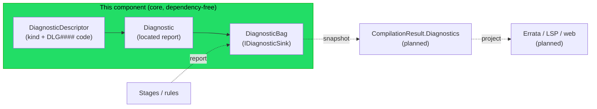

# Implementation note: Diagnostic model

> [!NOTE]
> Status: **approved** — implementation in progress. This is the first,
> minimal component of the larger diagnostics effort ([#43](https://github.com/pengzhengyi/godot-dialoguedown/issues/43)):
> the **core diagnostic model** — the value types that describe a located problem,
> and the **bag** that collects them. It is deliberately dependency-free and **not
> yet wired into any stage**; producing, surfacing, validating, and rendering
> diagnostics are later components (see [Integration](#integration)).

## Table of contents

- [Goal and scope](#goal-and-scope)
- [Where it sits](#where-it-sits)
- [Ubiquitous language](#ubiquitous-language)
- [The model shape — options compared](#the-model-shape--options-compared)
- [Functionality checklist](#functionality-checklist)
- [Interfaces and abstractions](#interfaces-and-abstractions)
- [Key design decisions](#key-design-decisions)
  - [DD1 — One offset-based model, internal for now](#dd1--one-offset-based-model-internal-for-now)
  - [DD2 — Three ordered severities; immutable diagnostics, a mutable bag](#dd2--three-ordered-severities-immutable-diagnostics-a-mutable-bag)
  - [DD3 — Descriptors carry a stable `DLG####` code](#dd3--descriptors-carry-a-stable-dlg-code)
  - [DD4 — The sink is the report seam; the bag preserves report order](#dd4--the-sink-is-the-report-seam-the-bag-preserves-report-order)
  - [DD5 — Message formatting is deferred to the renderer](#dd5--message-formatting-is-deferred-to-the-renderer)
  - [DD6 — Diagnostics is a new foundation module, guarded by an architecture test](#dd6--diagnostics-is-a-new-foundation-module-guarded-by-an-architecture-test)
- [Error and boundary cases](#error-and-boundary-cases)
- [Integration](#integration)
- [Testability](#testability)

## Goal and scope

Today the compiler is **throw-based**: a stage raises a `ScriptCompilationException`
(a `SyntaxError` or `SemanticError`) at the first fault, so an author sees only one
problem per run. The larger diagnostics effort will let the compiler **collect every
problem and continue**, then render them all. That effort needs one thing before
anything else: a shared, structured way to *describe* a problem. This component
delivers exactly that and nothing more.

**In scope — the model and its collector:**

- a **`Diagnostic`** value — one located report: a descriptor, a source span, a
  severity, and the **arguments** that fill its descriptor's message template;
- a **`DiagnosticDescriptor`** value — the stable definition of one diagnostic
  *kind*: a `DLG####` code, a title, a **message format**, a category, and a default
  severity;
- a **`DiagnosticSeverity`** — `Error`, `Warning`, or `Info`, with a defined order;
- an **`IDiagnosticSink`** seam and its **`DiagnosticBag`** implementation — the
  mutable collector a producer reports into during one compilation, exposing an
  immutable snapshot and a `HasErrors` convenience.

**Explicitly out of scope (later components of [#43](https://github.com/pengzhengyi/godot-dialoguedown/issues/43)):**

| Deferred to | What |
| --- | --- |
| **Collect-and-continue pipeline** | threading the sink through the stages, converting recoverable throws to reported diagnostics, and surfacing them on `CompilationResult` |
| **Descriptor catalog** | the populated set of real `DLG####` descriptors — each lands with the stage or rule that reports it |
| **Validator + rules** | the rule-based lint pass over a compiled artifact |
| **Rendering** | the `LineMap` (offset→line/column), **composing each message** from its descriptor's format and the diagnostic's arguments, and the CLI's [Errata](https://github.com/spectreconsole/errata) projection, plus exit codes |
| **Planned seams** | an LSP projection and a web-report overlay |

The point of shipping the model first is to **fix the vocabulary and de-risk its
shape** — severities, the code scheme, the bag's contract — in isolation, with pure
unit tests, before a single stage depends on it.

## Where it sits

The model is the foundation the rest of the effort builds on. Producers (stages and
rules) will **report** into the bag; consumers (the result and the renderers) will
**project** what it collected. None of those arrows are built here — they are drawn
dotted to show where this component plugs in.

## Ubiquitous language

| Term | Meaning |
| --- | --- |
| **Diagnostic** | One structured, located report found during compilation: a descriptor + a `SourceSpan` + a severity + message arguments. The collect-and-continue counterpart to "throw at the first fault". |
| **Severity** | How serious a diagnostic is: `Error` (the script is invalid), `Warning` (it compiles but is suspect), or `Info` (a neutral note). |
| **Descriptor** | The stable definition of one diagnostic *kind*: `Code`, `Title`, `MessageFormat`, `Category`, `DefaultSeverity`. Many diagnostics share one descriptor. |
| **Code** | The stable identifier on a descriptor — a `DLG####` string — used for docs, editor links, and (later) suppression. |
| **Category** | The kind of rule a descriptor belongs to: `Syntax`, `Semantic`, or `Style`. Mirrors the code's range. |
| **Message format** | A descriptor's composite format template (e.g. `"Unknown speaker '{0}'."`); the renderer fills its placeholders with a diagnostic's arguments. |
| **Message arguments** | The per-diagnostic values that fill the descriptor's message format. Kept structured, not pre-formatted, so composing the text belongs to the renderer. |
| **Diagnostic sink** | The seam (`IDiagnosticSink`) a producer reports a diagnostic into, so producers never know how diagnostics are stored. |
| **Diagnostic bag** | The concrete sink for one compilation: it collects diagnostics and hands back an immutable snapshot. |

## The model shape — options compared

The central choice is **how a diagnostic locates a problem**, because it must serve
both the near-term **linter** goal (collect and render during compilation) and a
future **editor/LSP** goal (a VS Code extension or the web editor consuming the same
data).

| Option | Location representation | Linter fit | Editor/LSP fit | Cost |
| --- | --- | --- | --- | --- |
| **A — offset-based** | a `SourceSpan` (start + length), like every AST node | Excellent | Needs an offset→`{line, character}` projection at the edge | Low; dependency-free |
| **B — line/column-based** | a `{line, character}` range, LSP-native | Awkward — forces a line index into every producer | Direct | Line/column mapping leaks into the core; tempts a wire-format dependency |
| **C — hybrid** | offset-based core **plus** a `LineMap` projection at each surface | Excellent | Excellent, via the projection | One extra `LineMap` seam — but that is a *rendering* component, not this one |

**Decision: A now, growing into C.** The core model is **offset-based**: a
`Diagnostic` carries a `SourceSpan`, exactly like the AST it describes, so producers
report with the spans they already hold and nothing computes line/column on the hot
path. Line/column is a rendering concern, so the `LineMap` that option C adds lands
with the **renderer** component, not here. Choosing offsets now keeps this component
tiny and keeps the core free of any editor or wire-format concept.

## Functionality checklist

- [ ] `DiagnosticSeverity` defines `Info`, `Warning`, `Error` with a defined order
      (`Error` is the worst).
- [ ] `DiagnosticDescriptor` carries a `Code`, `Title`, `MessageFormat`, `Category`,
      and `DefaultSeverity`, and rejects a malformed code or a code whose range does
      not match its category.
- [ ] `Diagnostic` carries a descriptor, a `SourceSpan`, its message **arguments**,
      and a severity that defaults to the descriptor's `DefaultSeverity`.
- [ ] `IDiagnosticSink.Report` accepts a diagnostic; `DiagnosticBag` implements it.
- [ ] `DiagnosticBag` exposes an **immutable snapshot** of what was reported, in
      **report order**, and a `HasErrors` convenience.
- [ ] An **architecture test** asserts `DialogueDown.Diagnostics` is a foundation
      leaf — it may use `Common` but must not depend on any pipeline stage.
- [ ] Every type is `internal`, dependency-free, and covered by unit tests.

## Interfaces and abstractions

| Type | Visibility | Responsibility | Collaborators |
| --- | --- | --- | --- |
| `DiagnosticSeverity` | internal enum | `Info` < `Warning` < `Error` | — |
| `DiagnosticCategory` | internal enum | `Syntax`, `Semantic`, `Style` (mirrors code ranges) | — |
| `DiagnosticDescriptor` | internal record | the stable kind: `Code`, `Title`, `MessageFormat`, `Category`, `DefaultSeverity` | `DiagnosticSeverity`, `DiagnosticCategory` |
| `Diagnostic` | internal record | one located report: `Descriptor`, `Span`, `MessageArguments`, `Severity` | `DiagnosticDescriptor`, `SourceSpan` |
| `IDiagnosticSink` | internal | the report seam a producer writes to | `Diagnostic` |
| `DiagnosticBag` | internal | collects for one compilation; yields an immutable snapshot + `HasErrors` | `IDiagnosticSink`, `Diagnostic` |

All types live in a new `DialogueDown.Diagnostics` namespace in the core library.

## Key design decisions

### DD1 — One offset-based model, internal for now

A `Diagnostic` locates a problem with a `SourceSpan` (offsets), the same value every
AST node already carries ([option A](#the-model-shape--options-compared)). Because
`SourceSpan` is **`internal`**, the model that embeds it is `internal` too — a public
type cannot expose an internal member. That is the right default anyway: nothing
public consumes a diagnostic yet, so exposing one now would be speculative API. The
test and visualization projects already have `InternalsVisibleTo`, so they can use
the model directly. When the **pipeline** component surfaces diagnostics on
`CompilationResult`, it decides the public projection then — most likely a
line/column view built by the renderer's `LineMap`, so `SourceSpan` can stay
internal. Keeping visibility internal now avoids a premature public contract.

### DD2 — Three ordered severities; immutable diagnostics, a mutable bag

Severity is `Error`, `Warning`, or `Info`, ordered so `Error` is the worst — enough
to answer "did anything fail?" (`HasErrors`) and, later, "what is the worst?" without
an editor-only rung like LSP's `Hint` (that belongs to a future LSP projection, never
the core). Each **diagnostic carries its own severity**, defaulting from its
descriptor's `DefaultSeverity` — a field now, not later, so a future configuration
pass can promote a warning to an error (or demote one) without reshaping the model.
The **diagnostic and descriptor are immutable value types** (records) so they are safe
to share and compare; the **bag is the only mutable piece**, and only during one
compilation. This cleanly separates the *what* (a value) from the *collecting* (a
process).

### DD3 — Descriptors carry a stable `DLG####` code

Each descriptor's identity is a stable **`DLG####` code**, assigned from category
ranges from the start: `DLG1xxx` for `Syntax`, `DLG2xxx` for `Semantic`, `DLG3xxx`
for `Style`. A code's range therefore names its category, and the descriptor
validates that the two agree. Codes make a diagnostic greppable, documentable,
linkable from an editor, and (later) suppressible. The README's error model lists
codes as an [optional future](./README.md#error-codes-optional-future); this
component **adopts them now** because a descriptor without a stable identity is not
worth much — a descriptor *is* its code. When this lands, that README section is
updated so the two channels (throw and collect) share one code scheme. This
component defines the code scheme and the descriptor type; the **catalog of real
descriptors is populated later**, each entry arriving with the producer that reports
it.

### DD4 — The sink is the report seam; the bag preserves report order

Producers depend only on `IDiagnosticSink.Report(diagnostic)` — they never see how
diagnostics are stored, so the same stage code works whether it reports into a real
bag or a test spy. `DiagnosticBag` is the one implementation: it appends and hands
back an **immutable snapshot in report order** (the order a stage walked the tree),
which is a natural, stable reading order. Sorting by source position or grouping by
severity is a **rendering** choice and lives with the renderer, so the bag stays a
plain, predictable collector.

### DD5 — Message formatting is deferred to the renderer

A diagnostic does **not** carry a finished message string. The descriptor owns a
**message format** — a composite template such as `"Unknown speaker '{0}'."` — and
each diagnostic carries the **arguments** that fill it. The final text is composed by
the **renderer** (the deferred rendering component), never in the model. This keeps
the model free of presentation and culture concerns, lets one descriptor phrase every
diagnostic of its kind consistently, and leaves room for **localization** later — a
message table keyed by code, resolved at render time. The model validates the
*structure* (a descriptor, a span, arguments), not that the argument count matches the
format: that is a rendering concern and surfaces there.

### DD6 — Diagnostics is a new foundation module, guarded by an architecture test

The model lives in a new top-level **`DialogueDown.Diagnostics`** module in the core
library, beside the other foundations (`Common`, `Configuration`, `Graph`) rather than
nested under `Common`: diagnostics is a distinct concern and later grows a catalog
and a validator, so it earns a module of its own. Its one allowed inward dependency is
`Common` (for `SourceSpan`); it must **not** depend on any pipeline stage (`Markdown`,
`Script`, `Compilation`), so those stages can later depend on *it* without a cycle. A
**NetArchTest** rule in `DialogueDown.Architecture.Tests` locks this in, mirroring the
existing foundation-leaf rules for `Common` and `Configuration`, so the boundary is
enforced by CI rather than by convention.

## Error and boundary cases

| Case | Behavior |
| --- | --- |
| **Malformed code** (`"DLG1"`, `"XYZ"`, empty) | `DiagnosticDescriptor` throws `ArgumentException` from a `AssertValidCode` guard — a *usage* error (a developer mis-defined a descriptor), not a script diagnostic. |
| **Code range ≠ category** (`DLG2001` marked `Syntax`) | rejected by the same guard, keeping codes and categories coherent. |
| **Empty bag** | `Diagnostics` is an empty snapshot; `HasErrors` is `false`. |
| **Info/Warning only** | `HasErrors` is `false` — only an `Error` flips it. |
| **Message argument/format mismatch** | not checked here — composing the message is the renderer's job ([DD5](#dd5--message-formatting-is-deferred-to-the-renderer)), so a mismatch surfaces at render time, not in the model. |
| **`null` diagnostic reported** | `ArgumentNullException` — a usage error. |
| **Snapshot immutability** | the list the bag returns cannot be cast back to mutate the bag; later reports do not change an earlier snapshot. |

Diagnostics describe **scripts**, never calling-code mistakes: a `null` argument or a
broken invariant stays an `ArgumentException`, unchanged. This component adds no new
script-facing throwing behavior — it is pure model.

## Integration

This component is intentionally self-contained; it integrates with **later** work:

- **Collect-and-continue pipeline (next).** A per-compilation context carries a
  `DiagnosticBag`; each stage takes an `IDiagnosticSink` and reports recoverable
  faults instead of throwing; the facade surfaces the collected diagnostics on
  `CompilationResult`. That component also decides the **public** projection and
  reconciles the README error model.
- **Descriptor catalog.** Real `DLG####` descriptors are defined next to the stages
  and rules that raise them, keeping each code beside its meaning.
- **Renderer.** A `LineMap` turns a `Diagnostic`'s span into line/column, and the CLI
  projects diagnostics through Errata; the same snapshot feeds a future LSP or web
  overlay.

No existing code changes in this component — it only *adds* the
`DialogueDown.Diagnostics` types.

## Testability

Everything here is a pure value type or an in-memory collector, so the whole
component is exercised by fast **unit tests** in `DialogueDown.Tests` (which has
`InternalsVisibleTo`), with no stage, file, or console in the loop:

- **`DiagnosticDescriptor`** — a valid code by category; each malformed-code and
  range-mismatch case throws; equality by value.
- **`DiagnosticSeverity`** — the order holds (`Error` > `Warning` > `Info`).
- **`Diagnostic`** — severity defaults from the descriptor and can be overridden;
  value equality; carries its span and message arguments.
- **`DiagnosticBag`** — reports collect in order; the snapshot is immutable and
  detached from later reports; `HasErrors` reflects only `Error`; an empty bag is
  well-behaved; `null` report throws.
- **Architecture (NetArchTest)** — a rule in `DialogueDown.Architecture.Tests` asserts
  `DialogueDown.Diagnostics` depends inward only on `Common` and on no pipeline stage,
  sitting beside the existing core-layering leaf rules.

A small **object-mother** helper builds test descriptors and diagnostics with sane
defaults, so a later shape change touches one file. Multi-line message inputs, where
used, are raw string literals.
