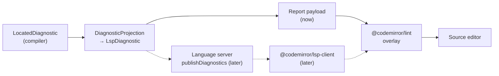

# Diagnostics Overlay

> [!NOTE]
> Status: **implemented**. This is the web-report half of
> [Component 6 — Editor seams](./Diagnostics%20and%20Validation.md) ([#121](https://github.com/pengzhengyi/godot-dialoguedown/issues/121)):
> it renders the compiler's diagnostics in the `visualize` report's source editor,
> built on an **LSP-shaped diagnostic projection** so a future language server and
> VS Code extension reuse the same seam. The language server itself is deferred.

## Goal and scope

The `visualize` report lets an author edit a script and watch it recompile. Today a
compile error only surfaces as a terse status line, and a halted compile grays out the
later stage tabs (see [Unavailable Stage Tabs](./Unavailable%20Stage%20Tabs.md)). This
component adds a **diagnostics overlay**: the editor underlines each problem in place,
marks the gutter, and explains it on hover with a link to its
[error code](../../guide/error-codes.md) — the familiar editor experience, driven by the
compiler's own diagnostics.

The overlay is one of the two **editor seams** in
[Component 6](./Diagnostics%20and%20Validation.md). It is built on a reusable
**LSP-shaped diagnostic projection** so the effort is a foundation, not a one-off: the
same projection and the same CodeMirror display power a future language server and VS
Code extension.

**In scope:**

- An **LSP diagnostic projection** in `.NET`: map each `LocatedDiagnostic` to an
  LSP-shaped diagnostic (a zero-based range, an integer severity, a code, a message, and
  a source), carried in the report payload.
- The **overlay**: render those diagnostics in the source editor with
  [`@codemirror/lint`](https://www.npmjs.com/package/@codemirror/lint) — squiggles, a
  gutter marker, and a hover tooltip that links to the error code — and refresh them
  whenever the report recompiles (save and hot-reload).

**Out of scope (deferred, but seams left open):**

- **A real language server.** Wrapping the projection in an
  [`OmniSharp.Extensions.LanguageServer`](https://github.com/OmniSharp/csharp-language-server-protocol)
  server that publishes `textDocument/publishDiagnostics`, and connecting the report to
  it through [`@codemirror/lsp-client`](https://discuss.codemirror.net/t/codemirror-lsp-client/9309),
  lands when the **VS Code extension** does. The projection and the CodeMirror display
  are designed to be reused unchanged (see [D6](#d6--the-transport-is-swappable-payload-now-lsp-later)).
- **Compile-on-type.** The overlay refreshes when the report recompiles (on save and
  hot-reload), matching the existing graph-tab updates. A debounced compile-as-you-type
  path is a later enhancement, likely the language server's job.
- **Non-diagnostic LSP features** (completion, hover, go-to-definition). Autocompletion
  already exists through its own seam; this component is diagnostics only.

## Ubiquitous language

| Term | Meaning |
| --- | --- |
| **Diagnostic** | The compiler's located report of a problem — `LocatedDiagnostic`: a code, a severity, a message, and a source range. |
| **LSP diagnostic** | The projection of a diagnostic into the shape the Language Server Protocol defines: a **zero-based** `range`, an integer `severity` (1–4), a `code`, a `message`, and a `source`. |
| **Diagnostic projection** | The pure mapping from a `LocatedDiagnostic` to an LSP diagnostic. The reusable seam. |
| **Overlay** | The editor rendering of the diagnostics — squiggles, gutter markers, and hover tooltips — via `@codemirror/lint`. |
| **Transport** | How LSP diagnostics reach the editor: the report **payload** now; a **language server** later. |

## Functionality checklist

- [x] `.NET` projects each `LocatedDiagnostic` into an **LSP diagnostic** (zero-based
      range, integer severity, code, message, `source = "dialoguedown"`).
- [x] The report **payload carries** the LSP diagnostics, for both a complete and a
      halted compile.
- [x] The source editor renders them as an **overlay**: an inline squiggle per
      diagnostic, a **gutter** marker, and a hover **tooltip** with the message.
- [x] The tooltip links to the diagnostic's **error-code** entry (`#dlg<code>`).
- [x] Severity maps correctly: error, warning, and info are visually distinct.
- [x] The overlay **refreshes on recompile** — save and hot-reload — without rebuilding
      the editor, and clears on a clean compile.
- [x] Out-of-range or zero-width ranges are handled without throwing.

## Interfaces and abstractions

| Type / seam | Responsibility | Collaborators |
| --- | --- | --- |
| `LspDiagnostic` (`.NET`, new) | An LSP-shaped diagnostic: `Range`, `Severity` (int), `Code`, `Message`, `Source`. | `LspRange`, `LspPosition` |
| `DiagnosticProjection` (`.NET`, new) | Map a `LocatedDiagnostic` to an `LspDiagnostic` (one-based → zero-based, severity → int). The reusable seam. | `LocatedDiagnostic` |
| `CompilationVisualizer.BuildContent` (`.NET`) | Project `result.LocatedDiagnostics` and include them in the payload. | `DiagnosticProjection`, `DisplayGraphJson` |
| `DisplayGraphJson.SerializeReport` (`.NET`) | Serialize the diagnostics into the payload's `diagnostics` field. | `LspDiagnostic` |
| `LspDiagnostic` (TS `model.ts`, new) | The payload mirror of the `.NET` `LspDiagnostic`. | `Report`, `LspRange`, `LspPosition` |
| `Report.diagnostics` (TS) | The document's LSP diagnostics; absent ⇒ none. | overlay builder |
| `diagnostics-overlay.ts` (TS, new) | Convert payload diagnostics to `@codemirror/lint` diagnostics (range → offset, severity, tooltip with doc link) and push them with `setEditorDiagnostics`; expose the `lintGutter` extension. | `@codemirror/lint`, `source-view.ts` |
| `source-view.ts` editor builder | Mount the lint gutter and expose `setDiagnostics` on its handle so recompiles push new diagnostics live. | `diagnostics-overlay.ts`, `app.ts` |

### Payload shape

The payload is LSP-canonical, so a language server can emit the identical structure later.
Ranges are **zero-based** (LSP); the editor converts them to offsets.

```ts
/** An LSP-shaped diagnostic carried in the report payload. */
export interface LspDiagnostic {
    range: LspRange; // zero-based (LSP)
    severity: LspSeverity; // 1 Error | 2 Warning | 3 Information | 4 Hint
    code: string; // e.g. "DLG2001"
    message: string;
    source: string; // "dialoguedown"
}

export interface LspRange {
    start: LspPosition;
    end: LspPosition;
}

export interface LspPosition {
    line: number; // zero-based
    character: number; // zero-based
}

export type LspSeverity = 1 | 2 | 3 | 4;

export interface Report {
    // …existing fields…
    diagnostics?: LspDiagnostic[];
}
```

## Key design decisions

### D1 — An LSP-shaped projection, not a bespoke payload

The diagnostics are carried in the exact shape the Language Server Protocol defines —
zero-based `range`, integer `severity` (1–4), `code`, `message`, `source` — as
[DD8 of the Diagnostics note](./Diagnostics%20and%20Validation.md) prescribes. The
projection is a **pure mapping** from `LocatedDiagnostic` (which already resolved its
line/column) to `LspDiagnostic`; it needs no `LineMap` of its own. This is the one
durable, reusable asset: a future language server publishes these identical structures,
and the CodeMirror display (below) consumes them unchanged. It has a single consumer
today — the report — so it lives in `DialogueDown.Visualization` for now; when the
language server lands it extracts mechanically to a shared editor-projection library,
since it depends only on the core diagnostic model.

Severity is a typed `LspSeverity` enum carrying the protocol's own numbers
(`Error = 1` … `Hint = 4`); a **property-level** `JsonNumberEnumConverter` keeps it an
integer on the wire, since the report serializer writes enums as strings by default and
only a property-level converter overrides one in its converter collection.

### D2 — `@codemirror/lint` for the overlay

[`@codemirror/lint`](https://www.npmjs.com/package/@codemirror/lint) (official, MIT) is
the standard CodeMirror 6 diagnostics UI — squiggles, a gutter (`lintGutter`), and hover
tooltips — for diagnostics from *any* source. It is also exactly what
`@codemirror/lsp-client` forwards into, so adopting it now is a step toward the language
server, not a throwaway. Diagnostics are **pushed imperatively** with `setDiagnostics`,
because they come from the server-side compile, not a client-side linter.

### D3 — Diagnostics ride the existing payload and live channel

No new transport. The static export and the live server's `/api/save` response and
`/api/document` both serialize the report through `SerializeReport`; adding a
`diagnostics` field flows to both. On recompile the app pushes the fresh diagnostics
imperatively with `setDiagnostics` — on load, on a View-mode hot-reload, and after each
Edit-mode save — so the one editor instance is never rebuilt and a clean compile clears
the overlay.

### D4 — No TypeScript re-implementation of the compiler

Unlike editor syntax highlighting, which needs a client-side lexer for instant coloring,
diagnostics are **produced by the `.NET` compiler** and pushed to the client. The overlay
only *renders* them, so there is no second implementation to keep in conformance — a real
simplification.

### D5 — The tooltip links to the error code

The hover tooltip renders the message plus a **"more information"** link to the code's
entry on the [Error codes](../../guide/error-codes.md) page — the same `#dlg<code>`
anchor the [CLI](./CLI%20Diagnostic%20Rendering.md) links to. The web builds the URL from
the code client-side (the editor already lives on the docs' origin story); the deferred
language server would instead set LSP `codeDescription.href`. One anchor convention, two
surfaces.

### D6 — The transport is swappable (payload now, LSP later)



The **projection** and the **`@codemirror/lint` display** are fixed; only the wire
between them changes. When the VS Code extension arrives, an
`OmniSharp.Extensions.LanguageServer` server publishes the same `LspDiagnostic` values
and the report switches to `@codemirror/lsp-client` — reusing both ends.

### D7 — Keep stage-boundary compilation

The visualizer compiles **stage-boundary** (per
[Unavailable Stage Tabs](./Unavailable%20Stage%20Tabs.md)), so a halted compile still
grays out the later tabs. The overlay shows the diagnostics from the produced stages —
exactly the errors that halted compilation. Compiling **best-effort** to surface *every*
stage's problems at once (more linter-like) is deferred: it would re-enable the grayed
tabs and belongs with user-selectable mode
([#110](https://github.com/pengzhengyi/godot-dialoguedown/issues/110)).

## Error and boundary cases

| Case | Intended behavior |
| --- | --- |
| Zero-width (synthetic) span | A zero-length range at the position; the squiggle still shows (CodeMirror handles `from == to`). |
| Range past the current buffer | Clamp to the document length; never throw. |
| Buffer edited since the last compile (dirty) | The overlay reflects the last compiled version; ranges may drift until the next save refreshes them — accepted, and CodeMirror clamps stale ranges. |
| Clean compile | No diagnostics; the overlay and gutter clear. |
| Halted compile | The produced stages' diagnostics render; later tabs stay disabled. |
| Info-severity diagnostic | Rendered as info (LSP severity 3), visually distinct from warnings and errors. |

## Integration

- **`.NET`:** `CompilationVisualizer.BuildContent` projects `result.LocatedDiagnostics`
  into `LspDiagnostic[]` and passes them to `SerializeReport`, which gains a
  `diagnostics` field. Both complete and halted results carry their diagnostics.
- **TypeScript:** `model.ts` gains `Report.diagnostics`; a new `diagnostics-overlay.ts`
  converts them to `@codemirror/lint` diagnostics (range → offset, severity, tooltip with
  the doc link) and pushes them with `setEditorDiagnostics`; `source-view.ts` mounts the
  lint gutter and exposes `setDiagnostics` on its handle; the `app` controller pushes on
  load, the View-mode reload pushes on hot-reload, and the Edit-mode save's `onSaved`
  pushes after each recompile.
- **Live server:** unchanged — `/api/save`, `/api/document`, and the SSE hot-reload
  already serialize the report, so the diagnostics flow through.

## Testability

- **`.NET` unit** (`DiagnosticProjectionTests`, `LspSeverityTests`): a `LocatedDiagnostic`
  maps to the right zero-based range, integer severity, code, message, and source; boundary
  cases — zero-width, multi-line, first line/column (one-based → zero-based); the severity
  enum carries the protocol numbers.
- **`.NET`** (`CompilationVisualizerTests`, `DisplayGraphJsonTests`): a compiled result's
  diagnostics reach the payload's `diagnostics` field with integer severity; a clean compile
  carries an empty array, so the overlay clears; a null diagnostics argument is omitted.
- **TS unit** (`diagnostics-overlay.test.ts`): payload diagnostics convert to editor
  diagnostics with correct offsets and severities; the tooltip carries the code's doc
  link.
- **End-to-end:** a report with diagnostics shows squiggles and a gutter marker;
  hovering shows the message and the doc link (static fixture); a live edit that
  introduces an error shows the overlay after recompile, and fixing it clears the overlay
  (live server).
