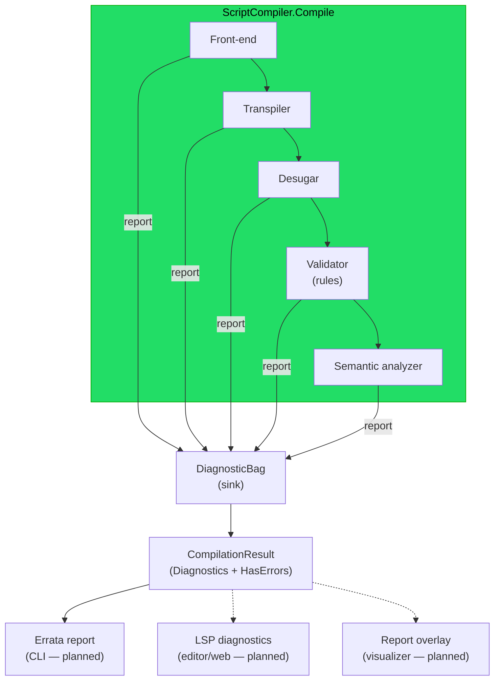

# Implementation note: Diagnostics and validation

> [!NOTE]
> Status: **in progress** — this note covers the whole diagnostics effort
> ([#43](https://github.com/pengzhengyi/godot-dialoguedown/issues/43)) as one design, built
> in components. It gives the compiler a single, structured way to **collect** every problem
> it finds (errors and warnings) instead of throwing at the first one, a **validator** that
> reports author-facing problems as rules, and a **humanized renderer** so the CLI can show
> them all at once. It evolves the throw-based [error model](./README.md#error-model) into a
> collect-and-continue model. Each component's state is tracked below.

## Component status

| Component | What it delivers | Status |
| --- | --- | --- |
| **1. Diagnostic model** | the value types that describe a located problem, and the bag that collects them | **Implemented** |
| **2. Collection seam** | a `DiagnosticsContext` threading the sink through the stages; the result surfaces what was collected | **Proposed (next)** |
| **3. Validator + rules** | a pluggable structural lint pass over the desugared artifact | Deferred |
| **4. Producers** | migrating recoverable throw sites to reported diagnostics | Deferred |
| **5. Renderer** | a `LineMap`, the CLI's Errata projection, exit codes, and the public diagnostic view | Deferred |
| **6. Editor seams** | an LSP projection and a web-report overlay | Deferred |

## Table of contents

- [Goal and scope](#goal-and-scope)
- [Where it sits](#where-it-sits)
- [Ubiquitous language](#ubiquitous-language)
- [Relationship to the error model](#relationship-to-the-error-model)
- [The diagnostic model — options compared](#the-diagnostic-model--options-compared)
- [Component 1 — the diagnostic model (implemented)](#component-1--the-diagnostic-model-implemented)
- [Component 2 — the collection seam (proposed)](#component-2--the-collection-seam-proposed)
- [Later components (deferred)](#later-components-deferred)
- [Key design decisions](#key-design-decisions)
  - [DD1 — One offset-based core model, internal for now](#dd1--one-offset-based-core-model-internal-for-now)
  - [DD2 — Three severities, collect-and-continue](#dd2--three-severities-collect-and-continue)
  - [DD3 — A descriptor catalog with `DLG####` codes](#dd3--a-descriptor-catalog-with-dlg-codes)
  - [DD4 — The validator is a set of pluggable rules](#dd4--the-validator-is-a-set-of-pluggable-rules)
  - [DD5 — The sink threads through the facade via a diagnostics context](#dd5--the-sink-threads-through-the-facade-via-a-diagnostics-context)
  - [DD6 — Public `HasErrors`, internal diagnostics until the renderer](#dd6--public-haserrors-internal-diagnostics-until-the-renderer)
  - [DD7 — Errata renders on the CLI, isolated to the CLI](#dd7--errata-renders-on-the-cli-isolated-to-the-cli)
  - [DD8 — LSP and web rendering are planned projection seams](#dd8--lsp-and-web-rendering-are-planned-projection-seams)
- [Error and boundary cases](#error-and-boundary-cases)
- [Integration](#integration)
- [Testability](#testability)
- [Resolved decisions](#resolved-decisions)

## Goal and scope

The compiler should be able to tell an author **everything** wrong with a script in one pass,
not just the first fault, and show each problem in a clear, located, human-readable form. This
effort introduces, in components:

- a **diagnostic model** — a structured, located report of a problem found during compilation
  (a descriptor with a stable code, a source span, a severity, and message arguments);
- a **collection seam** — a per-compilation diagnostics context carrying a sink each stage reports into, so
  compilation **collects and continues** instead of throwing at the first fault, surfacing the
  collected diagnostics on `CompilationResult`;
- a **validator** — a pluggable set of **rules** that inspect a compiled artifact and report
  diagnostics (the linter-style pass);
- a **humanized renderer** — the CLI projects diagnostics into
  [Errata](https://github.com/spectreconsole/errata) so warnings and errors print with source
  snippets, carets, colors, and codes.

The core stays **dependency-free**; the only new runtime dependency is Errata, confined to the
CLI. An **LSP** projection and a **web-report** overlay are designed as planned seams, not built.

### Build versus buy, and observability

- **Diagnostic model — build (small, in core).** No third-party model fits a dependency-free
  core cleanly; the model is a handful of value types. It takes its *shape* from Roslyn and LSP
  (see [the comparison below](#the-diagnostic-model--options-compared)) but owns the code.
- **Terminal rendering — buy (Errata).** Rendering source snippets with carets is the expensive
  part to hand-roll. Errata does it, is Spectre-based (already a CLI dependency), and stays
  confined to the CLI (see [DD7](#dd7--errata-renders-on-the-cli-isolated-to-the-cli)).
- **LSP wire types — buy later, at the edge.** When the editor surface lands, its adapter uses
  an LSP types package; the core never takes that dependency (see
  [DD8](#dd8--lsp-and-web-rendering-are-planned-projection-seams)).

**Observability is a separate concern.** A stage-tracing signal ("now entering desugar") is
*operational logging*, not an *author-facing diagnostic*, so it does not belong in this model.
If stage tracing is wanted, add it separately behind `Microsoft.Extensions.Logging`'s `ILogger`
abstraction, injected into the facade. That is out of scope here.

## Where it sits

Diagnostics are cross-cutting: every stage and the validator report into one sink, the facade
aggregates them onto the result, and each consumer projects the same structured diagnostics into
its own surface.

The core owns the model, the sink, and (later) the offset↔line/column mapping. Renderers are
**projections** of the same diagnostics; the compiler never depends on a wire format.

## Ubiquitous language

| Term | Meaning |
| --- | --- |
| **Diagnostic** | One structured, located report found during compilation: a `Descriptor` + a `SourceSpan` + a `Severity` + message **arguments**. The collect-and-continue counterpart to "throw at the first fault". |
| **Severity** | How serious a diagnostic is: `Error` (the script is invalid), `Warning` (it compiles but is suspect), or `Info` (a neutral note), ordered so `Error` is the worst. |
| **Descriptor** | The stable definition of one diagnostic *kind*: `Code`, `Title`, `MessageFormat`, `Category`, `DefaultSeverity`. Many diagnostics share one descriptor. |
| **Code** | The stable `DLG####` identifier on a descriptor — for docs, editor links, and (later) suppression. Its leading digit names its category. |
| **Category** | The kind of rule a descriptor belongs to: `Syntax` (`DLG1xxx`), `Semantic` (`DLG2xxx`), or `Style` (`DLG3xxx`). |
| **Message format** | A descriptor's template (e.g. `"Unknown speaker '{0}'."`); the renderer fills its placeholders with a diagnostic's arguments. |
| **Message arguments** | The per-diagnostic values that fill the format, kept structured (not pre-formatted) so composing the text belongs to the renderer. |
| **Diagnostic sink** | The seam (`IDiagnosticSink`) a producer reports a diagnostic into, so producers never know how diagnostics are stored. |
| **Diagnostic bag** | The concrete sink for one compilation: it collects diagnostics and hands back an immutable snapshot in report order. |
| **Diagnostics context** | The per-compilation bundle a stage receives: the original `Source` and the `Diagnostics` sink to report into. Replaces the bare `source` string threaded through the stages today. |
| **Collect and continue** | The stance the seam enables: a stage reports a recoverable problem and keeps going, so one run surfaces many problems. |
| **Validation rule** | One check (`IDiagnosticRule`) owning one descriptor: inspects an artifact and reports zero or more diagnostics. Pluggable and unit-testable in isolation. |
| **Line map** | A value that indexes the source's line starts once and converts a `SourceSpan` offset to a `LinePosition` (line, character), for the Errata/LSP projections. |
| **Unrecoverable fault** | A fault that leaves a stage unable to produce its artifact at all. It still **throws**; everything recoverable becomes a diagnostic. |

## Relationship to the error model

The [error model](./README.md#error-model) defines a throw-based exception hierarchy
(`DialogueDownException → ScriptCompilationException → SyntaxError / SemanticError`). This effort
**repartitions** faults along the recoverable axis rather than replacing that hierarchy:

- **Recoverable, author-facing problems** — a malformed jump, a tag without a speaker, a dangling
  `=>`, an unknown speaker — become **collected `Error` or `Warning` diagnostics**. Compilation
  continues, so the author sees them all.
- **Unrecoverable faults** — a stage genuinely cannot build its artifact — still **throw** a
  `ScriptCompilationException`. These are rare by design.
- **Usage errors** — a developer misusing the API (`null` argument, broken AST invariant) —
  remain standard `ArgumentException`/`ArgumentNullException`. Diagnostics are for scripts, not
  for calling code.

The two share one vocabulary: a diagnostic's **kind** (syntax vs semantic) and **location**
(`SourceSpan`) mean exactly what they mean in the error model, and the **code scheme** is the
same `DLG####` namespace. When the producer and renderer components land, the error-model note
is updated so the README describes both channels (throw for unrecoverable, collect for the rest)
as one coherent story.

## The diagnostic model — options compared

The central choice is **how a diagnostic locates a problem**, because it must serve both the
near-term **linter** goal (collect and render during compilation) and a future **editor/LSP**
goal (a VS Code extension or the web editor consuming the same data).

| Option | Location representation | Linter fit | Editor/LSP fit | Cost |
| --- | --- | --- | --- | --- |
| **A — offset-based** | a `SourceSpan` (start + length), like every AST node | Excellent | Needs an offset→`{line, character}` projection at the edge | Low; dependency-free |
| **B — line/column-based** | a `{line, character}` range, LSP-native | Awkward — forces a line index into every producer | Direct | Line/column mapping leaks into the core; tempts a wire-format dependency |
| **C — hybrid** | offset-based core **plus** a `LineMap` projection at each surface | Excellent | Excellent, via the projection | One extra `LineMap` seam — a *rendering* component |

**Decision: A now, growing into C.** The core model is **offset-based**: a `Diagnostic` carries a
`SourceSpan`, exactly like the AST it describes, so producers report with the spans they already
hold and nothing computes line/column on the hot path. Line/column is a rendering concern, so the
`LineMap` that option C adds lands with the **renderer**, not in the model. Choosing offsets keeps
the model tiny and free of any editor or wire-format concept.

## Component 1 — the diagnostic model (implemented)

The value types that describe a located problem and the bag that collects them, in a new
dependency-free `DialogueDown.Diagnostics` module. Every type is **`internal`** (the model embeds
the internal `SourceSpan`, and nothing public consumes a diagnostic yet), so tooling with friend
access (tests, the visualization project) uses it directly.

| Type | Responsibility |
| --- | --- |
| `DiagnosticSeverity` | `Info < Warning < Error` (Error is the worst) |
| `DiagnosticCategory` | `Syntax` / `Semantic` / `Style`, naming the `DLG####` code ranges |
| `DiagnosticDescriptor` | the stable kind: `Code`, `Title`, `MessageFormat`, `Category`, `DefaultSeverity`; a guard rejects a malformed code (anchored `^DLG[0-9]{4}$`) or a code whose leading digit does not match its category |
| `Diagnostic` | one located report: `Descriptor` + `SourceSpan` + `MessageArguments` + a `Severity` that defaults from the descriptor; value equality compares the arguments element-wise |
| `IDiagnosticSink` | the report seam a producer writes to |
| `DiagnosticBag` | the per-compilation collector: an immutable snapshot in report order + a `HasErrors` convenience; a null report throws |

A **NetArchTest** rule guards the module as a foundation leaf — it may use `Common` (for
`SourceSpan`) but must not depend on any pipeline stage, so those stages can later depend on it
without a cycle. The types are unit-tested at 100% line and branch coverage.

## Component 2 — the collection seam (proposed)

The plumbing that lets the compiler collect and continue: a per-compilation diagnostics context carrying the
sink to each stage, and a result that surfaces what was collected. It adds **no producer** —
stages still throw for now; migrating them is a later component. See
[DD5](#dd5--the-sink-threads-through-the-facade-via-a-diagnostics-context) and
[DD6](#dd6--public-haserrors-internal-diagnostics-until-the-renderer).

| Type | Visibility | Responsibility |
| --- | --- | --- |
| `DiagnosticsContext` | internal | per-compilation bundle: `Source` + `Diagnostics` (`IDiagnosticSink`) |
| `IScriptTranspiler` / `IScriptDesugarer` / `ISemanticAnalyzer` | internal | entry methods take a `DiagnosticsContext` in place of the bare `source` string |
| `ScriptCompiler` (facade) | internal | builds one `DiagnosticBag`, threads the context, aggregates the snapshot |
| `CompilationResult` | public (record) | gains `internal Diagnostics` (report-order snapshot) and a `public HasErrors` |

Because no stage reports yet, the seam is proved end to end with a **spy stage** that reports a
diagnostic when invoked; a facade test asserts it surfaces on `CompilationResult.Diagnostics` and
flips `HasErrors`.

## Later components (deferred)

- **Validator + rules** ([DD4](#dd4--the-validator-is-a-set-of-pluggable-rules)) — a pluggable
  structural lint pass over the desugared artifact. First rules: dangling `=>`, multiple jumps on
  one line, a tag without a speaker, dropped unmodeled Markdown.
- **Producers** — migrating the existing recoverable `DialogueSyntaxError`/`DialogueSemanticError`
  throw sites to reported diagnostics.
- **Renderer** ([DD7](#dd7--errata-renders-on-the-cli-isolated-to-the-cli)) — a `LineMap`
  (offset→line/column), the CLI's Errata projection with exit codes and warnings switches, and the
  **public** diagnostic view built on the `LineMap`.
- **Editor seams** ([DD8](#dd8--lsp-and-web-rendering-are-planned-projection-seams)) — an LSP
  projection and a web-report diagnostics overlay.

## Key design decisions

### DD1 — One offset-based core model, internal for now

A `Diagnostic` locates a problem with a `SourceSpan` (offsets), the same value every AST node
carries ([option A](#the-diagnostic-model--options-compared)). Because `SourceSpan` is `internal`,
the model that embeds it is `internal` too — and that is the right default anyway: nothing public
consumes a diagnostic yet, so a public type would be speculative API. The test and visualization
projects have friend access, so they use the model directly. When the **renderer** surfaces a
public diagnostic view, it builds a line/column projection through a `LineMap`, so `SourceSpan`
can stay internal (see [DD6](#dd6--public-haserrors-internal-diagnostics-until-the-renderer)).

### DD2 — Three severities, collect-and-continue

Severity is `Error`, `Warning`, or `Info`, ordered so `Error` is the worst — enough to answer
"did anything fail?" (`HasErrors`) and "what is the worst?". Compilation **collects and
continues**: a stage or rule reports a diagnostic and keeps going, so one run surfaces every
problem, and `CompilationResult` is returned with its diagnostics even when errors are present
(**partial compilation**). Only an **unrecoverable** fault still throws. Each **diagnostic carries
its own severity**, defaulting from its descriptor's `DefaultSeverity` — a field now, so a future
configuration pass can promote or demote one without reshaping the model. The **diagnostic and
descriptor are immutable value types** (records), safe to share and compare; a diagnostic compares
equal to another reporting the same problem, matching its **message arguments by value**
(element-wise). The **bag is the only mutable piece**, and only during one compilation.

### DD3 — A descriptor catalog with `DLG####` codes

Every diagnostic kind is a stable `DiagnosticDescriptor` carrying a `DLG####` code, assigned from
**category ranges**: `DLG1xxx` syntax, `DLG2xxx` semantic, `DLG3xxx` style — so a code's range
names its kind, and the descriptor validates that the two agree (an anchored `^DLG[0-9]{4}$` shape
plus a leading-digit check). Codes make a diagnostic greppable, documentable, linkable from an
editor, and (later) suppressible. The descriptor also owns a **message format** template; a
diagnostic carries the **arguments** that fill it, so composing the final text is a rendering
concern, never the model's — leaving room for localization later. The model defines the code
scheme and the descriptor type; the **catalog of real descriptors is populated later**, each entry
arriving with the producer that reports it.

### DD4 — The validator is a set of pluggable rules

Validation is **rule-based**, like Roslyn analyzers or ESLint rules: each `IDiagnosticRule` owns
one descriptor, inspects an artifact, and reports into the sink. A registry composes the rules the
`Validator` runs, so each check is independently unit-testable and rules are added without touching
the pipeline. Rules split by what they need to see:

- **Structural rules** need only the **desugared AST** — no resolved model. They run in the
  `Validator` pass. The first rules are all structural.
- **Semantic rules** would need the **semantic model** and can only run after the analyzer. A
  **planned seam**, not built.

A **hard semantic error** — a jump whose target does not exist, a speaker that never resolves — is
**not** a rule: it is produced by the **semantic analyzer** inline as it resolves references,
because the analyzer already does that resolution. Validation you can do *before* a model exists is
structural; validation that *needs* the model is the analyzer's own output.

The first (structural) rules target problems the current pipeline can already see:

| Rule | Code (proposed) | Severity | Trigger |
| --- | --- | --- | --- |
| Dangling jump arrow | `DLG1002` | `Warning` | a `=>` with no link, degraded to text by desugar |
| Multiple jumps on a line | `DLG1003` | `Warning` | more than one jump indicator on one line |
| Tag without a speaker | `DLG1101` | `Error` | tags attached to no speaker |
| Dropped unmodeled Markdown | `DLG3001` | `Info` | an unmodeled construct ignored by policy |

### DD5 — The sink threads through the facade via a diagnostics context

The sink reaches the stages through a small **`DiagnosticsContext`**, not by adding a parameter to
every method. Each stage's entry method already takes the raw `source`
(`Transpile(markdown, source)`, `Desugar(script, source)`, `Analyze(desugared, source)`); this
replaces that bare `source` with a `DiagnosticsContext { Source, Diagnostics }` at the **stage
boundary only** — one signature change per stage, reusing the seam already there. Stages read
`context.Source` where they read `source` today; a producer later reports into
`context.Diagnostics`, typed as the write-only `IDiagnosticSink` so a stage can report but never
read the bag. The parser's `Parse(source)` is unchanged — its `source` is the input to parse, not a
threaded channel.

Three deliveries were weighed: a per-method sink parameter (too invasive), constructor injection
(stages are stateless singletons; a per-compilation bag would force a scoped lifetime), and a
**context at the stage boundary** (**chosen**). The facade creates **one `DiagnosticBag` per
compilation**, wraps it with the source into a context, passes that to each stage, and after the
stages run reads the bag's snapshot onto the result — the write/read split keeps stages as
producers only. Internal parsers and builders keep their `ParseResult` shape; only the stage
boundary learns about the context.

### DD6 — Public `HasErrors`, internal diagnostics until the renderer

`Diagnostic` is `internal` but `CompilationResult` is `public`, so the result exposes the collected
diagnostics as an **internal** member (friend assemblies and tests read them) plus a **public
`HasErrors`**. Three options were weighed: an internal snapshot + public `HasErrors` (**chosen**);
a public diagnostic DTO now (front-loads the public API and forces an offsets-vs-line/column choice
with no `LineMap` yet); and making the CLI a friend (leaks internal compiler types across a
boundary the architecture tests guard). The public *projection* of a diagnostic — most naturally a
line/column view built by the renderer's `LineMap` — lands with the **renderer**, so `SourceSpan`
stays internal and no speculative public contract is frozen now. `HasErrors` is enough for a
consumer to branch on failure (a CLI exit code) before the renderer lands.

### DD7 — Errata renders on the CLI, isolated to the CLI

The CLI already depends on Spectre.Console, so **Errata** (same author, Spectre-based) renders
diagnostics with source snippets and carets at near-zero extra footprint. The renderer maps each
`Diagnostic` to an Errata diagnostic with a label at its span (resolved through a `LineMap` over
the source) and colors it by severity. Errata is **pre-1.0**, so it is pinned and confined to the
CLI project; the core and its model never see it. If its preview status becomes a problem, the same
projection can target hand-rolled Spectre.Console panels without touching the core.

### DD8 — LSP and web rendering are planned projection seams

An editor/web surface consumes the **same** diagnostics through a projection that maps the core
model to LSP `Diagnostic`:

| Core | LSP `Diagnostic` |
| --- | --- |
| `Span` via `LineMap` | `range` (`start`/`end` as line/character) |
| `Severity` | `severity` (`Error`→1, `Warning`→2, `Info`→3, LSP `Hint`→4) |
| `Descriptor.Code` | `code` |
| — | `source` = `"dialoguedown"` |

The projection and any LSP package live in a **future adapter**, not the core. The model plus a
`LineMap` is enough to produce LSP ranges when the editor arrives. An LSP `Hint` is not a core
severity; it would appear only in this projection.

## Error and boundary cases

| Case | Behavior |
| --- | --- |
| Malformed code / range ≠ category | `DiagnosticDescriptor` throws `ArgumentException` — a usage error (a developer mis-defined a descriptor). |
| Empty bag | `Diagnostics` is empty; `HasErrors` is false. |
| Info/Warning only | `HasErrors` is false — only an `Error` flips it. |
| `null` diagnostic reported | `ArgumentNullException` — a usage error. |
| Snapshot immutability | the bag hands back a detached snapshot; a later report never changes a snapshot taken earlier. |
| Clean compile, no producer | `Diagnostics` is empty; `HasErrors` is false; a complete result. |
| Null source or sink into `DiagnosticsContext` | `ArgumentNullException`. |
| Errors present (later, once producers report) | a **partial** `CompilationResult` is still returned with all diagnostics; `HasErrors` is true. |
| Message argument/format mismatch | not checked in the model — composing the message is the renderer's job, so a mismatch surfaces at render time. |

## Integration

- **Core** (`DialogueDown`): the model module (done); then `DiagnosticsContext`, the stage
  signature change, the facade building and threading the bag, and `CompilationResult` gaining
  `Diagnostics` (internal) + `HasErrors` (public). No new runtime dependency.
- **Facade** (`ScriptCompiler`): creates the bag, threads it, and (later) runs the validator and
  aggregates onto the result.
- **CLI** (`DialogueDown.Cli`): later adds Errata; `compile` renders `Diagnostics` and derives its
  exit code from the worst severity plus the warnings switches.
- **Error-model note** (`README.md`): later updated so the cross-cutting error section describes
  both channels — throw for unrecoverable, collect for the rest — as one model.
- **Visualization**: a diagnostics overlay on the report's Source tab, reusing the spans it renders.

## Testability

- **Model** — pure value types and an in-memory collector: descriptor code validation by category,
  severity order, the diagnostic's defaulting severity and element-wise argument equality, and the
  bag's ordered collection, detached snapshot, `HasErrors`, and null-report guard. A **NetArchTest**
  rule pins the foundation-leaf boundary. Built at 100% line and branch coverage.
- **Collection seam** — a **spy stage** reports a diagnostic when invoked; a facade test asserts it
  surfaces on `CompilationResult.Diagnostics` and flips `HasErrors`. A clean compile is empty and
  `HasErrors` is false. Existing stage/facade tests thread a `DiagnosticsContext` through a shared
  `DiagnosticsContextFactory` object mother, so the signature change touches one test helper.
- **Rules** (later) — each rule unit-tested in isolation: feed a small desugared artifact, assert
  the emitted descriptor, severity, and span.
- **Renderer** (later) — assert the mapping (severity→kind, span→label via `LineMap`, code,
  message) against an injected `IAnsiConsole`, not rendered pixels.

Tests build dependencies through shared factories and use multi-line raw string literals for
script inputs so the parsed shape is visible.

## Resolved decisions

- **Severity set.** The core stays `Error`/`Warning`/`Info`. An LSP `Hint` is not a core severity;
  it appears only in the LSP projection.
- **Code numbering.** Category ranges from the start — `DLG1xxx` syntax, `DLG2xxx` semantic,
  `DLG3xxx` style.
- **Model visibility.** The model types are `internal` for now, not public; the public surface is a
  later `HasErrors` plus a renderer-built projection ([DD1](#dd1--one-offset-based-core-model-internal-for-now),
  [DD6](#dd6--public-haserrors-internal-diagnostics-until-the-renderer)).
- **Message shape.** A descriptor owns a message-format template; a diagnostic carries structured
  arguments — the final text is composed by the renderer, not stored in the model.
- **Exception conversion scope.** Land the model and the collection seam first, then migrate the
  recoverable throw sites to diagnostics in a clean follow-up, rather than converting them all at
  once.
- **Rule configuration.** Design the `dialogue.toml` rule-severity seam later, mirroring how the
  unmodeled-handling policy defers its configuration reader.
- **CLI switch names.** Keep `--max-warnings` and `-Werror`/`--warnings-as-errors`.
