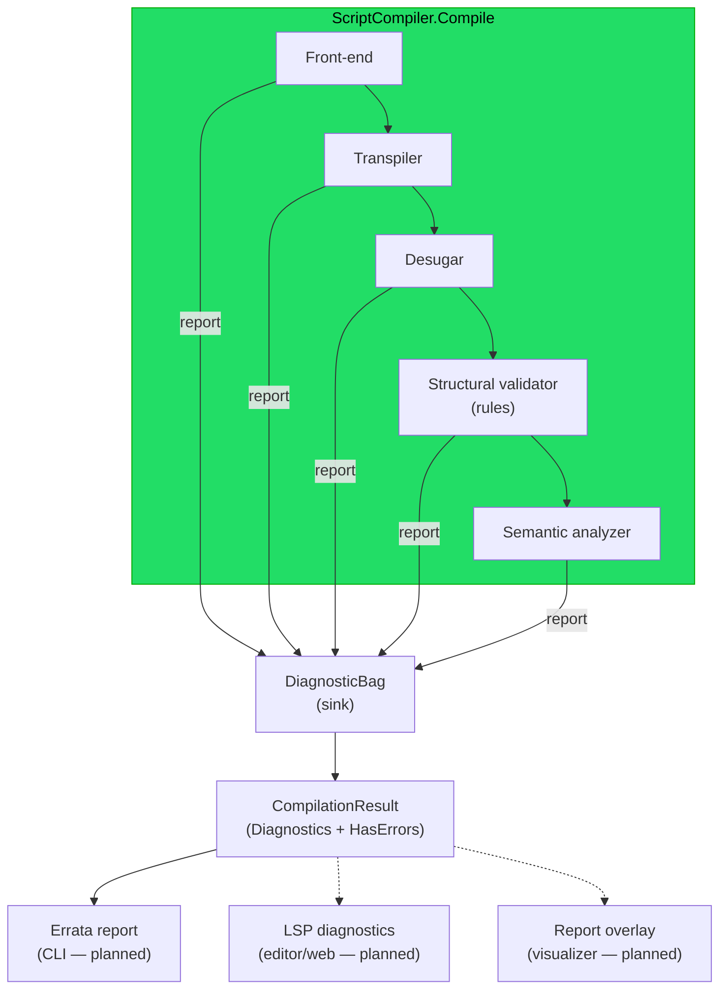
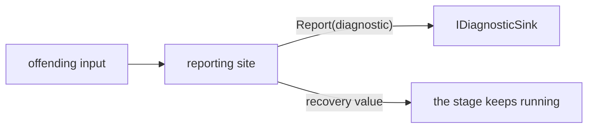

# Implementation note: Diagnostics and validation

> [!NOTE]
> Status: **in progress** — this note covers the whole diagnostics effort
> ([#43](https://github.com/pengzhengyi/godot-dialoguedown/issues/43)) as one design, built
> in components. It gives the compiler a single, structured way to **collect** every problem
> it finds (errors and warnings) instead of throwing at the first one, a **validator** that
> reports author-facing problems as rules, and a **humanized renderer** so the CLI can show
> them all at once. It evolves the throw-based [error model](./README.md#error-model) into a
> collect-and-continue model. Each component's state is tracked below.

## Component status

| Component | What it delivers | Status |
| --- | --- | --- |
| **1. Diagnostic model** | the value types that describe a located problem, and the bag that collects them | **Implemented** |
| **2. Collection seam** | a `DiagnosticsContext` threading the sink through the stages; the result surfaces what was collected | **Implemented** |
| **3. Structural validator + first rule** | the rule framework (`IDiagnosticRule` + `StructuralValidator`) and the first structural rule — multiple jumps on a line | **Implemented** |
| **4. Error reporting and recovery** | recoverable throw sites report diagnostics and recover, under a configurable compile mode | **Implemented** |
| **5. Renderer** | a `LineMap`, the CLI's Errata projection, exit codes, and the public diagnostic view | Deferred |
| **6. Editor seams** | an LSP projection and a web-report overlay | Deferred |

## Table of contents

- [Implementation note: Diagnostics and validation](#implementation-note-diagnostics-and-validation)
  - [Component status](#component-status)
  - [Table of contents](#table-of-contents)
  - [Goal and scope](#goal-and-scope)
    - [Build versus buy, and observability](#build-versus-buy-and-observability)
  - [Where it sits](#where-it-sits)
  - [Ubiquitous language](#ubiquitous-language)
  - [Relationship to the error model](#relationship-to-the-error-model)
  - [The diagnostic model — options compared](#the-diagnostic-model--options-compared)
  - [Component 1 — the diagnostic model (implemented)](#component-1--the-diagnostic-model-implemented)
  - [Component 2 — the collection seam (implemented)](#component-2--the-collection-seam-implemented)
  - [Component 3 — the structural validator (implemented)](#component-3--the-structural-validator-implemented)
  - [Component 4 — error reporting and recovery (implemented)](#component-4--error-reporting-and-recovery-implemented)
    - [Reporting and recovering](#reporting-and-recovering)
    - [The throw sites and their recovery](#the-throw-sites-and-their-recovery)
    - [The unified exception](#the-unified-exception)
    - [Pipeline integration](#pipeline-integration)
    - [Testing](#testing)
    - [Deferred and out of scope](#deferred-and-out-of-scope)
  - [Later components (deferred)](#later-components-deferred)
  - [Key design decisions](#key-design-decisions)
    - [DD1 — One offset-based core model, internal for now](#dd1--one-offset-based-core-model-internal-for-now)
    - [DD2 — Three severities; report rather than throw](#dd2--three-severities-report-rather-than-throw)
    - [DD3 — A descriptor catalog with `DLG####` codes](#dd3--a-descriptor-catalog-with-dlg-codes)
    - [DD4 — The validator is a set of pluggable rules](#dd4--the-validator-is-a-set-of-pluggable-rules)
    - [DD5 — The sink threads through the facade via a diagnostics context](#dd5--the-sink-threads-through-the-facade-via-a-diagnostics-context)
    - [DD6 — Public `HasErrors`, internal diagnostics until the renderer](#dd6--public-haserrors-internal-diagnostics-until-the-renderer)
    - [DD7 — Errata renders on the CLI, isolated to the CLI](#dd7--errata-renders-on-the-cli-isolated-to-the-cli)
    - [DD8 — LSP and web rendering are planned projection seams](#dd8--lsp-and-web-rendering-are-planned-projection-seams)
    - [DD9 — Compilation modes decide how far a compile proceeds](#dd9--compilation-modes-decide-how-far-a-compile-proceeds)
  - [Error and boundary cases](#error-and-boundary-cases)
  - [Integration](#integration)
  - [Testability](#testability)
  - [Resolved decisions](#resolved-decisions)

## Goal and scope

The compiler should be able to tell an author **everything** wrong with a script in one pass,
not just the first fault, and show each problem in a clear, located, human-readable form. This
effort introduces, in components:

- a **diagnostic model** — a structured, located report of a problem found during compilation
  (a descriptor with a stable code, a source span, a severity, and message arguments);
- a **collection seam** — a per-compilation diagnostics context carrying a sink each stage reports into, so
  compilation **collects and continues** instead of throwing at the first fault, surfacing the
  collected diagnostics on `CompilationResult`;
- a **validator** — a pluggable set of **rules** that inspect a compiled artifact and report
  diagnostics (the linter-style pass);
- a **humanized renderer** — the CLI projects diagnostics into
  [Errata](https://github.com/spectreconsole/errata) so warnings and errors print with source
  snippets, carets, colors, and codes.

The core stays **dependency-free**; the only new runtime dependency is Errata, confined to the
CLI. An **LSP** projection and a **web-report** overlay are designed as planned seams, not built.

### Build versus buy, and observability

- **Diagnostic model — build (small, in core).** No third-party model fits a dependency-free
  core cleanly; the model is a handful of value types. It takes its *shape* from Roslyn and LSP
  (see [the comparison below](#the-diagnostic-model--options-compared)) but owns the code.
- **Terminal rendering — buy (Errata).** Rendering source snippets with carets is the expensive
  part to hand-roll. Errata does it, is Spectre-based (already a CLI dependency), and stays
  confined to the CLI (see [DD7](#dd7--errata-renders-on-the-cli-isolated-to-the-cli)).
- **LSP wire types — buy later, at the edge.** When the editor surface lands, its adapter uses
  an LSP types package; the core never takes that dependency (see
  [DD8](#dd8--lsp-and-web-rendering-are-planned-projection-seams)).

**Observability is a separate concern.** A stage-tracing signal ("now entering desugar") is
*operational logging*, not an *author-facing diagnostic*, so it does not belong in this model.
If stage tracing is wanted, add it separately behind `Microsoft.Extensions.Logging`'s `ILogger`
abstraction, injected into the facade. That is out of scope here.

## Where it sits

Diagnostics are cross-cutting: every stage and the validator report into one sink, the facade
aggregates them onto the result, and each consumer projects the same structured diagnostics into
its own surface.

The core owns the model, the sink, and (later) the offset↔line/column mapping. Renderers are
**projections** of the same diagnostics; the compiler never depends on a wire format.

## Ubiquitous language

| Term | Meaning |
| --- | --- |
| **Diagnostic** | One structured, located report found during compilation: a `Descriptor` + a `SourceSpan` + a `Severity` + message **arguments**. The collect-and-continue counterpart to "throw at the first fault". |
| **Severity** | How serious a diagnostic is: `Error` (the script is invalid), `Warning` (it compiles but is suspect), or `Info` (a neutral note), ordered so `Error` is the worst. |
| **Descriptor** | The stable definition of one diagnostic *kind*: `Code`, `Title`, `MessageFormat`, `Category`, `DefaultSeverity`. Many diagnostics share one descriptor. |
| **Code** | The stable `DLG####` identifier on a descriptor — for docs, editor links, and (later) suppression. Its leading digit names its category. |
| **Category** | The kind of rule a descriptor belongs to: `Syntax` (`DLG1xxx`), `Semantic` (`DLG2xxx`), or `Style` (`DLG3xxx`). |
| **Message format** | A descriptor's template (e.g. `"Unknown speaker '{0}'."`); the renderer fills its placeholders with a diagnostic's arguments. |
| **Message arguments** | The per-diagnostic values that fill the format, kept structured (not pre-formatted) so composing the text belongs to the renderer. |
| **Diagnostic sink** | The seam (`IDiagnosticSink`) a producer reports a diagnostic into, so producers never know how diagnostics are stored. |
| **Diagnostic bag** | The concrete sink for one compilation: it collects diagnostics and hands back an immutable snapshot in report order. |
| **Diagnostics context** | The per-compilation bundle a stage receives: the original `Source` and the `Diagnostics` sink to report into. Replaces the bare `source` string threaded through the stages today. |
| **Collect and continue** | The stance the seam enables: a stage reports a recoverable problem and keeps going, so one run surfaces many problems. |
| **Validation rule** | One check (`IDiagnosticRule`) owning one descriptor: inspects an artifact and reports zero or more diagnostics. Pluggable and unit-testable in isolation. |
| **Line map** | A value that indexes the source's line starts once and converts a `SourceSpan` offset to a `LinePosition` (line, character), for the Errata/LSP projections. |
| **Unrecoverable fault** | A fault that leaves a stage unable to produce its artifact at all. It still **throws**; everything recoverable becomes a diagnostic. |

## Relationship to the error model

The [error model](./README.md#error-model) defines a throw-based exception hierarchy
(`DialogueDownException → ScriptCompilationException → SyntaxError / SemanticError`). This effort
**repartitions** faults along the recoverable axis rather than replacing that hierarchy:

- **Recoverable, author-facing problems** — a malformed jump, a tag without a speaker, a dangling
  `=>`, an unknown speaker — become **collected `Error` or `Warning` diagnostics**. Compilation
  continues, so the author sees them all.
- **Unrecoverable faults** — a stage genuinely cannot build its artifact — still **throw** a
  `ScriptCompilationException`. These are rare by design.
- **Usage errors** — a developer misusing the API (`null` argument, broken AST invariant) —
  remain standard `ArgumentException`/`ArgumentNullException`. Diagnostics are for scripts, not
  for calling code.

The two share one vocabulary: a diagnostic's **kind** (syntax vs semantic) and **location**
(`SourceSpan`) mean exactly what they mean in the error model, and the **code scheme** is the
same `DLG####` namespace. When error reporting and the renderer land, the error-model note
is updated so the README describes both channels (throw for unrecoverable, collect for the rest)
as one coherent story.

## The diagnostic model — options compared

The central choice is **how a diagnostic locates a problem**, because it must serve both the
near-term **linter** goal (collect and render during compilation) and a future **editor/LSP**
goal (a VS Code extension or the web editor consuming the same data).

| Option | Location representation | Linter fit | Editor/LSP fit | Cost |
| --- | --- | --- | --- | --- |
| **A — offset-based** | a `SourceSpan` (start + length), like every AST node | Excellent | Needs an offset→`{line, character}` projection at the edge | Low; dependency-free |
| **B — line/column-based** | a `{line, character}` range, LSP-native | Awkward — forces a line index into every producer | Direct | Line/column mapping leaks into the core; tempts a wire-format dependency |
| **C — hybrid** | offset-based core **plus** a `LineMap` projection at each surface | Excellent | Excellent, via the projection | One extra `LineMap` seam — a *rendering* component |

**Decision: A now, growing into C.** The core model is **offset-based**: a `Diagnostic` carries a
`SourceSpan`, exactly like the AST it describes, so producers report with the spans they already
hold and nothing computes line/column on the hot path. Line/column is a rendering concern, so the
`LineMap` that option C adds lands with the **renderer**, not in the model. Choosing offsets keeps
the model tiny and free of any editor or wire-format concept.

## Component 1 — the diagnostic model (implemented)

The value types that describe a located problem and the bag that collects them, in a new
dependency-free `DialogueDown.Diagnostics` module. Every type is **`internal`** (the model embeds
the internal `SourceSpan`, and nothing public consumes a diagnostic yet), so tooling with friend
access (tests, the visualization project) uses it directly.

| Type | Responsibility |
| --- | --- |
| `DiagnosticSeverity` | `Info < Warning < Error` (Error is the worst) |
| `DiagnosticCategory` | `Syntax` / `Semantic` / `Style`, naming the `DLG####` code ranges |
| `DiagnosticDescriptor` | the stable kind: `Code`, `Title`, `MessageFormat`, `Category`, `DefaultSeverity`; a guard rejects a malformed code (anchored `^DLG[0-9]{4}$`) or a code whose leading digit does not match its category |
| `Diagnostic` | one located report: `Descriptor` + `SourceSpan` + `MessageArguments` + a `Severity` that defaults from the descriptor; value equality compares the arguments element-wise |
| `IDiagnosticSink` | the report seam a producer writes to |
| `DiagnosticBag` | the per-compilation collector: an immutable snapshot in report order + a `HasErrors` convenience; a null report throws |

A **NetArchTest** rule guards the module as a foundation leaf — it may use `Common` (for
`SourceSpan`) but must not depend on any pipeline stage, so those stages can later depend on it
without a cycle. The types are unit-tested at 100% line and branch coverage.

## Component 2 — the collection seam (implemented)

The plumbing that lets the compiler collect and continue: a per-compilation diagnostics context carrying the
sink to each stage, and a result that surfaces what was collected. It adds **no producer** —
stages still throw for now; migrating them is a later component. The `DiagnosticsContext` lives in the
`DialogueDown.Diagnostics` module — the shared foundation both the stages and the facade can depend on,
since it carries the sink. See
[DD5](#dd5--the-sink-threads-through-the-facade-via-a-diagnostics-context) and
[DD6](#dd6--public-haserrors-internal-diagnostics-until-the-renderer).

| Type | Visibility | Responsibility |
| --- | --- | --- |
| `DiagnosticsContext` | internal | per-compilation bundle: `Source` + `Diagnostics` (`IDiagnosticSink`) |
| `IScriptTranspiler` / `IScriptDesugarer` / `ISemanticAnalyzer` | internal | entry methods take a `DiagnosticsContext` in place of the bare `source` string |
| `ScriptCompiler` (facade) | internal | builds one `DiagnosticBag`, threads the context, aggregates the snapshot |
| `CompilationResult` | public (record) | gains `internal Diagnostics` (report-order snapshot) and a `public HasErrors` |

Because no stage reports yet, the seam is proved end to end with a **spy stage** that reports a
diagnostic when invoked; a facade test asserts it surfaces on `CompilationResult.Diagnostics` and
flips `HasErrors`.

## Component 3 — the structural validator (implemented)

The first **producer**: a pluggable structural lint pass that inspects the desugared tree and
reports diagnostics into the sink, turning the collection seam's spy into a real diagnostic end to
end. It ships the rule framework and the one rule the desugared tree can honestly support today —
**multiple jumps on a line** — plus the first catalog entry.

| Type | Visibility | Responsibility |
| --- | --- | --- |
| `IDiagnosticRule` | internal | one check: inspect the indexed desugared tree and report zero or more diagnostics into an `IDiagnosticSink` |
| `DiagnosticRule` | internal (abstract) | base for a rule: guards its arguments, builds each diagnostic from the rule's descriptor, and hands the rule a `Reporter` closure, so a concrete rule only walks the nodes and reports a span with arguments |
| `MultipleJumpsOnLineRule` | internal | the first rule: a `Line` whose speech holds more than one `Jump` reports `DLG1003` (`Warning`), anchored on the line's span |
| `IStructuralValidator` / `StructuralValidator` | internal | the pass seam and its implementation: build the tree index once, run each composed rule over it, reporting into the sink |
| `ScriptCompiler` (facade) | internal | runs the validator over the desugared tree, between desugar and analyze, reporting into the context's sink |

Detection is purely structural: the validator builds a `DialogueTreeIndex` once and hands it to every
rule; `MultipleJumpsOnLineRule` takes each `Line` from the index and counts the `Jump` fragments
directly in its `Speech` — more than one is a `DLG1003`, and the message carries the count. Because
the validator emits a real diagnostic, the facade's collect-and-continue path is now exercised by a
genuine producer, not only a test spy. The rule reports the `DiagnosticDescriptor` it owns in the
central `DiagnosticCatalog` (per [DD3](#dd3--a-descriptor-catalog-with-dlg-codes)).

**Injection.** `StructuralValidator` sits behind an `IStructuralValidator` seam and is composed with
its rules, then injected into the facade like the other stages (wired by `ScriptCompilerFactory` and
`AddDialogueDown`), so validation is a real pipeline pass and the rule set can grow without touching
the facade.

**Shared traversal moves beneath the validator.** The rule must find every `Line`, including lines
nested in choices, without depending on the later analyzer. Two pieces that lived in
`Script.Semantics` relocated beneath the validator: the tree-walking helpers (`DescendantsAndSelf`,
`Children`) to `Script.Ast` — beside the nodes they walk — and the `DialogueTreeIndex` (which groups
a document's descendants by type) to `Script.Desugar`. Desugar, validation, and semantics now share
them without an upward dependency, and an architecture test guards that validation never reaches into
semantics. With two consumers now needing them, this is a fitting home rather than premature
generalization.

## Component 4 — error reporting and recovery (implemented)

Where the collect-and-continue model finally pays off: the compiler's recoverable **throw sites**
report a `Diagnostic` and **recover** — returning a sensible stand-in so the rest of the stage keeps
running — and a configurable **mode** decides how far a compile proceeds after an error. Together
they turn a dozen fatal exceptions into collected, located errors on the result.

Two stages own the throw sites this component migrates:

- the **transpiler** raises `DialogueSyntaxError` for a malformed line surface (syntax, `DLG1xxx`);
- the **semantic analyzer** raises `DialogueSemanticError` for meaning-level conflicts
  (semantic, `DLG2xxx`).

Every current site is **recoverable** — none is a genuine unrecoverable fault — so all twelve
migrate. Each keeps its existing message and span; only the *mechanism* changes from throw to
report-and-recover, and the two specific exception types give way to one mode-driven
`DiagnosticException` (below).

### Reporting and recovering

A reporting site needs two things the throwing code did not: a **sink** to report into, and a
**recovery value** to return.

- **Threading the sink.** The top-level stage methods already take a `DiagnosticsContext`
  ([DD5](#dd5--the-sink-threads-through-the-facade-via-a-diagnostics-context)). Each stage passes
  its `IDiagnosticSink` down to the inner builders that currently throw. A sub-pass takes an
  `IDiagnosticSink`, not the whole context — it only needs to *report*, so the narrower type keeps
  the dependency honest.
- **Recovering.** After reporting, the site returns a value that keeps the model coherent: a
  duplicate is dropped in favor of the first, a missing jump resolves to an `UnresolvedJump`, a
  speaker-less line falls back to the default speaker. The recovery is chosen so later passes see a
  *valid, if diminished*, artifact and keep collecting their own diagnostics.
- **Staying mode-agnostic.** A site always reports and then returns its recovery value; it never
  decides *whether* to stop. That decision belongs to the **mode**
  ([DD9](#dd9--compilation-modes-decide-how-far-a-compile-proceeds)), which lives in the sink and
  the facade — so the same site code serves every mode.

### The throw sites and their recovery

**Transpiler — syntax (`DLG1xxx`, `Error`):**

| Site              | Trigger                                                            | Code      | Recovery value                                                                 |
| ----------------- | ------------------------------------------------------------------ | --------- | ------------------------------------------------------------------------------ |
| speaker builder   | a line has tags but names no speaker                               | `DLG1101` | drop the tags; recover the line to the default speaker                         |
| game-call builder | a code span is not a valid game call                               | `DLG1102` | keep the span's inner text as a literal text fragment                          |
| label/alt policy  | a link, image, code span, or break sits inside a label or alt text | `DLG1103` | drop the disallowed element; keep the surrounding text and styling             |

**Semantic analyzer — semantic (`DLG2xxx`, `Error`):**

| Site           | Trigger                                                                     | Code      | Recovery value                                                                 |
| -------------- | --------------------------------------------------------------------------- | --------- | ------------------------------------------------------------------------------ |
| anchor table   | two headings slug to the same anchor — identical titles are the common case | `DLG2001` | keep the first scene for the anchor; the duplicate is not a jump target        |
| scene builder  | a heading has no sluggable text for an anchor                               | `DLG2002` | build the scene but register no anchor, so nothing can jump to it              |
| speaker binder | a name and an `@id` already name different speakers                         | `DLG2003` | keep the name's speaker; ignore the conflicting id link                        |
| speaker binder | an `@id` is already bound to another name                                   | `DLG2004` | keep the existing id binding; ignore the new name                              |
| speaker binder | a name is already bound to another `@id`                                    | `DLG2005` | keep the first id; ignore the later one                                        |
| speaker binder | two speakers both claim `##default`                                         | `DLG2006` | keep the first default; ignore later marks                                     |
| speaker binder | an `@id` is used but never given a name                                     | `DLG2007` | keep the id's speaker as an unnamed placeholder so id references still resolve |
| tag validator  | a `##tag` is not a known reserved tag                                       | `DLG2008` | leave the tag inert, treated like a custom tag                                 |
| jump resolver  | a jump targets an anchor no scene owns                                      | `DLG2009` | resolve it to an `UnresolvedJump`; keep resolving the rest                     |

Same-titled headings are the everyday form of `DLG2001`: a heading's anchor is its slug, and
DialogueDown deliberately **does not** auto-disambiguate duplicates the way GitHub appends `-1`, so
two headings with the same title (or any two titles that slug alike) claim one anchor and the
second is reported and dropped as a jump target.

The codes are added to the central `DiagnosticCatalog` (per
[DD3](#dd3--a-descriptor-catalog-with-dlg-codes)); each reporting site reports by referencing the
descriptor it owns there, and a test enforces that every code is unique.

### The unified exception

The two message-only exception types (`DialogueSyntaxError`, `DialogueSemanticError`) are
**retired**: a reporting site no longer throws, and *fail-fast* mode throws a single
**`DiagnosticException`** that carries the full `Diagnostic` (code, span, arguments) rather than a
bare message. One exception type serves every site because the diagnostic already names the problem.
Their now-childless abstract branches (`SyntaxError`, `SemanticError`) are removed with them; the
base `ScriptCompilationException` hierarchy stays for any genuinely unrecoverable fault a future
stage may hit.

### Pipeline integration

- **Transpiler / analyzer:** the inner builders and passes gain an `IDiagnosticSink` parameter and
  a recovery return where they used to throw. The transpiler entry and `SemanticAnalyzer.Analyze`
  already hold the context, so they pass `context.Diagnostics` down.
- **Facade:** the mode (from `CompilerOptions`) shapes the sink and the stage loop — a throwing sink
  for *fail-fast*; the collecting bag plus a **stage-boundary check** (halt when a stage reported an
  error) for the default; and run-every-stage for *best-effort* (see
  [DD9](#dd9--compilation-modes-decide-how-far-a-compile-proceeds)).
- **Result:** under the default mode a script with a bad jump or a duplicate anchor no longer throws
  out of `Compile`; it returns a `CompilationResult` whose `Diagnostics` carry the errors and whose
  `HasErrors` is true.
- **Visualizer:** a stage-boundary halt yields a partial result, and the visualizer projects it
  directly — the produced stages render as graphs while each unproduced stage becomes a disabled
  tab (see [Unavailable Stage Tabs](./Unavailable%20Stage%20Tabs.md), resolving
  [#111](https://github.com/pengzhengyi/godot-dialoguedown/issues/111)).
- **CLI (next component):** with the stages reporting, the CLI can render the collected diagnostics
  and set an exit code — the reason this component comes before CLI notification.

### Testing

- **Each reporting site** is unit-tested: feed the triggering input, assert the reported descriptor
  and span, and assert the recovery value lets the stage return a coherent artifact.
- **Each mode** is covered: *fail-fast* throws a `DiagnosticException` at the first error;
  *stage-boundary* (default) collects a stage's errors together and halts at the boundary;
  *best-effort* collects across stages. A script with *several* independent problems surfaces the
  right set for its mode through `ScriptCompilerFactory`.

### Deferred and out of scope

- **Warnings as errors.** Every mode keeps warnings as warnings today; promoting them, so an
  advisory like `DLG1003` can fail a build, is a planned per-run toggle — not built.
- **Dangling `=>` (`DLG1002`).** DD4 assigns the dangling jump arrow to a desugar producer, but it
  is a *new detection* (desugar degrades `=>` to text today), not a throw migration — kept out of
  this component's scope unless folded in.

## Later components (deferred)

- **Desugar producer for a dangling `=>`** — a linkless arrow is degraded to plain text today, so
  reporting it needs desugar to record that it dropped an arrow (see the corrected
  [DD4](#dd4--the-validator-is-a-set-of-pluggable-rules)). Deferred; not part of the producers
  component above.
- **Renderer** ([DD7](#dd7--errata-renders-on-the-cli-isolated-to-the-cli)) — a `LineMap`
  (offset→line/column), the CLI's Errata projection with exit codes and warnings switches, and the
  **public** diagnostic view built on the `LineMap`.
- **Editor seams** ([DD8](#dd8--lsp-and-web-rendering-are-planned-projection-seams)) — an LSP
  projection and a web-report diagnostics overlay, plus a front-end record of **dropped unmodeled
  Markdown** so it can be reported (today an `Ignore`d node leaves no trace).

## Key design decisions

### DD1 — One offset-based core model, internal for now

A `Diagnostic` locates a problem with a `SourceSpan` (offsets), the same value every AST node
carries ([option A](#the-diagnostic-model--options-compared)). Because `SourceSpan` is `internal`,
the model that embeds it is `internal` too — and that is the right default anyway: nothing public
consumes a diagnostic yet, so a public type would be speculative API. The test and visualization
projects have friend access, so they use the model directly. When the **renderer** surfaces a
public diagnostic view, it builds a line/column projection through a `LineMap`, so `SourceSpan`
can stay internal (see [DD6](#dd6--public-haserrors-internal-diagnostics-until-the-renderer)).

### DD2 — Three severities; report rather than throw

Severity is `Error`, `Warning`, or `Info`, ordered so `Error` is the worst — enough to answer
"did anything fail?" (`HasErrors`) and "what is the worst?". A stage or rule **reports** a
diagnostic rather than only throwing, so a run can surface many problems at once and
`CompilationResult` is returned with its diagnostics even when errors are present (**partial
compilation**). *How far* a compile proceeds after an error is a configurable **mode**
([DD9](#dd9--compilation-modes-decide-how-far-a-compile-proceeds)); only *fail-fast* still throws.
Each **diagnostic carries its own severity**, defaulting from its descriptor's `DefaultSeverity` —
a field now, so a future configuration pass can promote or demote one without reshaping the model.
The **diagnostic and descriptor are immutable value types** (records), safe to share and compare; a
diagnostic compares equal to another reporting the same problem, matching its **message arguments by
value** (element-wise). The **bag is the only mutable piece**, and only during one compilation.

### DD3 — A descriptor catalog with `DLG####` codes

Every diagnostic kind is a stable `DiagnosticDescriptor` carrying a `DLG####` code, assigned from
**category ranges**: `DLG1xxx` syntax, `DLG2xxx` semantic, `DLG3xxx` style — so a code's range
names its kind, and the descriptor validates that the two agree (an anchored `^DLG[0-9]{4}$` shape
plus a leading-digit check). Codes make a diagnostic greppable, documentable, linkable from an
editor, and (later) suppressible. The descriptor also owns a **message format** template; a
diagnostic carries the **arguments** that fill it, so composing the final text is a rendering
concern, never the model's — leaving room for localization later. The model defines the code
scheme and the descriptor type; the real descriptors live in one central `DiagnosticCatalog`, so
the codes stay greppable and documentable and a test can enforce that each is unique — each entry
arriving alongside the producer that reports it.

### DD4 — The validator is a set of pluggable rules

Validation is **rule-based**, like Roslyn analyzers or ESLint rules: each `IDiagnosticRule` owns
one descriptor, inspects an artifact, and reports into the sink. A registry composes the rules the
`StructuralValidator` runs, so each check is independently unit-testable and rules are added without touching
the pipeline. Rules split by what they need to see:

- **Structural rules** need only the **desugared AST** — no resolved model. They run in the
  `StructuralValidator` pass. The first rules are all structural.
- **Semantic rules** would need the **semantic model** and can only run after the analyzer. A
  **planned seam**, not built.

A **hard semantic error** — a jump whose target does not exist, a speaker that never resolves — is
**not** a rule: it is produced by the **semantic analyzer** inline as it resolves references,
because the analyzer already does that resolution. Validation you can do *before* a model exists is
structural; validation that *needs* the model is the analyzer's own output.

The first structural rule targets a problem the desugared tree can honestly reveal:

| Rule | Code | Severity | Trigger | Status |
| --- | --- | --- | --- | --- |
| Multiple jumps on a line | `DLG1003` | `Warning` | more than one `Jump` fragment in a `Line`'s speech | **First rule** |

The other candidates once listed here are **not** desugared-tree structural rules, so they move
elsewhere — checking how the pipeline actually represents each condition reclassified them:

| Candidate | Why it is not a structural rule | Where it belongs |
| --- | --- | --- |
| Dangling jump arrow (`DLG1002`) | desugar rewrites a linkless `=>` into plain `Text("=>")` with no provenance, so the desugared tree cannot tell it from ordinary text | **Deferred** — a later desugar reporting site emits it where it degrades the arrow |
| Tag without a speaker (`DLG1101`) | the transpiler already **throws** `DialogueSyntaxError` for tags naming no speaker; the desugared tree never carries it | **Error reporting and recovery** — migrate that throw to a reported diagnostic |
| Dropped unmodeled Markdown (`DLG3001`) | an `Ignore`d node is dropped in the front-end and leaves no marker, count, or trace to detect | **Editor seams / future** — needs the front-end to record drops first |

### DD5 — The sink threads through the facade via a diagnostics context

The sink reaches the stages through a small **`DiagnosticsContext`**, not by adding a parameter to
every method. Each stage's entry method already takes the raw `source`
(`Transpile(markdown, source)`, `Desugar(script, source)`, `Analyze(desugared, source)`); this
replaces that bare `source` with a `DiagnosticsContext { Source, Diagnostics }` at the **stage
boundary only** — one signature change per stage, reusing the seam already there. Stages read
`context.Source` where they read `source` today; a producer later reports into
`context.Diagnostics`, typed as the write-only `IDiagnosticSink` so a stage can report but never
read the bag. The parser's `Parse(source)` is unchanged — its `source` is the input to parse, not a
threaded channel.

Three deliveries were weighed: a per-method sink parameter (too invasive), constructor injection
(stages are stateless singletons; a per-compilation bag would force a scoped lifetime), and a
**context at the stage boundary** (**chosen**). The facade creates **one `DiagnosticBag` per
compilation**, wraps it with the source into a context, passes that to each stage, and after the
stages run reads the bag's snapshot onto the result — the write/read split keeps stages as
producers only. Internal parsers and builders keep their `ParseResult` shape; only the stage
boundary learns about the context.

### DD6 — Public `HasErrors`, internal diagnostics until the renderer

`Diagnostic` is `internal` but `CompilationResult` is `public`, so the result exposes the collected
diagnostics as an **internal** member (friend assemblies and tests read them) plus a **public
`HasErrors`**. Three options were weighed: an internal snapshot + public `HasErrors` (**chosen**);
a public diagnostic DTO now (front-loads the public API and forces an offsets-vs-line/column choice
with no `LineMap` yet); and making the CLI a friend (leaks internal compiler types across a
boundary the architecture tests guard). The public *projection* of a diagnostic — most naturally a
line/column view built by the renderer's `LineMap` — lands with the **renderer**, so `SourceSpan`
stays internal and no speculative public contract is frozen now. `HasErrors` is enough for a
consumer to branch on failure (a CLI exit code) before the renderer lands.

### DD7 — Errata renders on the CLI, isolated to the CLI

The CLI already depends on Spectre.Console, so **Errata** (same author, Spectre-based) renders
diagnostics with source snippets and carets at near-zero extra footprint. The renderer maps each
`Diagnostic` to an Errata diagnostic with a label at its span (resolved through a `LineMap` over
the source) and colors it by severity. Errata is **pre-1.0**, so it is pinned and confined to the
CLI project; the core and its model never see it. If its preview status becomes a problem, the same
projection can target hand-rolled Spectre.Console panels without touching the core.

### DD8 — LSP and web rendering are planned projection seams

An editor/web surface consumes the **same** diagnostics through a projection that maps the core
model to LSP `Diagnostic`:

| Core | LSP `Diagnostic` |
| --- | --- |
| `Span` via `LineMap` | `range` (`start`/`end` as line/character) |
| `Severity` | `severity` (`Error`→1, `Warning`→2, `Info`→3, LSP `Hint`→4) |
| `Descriptor.Code` | `code` |
| — | `source` = `"dialoguedown"` |

The projection and any LSP package live in a **future adapter**, not the core. The model plus a
`LineMap` is enough to produce LSP ranges when the editor arrives. An LSP `Hint` is not a core
severity; it would appear only in this projection.

### DD9 — Compilation modes decide how far a compile proceeds

Reporting-and-recovering lets a stage continue past an error, but continuing blindly through every
stage piles cascading noise onto unreliable material. So *how far* a compile proceeds is a **mode**,
chosen through `CompilerOptions`:

| Mode | Behavior | For |
| --- | --- | --- |
| **fail-fast** | stop at the first error — the sink throws a `DiagnosticException` carrying the diagnostic | a quick "is it broken?" check |
| **stage-boundary** (default) | within a stage, recover and collect **every** error; at the stage boundary, halt if that stage reported any error, because its output no longer reliably feeds the next stage | everyday compiles — one stage's errors together, no downstream noise |
| **best-effort** | recover through **every** stage and collect everything | tools that want the fullest picture, such as an editor |

The mode lives in the **sink and the facade**, never in a reporting site: a site always reports and
returns its recovery value, so one throwing sink implements *fail-fast* while the collecting
`DiagnosticBag` plus a facade stage-boundary check implements the other two. Warnings never fail a
compile today; a **warnings-as-errors** promotion is a planned toggle, not built.

## Error and boundary cases

| Case | Behavior |
| --- | --- |
| Malformed code / range ≠ category | `DiagnosticDescriptor` throws `ArgumentException` — a usage error (a developer mis-defined a descriptor). |
| Empty bag | `Diagnostics` is empty; `HasErrors` is false. |
| Info/Warning only | `HasErrors` is false — only an `Error` flips it. |
| `null` diagnostic reported | `ArgumentNullException` — a usage error. |
| Snapshot immutability | the bag hands back a detached snapshot; a later report never changes a snapshot taken earlier. |
| Clean compile, no producer | `Diagnostics` is empty; `HasErrors` is false; a complete result. |
| Null source or sink into `DiagnosticsContext` | `ArgumentNullException`. |
| Errors present (later, once producers report) | a **partial** `CompilationResult` is still returned with all diagnostics; `HasErrors` is true. |
| Message argument/format mismatch | not checked in the model — composing the message is the renderer's job, so a mismatch surfaces at render time. |

## Integration

- **Core** (`DialogueDown`): the model module (done); then `DiagnosticsContext`, the stage
  signature change, the facade building and threading the bag, and `CompilationResult` gaining
  `Diagnostics` (internal) + `HasErrors` (public). No new runtime dependency.
- **Facade** (`ScriptCompiler`): creates the bag, threads it, runs the validator, and aggregates
  the diagnostics onto the result.
- **CLI** (`DialogueDown.Cli`): later adds Errata; `compile` renders `Diagnostics` and derives its
  exit code from the worst severity plus the warnings switches.
- **Error-model note** (`README.md`): later updated so the cross-cutting error section describes
  both channels — throw for unrecoverable, collect for the rest — as one model.
- **Visualization**: a diagnostics overlay on the report's Source tab, reusing the spans it renders.

## Testability

- **Model** — pure value types and an in-memory collector: descriptor code validation by category,
  severity order, the diagnostic's defaulting severity and element-wise argument equality, and the
  bag's ordered collection, detached snapshot, `HasErrors`, and null-report guard. A **NetArchTest**
  rule pins the foundation-leaf boundary. Built at 100% line and branch coverage.
- **Collection seam** — a **spy stage** reports a diagnostic when invoked; a facade test asserts it
  surfaces on `CompilationResult.Diagnostics` and flips `HasErrors`. A clean compile is empty and
  `HasErrors` is false. Existing stage/facade tests thread a `DiagnosticsContext` through a shared
  `DiagnosticsContextFactory` object mother, so the signature change touches one test helper.
- **Rules and the validator** — each rule is unit-tested in isolation: feed a small desugared
  artifact and assert the emitted descriptor, severity, and span. The `StructuralValidator` pass is
  tested separately — it builds one shared index and runs each composed rule over it — and an
  integration test through `ScriptCompilerFactory` confirms a two-jump line surfaces `DLG1003` end
  to end. A **NetArchTest** rule pins that validation never depends on the semantic layer. Built at
  100% line and branch coverage.
- **Renderer** (later) — assert the mapping (severity→kind, span→label via `LineMap`, code,
  message) against an injected `IAnsiConsole`, not rendered pixels.

Tests build dependencies through shared factories and use multi-line raw string literals for
script inputs so the parsed shape is visible.

## Resolved decisions

- **Severity set.** The core stays `Error`/`Warning`/`Info`. An LSP `Hint` is not a core severity;
  it appears only in the LSP projection.
- **Code numbering.** Category ranges from the start — `DLG1xxx` syntax, `DLG2xxx` semantic,
  `DLG3xxx` style.
- **Model visibility.** The model types are `internal` for now, not public; the public surface is a
  later `HasErrors` plus a renderer-built projection ([DD1](#dd1--one-offset-based-core-model-internal-for-now),
  [DD6](#dd6--public-haserrors-internal-diagnostics-until-the-renderer)).
- **Message shape.** A descriptor owns a message-format template; a diagnostic carries structured
  arguments — the final text is composed by the renderer, not stored in the model.
- **Exception conversion scope.** Land the model and the collection seam first, then migrate the
  recoverable throw sites to diagnostics in a clean follow-up, rather than converting them all at
  once.
- **Rule configuration.** Design the `dialogue.toml` rule-severity seam later, mirroring how the
  unmodeled-handling policy defers its configuration reader.
- **CLI switch names.** Keep `--max-warnings` and `-Werror`/`--warnings-as-errors`.
