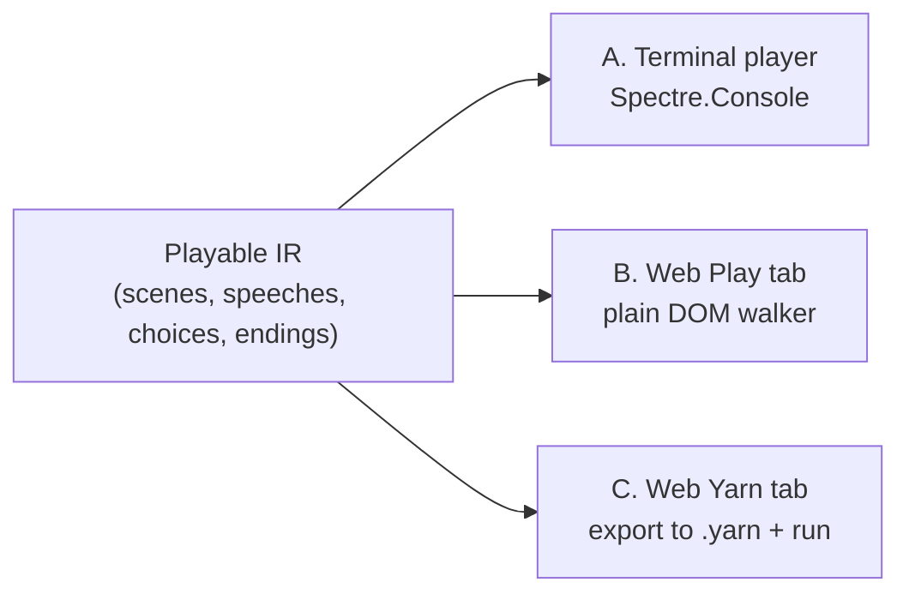

# Interactive Playthrough

> [!NOTE]
> Status: **explored — not adopted**. This note records an exploration spike:
> three prototypes were built and evaluated, but none is merged. It captures the
> directions tried, the tradeoffs found, and enough implementation guidance to
> reproduce whichever approach the project later adopts.

The compiler's visualization renders each stage as a graph — precise, but a poor
way to answer *"does this dialogue actually play?"*. This note explores a
lighter, human check: **play the dialogue as an old-school text adventure** —
read a line, pick a choice, follow the jump, reach an ending — so branching and
reachability can be validated by feel rather than by reading a graph.

## Table of contents

- [Goal and scope](#goal-and-scope)
- [Two philosophies](#two-philosophies)
- [Directions attempted](#directions-attempted)
  - [A. Terminal player](#a-terminal-player)
  - [B. Web Play tab](#b-web-play-tab)
  - [C. Web Yarn Spinner tab](#c-web-yarn-spinner-tab)
- [Tradeoffs discovered](#tradeoffs-discovered)
- [Findings worth keeping](#findings-worth-keeping)
- [Evaluation and recommendation](#evaluation-and-recommendation)
- [Implementation guidance](#implementation-guidance)
  - [Shared: a small playable IR](#shared-a-small-playable-ir)
  - [Reproduce A — terminal player](#reproduce-a--terminal-player)
  - [Reproduce B — web Play tab](#reproduce-b--web-play-tab)
  - [Reproduce C — web Yarn Spinner export and run](#reproduce-c--web-yarn-spinner-export-and-run)
- [Open questions if adopted](#open-questions-if-adopted)

## Goal and scope

The [Compilation Visualization](./Compilation%20Visualization.md) and
[Semantic Model Visualization Tab](./Semantic%20Model%20Visualization%20Tab.md)
show a script's *structure*. A playthrough answers a different question: **can a
reader walk every branch to an ending, and do the lines connect sensibly?** That
is validation by playing, not by inspecting.

In scope for the spike: a minimal, choice-based player driven by a small dialogue
model — dialogue lines, a branch (choices) or an ending per scene, and jumps
between scenes. Out of scope: game-state queries and commands, styling fidelity,
save/restore, and anything requiring the still-incomplete runtime.

## Two philosophies

Every candidate falls into one of two camps, and the choice between them is the
central tradeoff:

- **Render our own graph.** Walk the compiled dialogue directly. Lean, adds no
  format conversion, and validates the *real* graph. This is the better fit for
  validation.
- **Adopt an interactive-fiction (IF) engine.** Export the dialogue to an
  engine's format (Yarn, ink, Twine) and run its runtime. Battle-tested and
  shippable, but it validates the *exporter* as much as the graph, and adds a
  dependency and a translation layer.

## Directions attempted

Three prototypes were built, all fed by one hand-authored sample scenario (a
short "escape a high-rise fire" drill) expressed in a shared playable model, so
each renderer plays identical branching.



### A. Terminal player

A `dialoguedown play` command that walks the scenario in the terminal using
**Spectre.Console** — already a CLI dependency. Speeches render with markup and
color-coded speakers; each branch is an arrow-key `SelectionPrompt`; endings show
a green (safe) or red (danger) panel; a prompt offers a replay.

### B. Web Play tab

A **Play** tab appended after the Semantic Model tab in the visualization report.
A plain-DOM walker prints a scrolling transcript (markdown emphasis rendered with
the already-present `marked`), offers choice buttons, and shows tone-styled
endings with a restart. No new dependency.

### C. Web Yarn Spinner tab

A **Yarn Spinner** tab that first **exports** the scenario to classic Yarn
(`.yarn`) text, then **runs** it in the browser with **`yarn-bound`** (a wrapper
around the `bondage.js` Yarn interpreter). It demonstrates targeting the Yarn
ecosystem: option buttons drive the runtime, and endings terminate with a
restart.

## Tradeoffs discovered

| Dimension | A. Terminal (Spectre) | B. Web Play tab | C. Web Yarn (`yarn-bound`) |
| --- | --- | --- | --- |
| Philosophy | Render our graph | Render our graph | Adopt an IF engine |
| New dependency | None (Spectre already used) | None (`marked` already used) | `yarn-bound` (ISC) + `bondage.js` |
| Added bundle weight | n/a | ~0 | ~48 KB raw / ~24 KB gzip |
| Validates | The real graph | The real graph | The graph **and** the exporter |
| Where it runs | Terminal | The report (all modes) | The report (all modes) |
| Effort to build | Low | Low | Medium (export + runtime + syntax tuning) |
| Toward a shippable runtime | Low | Low | High (Yarn is a real engine) |

## Findings worth keeping

- **Spectre.Console covers the terminal for free.** `SelectionPrompt<T>` gives
  arrow-key choices and markup gives styled speech, so the terminal player needs
  no new dependency and stays out of the engine-agnostic core (it lives in the
  CLI).
- **A fixed-data preview is enough to evaluate UX.** Capturing a real report from
  `dialoguedown visualize` gave authentic stage tabs, while a hand-authored
  playable IR fed the new tabs — no dependency on the incomplete runtime.
- **`yarn-bound` sizing.** The runtime adds about **48 KB raw / 24 KB gzip** to
  the built report (measured by building with and without it).
- **The report is a single inlined file.** `vite-plugin-singlefile` disables code
  splitting and inlines everything into one HTML, so a lazy `import()` does *not*
  shrink the shipped file — it only defers parsing. A lazy, feature-gated import
  does still let the bundler dead-code-eliminate the runtime from production.
- **Side-effectful UMD imports resist tree-shaking.** Importing `yarn-bound` at
  module top level kept it in the production bundle even when the tab factory was
  dead code; only a gated dynamic import removed it.
- **Yarn syntax the runtime accepts.** `bondage.js` runs classic nodes
  (`title:` / `---` / `===`) with `->` shortcut options and indented
  `<<jump node>>`; node names cannot contain hyphens (map `-` to `_`).

## Evaluation and recommendation

For the stated goal — **validating branching** — rendering our own graph wins,
because it exercises the real compiled dialogue with no translation layer:

- **Terminal player (A)** is the fastest, lowest-risk path and adds nothing to
  the dependency set. Best first adoption.
- **Web Play tab (B)** is the leanest in-report option and reuses the existing
  visualization stack. Adopt alongside or after A when an in-browser check is
  wanted.
- **Yarn export and run (C)** is the right choice only when the goal shifts from
  *validation* to a **shippable, playable runtime**. It requires a real
  DialogueDown → Yarn exporter (and then validates that exporter), so treat it as
  a later, separate feature rather than a validation tool.

## Implementation guidance

Each subsection is a reproduce-from-scratch sketch. All three share one small
playable model.

### Shared: a small playable IR

Model a scenario as scenes; each scene has ordered speeches and then either a
branch or an ending. This mirrors the domain (scene, speech, choice, jump) while
staying small enough to hand-author or, later, to project from the semantic
model.

```ts
interface Speech { speaker: string; text: string; }
interface Choice { prompt: string; target: string; } // target = scene id
type SceneOutcome =
  | { kind: "choices"; choices: Choice[] }
  | { kind: "ending"; tone: "safe" | "danger"; summary: string };
interface Scene { id: string; title: string; lines: Speech[]; outcome: SceneOutcome; }
interface Scenario { title: string; start: string; scenes: Scene[]; }
```

### Reproduce A — terminal player

1. Add a `play` command to the CLI (`Command<PlaySettings>`, registered in the
   configurator) that resolves `IAnsiConsole` from DI.
2. Walk from `scenario.start`: render each scene's speeches, then branch on the
   outcome.
3. For a branch, use an arrow-key selection prompt; for an ending, a colored
   panel:

   ```csharp
   var chosen = console.Prompt(
       new SelectionPrompt<Choice>()
           .Title("[bold]What do you do?[/]")
           .UseConverter(choice => choice.Prompt)
           .AddChoices(branch.Choices));
   ```

4. Convert the small markdown subset (`**bold**`, `*italic*`, `~~strike~~`) to
   Spectre markup, escaping the text first so literal brackets can never be read
   as markup.
5. Guard non-interactive terminals: `SelectionPrompt` throws without a TTY, so
   check `console.Profile.Capabilities.Interactive` and exit with a friendly
   message.

Keep this in the CLI project — it depends on `Spectre.Console` and a terminal,
which the architecture tests forbid in the core.

### Reproduce B — web Play tab

1. Add an "extra tab" seam to the report app so non-stage tabs can be appended
   after the compiler stages. A minimal contract:

   ```ts
   interface ExtraTab { title: string; description: string; element: HTMLElement; }
   ```

2. Build a factory `createPlayTab(scenario): ExtraTab` that returns a mounted
   element: a scrolling transcript, choice `<button>`s per branch, and a
   tone-styled ending with a restart.
3. Render markdown emphasis with the already-present `marked`
   (`marked.parseInline`).
4. Preview with the Vite dev server, which injects sample data in development —
   no server build needed.

### Reproduce C — web Yarn Spinner export and run

1. **Export.** Emit one Yarn node per scene; map scene IDs to node names by
   replacing `-` with `_`; emit speeches as `Speaker: text`, branches as `->`
   options with an indented `<<jump node>>`, and endings as a plain line.

   ```text
   title: the_alarm
   ---
   Guide: The smoke alarm shrieks.
   -> Check the door before opening.
       <<jump the_door>>
   -> Run for the elevator.
       <<jump the_elevator>>
   ===
   ```

2. **Run.** Add `yarn-bound`, then drive it from the exported text:

   ```ts
   const runner = new YarnBound({
     dialogue: yarnText,
     startNode: "the_alarm",
     combineTextAndOptionsResults: true,
   });
   // runner.currentResult has .text, .options[], and .isDialogueEnd;
   // runner.advance(optionIndex?) advances a line or selects an option.
   ```

3. **Gate and lazy-load the runtime.** Import `yarn-bound` with a dynamic
   `import()` inside a feature-gated path so the bundler can drop it from
   production; a top-level import will not be tree-shaken.

## Open questions if adopted

- **Project the IR from the semantic model** instead of hand-authoring it, so the
  player walks the real compiled dialogue rather than a fixture.
- **Read a script argument** (`play <script>`) once the runtime lands, replacing
  the built-in sample.
- **Decide C's home.** If a shippable Yarn runtime is wanted, design the
  DialogueDown → Yarn exporter as a first-class component with its own tests,
  separate from this validation spike.
