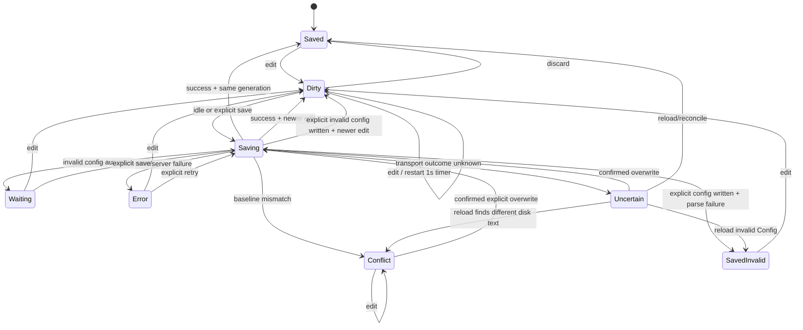

# Live visualization — autosave

> [!NOTE]
> Status: **implemented**
> ([issue #140](https://github.com/pengzhengyi/godot-dialoguedown/issues/140)).
> Reliable idle autosave in the live report, alongside explicit Save, discard,
> external-change protection, and document-specific defaults. See
> [Implementation status](#implementation-status) for what shipped.

## Table of contents

- [Goal and scope](#goal-and-scope)
- [Prior art](#prior-art)
- [Functionality checklist](#functionality-checklist)
- [Ubiquitous language](#ubiquitous-language)
- [Writer experience](#writer-experience)
- [State and flow](#state-and-flow)
- [Interfaces and responsibilities](#interfaces-and-responsibilities)
- [Key design decisions](#key-design-decisions)
- [Error and boundary cases](#error-and-boundary-cases)
- [Integration](#integration)
- [Testability](#testability)
- [Implementation status](#implementation-status)
- [Deferred and out of scope](#deferred-and-out-of-scope)
- [Open questions](#open-questions)

## Goal and scope

Add a persisted **Auto / Manual** save mode to each editable document in the
served visualization report. Source defaults to **Auto**; Config defaults to
**Manual**. Auto saves after 1 second without an edit, using the same
write-and-recompile flow as explicit Save, so graphs, symbols, configuration, and
diagnostics refresh without interrupting writing.

Autosave must not introduce overlapping writes, clear dirty state for text that
was never saved, apply a stale compile to a newer buffer, overwrite an external
change silently, or persist an invalid config without an explicit action.

## Prior art

| Editor | Relevant behavior | Lesson |
| --- | --- | --- |
| VS Code Web | Autosave defaults to `afterDelay` with a 1,000 ms delay; explicit Save remains available. Its save coordinator serializes writes, tracks document versions, and prevents stale completions from clearing dirty state. | Use a 1-second trailing debounce, a generation counter, and single-flight saves. |
| VS Code desktop | Autosave defaults off and persists as an editor setting. External modifications enter a conflict state instead of being overwritten automatically. | Persist the user's mode and require an explicit overwrite after conflict. |
| JetBrains IDEs | Save after idle and on other editor events; manual Save remains available. | Autosave is a scheduling policy, not a replacement for explicit Save. |
| Zed | Offers `off`, focus/window, and after-delay modes; defaults off. | Auto and Manual are familiar, user-controlled modes. |
| CodeMirror / Monaco | Provide change events but no file or autosave policy. | DialogueDown must own the complete save state machine. |

DialogueDown uses a hybrid default rather than copying one editor wholesale:
Source is the primary writer surface and starts Auto, while Config starts Manual
because transient TOML is often invalid while being typed.

## Functionality checklist

- [x] Add the `Auto | Manual` capsule beside the separate Save button in Edit
      mode.
- [x] Keep Save and <kbd>⌘/Ctrl-S</kbd> available in both modes.
- [x] Persist one save-mode preference per document type in `localStorage`.
- [x] Default Source to Auto and Config to Manual.
- [x] Autosave after a fixed 1,000 ms trailing-edge idle delay.
- [x] Serialize writes and coalesce edits during an in-flight save.
- [x] Never clear dirty state or apply a report when a newer edit exists.
- [x] Advance the saved baseline for every successful disk write, even when a
      newer edit already exists.
- [x] Parse Config before an automatic write; invalid TOML remains unsaved.
- [x] Compare the expected saved baseline before an automatic write.
- [x] Pause Auto on an external-change conflict; require confirmation before an
      explicit overwrite.
- [x] In Auto mode, save and await success before continuing tab, node, or View
      navigation.
- [x] Preserve Manual mode's current Save-or-Discard navigation behavior.
- [x] Show accessible save status: Unsaved, Saving…, Saved, Conflict, waiting
      for valid TOML, Saved — invalid TOML, uncertain, or failure.
- [x] Keep the existing `beforeunload` guard while dirty or saving.

## Ubiquitous language

| Term | Meaning |
| --- | --- |
| **Save mode** | `Auto` or `Manual`: when a dirty buffer is scheduled to save. |
| **Explicit save** | Save button or <kbd>⌘/Ctrl-S</kbd>; immediate in either mode. |
| **Idle save** | An automatic save after 1,000 ms without another edit. |
| **Saved baseline** | The exact source last confirmed on disk for this document. |
| **Edit generation** | A monotonically increasing number assigned to each buffer change. |
| **Save snapshot** | The source, saved baseline, generation, validation policy, and conflict policy captured when a save begins. |
| **Save trigger** | Why the client wants a save now: idle Auto, explicit Save, or navigation flush. It controls urgency, not what the server may write. |
| **Validation policy** | Require valid Config (Auto/navigation) or allow invalid Config (explicit Save). |
| **Conflict policy** | Check the expected baseline, or force overwrite after explicit confirmation. |
| **Pending save** | One in-flight write; a newer edit may require one later follow-up, never a concurrent write. |
| **Dirty** | The current buffer differs from the saved baseline. |
| **Conflict** | The disk no longer matches the saved baseline; automatic writes pause. |
| **Idempotent success** | The response was lost, but the disk already equals the requested source; retry returns success without writing again. |
| **Report stale** | The file was written, but the latest source did not produce an accepted report (for example, an explicitly saved invalid config). |
| **Saved-invalid Config** | Config text is persisted and therefore not dirty, but its parse failed and the last valid report remains stale. |
| **Uncertain** | The request may have written, but no response established the outcome; automatic work pauses until reconciliation or confirmed overwrite. |
| **Active document** | Dialogue Source (including node-inspector edits) or Config, whichever the current UI action targets. |

## Writer experience

The status bar keeps mode and action separate:

```text
Auto | Manual    Unsaved / Saving… / Saved    Discard    Save
```

- The capsule reflects the **active document's** persisted preference.
- Save is enabled whenever that document is dirty; in Auto it flushes
  immediately instead of waiting for idle.
- Discard is disabled while a save request is in flight; the controller must
  first know which snapshot reached disk.
- Discard restores the most recently saved baseline. With Auto enabled, that
  baseline advances after every successful idle save.
- A successful save briefly reports **Saved**. Failures and conflicts stay
  visible until resolved; they are never success-shaped fallbacks.
- The status uses `aria-live="polite"` so automatic writes are
  understandable without visual-only feedback.
- An explicitly persisted invalid Config reports **Saved — invalid TOML**. Its
  last valid compiled report stays marked stale.

## State and flow



One save owns the network and disk path at a time. A save captures the current
generation and source. If another edit arrives before the response:

- the response **must** update the saved baseline to the snapshot written to
  disk, so a follow-up save compares against the file it actually replaces;
- it must not clear dirty state or apply that snapshot's report to the newer
  editor buffer; and
- Auto schedules one follow-up for the latest buffer after it becomes idle.

An Auto navigation request flushes the latest generation and awaits it. On
success the original tab, node, or View transition continues automatically. On
failure, invalid Config, or conflict, navigation stays in place.

## Interfaces and responsibilities

| Type / seam | Responsibility |
| --- | --- |
| `SaveMode` | `auto` / `manual` value shared by the controller and capsule. |
| Save preference store | Read/write Source and Config modes in `localStorage`, with their distinct defaults. |
| `LiveEditController` | Own buffer, saved baseline, edit generation, dirty state, timer, single-flight save, conflict/error state, discard, and flush-before-navigation. |
| Timer seam | Schedule/cancel the 1-second idle callback; use fake timers in tests. |
| `LiveEditPorts.save` | Submit a save snapshot and return a typed outcome (`saved`, `saved-invalid`, `conflict`, `invalid-auto`, or `failure`); a transport exception yields Uncertain. Do not mutate UI before the controller accepts it. |
| Live Edit UI | Render the capsule, active-document status, Save/Discard actions, and conflict confirmation. |
| Navigation guard | Await the active document's Auto flush, or run Manual's existing discard confirmation, before executing navigation. |
| Save request | Carry source, target, validation policy, expected baseline, and explicit conflict-overwrite intent. The trigger remains client-side. |
| Live server/session | Validate Config autosaves before writing, compare the expected baseline, write, recompile, and return conflict/validation failures distinctly. |

## Key design decisions

### D1 — Trailing debounce, not throttling

Each edit restarts one 1,000 ms timer. A periodic throttle would write while the
writer is still typing and perform more recompiles without improving durability.
The fixed delay matches VS Code Web and avoids a premature configuration surface.

### D2 — Save modes are per document type and persistent

Source and Config have different safe defaults, so one global mode would be
surprising. Store two preferences:

- Source: Auto by default.
- Config: Manual by default.

The active capsule changes only the active document type's preference and the
choice persists across report sessions.

- Auto → Manual cancels a pending idle timer. An in-flight request is not
  canceled; its generation checks still determine whether it may settle clean.
  Any queued automatic follow-up is canceled, while a queued explicit Save
  remains.
- Manual → Auto schedules the current dirty buffer after the normal 1-second
  idle delay only from an ordinary Dirty state. Conflict, Waiting, and Error
  remain paused; changing mode alone is never an implicit retry. If another save
  is already running, it remains single-flight and schedules only the latest
  required follow-up.

### D3 — Explicit Save remains first-class

Auto controls scheduling only. Save and <kbd>⌘/Ctrl-S</kbd> cancel the idle timer
and request an immediate save in either mode. This remains the recovery path
after an ordinary failure and the entry point for a confirmed overwrite.

### D4 — Saves are single-flight and generation-safe

The current controller can clear dirty state using a buffer that changed while a
save awaited the server. Add an edit generation and capture a save snapshot.
Every successful write advances the saved baseline to the source that reached
disk. Only a response for the latest generation may:

- clear dirty state;
- replace graphs, diagnostics, symbols, or configuration; or
- report the editor as Saved.

Never run two save requests concurrently:

- a request with the same source, generation, validation policy, and conflict
  policy reuses the in-flight promise, regardless of whether Auto or navigation
  requested it;
- an explicit Config save never reuses an automatic Config request, because
  explicit saving may persist invalid TOML while automatic saving may not;
- a request for newer content replaces the one queued slot, so only the latest
  generation runs afterward; and
- ordinary Auto edits restart the idle timer rather than bypassing the debounce,
  unless navigation explicitly requests an immediate flush.

The queued slot follows deterministic replacement rules:

- a newer generation always replaces an older queued request and keeps the newer
  request's own write policy;
- for the same generation, explicit Save or navigation flush replaces Auto;
- for the same generation, a request with a stronger server policy replaces a
  queued weaker policy (`allow-invalid` over `require-valid`, confirmed
  overwrite over baseline check);
- a queued explicit request survives Auto → Manual only while its generation is
  still current; and
- entering Error or Conflict clears the queue. A stale `invalid-auto` outcome
  may continue with a newer queued generation because no write occurred.

Outcome handling also respects generation:

- `invalid-auto` enters Waiting only when it describes the latest generation.
  If newer Config text exists, discard that stale outcome and schedule/flush the
  latest generation according to the current mode.
- a write/server failure enters Error and cancels queued automatic work; do not
  turn newer text into a blind retry.
- a baseline mismatch enters Conflict and cancels queued automatic work,
  regardless of generation, because the disk baseline itself is no longer safe.
- a transport exception after dispatch enters Uncertain and clears the queue,
  because the client cannot know whether the disk write committed.

A replaced queued request resolves as `superseded`; its caller re-evaluates the
current controller state instead of assuming that its original snapshot saved.

When an automatic Config request is already in flight and an explicit request
for the same generation arrives:

- an automatic success also satisfies the explicit request;
- `invalid-auto` runs the queued explicit allow-invalid request; and
- conflict, failure, or Uncertain cancels the queued request and enters that
  paused state.

### D5 — Config Auto validates before writing

Explicit Config Save keeps today's deliberate force-write behavior. Malformed
TOML is written, and the load error is surfaced. The controller advances the
saved baseline and clears disk-dirty state because the buffer is persisted, but
the last valid report remains visibly stale until the config becomes valid.

If a newer edit arrived during that save, the written invalid snapshot still
becomes the saved baseline, but the newer buffer remains dirty. With no newer
edit, the controller enters **Saved — invalid TOML**: navigation is allowed
because no work is unsaved, while the stale-report cue remains visible.

Auto is unattended and therefore uses validate-before-write:

- valid TOML writes and recompiles;
- invalid TOML writes nothing, stays dirty, and enters **Waiting for valid
  TOML**;
- another edit restarts the idle timer.

### D6 — Autosave is optimistic, not last-write-wins

Every non-forced save carries the saved baseline it expects on disk. The server
first compares the disk with the requested source:

- if they already match, return an idempotent success (the earlier response may
  have been lost). Recompile it: valid content returns `saved`; invalid Config
  returns `saved-invalid`;
- otherwise compare the disk with the expected baseline;
- a baseline mismatch returns a conflict and writes nothing.

Auto pauses in conflict. Explicit Save asks before retrying with conflict
overwrite; this intent is distinct from allowing an invalid Config to be written.
The alternative is **Reload from disk**, which replaces the buffer and establishes
the external content as the new saved baseline. Ordinary Discard never restores a
stale pre-conflict baseline. A compare/diff editor is deferred.

This concurrency is genuinely *optimistic* and honest about what is portable. A
per-path in-process lock serializes this process's own writes, so two concurrent
in-process saves from the same baseline settle as one write and one conflict — no
lost update. Against a *separate* process (an external editor) the baseline read
and the commit are distinct steps rather than one held OS lock, which keeps the
commit a portable, cross-volume-safe atomic rename. That narrow window is covered
by the baseline check plus the on-disk watcher (an external change is reported as a
conflict), and every write is staged to a same-directory temp file and moved
atomically over the target, so a reader ever sees only the whole old file or the
whole new file and a failed write leaves the original intact — never a partial or
truncated document.

Reload recompiles the external text. Valid text enters Saved; invalid Config
enters Saved — invalid TOML with a stale report; a missing file remains Conflict
and offers confirmed recreation through explicit overwrite.

Uncertain uses the same reconciliation action. Reload identifies what reached
disk; confirmed overwrite writes the current buffer. No automatic retry or queued
save runs while the outcome is unknown.

### D7 — Auto navigation flushes; Manual navigation prompts

The existing synchronous boolean navigation guard cannot await autosave. Replace
it with an asynchronous request boundary used by tab changes, node selection,
and Edit→View switching:

- Auto: save the latest generation, await success, then execute the requested
  transition.
- Manual: preserve the current save-or-discard decision.

Only one pending navigation intent executes after a flush; later requests replace
the earlier intent rather than replaying several stale clicks. Navigation never
retries a paused state: Waiting and Error require an edit or explicit Save;
Conflict and Uncertain require Reload from disk or confirmed overwrite, and
further edits do not unpause them. Entering a paused state clears the pending
navigation; recovery never replays an old transition automatically.

If navigation begins while a save is already running:

- Auto awaits it and, if newer edits exist, flushes the latest generation before
  continuing.
- Manual awaits it; if newer edits remain afterward, the existing Save-or-Discard
  decision runs for those edits.
- Failure, Waiting, or Conflict keeps navigation in place.
- Changing save mode clears a pending navigation intent; a later navigation uses
  the mode active when that request is made.

### D8 — Do not save on unload

Browsers cannot reliably await a network write during unload. Keep the existing
`beforeunload` warning while dirty or saving; idle and explicit saves remain the
only write triggers.

### D9 — No blind retry loop

A failed automatic save stays dirty and reports failure. The next edit may
schedule another idle attempt, and explicit Save retries immediately. Do not
hammer a dead local server or permission-denied path with background retries.

## Error and boundary cases

| Case | Behavior |
| --- | --- |
| Source contains compilation errors | Save normally; diagnostics and available stages refresh. |
| Config Auto buffer is invalid TOML | Do not write; remain dirty in Waiting state. |
| Config explicit Save is invalid TOML | Write, advance the baseline, clear disk-dirty state, keep the last valid report visibly stale, and surface the load failure. |
| Config explicit invalid Save completes after a newer edit | Advance the baseline to the written snapshot, keep the newer buffer dirty, and retain the stale-report cue. |
| Edit while save is in flight | Keep dirty; discard stale report; Auto coalesces one follow-up. |
| External change while a save or reload is in flight | A disk-change epoch marks the in-flight response stale: it leaves Conflict in place and installs no baseline or report. A newer save also invalidates an in-flight reload (a save epoch), so an older reload can never overwrite the baseline a newer save just confirmed. |
| Save request matches the in-flight snapshot and server policy | Reuse the same promise, regardless of Auto/navigation urgency. |
| Explicit Config save matches an in-flight automatic snapshot | Treat it as a different write policy and queue the explicit request. |
| Explicit Config save queued behind an in-flight invalid-auto | Once the invalid-auto settles into Waiting, promote and run the queued allow-invalid explicit save (persisting the invalid TOML), so `whenIdle` and navigation never hang. |
| Save request has newer content | Replace the single queued save with the latest generation; never overlap writes. |
| Discard while save is in flight | Disabled until the write outcome identifies the new saved baseline. |
| External change before idle timer | Cancel timer, enter Conflict, write nothing. |
| External change races with request | Writes stage the full bytes in a same-directory temp file and publish them with an atomic replace that captures the target's immediately previous content into a backup. That backup is a compare-and-swap check: if it differs from the snapshot the caller decided on (an external editor wrote in the replace window), the external content is rolled back into place and the write is reported as Conflict rather than silently overwritten. A per-path in-process lock serializes this process's own concurrent saves, a create uses a no-overwrite move so an external create wins, and a confirmed overwrite stays an intentional force. The original is never truncated or partially overwritten. |
| External change restores earlier self-written content (A→B→A) | Self-write suppression is one-shot: the token covers a single watcher event, so a later external change back to that content still reloads. |
| Confirmed overwrite | Explicit request bypasses the baseline check once. |
| Reload after conflict | Replace the buffer from disk, establish it as the new baseline, clear conflict/dirty state, and refresh the report. |
| Reload external invalid Config | Establish the external text as the baseline, clear dirty/conflict, enter Saved — invalid TOML, and retain the last valid report. |
| Reload after external deletion | Keep Conflict; explicit confirmed overwrite may recreate the file. A push-side deletion or read failure carries its target (document or config) and routes through that controller's disk-change/conflict path (bumping the epoch to invalidate an in-flight save), not a banner alone, so an autosave cannot silently rewrite the deleted file. |
| Save fails | Stay dirty, show failure, do not retry until an edit or explicit Save. |
| Transport fails after dispatch | Enter Uncertain, clear queued work/navigation, and require Reload or confirmed overwrite. |
| Write cannot establish a safe disk state | The atomic replace found the target changed or deleted again between the swap and the rollback, or a post-commit verification found the published bytes gone: the newer external data and the captured backup are preserved on disk and the server returns an explicit `uncertain` outcome, which enters Uncertain (like a lost transport) rather than a no-write failure. |
| Navigate while Auto is dirty | Flush latest generation, then continue on success. The loop rechecks the mode and a cancellation signal before every follow-up flush, so an Auto→Manual switch (or a newer superseding navigation) stops the follow-up saving and cancels this navigation rather than driving stale Auto flushes. |
| Navigate while Auto is saving | Await the current save and any required latest-generation flush, then continue. |
| Navigate while Manual is saving | Await it; if newer edits remain, run the Manual Save-or-Discard decision. |
| Navigate while Auto is waiting/error/conflict/uncertain | Stay in place; do not use navigation as an implicit retry. |
| Navigate while Config is Saved — invalid TOML | Allow navigation; no work is unsaved, but the last valid report remains marked stale. |
| Reload the page while Config is Saved — invalid TOML | The served payload (initial HTML and document API) carries the invalid source and a `saved-invalid` marker, so the reloaded controller restores the stale state instead of reverting to the last valid text. |
| Navigate while Manual is dirty | Preserve the existing Save-or-Discard prompt. |
| Switch active Source/Config document | Capsule and status reflect that document's controller. |
| Close while dirty/saving | Existing browser confirmation remains the last-resort guard. |
| Node inspector edits | Use the Source controller and Source save-mode preference. |
| Config does not exist yet | No Config save controller or preference is active. After Create succeeds, the starter text is the saved baseline and Config starts with its persisted mode (Manual by default). |
| Switch Auto/Manual while waiting/error/conflict/uncertain | Update and persist the preference, but keep the state paused until the normal recovery event. |
| Edit while in Conflict or Uncertain | Update the buffer and dirty generation, but remain paused until Reload or confirmed overwrite. |
| Discard while Conflict | Unavailable; use Reload from disk or confirmed overwrite. |
| Discard while waiting/error | Restore the saved baseline and its state (`Saved` or `Saved — invalid TOML`, with the saved-invalid baseline's parse detail), then clear dirty plus the paused status. |
| Mode changes while navigation is pending | Clear the pending navigation; the writer must request it again under the new mode. |
| Save response is lost | Enter Uncertain; retrying the same snapshot can return idempotent success after reconciliation. |
| Create Config when no file exists | Create only when the expected state is absence; the starter template becomes the saved baseline. |
| Create Config response is lost | The create UI reports Uncertain without constructing a controller. Retry adopts the file when it equals the starter template; failure leaves the no-config state unchanged. Even once the session has adopted the config, a retry for that same path stays idempotent while the file is the starter template and becomes a conflict once it diverges. |
| Create Config when a different file already exists | A config-less session adopts the pre-existing `dialogue.toml` without overwriting it — valid TOML into the visualizer, invalid TOML as saved-invalid — assigns the config path, starts the config watcher, and returns a typed adopt outcome, so the frontend reloads and opens the existing Config instead of dead-ending config-less. |

## Integration

- **Live Edit state machine:** refactor `live-edit.ts` so that all save reasons
  share one generation-safe, single-flight path.
- **Status-bar UI:** extend `live-edit-ui.ts` with the save-mode capsule and save
  status; keep the separate Save/Discard controls.
- **Active document:** tab/node navigation informs the UI which controller's
  mode and status to reflect.
- **Navigation:** replace the synchronous `confirmNavigation` contract in
  `app.ts`, tree selection, and `view-edit.ts` with an asynchronous guard.
- **Server:** extend `/api/save` and `LiveSession` with the expected baseline,
  validation policy, conflict policy, and typed outcomes; the write goes through
  `AtomicFile`, which stages the full bytes in a same-directory temp file and moves
  it atomically over the target under a per-path in-process lock, so the baseline
  check and commit are one step for this process's own saves and never truncate the
  file on failure (optimistic against a separate process — see [D6](#d6--autosave-is-optimistic-not-last-write-wins)).
  Auto/explicit/navigation trigger remains client-side scheduling metadata.
- **Existing refresh paths:** an accepted save response updates stages,
  diagnostics, symbols, and configuration exactly once.
- **Hot reload:** both the dialogue document and its `dialogue.toml` are watched. An
  external change to either enters Conflict on that document's controller while Edit
  owns its buffer; in View the report re-syncs and the controller adopts the external
  content as its clean baseline, so a later Edit starts from disk rather than stale text.
  The config watcher is armed whenever a configuration applies and re-armed when one is
  created at runtime, and a save suppresses its own watcher event once (a one-shot
  token, so a later external change back to that content still reloads). Each watcher's
  debounced refresh is serialized and coalesced: a change arriving during a slow
  recompile schedules exactly one follow-up run rather than a concurrent one, so an
  older compile can never broadcast a stale report after a newer one.
- **Deferred node selection:** selecting a different node is navigation, so the Auto
  flush it awaits can recompile and rebuild the graph tabs. The selection is deferred
  by the node's stable id and resolved against the freshly installed view before it is
  applied (cancelling safely if the id no longer exists), so it never lands on the
  stale, detached node the click captured or its stale source spans.

## Testability

- **Controller unit tests:** fake timers and controllable save promises cover
  debounce reset, manual flush, single-flight behavior, edits during save, stale
  response rejection, mandatory baseline advancement, follow-up saves, failure,
  conflict/reload, discard-disabled-while-saving, save-mode changes,
  paused-state mode changes, conflict/uncertain edits, saved-invalid Config with
  and without newer edits, request-policy deduplication and precedence,
  superseded callers, pending-navigation clearing, and status.
- **Preference tests:** Source/Config defaults, per-type persistence, and active
  capsule reflection.
- **Navigation tests:** Auto await-and-continue, Manual prompt, failure/conflict
  blocking, and latest-intent behavior for tabs and nodes.
- **Server/session tests:** expected-baseline success/conflict, forced overwrite,
  idempotent lost-response recovery (including invalid Config), Config Auto
  validate-before-write, Config Manual force-write, create-if-absent
  success/conflict/failure/uncertain recovery, and self-watcher suppression.
- **Browser tests:** default Source Auto save after idle, Config Manual no-save,
  persisted toggles, explicit Save in Auto, in-flight typing, status feedback,
  external conflict, diagnostics/graph refresh, and beforeunload protection.

## Implementation status

Delivered across the seven planned increments (generation-safe single-flight core,
preference model and timer, server baseline/validation outcomes, capsule/status UI,
async navigation, browser coverage and docs, and this crosscheck).

### Achieved

- The **Auto | Manual** capsule sits beside a separate Save button and a Discard
  button in Edit, reflecting the active document (Config tab → config, else source,
  including node-inspector edits).
- Per-document-type `localStorage` preferences (`dd-save-mode-source`,
  `dd-save-mode-config`) with Source defaulting to Auto and Config to Manual.
- A fixed 1,000 ms trailing idle debounce; explicit Save and <kbd>⌘/Ctrl-S</kbd> flush
  immediately; navigation flushes without waiting for idle.
- A generation-safe, single-flight controller (`live-edit.ts`): request identity shares
  the in-flight promise; a single queued slot follows the newer-generation and
  stronger-policy precedence rules; superseded callers settle `superseded`; the saved
  baseline advances for every confirmed write and stale reports never apply to a newer
  buffer.
- Typed outcomes — `saved`, `saved-invalid`, `invalid-auto`, `conflict`, `failure`, and
  `Uncertain` from a transport exception — surfaced as accessible `aria-live` status.
- Server (`LiveSession` + both live servers): expected-baseline conflict checks,
  current-equals-requested idempotent recovery, confirmed explicit overwrite, Config Auto
  validate-before-write versus explicit allow-invalid (`saved-invalid`), a `/api/reload`
  route (loaded/invalid/missing), create-config via an exclusive `FileMode.CreateNew`
  (expected-absence create, idempotent starter-template adoption, differing-content conflict,
  and a failed create that leaves the no-config state for a retry), and a config watcher
  (alongside the dialogue watcher) that routes external `dialogue.toml` edits to a
  `reload-config` event with self-write suppression.
- Conflict Reload from disk (single-flight and generation-guarded, so a delayed reload never
  overwrites a newer edit); Discard unavailable in Conflict/Uncertain and disabled while
  saving; Discard from Waiting/Error restores the baseline and its state.
- Async navigation for tabs, tree-node selection, and Edit→View: Auto flushes and awaits the
  latest generation (looping until the buffer is clean), Manual awaits the current save before
  prompting, a Config tab with no controller yields no active save controller, paused states
  block, and the latest navigation wins.
- A queued follow-up save rebases onto the baseline its predecessor confirmed on disk, and a
  View hot reload adopts the external content as the controller's clean baseline.
- Preserved `beforeunload` guard while dirty or saving; no unload save; no background
  retry loop; the help text, changelog, and rebuilt `report.html`/`launcher.html` bundles.

### Changed from the original sketch

- The passive "file changed on disk — refresh to sync" chip from Live Edit is **replaced**
  by the explicit **Conflict** status plus a **Reload** action, because autosave must pause
  rather than silently ignore an external change. The dialogue Save is therefore no longer a
  blind force-overwrite: it is baseline-checked, with a confirmed overwrite as the escape
  hatch.
- The client `save` port returns a typed `SaveOutcome` and the server returns the payload
  with an `outcome` discriminator (200 for every negotiated outcome; 400 only for a true
  write error), rather than distinct HTTP status codes — a single client parse path owns the
  state machine.

### Correctness refinements

Follow-up fixes hardened the shipped state machine against races and reload:

- **Atomic, non-destructive writes.** `LiveSession` writes the dialogue document and
  `dialogue.toml` through `AtomicFile`, which reads the current content by an atomic
  open (no stale `File.Exists` probe, so it can never delete an externally created
  file), stages the full replacement in a same-directory temp file, and moves it
  atomically over the target. A per-path in-process lock serializes this process's own
  saves so a same-baseline race is one write and one conflict; a failed write leaves the
  original intact. Create-config likewise stages the starter template and moves it into
  place with a no-overwrite atomic move, removing the temp on failure. Concurrency is
  optimistic against a *separate* process — see [D6](#d6--autosave-is-optimistic-not-last-write-wins).
- **Save epoch invalidates a stale reload.** A reload captures a save epoch when its
  disk fetch begins; any save that starts bumps it, so a reload whose fetch predates a
  newer successful save is discarded instead of overwriting the baseline that save
  confirmed.
- **Serialized, coalesced watcher refresh.** The watcher `Debouncer` never runs its
  refresh concurrently with itself; a change arriving during a slow recompile is
  coalesced into exactly one follow-up run, so an older compile or config refresh can
  never broadcast or mutate after a newer one. The running flag is cleared in a
  `finally`, so a refresh that throws never wedges the debouncer and stops later
  on-disk changes from reloading.
- **Disk deletion/read failures route through the controller.** A push-side `problem`
  event carries its target (document or config); the client routes it through that
  controller's disk-change/conflict path (bumping the epoch) rather than a banner alone,
  so an in-flight autosave cannot silently rewrite a file that was deleted underneath it.
- **Deferred node selection by stable id.** A node selection deferred across a
  save-triggered rebuild is resolved by id against the freshly installed view (or
  cancelled when the id is gone), never applied to the stale captured node or its spans.
- **Auto navigation rechecks mode and cancellation.** The Auto flush loop rechecks the
  save mode and a cancellation signal before every follow-up flush, so an Auto→Manual
  switch or a superseding navigation stops the follow-up saving and cancels the move.
- **One-shot self-write suppression.** The watcher-suppression token for a save is
  consumed on the first event it covers, so an external change that later restores
  the same content (A→B→A) still reloads.
- **Disk-change epoch.** Each save and reload captures a disk-change epoch;
  `onDiskChange` bumps it, so a response that returns after an external change is
  treated as superseded and cannot clear Conflict or install a stale baseline/report.
- **Queued explicit after invalid-auto.** A queued allow-invalid explicit save is
  promoted and run once an in-flight invalid-auto settles into Waiting, so `whenIdle`
  and navigation never hang behind a paused state.
- **Lost create-config retry after adopt.** A retry that targets the config a session
  already adopted is idempotent while the file is the starter template and a conflict
  once it diverges, rather than throwing.
- **Invalid config survives reload.** `LiveSession` tracks the current config source
  and validity apart from the last valid visualizer; a `ConfigStatusOverlay` threads a
  `saved-invalid` marker and the invalid source into the served payload so a page
  reload restores the saved-invalid (report stale) state.

### Publication hardening

A final review pass closed the remaining races and dead ends before publication:

- **Cross-process write compare-and-swap.** `AtomicFile`'s validated write is no longer a
  blind atomic overwrite. The replace captures the target's immediately previous content
  into a backup and checks it against the snapshot the caller decided on (or the bytes just
  written); an external editor that wrote in the replace window is rolled back into place
  and reported as Conflict rather than silently clobbered — but only when the target still
  holds the bytes this write just published (see
  [Uncertain writes preserve newer external data](#post-publication-defect-fixes)). A create
  uses a no-overwrite move so an external create wins, a confirmed overwrite stays an
  intentional force, and temps and backups are cleaned on every settled path.
- **Config state published only after commit.** `SaveConfig` parses the candidate and stages
  the write inside the transaction but adopts the visualizer and config source/validity only
  after `AtomicFile` confirms the commit, so a staging failure or a conflict never leaves the
  served state ahead of disk.
- **Watcher refresh survives read failures.** `Refresh` and `RefreshConfig` catch
  `UnauthorizedAccessException` alongside `IOException`, so an unreadable file (permission
  denied, or a path that became a directory) broadcasts a targeted problem instead of
  escaping the debounced timer callback.
- **Debouncer disposal is race-safe.** A `_disposed` flag guarded by the gate — with the
  timer armed only while holding it — keeps a watcher event, a coalesced follow-up rearm, or
  a late callback from ever calling `Change` on a disposed timer.
- **Edit→View transition is cancellable.** The View⇄Edit controller carries a transition
  token rechecked after every await and before the final apply, so reasserting Edit (or a
  newer switch) during the leave-Edit flush cancels a stale drop into View.
- **Status detail is preserved and announced.** The controller exposes its current status
  message; the shared chrome reflects it and renders it inside the `aria-live` readout, and a
  page that loaded with a persisted-but-invalid config seeds the saved-invalid detail from
  `report.configMessage`.
- **No-config create adopts an existing file.** A create-config request that finds a
  *different* `dialogue.toml` at the serve root adopts it without overwriting (valid, or
  saved-invalid), assigns the config path, starts the config watcher, and returns a typed
  adopt outcome, so the session recovers into the existing configuration instead of staying
  permanently config-less.

### Post-publication defect fixes

A follow-up pass closed three defects the publication review left open:

- **Uncertain writes preserve newer external data.** `AtomicFile`'s conflict rollback could
  overwrite an even newer external write: after the atomic replace captured the displaced
  backup, it restored that backup unconditionally. It now rolls the external content back
  only when the target still holds the bytes this write just published, and a post-commit
  read verifies a clean swap actually stuck. If the target changed or was deleted again in
  that window, or the verification finds the published bytes gone, the newer external data
  and the captured backup are left on disk and a new `WriteUncertainException` is thrown
  instead of a lost update. `LiveSession` maps that to an explicit `uncertain` save outcome
  (document and config) rather than an ordinary no-write failure, and the client routes it
  into the paused Uncertain state with the server's detail message. Deterministic tests cover
  the target-changed-again, target-deleted-again, and post-commit-verification races through a
  threaded replace hook.
- **Invalid `dialogue.toml` adoption is editable.** Adopting a pre-existing but invalid
  `dialogue.toml` from a config-less session produced a report with no `configuration.file`,
  so the client never built a Config controller and the writer dead-ended. The saved-invalid
  overlay now carries the config path, the serializer synthesizes a `configuration` section
  and `file` (path plus the invalid source) when the last valid compile had no configuration,
  and `LiveSession` routes every invalid-config payload (adopt, save-invalid, reload) through
  that overlay serialization. A C# test asserts the adoption payload and the re-served page
  both carry `configuration.file`; a live browser spec adopts an invalid file as saved-invalid
  and recovers it by editing.
- **The saved-invalid baseline message survives restore.** The controller tracked the saved
  baseline's validity but not its detail message, so discard, restore, a View hot-reload
  adoption, or an invalid disk reload dropped to a saved-invalid status with no message. The
  baseline now carries its message alongside its validity and every restore path replays the
  exact detail; `adoptDisk` takes the message and the View config-reload threads
  `report.configMessage` through.

### Not implemented

- Everything under [Deferred and out of scope](#deferred-and-out-of-scope) — configurable
  delay, focus/window modes, a compare/diff resolver, Save As, background retry/backoff,
  multi-file or collaborative editing, and a client-side TOML parser.

## Deferred and out of scope

- Configurable idle delay or additional focus/window autosave modes.
- Compare/diff conflict resolution, Save As, or background backup/hot exit.
- Automatic retry/backoff without a new edit.
- Multi-file editing, collaborative editing, or graph-directed editing.
- A client-side TOML parser; Config Auto validation stays server-owned.

## Open questions

None.
