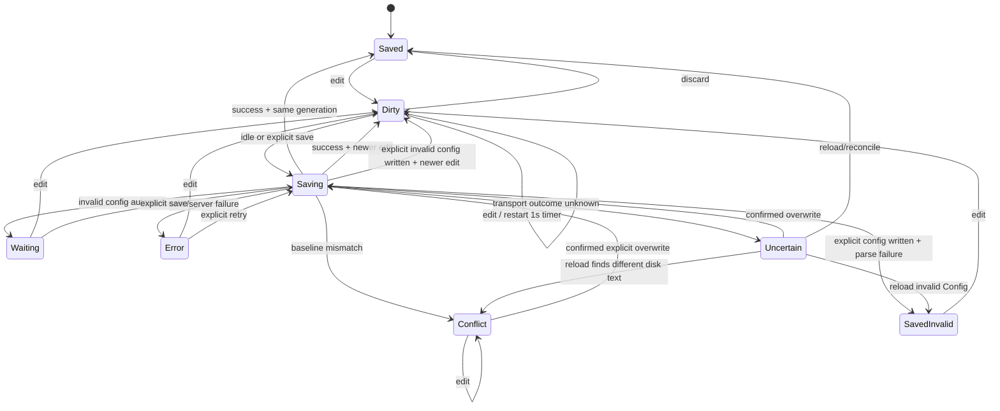

# Live visualization — autosave

> [!NOTE]
> Status: **approved — implementation in progress**
> ([issue #140](https://github.com/pengzhengyi/godot-dialoguedown/issues/140)).
> Add reliable idle autosave to the live report while preserving explicit Save,
> discard, external-change protection, and document-specific defaults.

## Table of contents

- [Goal and scope](#goal-and-scope)
- [Prior art](#prior-art)
- [Functionality checklist](#functionality-checklist)
- [Ubiquitous language](#ubiquitous-language)
- [Writer experience](#writer-experience)
- [State and flow](#state-and-flow)
- [Interfaces and responsibilities](#interfaces-and-responsibilities)
- [Key design decisions](#key-design-decisions)
- [Error and boundary cases](#error-and-boundary-cases)
- [Integration](#integration)
- [Testability](#testability)
- [Implementation increments](#implementation-increments)
- [Deferred and out of scope](#deferred-and-out-of-scope)
- [Open questions](#open-questions)

## Goal and scope

Add a persisted **Auto / Manual** save mode to each editable document in the
served visualization report. Source defaults to **Auto**; Config defaults to
**Manual**. Auto saves after 1 second without an edit, using the same
write-and-recompile flow as explicit Save, so graphs, symbols, configuration, and
diagnostics refresh without interrupting writing.

Autosave must not introduce overlapping writes, clear dirty state for text that
was never saved, apply a stale compile to a newer buffer, overwrite an external
change silently, or persist an invalid config without an explicit action.

## Prior art

| Editor | Relevant behavior | Lesson |
| --- | --- | --- |
| VS Code Web | Autosave defaults to `afterDelay` with a 1,000 ms delay; explicit Save remains available. Its save coordinator serializes writes, tracks document versions, and prevents stale completions from clearing dirty state. | Use a 1-second trailing debounce, a generation counter, and single-flight saves. |
| VS Code desktop | Autosave defaults off and persists as an editor setting. External modifications enter a conflict state instead of being overwritten automatically. | Persist the user's mode and require an explicit overwrite after conflict. |
| JetBrains IDEs | Save after idle and on other editor events; manual Save remains available. | Autosave is a scheduling policy, not a replacement for explicit Save. |
| Zed | Offers `off`, focus/window, and after-delay modes; defaults off. | Auto and Manual are familiar, user-controlled modes. |
| CodeMirror / Monaco | Provide change events but no file or autosave policy. | DialogueDown must own the complete save state machine. |

DialogueDown uses a hybrid default rather than copying one editor wholesale:
Source is the primary writer surface and starts Auto, while Config starts Manual
because transient TOML is often invalid while being typed.

## Functionality checklist

- [ ] Add the `Auto | Manual` capsule beside the separate Save button in Edit
      mode.
- [ ] Keep Save and <kbd>⌘/Ctrl-S</kbd> available in both modes.
- [ ] Persist one save-mode preference per document type in `localStorage`.
- [ ] Default Source to Auto and Config to Manual.
- [ ] Autosave after a fixed 1,000 ms trailing-edge idle delay.
- [ ] Serialize writes and coalesce edits during an in-flight save.
- [ ] Never clear dirty state or apply a report when a newer edit exists.
- [ ] Advance the saved baseline for every successful disk write, even when a
      newer edit already exists.
- [ ] Parse Config before an automatic write; invalid TOML remains unsaved.
- [ ] Compare the expected saved baseline before an automatic write.
- [ ] Pause Auto on an external-change conflict; require confirmation before an
      explicit overwrite.
- [ ] In Auto mode, save and await success before continuing tab, node, or View
      navigation.
- [ ] Preserve Manual mode's current Save-or-Discard navigation behavior.
- [ ] Show accessible save status: Unsaved, Saving…, Saved, Conflict, waiting
      for valid TOML, Saved — invalid TOML, uncertain, or failure.
- [ ] Keep the existing `beforeunload` guard while dirty or saving.

## Ubiquitous language

| Term | Meaning |
| --- | --- |
| **Save mode** | `Auto` or `Manual`: when a dirty buffer is scheduled to save. |
| **Explicit save** | Save button or <kbd>⌘/Ctrl-S</kbd>; immediate in either mode. |
| **Idle save** | An automatic save after 1,000 ms without another edit. |
| **Saved baseline** | The exact source last confirmed on disk for this document. |
| **Edit generation** | A monotonically increasing number assigned to each buffer change. |
| **Save snapshot** | The source, saved baseline, generation, validation policy, and conflict policy captured when a save begins. |
| **Save trigger** | Why the client wants a save now: idle Auto, explicit Save, or navigation flush. It controls urgency, not what the server may write. |
| **Validation policy** | Require valid Config (Auto/navigation) or allow invalid Config (explicit Save). |
| **Conflict policy** | Check the expected baseline, or force overwrite after explicit confirmation. |
| **Pending save** | One in-flight write; a newer edit may require one later follow-up, never a concurrent write. |
| **Dirty** | The current buffer differs from the saved baseline. |
| **Conflict** | The disk no longer matches the saved baseline; automatic writes pause. |
| **Idempotent success** | The response was lost, but the disk already equals the requested source; retry returns success without writing again. |
| **Report stale** | The file was written, but the latest source did not produce an accepted report (for example, an explicitly saved invalid config). |
| **Saved-invalid Config** | Config text is persisted and therefore not dirty, but its parse failed and the last valid report remains stale. |
| **Uncertain** | The request may have written, but no response established the outcome; automatic work pauses until reconciliation or confirmed overwrite. |
| **Active document** | Dialogue Source (including node-inspector edits) or Config, whichever the current UI action targets. |

## Writer experience

The status bar keeps mode and action separate:

```text
Auto | Manual    Unsaved / Saving… / Saved    Discard    Save
```

- The capsule reflects the **active document's** persisted preference.
- Save is enabled whenever that document is dirty; in Auto it flushes
  immediately instead of waiting for idle.
- Discard is disabled while a save request is in flight; the controller must
  first know which snapshot reached disk.
- Discard restores the most recently saved baseline. With Auto enabled, that
  baseline advances after every successful idle save.
- A successful save briefly reports **Saved**. Failures and conflicts stay
  visible until resolved; they are never success-shaped fallbacks.
- The status uses `aria-live="polite"` so automatic writes are
  understandable without visual-only feedback.
- An explicitly persisted invalid Config reports **Saved — invalid TOML**. Its
  last valid compiled report stays marked stale.

## State and flow



One save owns the network and disk path at a time. A save captures the current
generation and source. If another edit arrives before the response:

- the response **must** update the saved baseline to the snapshot written to
  disk, so a follow-up save compares against the file it actually replaces;
- it must not clear dirty state or apply that snapshot's report to the newer
  editor buffer; and
- Auto schedules one follow-up for the latest buffer after it becomes idle.

An Auto navigation request flushes the latest generation and awaits it. On
success the original tab, node, or View transition continues automatically. On
failure, invalid Config, or conflict, navigation stays in place.

## Interfaces and responsibilities

| Type / seam | Responsibility |
| --- | --- |
| `SaveMode` | `auto` / `manual` value shared by the controller and capsule. |
| Save preference store | Read/write Source and Config modes in `localStorage`, with their distinct defaults. |
| `LiveEditController` | Own buffer, saved baseline, edit generation, dirty state, timer, single-flight save, conflict/error state, discard, and flush-before-navigation. |
| Timer seam | Schedule/cancel the 1-second idle callback; use fake timers in tests. |
| `LiveEditPorts.save` | Submit a save snapshot and return a typed outcome (`saved`, `saved-invalid`, `conflict`, `invalid-auto`, or `failure`); a transport exception yields Uncertain. Do not mutate UI before the controller accepts it. |
| Live Edit UI | Render the capsule, active-document status, Save/Discard actions, and conflict confirmation. |
| Navigation guard | Await the active document's Auto flush, or run Manual's existing discard confirmation, before executing navigation. |
| Save request | Carry source, target, validation policy, expected baseline, and explicit conflict-overwrite intent. The trigger remains client-side. |
| Live server/session | Validate Config autosaves before writing, compare the expected baseline, write, recompile, and return conflict/validation failures distinctly. |

## Key design decisions

### D1 — Trailing debounce, not throttling

Each edit restarts one 1,000 ms timer. A periodic throttle would write while the
writer is still typing and perform more recompiles without improving durability.
The fixed delay matches VS Code Web and avoids a premature configuration surface.

### D2 — Save modes are per document type and persistent

Source and Config have different safe defaults, so one global mode would be
surprising. Store two preferences:

- Source: Auto by default.
- Config: Manual by default.

The active capsule changes only the active document type's preference and the
choice persists across report sessions.

- Auto → Manual cancels a pending idle timer. An in-flight request is not
  canceled; its generation checks still determine whether it may settle clean.
  Any queued automatic follow-up is canceled, while a queued explicit Save
  remains.
- Manual → Auto schedules the current dirty buffer after the normal 1-second
  idle delay only from an ordinary Dirty state. Conflict, Waiting, and Error
  remain paused; changing mode alone is never an implicit retry. If another save
  is already running, it remains single-flight and schedules only the latest
  required follow-up.

### D3 — Explicit Save remains first-class

Auto controls scheduling only. Save and <kbd>⌘/Ctrl-S</kbd> cancel the idle timer
and request an immediate save in either mode. This remains the recovery path
after an ordinary failure and the entry point for a confirmed overwrite.

### D4 — Saves are single-flight and generation-safe

The current controller can clear dirty state using a buffer that changed while a
save awaited the server. Add an edit generation and capture a save snapshot.
Every successful write advances the saved baseline to the source that reached
disk. Only a response for the latest generation may:

- clear dirty state;
- replace graphs, diagnostics, symbols, or configuration; or
- report the editor as Saved.

Never run two save requests concurrently:

- a request with the same source, generation, validation policy, and conflict
  policy reuses the in-flight promise, regardless of whether Auto or navigation
  requested it;
- an explicit Config save never reuses an automatic Config request, because
  explicit saving may persist invalid TOML while automatic saving may not;
- a request for newer content replaces the one queued slot, so only the latest
  generation runs afterward; and
- ordinary Auto edits restart the idle timer rather than bypassing the debounce,
  unless navigation explicitly requests an immediate flush.

The queued slot follows deterministic replacement rules:

- a newer generation always replaces an older queued request and keeps the newer
  request's own write policy;
- for the same generation, explicit Save or navigation flush replaces Auto;
- for the same generation, a request with a stronger server policy replaces a
  queued weaker policy (`allow-invalid` over `require-valid`, confirmed
  overwrite over baseline check);
- a queued explicit request survives Auto → Manual only while its generation is
  still current; and
- entering Error or Conflict clears the queue. A stale `invalid-auto` outcome
  may continue with a newer queued generation because no write occurred.

Outcome handling also respects generation:

- `invalid-auto` enters Waiting only when it describes the latest generation.
  If newer Config text exists, discard that stale outcome and schedule/flush the
  latest generation according to the current mode.
- a write/server failure enters Error and cancels queued automatic work; do not
  turn newer text into a blind retry.
- a baseline mismatch enters Conflict and cancels queued automatic work,
  regardless of generation, because the disk baseline itself is no longer safe.
- a transport exception after dispatch enters Uncertain and clears the queue,
  because the client cannot know whether the disk write committed.

A replaced queued request resolves as `superseded`; its caller re-evaluates the
current controller state instead of assuming that its original snapshot saved.

When an automatic Config request is already in flight and an explicit request
for the same generation arrives:

- an automatic success also satisfies the explicit request;
- `invalid-auto` runs the queued explicit allow-invalid request; and
- conflict, failure, or Uncertain cancels the queued request and enters that
  paused state.

### D5 — Config Auto validates before writing

Explicit Config Save keeps today's deliberate force-write behavior. Malformed
TOML is written, and the load error is surfaced. The controller advances the
saved baseline and clears disk-dirty state because the buffer is persisted, but
the last valid report remains visibly stale until the config becomes valid.

If a newer edit arrived during that save, the written invalid snapshot still
becomes the saved baseline, but the newer buffer remains dirty. With no newer
edit, the controller enters **Saved — invalid TOML**: navigation is allowed
because no work is unsaved, while the stale-report cue remains visible.

Auto is unattended and therefore uses validate-before-write:

- valid TOML writes and recompiles;
- invalid TOML writes nothing, stays dirty, and enters **Waiting for valid
  TOML**;
- another edit restarts the idle timer.

### D6 — Autosave is optimistic, not last-write-wins

Every non-forced save carries the saved baseline it expects on disk. The server
first compares the disk with the requested source:

- if they already match, return an idempotent success (the earlier response may
  have been lost). Recompile it: valid content returns `saved`; invalid Config
  returns `saved-invalid`;
- otherwise compare the disk with the expected baseline;
- a baseline mismatch returns a conflict and writes nothing.

Auto pauses in conflict. Explicit Save asks before retrying with conflict
overwrite; this intent is distinct from allowing an invalid Config to be written.
The alternative is **Reload from disk**, which replaces the buffer and establishes
the external content as the new saved baseline. Ordinary Discard never restores a
stale pre-conflict baseline. A compare/diff editor is deferred.

Reload recompiles the external text. Valid text enters Saved; invalid Config
enters Saved — invalid TOML with a stale report; a missing file remains Conflict
and offers confirmed recreation through explicit overwrite.

Uncertain uses the same reconciliation action. Reload identifies what reached
disk; confirmed overwrite writes the current buffer. No automatic retry or queued
save runs while the outcome is unknown.

### D7 — Auto navigation flushes; Manual navigation prompts

The existing synchronous boolean navigation guard cannot await autosave. Replace
it with an asynchronous request boundary used by tab changes, node selection,
and Edit→View switching:

- Auto: save the latest generation, await success, then execute the requested
  transition.
- Manual: preserve the current save-or-discard decision.

Only one pending navigation intent executes after a flush; later requests replace
the earlier intent rather than replaying several stale clicks. Navigation never
retries a paused state: Waiting and Error require an edit or explicit Save;
Conflict and Uncertain require Reload from disk or confirmed overwrite, and
further edits do not unpause them. Entering a paused state clears the pending
navigation; recovery never replays an old transition automatically.

If navigation begins while a save is already running:

- Auto awaits it and, if newer edits exist, flushes the latest generation before
  continuing.
- Manual awaits it; if newer edits remain afterward, the existing Save-or-Discard
  decision runs for those edits.
- Failure, Waiting, or Conflict keeps navigation in place.
- Changing save mode clears a pending navigation intent; a later navigation uses
  the mode active when that request is made.

### D8 — Do not save on unload

Browsers cannot reliably await a network write during unload. Keep the existing
`beforeunload` warning while dirty or saving; idle and explicit saves remain the
only write triggers.

### D9 — No blind retry loop

A failed automatic save stays dirty and reports failure. The next edit may
schedule another idle attempt, and explicit Save retries immediately. Do not
hammer a dead local server or permission-denied path with background retries.

## Error and boundary cases

| Case | Behavior |
| --- | --- |
| Source contains compilation errors | Save normally; diagnostics and available stages refresh. |
| Config Auto buffer is invalid TOML | Do not write; remain dirty in Waiting state. |
| Config explicit Save is invalid TOML | Write, advance the baseline, clear disk-dirty state, keep the last valid report visibly stale, and surface the load failure. |
| Config explicit invalid Save completes after a newer edit | Advance the baseline to the written snapshot, keep the newer buffer dirty, and retain the stale-report cue. |
| Edit while save is in flight | Keep dirty; discard stale report; Auto coalesces one follow-up. |
| Save request matches the in-flight snapshot and server policy | Reuse the same promise, regardless of Auto/navigation urgency. |
| Explicit Config save matches an in-flight automatic snapshot | Treat it as a different write policy and queue the explicit request. |
| Save request has newer content | Replace the single queued save with the latest generation; never overlap writes. |
| Discard while save is in flight | Disabled until the write outcome identifies the new saved baseline. |
| External change before idle timer | Cancel timer, enter Conflict, write nothing. |
| External change races with request | Expected-baseline check returns Conflict, write nothing. |
| Confirmed overwrite | Explicit request bypasses the baseline check once. |
| Reload after conflict | Replace the buffer from disk, establish it as the new baseline, clear conflict/dirty state, and refresh the report. |
| Reload external invalid Config | Establish the external text as the baseline, clear dirty/conflict, enter Saved — invalid TOML, and retain the last valid report. |
| Reload after external deletion | Keep Conflict; explicit confirmed overwrite may recreate the file. |
| Save fails | Stay dirty, show failure, do not retry until an edit or explicit Save. |
| Transport fails after dispatch | Enter Uncertain, clear queued work/navigation, and require Reload or confirmed overwrite. |
| Navigate while Auto is dirty | Flush latest generation, then continue on success. |
| Navigate while Auto is saving | Await the current save and any required latest-generation flush, then continue. |
| Navigate while Manual is saving | Await it; if newer edits remain, run the Manual Save-or-Discard decision. |
| Navigate while Auto is waiting/error/conflict/uncertain | Stay in place; do not use navigation as an implicit retry. |
| Navigate while Config is Saved — invalid TOML | Allow navigation; no work is unsaved, but the last valid report remains marked stale. |
| Navigate while Manual is dirty | Preserve the existing Save-or-Discard prompt. |
| Switch active Source/Config document | Capsule and status reflect that document's controller. |
| Close while dirty/saving | Existing browser confirmation remains the last-resort guard. |
| Node inspector edits | Use the Source controller and Source save-mode preference. |
| Config does not exist yet | No Config save controller or preference is active. After Create succeeds, the starter text is the saved baseline and Config starts with its persisted mode (Manual by default). |
| Switch Auto/Manual while waiting/error/conflict/uncertain | Update and persist the preference, but keep the state paused until the normal recovery event. |
| Edit while in Conflict or Uncertain | Update the buffer and dirty generation, but remain paused until Reload or confirmed overwrite. |
| Discard while Conflict | Unavailable; use Reload from disk or confirmed overwrite. |
| Discard while waiting/error | Restore the saved baseline and its state (`Saved` or `Saved — invalid TOML`), then clear dirty plus the paused status. |
| Mode changes while navigation is pending | Clear the pending navigation; the writer must request it again under the new mode. |
| Save response is lost | Enter Uncertain; retrying the same snapshot can return idempotent success after reconciliation. |
| Create Config when no file exists | Create only when the expected state is absence; the starter template becomes the saved baseline. |
| Create Config response is lost | The create UI reports Uncertain without constructing a controller. Retry adopts the file when it equals the starter template; differing content is a conflict, and failure leaves the no-config state unchanged. |

## Integration

- **Live Edit state machine:** refactor `live-edit.ts` so that all save reasons
  share one generation-safe, single-flight path.
- **Status-bar UI:** extend `live-edit-ui.ts` with the save-mode capsule and save
  status; keep the separate Save/Discard controls.
- **Active document:** tab/node navigation informs the UI which controller's
  mode and status to reflect.
- **Navigation:** replace the synchronous `confirmNavigation` contract in
  `app.ts`, tree selection, and `view-edit.ts` with an asynchronous guard.
- **Server:** extend `/api/save` and `LiveSession` with the expected baseline,
  validation policy, conflict policy, and typed outcomes. Auto/explicit/navigation
  trigger remains client-side scheduling metadata.
- **Existing refresh paths:** an accepted save response updates stages,
  diagnostics, symbols, and configuration exactly once.
- **Hot reload:** external disk events enter conflict while Edit owns a buffer;
  View mode remains read-only and auto-updating.

## Testability

- **Controller unit tests:** fake timers and controllable save promises cover
  debounce reset, manual flush, single-flight behavior, edits during save, stale
  response rejection, mandatory baseline advancement, follow-up saves, failure,
  conflict/reload, discard-disabled-while-saving, save-mode changes,
  paused-state mode changes, conflict/uncertain edits, saved-invalid Config with
  and without newer edits, request-policy deduplication and precedence,
  superseded callers, pending-navigation clearing, and status.
- **Preference tests:** Source/Config defaults, per-type persistence, and active
  capsule reflection.
- **Navigation tests:** Auto await-and-continue, Manual prompt, failure/conflict
  blocking, and latest-intent behavior for tabs and nodes.
- **Server/session tests:** expected-baseline success/conflict, forced overwrite,
  idempotent lost-response recovery (including invalid Config), Config Auto
  validate-before-write, Config Manual force-write, create-if-absent
  success/conflict/failure/uncertain recovery, and self-watcher suppression.
- **Browser tests:** default Source Auto save after idle, Config Manual no-save,
  persisted toggles, explicit Save in Auto, in-flight typing, status feedback,
  external conflict, diagnostics/graph refresh, and beforeunload protection.

## Implementation increments

1. Make manual saving generation-safe and single-flight without changing UI.
2. Add the save-mode preference model, timer, and controller autosave behavior.
3. Add server baseline conflict checks and Config Auto validation.
4. Add the capsule/status UI and active-document reflection.
5. Make navigation and Edit→View transitions await Auto flushes.
6. Add browser coverage, help text, changelog, and rebuilt report bundles.
7. Crosscheck this note against the finished behavior.

## Deferred and out of scope

- Configurable idle delay or additional focus/window autosave modes.
- Compare/diff conflict resolution, Save As, or background backup/hot exit.
- Automatic retry/backoff without a new edit.
- Multi-file editing, collaborative editing, or graph-directed editing.
- A client-side TOML parser; Config Auto validation stays server-owned.

## Open questions

None.
