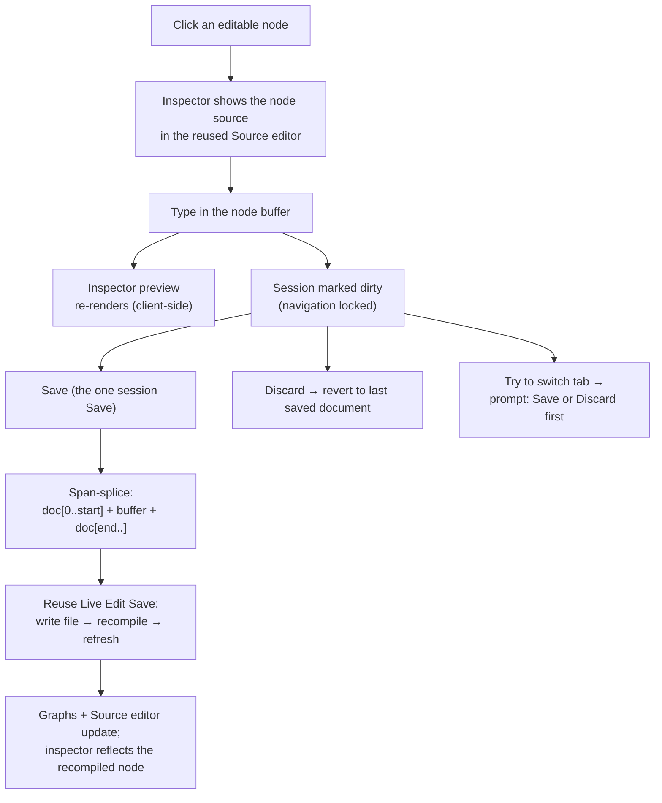

# Live Visualization — Node Editing

> [!NOTE]
> Status: **implemented** (a component of live visualization). Builds directly on
> [Live Edit](./Live%20Visualization%20-%20Live%20Edit.md): the Source tab is already an
> editor whose **Save** recompiles the graphs. This component makes the **node-details
> inspector** an editor too, so a writer can edit the exact source behind a graph node in
> place — the **preview updates as you type**, and the session's **Save** splices the
> node's text back into the document and recompiles. There is **one** document, **one**
> dirty state, and **one** Save/Discard across the whole report; the node inspector is just
> another way to edit that one document. Reuses Live Edit's save→recompile→refresh loop and
> the Source tab's editor unchanged; adds no server route.
>
> Like the rest of the visualization tooling, this surface is "vibe-coded" (see the
> visualization note's maturity caveat); the core engine stays the reviewed surface.

## Table of contents

- [Live Visualization — Node Editing](#live-visualization--node-editing)
  - [Table of contents](#table-of-contents)
  - [Goal and scope](#goal-and-scope)
  - [Ubiquitous language](#ubiquitous-language)
  - [Functionality checklist](#functionality-checklist)
  - [Interfaces and abstractions](#interfaces-and-abstractions)
  - [How a node edit flows](#how-a-node-edit-flows)
  - [Key design decisions](#key-design-decisions)
    - [D1 — Splice by offset span, never by text search](#d1--splice-by-offset-span-never-by-text-search)
    - [D2 — One editor, reused — the inspector *is* the Source editor](#d2--one-editor-reused--the-inspector-is-the-source-editor)
    - [D3 — One dirty document; navigation locks until saved or discarded](#d3--one-dirty-document-navigation-locks-until-saved-or-discarded)
    - [D4 — Save reuses the Live Edit loop; no new server route, no second Save](#d4--save-reuses-the-live-edit-loop-no-new-server-route-no-second-save)
    - [D5 — Synthetic nodes are read-only and point to the editable parent](#d5--synthetic-nodes-are-read-only-and-point-to-the-editable-parent)
    - [D6 — Preview-as-you-type, in the inspector](#d6--preview-as-you-type-in-the-inspector)
    - [D7 — Enter Edit from a graph tab](#d7--enter-edit-from-a-graph-tab)
  - [Error and boundary cases](#error-and-boundary-cases)
  - [Integration](#integration)
  - [Testability](#testability)
  - [Resolved decisions](#resolved-decisions)
  - [Follow-ups](#follow-ups)

## Goal and scope

Today the node-details inspector is a **read-only** mirror: click a node and it shows the
node's category, attributes, the **source** it was produced from, and a rendered
**preview**. In Edit mode the inspector stays read-only and the View ⇄ Edit toggle is
frozen on graph tabs, so editing means hopping back to the Source tab and hunting for the
text. This component closes that gap: **the inspector becomes an editor**, so you can
change the source *behind a node* right where you are looking at it.

The mechanism is a **span-splice**. Every Markdown-, Dialogue-, and Desugared-AST node
already carries a **source span** — a half-open `[start, end)` range into the original
document — and the exact **slice** of text at that range. Editing a node replaces that
range: `document[0..start] + edited + document[end..]`. Because the range is precise
offsets (not a text search), there is no ambiguity when the same line appears twice.

In scope:

- The inspector's **source** becomes an editor — read-only in View, editable in Edit — by
  **reusing the Source tab's editor component** so the two surfaces are the same editor with
  the same features (line numbers, folding, search, Markdown shortcuts, autocomplete, and a
  live preview).
- **Preview-as-you-type** in the inspector: each edit re-renders the node's preview from the
  node buffer, client-side, with no server round-trip (inherited from the reused editor).
- The session's single **Save** **span-splices** the node buffer into the document, then
  reuses Live Edit's Save — write the file, recompile, refresh the graphs and the Source
  editor. **Discard** reverts the node buffer to the node's current source.
- Editable wherever a node has a **real span** (a non-empty slice): the **Markdown**,
  **Dialogue**, and **Desugared** AST tabs. The **document-root** node's span covers the
  whole document, so editing it is editing the whole document — identical to the Source tab.
- **Spawning children falls out for free**: type a new line or choice into a node and the
  recompile grows the corresponding child nodes.

Out of scope (deliberate follow-ups):

- **Insert at a synthetic node.** A synthetic node (a filled default speaker) has an
  **empty** span *positioned* where it belongs (`SourceSpan.EmptyAt`), so the very same
  splice could *insert* there. This was **evaluated and rejected as redundant**: the
  node's parent line already carries a real, editable span, so naming a speaker is just
  editing that line. Synthetic nodes stay **read-only** and point the reader at the parent
  ([D5](#d5--synthetic-nodes-are-read-only-and-point-to-the-editable-parent)).
- **The Semantic tab.** Its scene-tree and tables are aggregate entities with no per-node
  span, so nodes there are not editable.
- **Editing the graph structure directly** (dragging, reconnecting). Edits are always
  textual; the graph stays a projection of the source.

## Ubiquitous language

Reuses the live-visualization and Live Edit language (**session**, **mode**, **report**,
**buffer**, **dirty**, **Save**, **stage**, **preview-as-you-type**). New or sharpened
here:

| Term | Meaning |
| --- | --- |
| **Node source** | The exact slice of the original document a node was produced from — the `[start, end)` **span** and its text. The document-root node's span covers the whole document; a **synthetic** node has none. |
| **Inspector** | The node-details side panel: category, attributes, the node source, and its preview. Now the **editable** surface, reusing the Source tab's editor. |
| **Node buffer** | The inspector editor's current text for the selected node — what you are typing. Splicing it into the document yields the session's one dirty document buffer. |
| **Span-splice** | Producing a new document by replacing a node's `[start, end)` range with the node buffer: `doc[0..start] + buffer + doc[end..]`. |
| **Navigation lock** | While the session is dirty you cannot switch tabs; a prompt asks you to **Save** or **Discard** first, so no tab ever shows stale data. |
| **Synthetic node** | A node a stage inserted with no source of its own (a filled default speaker); its span is **empty** but **positioned**. Read-only — it points at the editable parent line. |

## Functionality checklist

- [x] Selecting an **editable** node (one with a real span) shows its source in the **Source
      tab's editor** (same features) instead of a static block.
- [x] The inspector editor is **read-only in View** and **editable in Edit**, matching the
      Source tab's look and behavior.
- [x] Editing the node buffer **re-renders the inspector preview as you type** (no server).
- [x] The session shows a **dirty** marker while any editor (Source or a node) differs from
      the last saved document.
- [x] While dirty, **switching tabs is blocked** by a prompt to **Save** or **Discard**, so
      no tab shows stale data ([D3](#d3--one-dirty-document-navigation-locks-until-saved-or-discarded)).
- [x] The session's single **Save** span-splices a node edit into the document, writes the
      file, recompiles, and refreshes the graphs **and** the Source editor; the inspector
      then reflects the recompiled node. **Discard** reverts to the last saved document.
- [x] A **synthetic** node stays read-only; its note explains the insertion and points the
      reader at the editable parent line (the call to action only in a served session).
- [x] The **document-root** node is editable and edits the whole document (its span is the
      whole document).

## Interfaces and abstractions

| Type / seam | Responsibility | Collaborators |
| --- | --- | --- |
| `DisplayNode.span?` (new field) | Carries the node's structured `{ start, end }` so the client can splice. The `.NET` projection already computes the `SourceSpan`; this promotes it from a display-only `span` attribute string to a real field. The document-root node gains a whole-document span. | `DialogueAstProjection`, `MarkdownAstProjection`, `model.ts` |
| **Inspector editor** | The **reused Source tab editor** (`createSourceView`) — same features, read-only/editable, with its own live preview — hosted in the inspector. No second editor to maintain. | `source-view.ts` (reused as-is), `detail-panel.ts` |
| `spanSplice(document, span, buffer)` (new, pure) | Builds the next document by replacing a node's `[start, end)` with the node buffer. The only new logic. | `detail-panel.ts` |
| Session Save/Discard (existing) | The one dirty/save/discard path. A node edit produces a spliced document that becomes the session's dirty buffer, so node and Source edits share the same Save. | `live-edit.ts`, `app.ts`, `view-edit.ts` |
| Navigation lock (new wiring) | Blocks a tab switch while dirty, prompting Save or Discard. | `app.ts` (tab activation), `view-edit.ts` |

## How a node edit flows

The **span-splice is the only new logic**; everything after it is the existing Live Edit
save path. The spliced document becomes the session's one dirty buffer, so the Source
editor and the graphs never diverge from a single authoritative document.

## Key design decisions

### D1 — Splice by offset span, never by text search

Each node carries a precise `[start, end)` span, so Save replaces exactly that range. A
text-based `find/replace` of the node's old text would be ambiguous — two identical lines
(`Guide: Hi.`) would collide. The span is already computed server-side; we only
**promote** it to a structured field on `DisplayNode` (it is currently a human-readable
`span` attribute string). The attribute display stays; the field drives the splice.

### D2 — One editor, reused — the inspector *is* the Source editor

The inspector hosts the **same editor component as the Source tab** (`createSourceView`),
not a stripped-down variant. This keeps one editor to maintain (the two surfaces can never
drift in features) and means the **document-root node** — whose span is the whole document
— gets the full editor it needs (line numbers, folding, search), editing the whole document
exactly as the Source tab does. Preview-as-you-type ([D6](#d6--preview-as-you-type-in-the-inspector))
comes for free, since that editor already renders a live preview. CodeMirror is already
bundled, so this adds no dependency and, by reusing rather than forking, less code.

### D3 — One dirty document; navigation locks until saved or discarded

There is **one** document, **one** dirty state, and **one** Save/Discard for the whole
report. Editing a node produces a spliced document that becomes that same dirty buffer, so
there is never a second "inspector save" to reconcile against the Source tab's — no
write-on-dirty. A node's span indexes the **last-compiled** document, which is only valid
while nothing is unsaved, so **while the session is dirty you cannot switch tabs**: a prompt
asks you to **Save** or **Discard** first. This guarantees every tab always shows data that
matches the compiled document (no stale graph beside unsaved edits) and that a splice always
lands at a valid offset. It is a deliberate change from today's Live Edit, where you can
leave the Source tab dirty and view a stale graph; that freedom is what produced the
"outdated data" confusion this rule removes.

### D4 — Save reuses the Live Edit loop; no new server route, no second Save

A node edit produces a whole new document (the splice) that feeds the session's **existing**
Save — the same button, shortcut, and `/api/save` (which writes the session's own file,
recompiles, and returns fresh stages). The inspector adds **no** HTTP surface and inherits
Live Edit's security posture unchanged (loopback-only; the server writes only the document
it already serves — never a path from the request). Because both the Source editor and the
node inspector edit the one document buffer, a single Save/Discard governs everything.

### D5 — Synthetic nodes are read-only and point to the editable parent

A synthetic node (a filled default speaker) has an **empty** span, so its splice would
*insert* rather than replace. A dedicated insert affordance was considered and **rejected
as redundant**: the default speaker's parent **line** already carries a real, editable span,
so naming a speaker is just editing that line — no separate authoring surface is warranted
for the one synthetic node the pipeline produces. Instead the synthetic node stays
**read-only** and its note guides the reader to the editable parent line ("Inserted by the
compiler because the line names no speaker. Edit the line to name one."). The call to
action appears only in a **served** session, where editing is actually possible; a static
export shows the explanation without it.

### D6 — Preview-as-you-type, in the inspector

The inspector preview re-renders from the node buffer on each edit — free, because the
reused Source editor ([D2](#d2--one-editor-reused--the-inspector-is-the-source-editor))
already does this. The writer sees the effect immediately, before Save.
The **graphs** still recompile only on **Save** (the established Live Edit model): live
graph recompilation on every keystroke is out of scope and expensive. So "live" here means
the node's own preview, not the whole graph.

### D7 — Enter Edit from a graph tab

Because node editing happens on graph tabs, the View ⇄ Edit toggle is **thawed on graph
tabs** so a reader can switch to Edit while looking at a graph (today it is frozen there
and only live on Source). The toggle still governs the whole session; thawing it just
removes an awkward detour through the Source tab.

## Error and boundary cases

- **Synthetic node (empty span):** read-only; the inspector explains the insertion and,
  in a served session, points the reader at the editable parent line — no in-node editor.
- **Semantic tab node:** no span, so not editable — the inspector stays read-only there.
- **Session dirty:** switching tabs is blocked by a Save-or-Discard prompt, so you never
  reach a graph tab whose spans are stale ([D3](#d3--one-dirty-document-navigation-locks-until-saved-or-discarded)).
- **Edit makes the document fail to compile:** Save reuses Live Edit, so a compile error
  surfaces the same way (the live banner); the file is still written (force-overwrite), as
  today.
- **Stale selection after recompile:** a node's identity can change across a recompile
  (its span shifts). After a node Save the inspector reflects the **recompiled** result
  rather than trying to preserve a now-invalid selection; if the node cannot be re-resolved
  it clears to the placeholder.
- **Span out of range** (defensive): the splice clamps offsets to the document length, so
  a stray span can never throw or corrupt beyond a no-op.

## Integration

- **`.NET` projection:** add the structured `span` to `DisplayNode` in
  `DialogueAstProjection` and `MarkdownAstProjection` (the Desugared tab reuses the
  Dialogue projection), and give the document-root node a whole-document span. The Semantic
  projection is untouched (no spans).
- **`detail-panel.ts`:** hosts the reused Source editor + a `spanSplice` for editable nodes,
  replacing the static `<pre>`/preview; synthetic and Semantic nodes keep the read-only
  rendering.
- **`source-view.ts`:** reused as-is for the inspector (no fork).
- **`live-edit.ts` / `app.ts` / `view-edit.ts`:** a node edit feeds the session's one dirty
  buffer and Save; tab activation gains the dirty **navigation lock** (prompt to
  Save/Discard).
- **`mode-toggle` wiring:** thaw the toggle (and the Save/Discard controls) on graph tabs
  ([D7](#d7--enter-edit-from-a-graph-tab)).

## Testability

- **Span-splice** (unit, vitest): a pure function — replace `[start, end)` with new text;
  covers replace, no-op, clamping, and (for v2 readiness) empty-span insert. Table-driven.
- **Session edit + navigation lock** (unit, vitest): a node edit marks the session dirty and
  produces the right spliced document; a tab switch while dirty prompts and only proceeds on
  Save or Discard; injected ports, no DOM.
- **`.NET` projection** (unit, xUnit): a node's serialized `span` matches its
  `SourceSpan`; the document-root node spans the whole document; a synthetic node has no
  span.
- **Inspector editing** (end to end, Playwright live): on `visualize --edit`, select a
  Dialogue-AST node, edit its text, assert the inspector preview updates live, Save, and
  assert the file changed, the graphs recompiled, and the Source editor now shows the new
  document; a synthetic node offers no editor; a dirty session blocks a tab switch until
  Save or Discard.

## Resolved decisions

Settled during design review:

- **One Save, not two.** The inspector reuses the session's single Save/Discard rather than
  a separate inspector-local pair, and a dirty session locks tab navigation — avoiding any
  write-on-dirty across two buffers ([D3](#d3--one-dirty-document-navigation-locks-until-saved-or-discarded),
  [D4](#d4--save-reuses-the-live-edit-loop-no-new-server-route-no-second-save)).
- **Desugared tab is editable.** Desugaring only assembles jumps (the assembled node keeps a
  real span) and inserts default speakers (synthetic, read-only) — so every editable node
  still maps to a clean original-source range. No indirection worth special-casing.
- **Same editor everywhere.** The inspector reuses the full Source editor, including for the
  document-root node ([D2](#d2--one-editor-reused--the-inspector-is-the-source-editor)).

## Follow-ups

- **Insert at a synthetic node** (v2): a synthetic node's empty, positioned span makes the
  same splice an *insert*; give it an empty editor that means "insert here," once the UX for
  what may legitimately be inserted is settled.
