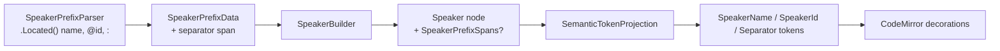

# Precise Speaker Tokens

> [!NOTE]
> Status: **implemented**. Refines the coarse `Speaker` token from
> [Compiler-Projected Editor Semantics](./Compiler-Projected%20Editor%20Semantics.md) into precise,
> non-overlapping sub-tokens (name, `@id`, separator), resolving
> [#142](https://github.com/pengzhengyi/godot-dialoguedown/issues/142). The core AST gains the
> sub-spans the parser already computes; the editor projection emits a token per part.

## Goal and scope

Highlight a speaker prefix's **parts** distinctly — the display **name**, the optional
**`@id`**, and the **`:` separator** — instead of one coarse `Speaker` token spanning the whole
prefix. This makes the projected `semanticTokens` **precise and non-overlapping**, the shape a
real language server publishes.

The enabling change is in the **core**: the transpiler already parses the name, id, and colon; it
just discards their positions. This note keeps those positions and surfaces them on the speaker
AST nodes, then teaches the visualization projection to emit a token per part.

Two components, one feature:

- **C1 — Core: speaker prefix sub-spans.** Capture the name, `@id`, and `:` spans in the parser
  and carry them on the speaker AST nodes.
- **C2 — Visualization: precise speaker tokens.** Project those sub-spans into `SpeakerName`,
  `SpeakerId`, and `Separator` tokens, render them in the editor, and retire the coarse token.

**In scope:** the three sub-spans for every speaker form (name-only, `@id`-only, name-and-`@id`,
declarations with tags, quoted names), sourced from the parser; the precise token projection and
its editor rendering.

**Out of scope:** the language server itself (this only makes the ranges precise for when it
lands); re-deriving sub-spans by string-scanning in the projection (rejected — the AST is the
source of truth); tags, which already carry their own spans and render as precise
`CustomTag`/`ReservedTag` tokens today.

## Functionality checklist

- [x] The parser captures the name span, the optional `@id` span, and the `:` separator span,
      sourced from Superpower's `.Located()` — not re-derived.
- [x] The `@id` span includes its leading `@`; a quoted name's span includes the quotes.
- [x] Speaker AST nodes carry the sub-spans; a synthetic or config-built speaker carries none.
- [x] `TokenKind` gains `SpeakerName`, `SpeakerId`, and `Separator`; the coarse `Speaker` is
      retired.
- [x] The projection emits one token per present part; the tokens are **non-overlapping** and
      interleave cleanly with the separate tag tokens.
- [x] The editor renders the three kinds, and the coarse-token overlap precedence is removed.
- [x] A default/orphan-recovery speaker emits no speaker tokens (unchanged).

## Interfaces and abstractions

| Type | Responsibility | Change |
| --- | --- | --- |
| `SpeakerPrefixParser` (core) | Recognizes a speaker prefix and reports its parts | `.Located()` the name, id, and colon so their spans are kept |
| `SpeakerPrefixData` (core) | The parsed parts of a prefix | Name/Id become `Spanned<string>`; the match carries the separator span |
| `SpeakerPrefixSpans` (core, new) | The source locations of a prefix's parts | `SourceSpan? Name`, `SourceSpan? Id`, `SourceSpan Separator` |
| `Speaker` nodes (core) | The speaker AST | Carry a nullable `SpeakerPrefixSpans` (`null` when synthetic) |
| `SpeakerBuilder` (core) | Classifies parts into a speaker node | Threads the sub-spans onto the node it builds |
| `TokenKind` (viz) | The token legend | `Speaker` → `SpeakerName`, `SpeakerId`, `Separator` |
| `SemanticTokenProjection` (viz) | Projects AST spans into editor tokens | Emits a token per part from `SpeakerPrefixSpans` |

## Key design decisions

### D1 — Keep the parser's positions instead of re-deriving them

Superpower already tracks each element's position; the tag parser keeps them via `.Located()`
(which is why tags render precisely today), while the name, id, and colon are parsed as bare
values and their positions dropped. The fix is symmetry: `.Located()` the name, id, and colon too.
This keeps the AST the single source of truth for token ranges and avoids the fragile source
re-scanning [#115](https://github.com/pengzhengyi/godot-dialoguedown/issues/115) rejected.

The optional `@id` needs one piece of care: `.Optional()` on a value type yields `default(T)`,
which a located id (a struct) cannot tell from absence, so a small `OptionalValue` combinator lifts
it into a nullable that is genuinely `null` when the id is missing.

### D2 — Model the sub-spans as one nullable value object

A speaker prefix has parts, each with a location. Carry them as a single value object,
`SpeakerPrefixSpans(SourceSpan? Name, SourceSpan? Id, SourceSpan Separator)`, held as a **nullable**
member on the speaker nodes. `Name`/`Id` are nullable within it because a name-only reference has
no id and an `@id`-only reference has no name. `Separator` is **non-nullable**: a written prefix
always ends in a colon (the parser requires it), so whenever a `SpeakerPrefixSpans` exists its
separator does too. The whole object is `null` for a speaker with no written prefix — a filled
default or a config-built declaration — so a speaker that has no colon simply carries no
`SpeakerPrefixSpans`, and the "separator without a prefix" case never arises.

Considered alternatives:

- **Additive per-node span properties** (`NameSpan`, `IdSpan?`, `SeparatorSpan` on each node).
  Rejected: it fans the same three fields across four node types and makes the projection switch
  per type, where the value object gives it one uniform shape to read.
- **Replace the bare `Name`/`Id` strings with span-carrying value objects** (the DDD-pure form).
  Rejected: it is elegant only when a speaker has source text — but a config-built speaker has
  none, so it would fabricate empty sentinel spans that make the type dishonest and risk emitting
  wrong tokens. It also touches every `.Name`/`.Id` reader (`SpeakerBinder`, `SpeakerTable`,
  `ConfiguredSpeakerBuilder`, `DialogueAstRewriter`) for no gain the nullable value object does not
  already provide honestly.

Keeping `Name`/`Id` as plain strings means the semantic analyzer and every existing reader are
untouched; the sub-spans ride alongside as an editor/LSP concern.

### D3 — Precise tokens are non-overlapping; the overlap precedence goes away

The coarse `Speaker` token spanned the whole prefix and **overlapped** its tag tokens, so the
editor layered tags on top by decoration precedence. The precise `SpeakerName`/`SpeakerId` tokens
stop at their own text, and the `Separator` is the lone `:`; none overlaps a tag. So the tokens
are disjoint — the LSP-conformant form — and the frontend's tag-over-speaker precedence is no
longer needed and is removed.

### D4 — Retire the coarse `Speaker` kind rather than keep both

`SpeakerName`, `SpeakerId`, and `Separator` fully replace `Speaker`; the coarse kind is removed
from the legend, the projection, the payload type, and the editor's classes. Keeping a
now-unreachable kind would be dead vocabulary. The report payload is internal to this repository,
so the wire change needs no compatibility shim.

## Error and boundary cases

| Case | Intended behavior |
| --- | --- |
| Name only (`Alice:`) | `SpeakerName` over `Alice`, `Separator` over `:`; no `SpeakerId`. |
| `@id` only (`@alice:`) | `SpeakerId` over `@alice` (incl. `@`), `Separator`; no `SpeakerName`. |
| Name and id (`Alice @alice:`) | `SpeakerName`, `SpeakerId`, `Separator`, all disjoint. |
| Quoted name (`"Dr. Vale":`) | `SpeakerName` covers the quotes. |
| Tags interleaved (`Alice @alice #happy:`) | Name/id/separator tokens plus the separate `#happy` tag token; none overlap. |
| Unusual whitespace (`Alice   @alice   :`) | Tokens sit on the parts; the whitespace between stays uncolored. |
| Default / orphan-tag recovery (`#lonely:`) | No speaker tokens — the node has no `SpeakerPrefixSpans`. |
| Config-built speaker | No sub-spans (no source text); contributes no tokens. |

## Integration

- **Core:** `SpeakerPrefixParser` gains `.Located()` on name/id/colon; `SpeakerPrefixData` and the
  builder thread the spans onto the speaker nodes via `SpeakerPrefixSpans`. No semantic-analysis
  or desugar change — the strings they read are unchanged.
- **Visualization projection:** `SemanticTokenProjection.TokensOf` reads a speaker node's
  `SpeakerPrefixSpans` and yields the present tokens, replacing the single coarse `Speaker` yield.
- **Editor (frontend):** the TS `TokenKind` union and the decoration classes gain the three kinds
  and drop `Speaker`; `styles.css` styles `.dd-tok-speaker-name`, `.dd-tok-speaker-id`, and
  `.dd-tok-separator`; the coarse-overlap precedence in `semantic-tokens.ts` is removed. The
  committed `web/dist/report.html` is rebuilt.
- **Docs:** [Compiler-Projected Editor Semantics](./Compiler-Projected%20Editor%20Semantics.md) is
  reconciled — its coarse-speaker decision and its `#142`-deferred references flip to "precise
  tokens shipped", pointing here.

## Testability

- **Core unit** (`SpeakerBuilderTests` / parser tests): each prefix form yields a node whose
  `SpeakerPrefixSpans` has the right name/id/separator ranges (quoted, `@id`-only, name-only,
  name+id, with tags, odd whitespace); a config-built speaker has none.
- **Visualization unit** (`SemanticTokenProjectionTests`): each form projects the expected
  `SpeakerName`/`SpeakerId`/`Separator` tokens at zero-based ranges; the tokens are non-overlapping
  and coexist with tag tokens; a default/orphan speaker emits none.
- **Frontend unit** (`semantic-tokens.test.ts`): the three kinds map to their classes at the right
  offsets.
- **End-to-end:** a served report colors a speaker's name, id, and separator distinctly from its
  tags in light and dark.

## Open questions

None outstanding — the modeling is settled on the nullable `SpeakerPrefixSpans` value object (A),
and the `:` separator is rendered with its own color. The DDD-pure alternative (C) was considered
and rejected (see [D2](#d2--model-the-sub-spans-as-one-nullable-value-object)).
