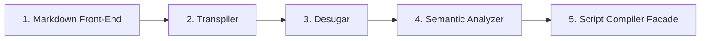
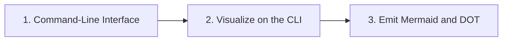
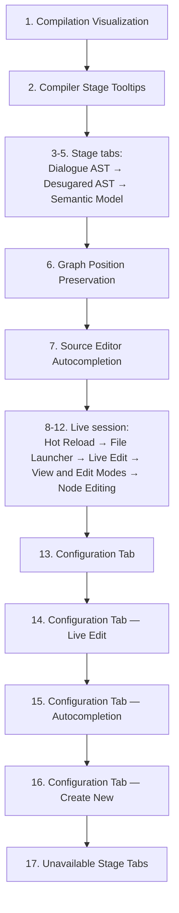
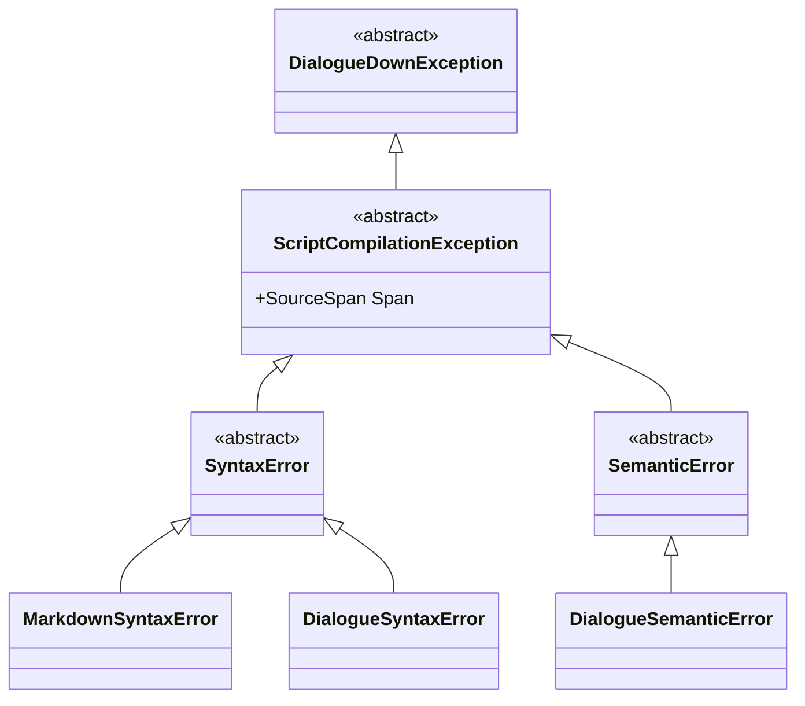

# Implementation notes

Design and rationale notes for DialogueDown's compiler. Each note covers one
component; this README is a **reading guide** to them and records **cross-cutting conventions**
that every component shares — starting with the error model.

> [!NOTE]
> The error model below is a **proposed design**, not yet implemented. It defines
> the exception types and message conventions each component will adopt as it is
> built. Component notes link back here rather than redefining errors locally.

## Table of contents

- [Reading guide](#reading-guide)
  - [Core: the compiler pipeline](#core-the-compiler-pipeline)
  - [Configuration](#configuration)
  - [Diagnostics](#diagnostics)
  - [Command-line interface](#command-line-interface)
  - [Visualization](#visualization)
  - [Other notes](#other-notes)
- [Error model](#error-model)
  - [Principles](#principles)
  - [Exception hierarchy](#exception-hierarchy)
  - [What each stage raises](#what-each-stage-raises)
  - [Domain errors vs usage errors](#domain-errors-vs-usage-errors)
  - [Every error carries a location](#every-error-carries-a-location)
  - [Message conventions](#message-conventions)
  - [Error codes (optional, future)](#error-codes-optional-future)
  - [Open choices](#open-choices)

## Reading guide

The notes below are grouped by area and ordered for reading. Start with
**Core** — those explain the compiler itself and are worth reading in full.
Read **Command-line interface** or **Visualization** only when you work on that
surface: both document tools built *on top of* the core, so they are optional
for understanding the compiler. Each note keeps a one-line summary and a status
(**Implemented**, **In progress**, or **Explored**).

> [!TIP]
> New here? Read the Core notes in order, then the [Error model](#error-model)
> below. That is enough to understand and change the compiler.

### Core: the compiler pipeline

**Essential — read in full.** These trace a script through the compiler, one
stage per note, in pipeline order; the facade note ties the stages together.

| Order | Note | What it covers | Status |
| --- | --- | --- | --- |
| 1 | [Markdown Front-End](./Markdown%20Front-End.md) | Source text → Markdown AST (Markdig adapter) | Implemented |
| 1a | [Unmodeled Markdown Handling](./Unmodeled%20Markdown%20Handling.md) | A front-end detail: which Markdown is ignored vs kept as raw text | Implemented |
| 2 | [Markdown to Dialogue AST Transpiler](./Markdown%20to%20Dialogue%20AST%20Transpiler.md) | Markdown AST → Dialogue AST | Implemented |
| 3 | [Desugar](./Desugar.md) | Dialogue AST → normalized Dialogue AST (jump assembly, default speaker) | Implemented |
| 4 | [Semantic Analyzer](./Semantic%20Analyzer.md) | Desugared AST → semantic model (speakers, scenes, resolved jumps) | Implemented |
| 5 | [Script Compiler Facade](./Script%20Compiler%20Facade.md) | One `IScriptCompiler` seam over the stages + `AddDialogueDown` DI | Implemented |

The [Error model](#error-model) below is a cross-cutting core convention every
stage adopts — read it alongside these.

### Configuration

**Read when you configure the compiler or add a config knob.** A cross-cutting core
concern — an immutable `CompilerOptions` seam threaded into the stages — and its file
edge, a satellite that reads a `dialogue.toml` into those options.

| Order | Note | What it covers | Status |
| --- | --- | --- | --- |
| 1 | [Configuration](./Configuration.md) | The `CompilerOptions` seam: a configured speaker registry (default via the reserved tag) threaded into the semantic stage | Implemented |
| 2 | [Configuration Loader](./Configuration%20Loader.md) | The TOML edge: reads `dialogue.toml` into a `CompilerOptions`, validating with located errors, in its own satellite assembly | Implemented |
| 3 | [CLI Configuration](./CLI%20Configuration.md) | Threads a project's `dialogue.toml` through the `dialoguedown` CLI into `compile` and `visualize` (and the report's autocompletion) | Implemented |
| 4 | [Compilation Mode Configuration](./Compilation%20Mode%20Configuration.md) | Makes the compilation `mode` settable in `dialogue.toml` and shown in the Config tab (CLI `--mode` already ships) | Implemented |

### Diagnostics

**Read when you work on collecting or reporting problems.** A cross-cutting core
concern that lets the compiler describe every problem it finds — errors and
warnings — in a structured, located form, so an author can see them all at once
instead of one throw per run. Start with the subsystem note; focused rule notes
then record decisions that are too specific for the parent design.

| Order | Note | What it covers | Status |
| --- | --- | --- | --- |
| 1 | [Diagnostics and Validation](./Diagnostics%20and%20Validation.md) | The whole effort: the diagnostic model (built), the collect-and-continue collection seam, the validator and rules, and the renderer | In progress |
| 2 | [Choice Nesting Diagnostic](./Choice%20Nesting%20Diagnostic.md) | A style warning for choice branches nested beyond the recommended depth | Implemented |

### Command-line interface

**Read when you work on the `dialoguedown` CLI.** These build on the core through
Spectre.Console.Cli; they are not needed to understand the compiler.

| Order | Note | What it covers | Status |
| --- | --- | --- | --- |
| 1 | [Command-Line Interface](./Command-Line%20Interface.md) | The `dialoguedown` CLI: `compile` + `visualize` (Spectre.Console.Cli) | Implemented |
| 2 | [Visualize on the CLI](./Visualize%20on%20the%20CLI.md) | Wire `dialoguedown visualize` to the engine; retire the hand-rolled CLI | Implemented |
| 3 | [Visualize CLI — Emit Mermaid and DOT](./Visualize%20CLI%20-%20Emit%20Mermaid%20and%20DOT.md) | `visualize --emit mermaid\|dot` emits each stage's graph as portable text | Implemented |

### Visualization

**Read when you work on the interactive report or the live/served session.** An
optional TypeScript client that renders each compiler stage; not needed to
understand the compiler. Read the foundation first, then the per-stage tabs, the
shared graph experience, and finally the live session.

| Order | Note | What it covers | Status |
| --- | --- | --- | --- |
| 1 | [Compilation Visualization](./Compilation%20Visualization.md) | Compiler-stage IRs → interactive diagrams (the report foundation) | Implemented |
| 2 | [Compiler Stage Tooltips](./Compiler%20Stage%20Tooltips.md) | Per-stage hover tips on the report tabs | Implemented |
| 3 | [Dialogue AST Visualization Tab](./Dialogue%20AST%20Visualization%20Tab.md) | The transpiler's Dialogue AST as a second graph tab | Implemented |
| 4 | [Desugared AST Visualization Tab](./Desugared%20AST%20Visualization%20Tab.md) | The desugarer's normalized AST as a third tab | Implemented |
| 5 | [Semantic Model Visualization Tab](./Semantic%20Model%20Visualization%20Tab.md) | The semantic model as an analytics tab: scene-tree graph + cross-linked tables | In progress |
| 6 | [Graph Position Preservation](./Graph%20Position%20Preservation.md) | Per-graph zoom/pan/fold memory and a root-centered default | Implemented |
| 7 | [Source Editor Autocompletion](./Source%20Editor%20Autocompletion.md) | Document-aware editor completions behind a symbol-source seam | Implemented |
| 8 | [Live Visualization — Hot Reload](./Live%20Visualization%20-%20Hot%20Reload.md) | Watch a script and hot-reload the report from a local server | Implemented |
| 9 | [Live Visualization — File Launcher](./Live%20Visualization%20-%20File%20Launcher.md) | Browse and open a script in the launcher (the uniform `visualize` entry point) | Implemented |
| 10 | [Live Visualization — Live Edit](./Live%20Visualization%20-%20Live%20Edit.md) | Edit the source in the report; compile-as-you-type and save to disk | Implemented |
| 11 | [Live Visualization — View and Edit Modes](./Live%20Visualization%20-%20View%20and%20Edit%20Modes.md) | The current unified model: a served session with a runtime View⇄Edit toggle; static becomes an export | Implemented |
| 12 | [Live Visualization — Node Editing](./Live%20Visualization%20-%20Node%20Editing.md) | Edit the source behind a graph node in the inspector; splice it back and recompile | Implemented |
| 13 | [Configuration Tab](./Configuration%20Tab.md) | The applied `dialogue.toml` as a first tab: TOML source beside its configured speakers (Stage 1, read-only) | Implemented |
| 14 | [Configuration Tab — Live Edit](./Configuration%20Tab%20-%20Live%20Edit.md) | Edit the `dialogue.toml` in the report; Save recompiles and refreshes the configured speakers (Stage 2a) | Implemented |
| 15 | [Configuration Tab — Autocompletion](./Configuration%20Tab%20-%20Autocompletion.md) | Schema autocompletion for the editable `dialogue.toml`: the `[[speakers]]` table, its keys, and the reserved tag names (Stage 2b) | Implemented |
| 16 | [Configuration Tab — Create New](./Configuration%20Tab%20-%20Create%20New.md) | Create a `dialogue.toml` in place when a project has none, then drop into the editable Config tab (Stage 3) | Implemented |
| 17 | [Unavailable Stage Tabs](./Unavailable%20Stage%20Tabs.md) | A halted compile renders its unproduced stages as disabled tabs, so a broken script still shows what it did produce | Implemented |

### Other notes

**Optional context.** Exploration spikes and one-off documentation-maintenance
passes that sit outside the pipeline and its tools.

| Note | What it covers | Status |
| --- | --- | --- |
| [BBCode Rendering](./BBCode%20Rendering.md) | Surveyed: render a line's styled speech as BBCode (Godot), terminal, and web — the `ISpeechFormatter` seam and library options | Explored |
| [Development Cycle Optimization](./Development%20Cycle%20Optimization.md) | Implemented: reduce local and CI feedback time through measured, behavior-preserving increments | Implemented |
| [Interactive Playthrough](./Interactive%20Playthrough.md) | Explored: play the dialogue as a text adventure to validate branching — a terminal player, a web Play tab, and a Yarn export/run | Explored |
| [README Shipping-Status Refresh](./README%20Shipping-Status%20Refresh.md) | A docs-only pass reconciling the README's visualization section with what actually ships | Implemented |

## Error model

The compiler runs in stages: **source → Markdown AST → Dialogue AST → graph →
runtime**. A fault can occur at any stage, and callers (a game integrating the
library) need to tell *what kind* of fault happened and *where*. The error model
makes that explicit through **distinct exception types per stage and kind**, each
carrying a clear, actionable message.

### Principles

- **Two axes.** Classify every fault by **kind** (is the input malformed, or
  well-formed but meaningless?) and by **layer/language** (which stage/DSL raised
  it). The type name encodes both, e.g. `MarkdownSyntaxError` vs
  `DialogueSyntaxError` vs `DialogueSemanticError`.
- **Syntax ≠ semantics.** A `SyntaxError` means the text could not be understood
  structurally. A `SemanticError` means it parsed fine but violates meaning
  (unknown speaker, dangling jump). They are different types, so callers and tools
  can react differently.
- **One base to catch them all.** Every domain fault derives from a single base
  (`DialogueDownException`), so a caller can `catch` broadly or narrowly.
- **Locate everything.** Every compilation error carries a
  [`SourceSpan`](./Markdown%20Front-End.md#the-markdown-ast-model) so messages and
  tooling can point at the exact offending characters.
- **Fail with intent.** Messages state what is wrong, where, and how to fix it —
  never a bare "parse error".
- **Usage errors are not domain errors.** Programmer mistakes (a `null` argument,
  an out-of-range value) use standard .NET exceptions and stay outside this
  hierarchy (see [Domain errors vs usage errors](#domain-errors-vs-usage-errors)).

### Exception hierarchy

- **`DialogueDownException`** — abstract base for everything the library throws
  as a domain fault. Callers catch this to handle "any DialogueDown error".
- **`ScriptCompilationException`** — abstract; a fault while compiling a script.
  Carries the `SourceSpan` (and, derived from it, a line/column) that locates the
  problem. A future **runtime** branch (graph execution faults) can hang directly
  off `DialogueDownException`, parallel to this one.
- **`SyntaxError`** — abstract; structurally malformed input.
- **`SemanticError`** — abstract; well-formed input that breaks a rule.
- The concrete leaves are what each stage actually throws (next section).

### What each stage raises

| Stage | Type | Kind | Example |
| --- | --- | --- | --- |
| Markdown front-end | `MarkdownSyntaxError` | Syntax | Reserved for unrecoverable Markdown parse faults. The front-end is deliberately permissive — it **flattens** unmodeled constructs to raw text rather than failing — so this is rare in practice. |
| Transpiler (DSL grammar) | `DialogueSyntaxError` | Syntax | A jump `=>` not followed by a Markdown link; a malformed tag (`#` with no name); a code-span command that is not valid query/command grammar. |
| Reference validation / compile | `DialogueSemanticError` | Semantic | Unknown speaker reference; dangling jump (anchor/file does not exist); conflicting speaker metadata for the same speaker; duplicate section anchor; unknown reserved tag (`##foo`). |

Each stage owns its type: the Markdown adapter never throws a `DialogueSyntaxError`,
and the transpiler never throws a `MarkdownSyntaxError`. This keeps the failing
layer unambiguous from the type alone.

### Domain errors vs usage errors

The hierarchy above is for **faults in the script being compiled** — bad *input*.
It is **not** for **programmer mistakes** calling the API. Those stay as standard
.NET exceptions:

| Situation | Exception | Why |
| --- | --- | --- |
| `null` passed where a value is required | `ArgumentNullException` | Caller contract violation, not a script fault. |
| An AST invariant is violated in code (e.g. a heading level outside 1–6, an empty text run, a non-positive span length) | `ArgumentException` / `ArgumentOutOfRangeException` | Internal construction bug, caught in tests, not something a script author can cause. |

Rule of thumb: if a **script author** can trigger it by writing a bad `.dialogue.md`,
it is a `DialogueDownException`. If only a **developer** can trigger it by
misusing the API, it is a standard argument/usage exception.

### Every error carries a location

`ScriptCompilationException` exposes the `SourceSpan` of the offending text. Since
`SourceSpan` is a start-offset + length into the original source, a line/column
(and a source snippet) can be derived from it for display. Messages should render
that location so authors can jump straight to the problem.

### Message conventions

A good message answers three questions: **what** is wrong, **where**, and **how**
to fix it.

- Lead with the problem, not the mechanics ("jump target not found", not
  "null reference in ResolveJump").
- Include the **offending token** and its **line:column**.
- Suggest a fix or show the expected form when it is short.
- Use plain language a script author understands; avoid internal type names.

| Kind | Weak | Strong |
| --- | --- | --- |
| `DialogueSyntaxError` | `Invalid jump.` | `Syntax error at 12:5 — a jump must be '=> [label](target)'; found '=> play-tennis' with no link.` |
| `DialogueSemanticError` | `Unknown speaker.` | `Unknown speaker 'Alicia' at 8:1 — declare it inline or add it to speakers.json (did you mean 'Alice'?).` |
| `DialogueSemanticError` | `Bad jump.` | `Jump target '#play-tennis' at 3:4 does not match any section heading in this file.` |

### Error codes (optional, future)

For tooling (editor squiggles, documentation, suppression), errors may later carry
a stable **code** alongside the message, e.g. `DLG1001` for "malformed jump". This
is out of scope for the first implementation; the type + message are sufficient
until an editor integration needs stable identifiers.

### Open choices

Flagged for confirmation before implementation:

- **Base type name.** `DialogueDownException` (matches the library name) vs a
  shorter `DialogueException`.
- **Intermediate `ScriptCompilationException`.** Keep it as the span-carrying
  parent (recommended, leaves room for a runtime branch), or fold `Span` directly
  onto `SyntaxError`/`SemanticError` and drop the middle layer.
- **Error codes.** Adopt a code scheme now, or defer until tooling needs it
  (deferred above).
