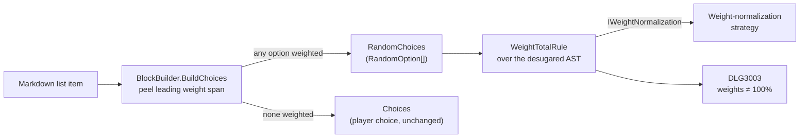

# Random choice

> [!NOTE]
> Status: **proposed**
> ([issue #141](https://github.com/pengzhengyi/godot-dialoguedown/issues/141)).
> Let a choice list carry per-option weights so the engine picks one option at
> random, instead of offering the options to the player.

## Table of contents

- [Goal and scope](#goal-and-scope)
- [Functionality checklist](#functionality-checklist)
- [Ubiquitous language](#ubiquitous-language)
- [Writer-facing behavior](#writer-facing-behavior)
- [Grammar](#grammar)
- [Weight resolution](#weight-resolution)
- [Prior art](#prior-art)
- [Architecture](#architecture)
- [Interfaces and responsibilities](#interfaces-and-responsibilities)
- [Key design decisions](#key-design-decisions)
- [Markdown interaction](#markdown-interaction)
- [Diagnostics](#diagnostics)
- [Error and boundary cases](#error-and-boundary-cases)
- [Testability](#testability)
- [Alternatives not chosen](#alternatives-not-chosen)
- [Open questions and deferred work](#open-questions-and-deferred-work)

## Goal and scope

A writer often wants *variety* rather than a *decision*: a guard who greets you
one of several ways, a crowd that reacts unpredictably, a coin that lands one of
two ways. Today the only branch in DialogueDown is a **player choice** — a list
whose options are offered to the player. There is no way to say "let the engine
pick one of these for me, and make some outcomes more likely than others."

A **random choice** fills that gap. It reuses the familiar choice list, but each
option leads with a **weight** — a code span ending in `%`. When any option in a
list carries a weight, the whole list becomes a random choice: at runtime the
engine selects exactly one option by weight and runs its body. The player sees
no menu.

This note covers recognizing the construct, its weight grammar, the
compile-time weight semantics, and the diagnostics it introduces. It does **not**
cover the runtime selection itself (there is no runtime yet) or dynamic weights
that read game state; both are described as [deferred
work](#open-questions-and-deferred-work) with a seam left for them.

## Functionality checklist

- [ ] Recognize a leading weight code span (`` `N%` ``, `` `%` ``) on a choice
      option before game-call classification.
- [ ] Build a dedicated `RandomChoices` node (of `RandomOption`s) when any
      option is weighted, leaving `Choices`/`Choice` unchanged otherwise.
- [ ] Model a `NumberWeight` (explicit percentage) and an `AutoWeight` (equal
      share of the leftover) as a closed `ChoiceWeight`.
- [ ] Leave a closed seam for a future dynamic `QueryWeight`.
- [ ] Resolve weights through an injectable normalization strategy, so the
      arithmetic is tested and swapped in isolation from parsing.
- [ ] Defer all resolution to the runtime for a random choice with any dynamic
      weight.
- [ ] Report `DLG1104` when an option in a random choice has no weight.
- [ ] Report `DLG1105` when a weight value is neither a non-negative number nor
      a quoted query.
- [ ] Report `DLG3003` when static weights do not total 100%, and normalize.
- [ ] Report `DLG2010` when static weights sum to zero (no option can be selected).
- [ ] Report `DLG3004` when a random choice offers only one option.
- [ ] Preserve source spans for the weight span, its owning option, and the
      group.
- [ ] Add the construct to the writer-facing specification and the gallery.
- [ ] Leave the ordinary player-choice list unchanged when no option is weighted.

## Ubiquitous language

| Term | Meaning |
| --- | --- |
| **Random choice** | A choice group the engine resolves by selecting one option at random by weight; the selected option's body runs. No player menu is shown. |
| **Choice weight** | The leading code span ending in `%` on an option that gives its relative selection probability. |
| **Explicit weight** | A numeric weight, `` `N%` `` — a concrete percentage. |
| **Auto weight** | A bare `` `%` `` — claims an equal share of the percentage left over after the explicit weights. |
| **Dynamic weight** *(deferred)* | `` `"Query"%` `` — a weight read from game state at runtime, reusing the game-call query grammar. |
| **Leftover** | `max(0, 100 − sum of explicit weights)`, divided equally among the auto weights. |
| **Normalization** | Dividing every resolved weight by their total so the probabilities sum to 1; owned by a swappable strategy so it can be tested and replaced in isolation. |

The domain term is **random choice** everywhere: the AST distinction, the
diagnostics, the specification, commits, and the changelog.

## Writer-facing behavior

A choice list becomes a random choice as soon as one option leads with a weight:

```markdown
The coin spins in the air.

- `50%` It lands heads.
- `50%` It lands tails.
```

Weights are **relative**: they are normalized by their sum, so equal numbers
mean equal odds regardless of the total. A bare `` `%` `` is an **auto** weight —
it takes an equal share of whatever percentage the explicit weights leave:

```markdown
- `70%` Guard: Halt! Who goes there?
- `%`   Guard: ...oh, it's you.
```

Here the auto weight resolves to the remaining 30%. Several autos split the
leftover equally, so `` `%` `` + `` `%` `` is a plain 50/50, and `` `50%` `` +
`` `%` `` + `` `%` `` gives 50/25/25. All-auto lists are a convenient uniform
random:

```markdown
- `%` The crow caws.
- `%` The crow tilts its head.
- `%` The crow ignores you.
```

An option's body is an ordinary choice body, so a random choice nests and
carries dialogue exactly like a player choice:

```markdown
- `80%` Merchant: Fresh apples!
    - Alice: I'll take one.
- `20%` Merchant: ...bad day for business.
```

In a plain Markdown preview each weight shows as inline code (`50%`) at the start
of the option — readable, and clearly not spoken text.

## Grammar

A weight is the first inline of an option: a code span whose content ends with a
literal `%`.

```ebnf
RandomChoices     = WeightedItem , { WeightedItem } ;
WeightedItem     = WeightSpan , ChoiceBody ;
WeightSpan       = "`" , WeightValue , "%" , "`" ;
WeightValue      = [ Number | QuotedString ] ; (* empty => auto; quoted => dynamic, deferred *)
Number           = Digit , { Digit } , [ "." , { Digit } ] ;
```

A list is a **random choice** if and only if at least one of its items begins
with a `WeightSpan`. A well-formed random choice is *all* `WeightedItem`s; an
item that omits its weight is the recovery case reported as
[`DLG1104`](#diagnostics). The trailing `%` is the recognition signal: no game
call ends in `%`, so a leading `` `…%` `` code span is unambiguous (see
[Markdown interaction](#markdown-interaction)).

## Weight resolution

Resolution turns the raw weights into normalized probabilities. It is owned by a
single **injectable normalization strategy** (`IWeightNormalization`, see
decision **D8**), so the arithmetic is tested and swapped in isolation from
parsing and the AST.

**A random choice that contains any dynamic weight defers *all* resolution to the
runtime** — the total cannot be known until the game runs. The steps below
therefore apply only when every weight is static (a number or an auto):

1. **Sum the explicit weights** → `explicit`.
2. **Distribute the leftover to autos:** `leftover = max(0, 100 − explicit)`;
   each auto resolves to `leftover ÷ (auto count)`.
3. **Total** all resolved weights.
4. **Normalize:** every weight is divided by the total so the probabilities sum
   to 1. Weights are relative, so the total need not be 100.
5. **Warn on drift:** if the total is not within 0.5 of 100, report
   [`DLG3003`](#diagnostics) with the actual total. The script still compiles;
   the odds are simply normalized. The small tolerance keeps deliberate rounding
   quiet — three `` `33.3%` `` options total 99.9, not a mistake — while a real
   mismatch such as 50 + 30 still warns. A single-option group is skipped by the
   total checks — its lone option is always selected, so its total is moot — and
   is instead reported by its own rule as [`DLG3004`](#diagnostics).
6. **Reject a zero total** (every weight resolved to 0, e.g. all `` `0%` ``):
   report [`DLG2010`](#diagnostics) as an **error**. A zero total is ambiguous —
   a mistake, or a misread as uniform — so the explicit principle rejects it
   rather than guessing. The strategy still recovers to a uniform distribution so
   later stages never divide by zero on the best-effort result.

At runtime a dynamic random choice runs the same strategy over its resolved
values, so static and dynamic lists share one normalization definition.

## Prior art

First-class weighted randomness is rare in interactive-fiction languages — most
offer only *uniform* random selection and ask authors to fake weights by
repeating lines. That makes a readable weight syntax a genuine improvement, but
it also means there is little precedent for the notation itself.

| Tool | Random selection | Native weights | How authors weight today |
| --- | --- | --- | --- |
| [Yarn Spinner](https://yarnspinner.dev/docs/yarn/02-fundamentals/12-line-groups/) | Line groups (`=>`) pick one line at random. | No (as of 3.x). | Duplicate a line to raise its odds. |
| [Ink](https://github.com/inkle/ink/blob/master/Documentation/WritingWithInk.md) | Shuffle `{~ a\|b\|c }` picks one, cycling before repeats. | No. | Duplicate an option, or `RANDOM(min,max)` with conditionals. |
| [Ren'Py](https://www.renpy.org/doc/html/python.html) | Python `renpy.random` / `random.choices`. | Yes, via Python `weights=`. | Call `random.choices` with a weight list in Python. |

Lessons carried into this design:

- **Weights are worth making first-class.** Duplication (Yarn, Ink) is noisy and
  caps the granularity at whole copies; a percentage is exact and scannable.
- **Relative weights normalized by the sum** are the established mental model
  (Ren'Py's `random.choices`, and the duplication trick is just integer
  weighting). DialogueDown adopts the same relative model but lets the author
  *see* the intended percentages.
- **A percent sign reads as a probability** to a non-technical writer, and it is
  the one punctuation none of the surveyed tools claimed — so it is a clean,
  self-explanatory marker for DialogueDown to define.

## Architecture



Recognition happens in the **transpiler**, in `BlockBuilder.BuildChoices`. Before
an item's blocks are built, the builder peels a leading weight code span off the
item's first paragraph. This is essential: if the weight reached the ordinary
inline walk it would be handed to `GameCallBuilder`, which rejects any code span
that is not a game call as `DLG1102`. Peeling it first keeps the weight out of
game-call classification, and the rest of the option body builds exactly as it
does today. When any option is weighted the builder emits a `RandomChoices` of
`RandomOption`s; otherwise it emits `Choices` as before.

The **weight-total** style warning (`DLG3003`) is a structural validation rule
over the desugared Dialogue AST, mirroring the existing choice-nesting rule
(`DLG3002`). The rule asks the `IWeightNormalization` strategy for the resolved
total rather than doing the arithmetic itself. Recognition-time problems — a
missing weight (`DLG1104`) and an invalid weight value (`DLG1105`) — are reported
where the span is peeled.

## Interfaces and responsibilities

| Type | Responsibility |
| --- | --- |
| `ChoiceGroup` | The abstract base shared by `Choices` and `RandomChoices` — a branch that offers several options. It lets a pass that cares about any branch group (the choice-nesting depth check) query one type, while the two stay distinct records. |
| `RandomChoices` | A `ChoiceGroup` for the whole construct: the ordered `RandomOption`s the engine resolves to one. Separate from `Choices` so the player choice stays unchanged and the visualization and runtime handle it distinctly. |
| `RandomOption` | One option in a random choice: its `ChoiceWeight` and its body blocks. Named an *option*, not a `Choice`: the player never selects it — the engine does — so the "choice" vocabulary (which means player selection here) would mislead. |
| `ChoiceWeight` | A closed value hierarchy for a weight: `NumberWeight(double)` and `AutoWeight`. A future `QueryWeight` variant is the deferred dynamic seam. |
| `IWeightNormalization` | The injectable strategy that turns a random choice's static weights into normalized probabilities and reports the raw total; consumed by `WeightTotalRule` now and the runtime later. |
| `BlockBuilder` | Peels the leading weight span from each item, emits a `RandomChoices` when any option is weighted (otherwise `Choices`), reports `DLG1104`/`DLG1105`, and builds each option body from the remaining inlines. |
| `DiagnosticCatalog` | Own `DLG1104`, `DLG1105`, `DLG2010`, `DLG3003`, and `DLG3004`. |
| `WeightTotalRule` | A structural rule that, for a fully static random choice, asks `IWeightNormalization` for the raw total; reports `DLG2010` when it is zero, or `DLG3003` when it is otherwise not ≈100%. Skips a single-option group. |
| `SingleOptionRandomChoiceRule` | A structural rule that warns (`DLG3004`) when a random choice offers only one option, since it is always selected and the weight has no effect. |

## Key design decisions

### D1 — Weights imply a random choice (implicit marking)

Any option carrying a weight makes the whole list a random choice. There is no
separate marker keyword, heading, or bullet style. This matches the minimal
writer example, keeps the surface Markdown-native, and needs no new token. The
trailing `%` on a leading code span is a strong, unambiguous signal, so the
weights *are* the marker.

The cost is that one stray weight changes the list's nature. Decision **D2**
contains that cost by requiring every option in a random choice to be weighted.

### D2 — Every option in a random choice must be weighted

Once a list is random, an option with no weight marker is a `DLG1104` error. An
unweighted option in a random list is almost always a mistake — a forgotten
`` `%` `` — and silently guessing a probability for it would be surprising. Being
explicit matches the rest of the language. For error recovery the analyzer treats
the missing weight as an auto so downstream stages still receive a well-formed
tree.

A bare `` `%` `` auto weight is the deliberate, visible way to say "share the
rest," so writers never need an implicit blank.

### D3 — Relative weights, normalized by the sum, with a drift warning

Weights are relative and normalized by their total, so `50/50`, `1/1`, and
`10/10` all mean even odds. This is the established model (Ren'Py, and integer
duplication generalized). Percentages are still the friendliest way to *write*
relative weights, so the author writes what they mean, and the compiler warns
(`DLG3003`) only when the numbers do not add up — a nudge, not a rejection.

### D4 — Auto weights fill the leftover

A bare `` `%` `` resolves to an equal share of `max(0, 100 − sum of explicit)`.
This gives writers a "rest" primitive familiar from layout systems (CSS `fr`,
flexible space): pin the important odds explicitly and let the remainder divide
evenly. All-auto lists are a natural uniform random.

### D5 — Recognize in the transpiler, warn in structural validation

Peeling the weight belongs in `BlockBuilder` because that is the only place with
the raw leading inline before game-call classification claims it. The
total-drift warning belongs in a structural rule over the desugared AST, next to
the choice-nesting rule, because it is a whole-group property best computed once
the tree is normalized. Splitting recognition from the aggregate check keeps each
concern small and mirrors the existing diagnostics architecture.

### D6 — A dedicated `RandomChoices` node, not a flag on `Choices`

A random choice is a *different construct* from a player choice: the engine
resolves it to one option and shows no menu, so the runtime renders it in a
completely different way, and the visualization projects it as its own node kind.
Overloading `Choices` with an `IsRandom` flag and `Choice` with an optional
weight would blur two behaviors into one type and force every consumer to branch
on the flag.

Instead the transpiler emits a dedicated `RandomChoices` block of
`RandomOption`s, leaving `Choices`/`Choice` untouched. Downstream stages
pattern-match the node type, so the two behaviors stay cleanly separated for
desugar, the semantic model, the graph, the runtime, and the report. The group
mirrors `Choices` (plural), while its items are `RandomOption`s rather than
`Choice`s: in this language "choice" means a *player* selection, and the player
never selects here — the engine does — so the neutral "option" is the honest name.

The two group records do share an abstract `ChoiceGroup` base — both *are* a
branch offering options — so a pass that treats any branch group uniformly (the
choice-nesting depth check) can query one type. This is a shared supertype, not
a merge: `Choices` and `RandomChoices` remain distinct records, so it does not
reintroduce the branching-on-a-flag problem above.

### D7 — A closed weight hierarchy with a dynamic seam

`ChoiceWeight` is a closed set of records — `NumberWeight` and `AutoWeight` now —
so exhaustive handling is compiler-checked. The dynamic `` `"Query"%` `` form is
designed but not implemented: it reuses the game-call query grammar and adds a
`QueryWeight` variant later. Modeling the seam now keeps the recognition and AST
shape stable when the runtime lands, without building expression evaluation
today.

### D8 — Weight normalization is an injectable strategy

Turning weights into probabilities — summing, filling autos, normalizing by the
total, and the zero-total uniform fallback — lives behind an `IWeightNormalization`
seam, not inline in `BlockBuilder` or `WeightTotalRule`. This keeps the arithmetic
a pure, table-testable unit independent of parsing, lets the compile-time warning
and the future runtime share one definition, and leaves room to swap the policy
(for example, a strict "must total 100" variant) without touching recognition.

The strategy takes non-negative weights as a precondition — recognition rejects a
negative weight as `DLG1105` before it reaches the AST — and fails fast on a
violation, so its output probabilities are always valid.

## Markdown interaction

`` `50%` `` is an ordinary CommonMark **code span**. A plain Markdown preview
renders it as inline code at the start of the list item, which reads naturally as
a label on the option. The construct collides with no other Markdown syntax.

Crucially, a leading code span on a choice option is **already a hard error
today**: the inline walk sends it to `GameCallBuilder`, and no game call ends in
`%`, so `` `50%` `` currently fails as `DLG1102`. Reclaiming that position for a
weight therefore removes **no valid expressibility** — it gives meaning to input
that was previously always rejected.

**Literal text.** The weight is special *only* as the first inline of a
choice-list item. Elsewhere — mid-speech, in paragraphs, in a non-choice list —
a code span ending in `%` is untouched. In the rare case a writer wants a literal
leading `` `100%` `` code span on a choice option, they can put any text before
it; because that exact position was previously a `DLG1102` error, no previously
valid script changes meaning.

## Diagnostics

| Code | Title | Category | Severity | When |
| --- | --- | --- | --- | --- |
| `DLG1104` | Missing weight in a random choice | Syntax | Error | An option in a random choice has no leading weight span. |
| `DLG1105` | Invalid choice weight | Syntax | Error | A weight value is neither a non-negative number nor a quoted query (e.g. `` `-10%` ``, `` `abc%` ``). |
| `DLG2010` | Random choice weights sum to zero | Semantic | Error | A fully static random choice's weights all resolve to 0, so no option can be selected. |
| `DLG3003` | Choice weights do not total 100% | Style | Warning | A fully static random choice's weights do not total ≈100% (within 0.5, and not all zero); the odds are normalized anyway. |
| `DLG3004` | Single-option random choice | Style | Warning | A random choice offers only one option, so it is always selected and the weight has no effect. |

`DLG1104`/`DLG1105` sit in the `DLG11xx` line/inline-surface band alongside the
game-call diagnostics. `DLG2010` is the next free semantic code; a zero total is
a meaning-level fault, not a token-level one. `DLG3003` and `DLG3004` are the
next free style codes after `DLG3002` (`DLG3001` remains reserved for the
planned dropped-unmodeled-Markdown warning).

## Error and boundary cases

| Case | Behavior |
| --- | --- |
| No option weighted | Ordinary player choice; unchanged. |
| Some options weighted, one bare | `DLG1104` on the bare option; recover it as an auto. |
| Single weighted option | Valid, but always selected, so `DLG3004` warns that the weight has no effect. |
| All auto (`` `%` `` everywhere) | Uniform random. |
| Explicit total < 100, no autos | `DLG3003`; normalize by the sum. |
| Explicit total within 0.5 of 100 (e.g. three `` `33.3%` `` → 99.9) | No warning. |
| Explicit total > 100 | Autos resolve to 0%; `DLG3003`; normalize by the sum. |
| Every weight 0 (`` `0%` ``), sum 0 | `DLG2010` error; the strategy recovers to a uniform distribution. |
| Negative weight (`` `-10%` ``) | `DLG1105`. |
| Non-numeric, non-query value (`` `abc%` ``) | `DLG1105`. |
| Non-integer (`` `33.3%` ``) | Allowed; normalized. |
| Any dynamic weight present | Recognized; total check deferred to runtime; no `DLG3003`. |
| Nested random choice | Composes recursively; the choice-nesting rule (`DLG3002`) still applies. |
| Ordered vs unordered list | Both may be random; a random choice shows no menu, so list ordering is not observed. |

## Testability

- **Recognition (transpiler):** each weight form (`` `50%` ``, `` `%` ``,
  non-integer) is peeled into the right `ChoiceWeight`; the option body keeps its
  remaining inlines; an all-unweighted list stays an ordinary player choice.
- **Normalization strategy (isolated):** feed weight lists straight to
  `IWeightNormalization` and assert the probabilities, raw total, auto
  distribution, over-100 totals, the zero-total uniform recovery, and a
  fail-fast on a negative weight — no parsing involved.
- **Diagnostics:** `DLG1104`, `DLG1105`, `DLG2010`, and `DLG3003` fire on the
  right inputs with located spans, and a well-formed random choice produces none.
- **Boundaries:** every row in the table above, especially auto distribution,
  over-100 totals, and the zero-total error.
- **Composition:** a nested random choice inside a player choice (and vice
  versa) builds correctly and still triggers the nesting rule when deep.
- **AST shape:** a weighted list yields a `RandomChoices` of `RandomOption`s
  with the source weights; an unweighted list still yields `Choices`.

Use multi-line raw string literals for the script fixtures so the weights and
indentation are visible.

## Alternatives not chosen

| Alternative | Why not |
| --- | --- |
| An explicit marker (heading, tag, or distinct bullet) to declare a random list | More to type and remember; the weights already mark the list unambiguously. |
| Bare integer weights without `%` (e.g. `` `3` ``) | A leading integer code span is far more likely to be intended as text; `%` reads as a probability and is unambiguous. |
| Silent normalization with no warning | Hides a likely authoring slip (weights that do not add up); the warning is advisory, not a rejection. |
| Silently interpret a zero total (uniform, or all-zero) | Ambiguous — a mistake or a misread as uniform; the explicit principle rejects it as `DLG2010` so the writer resolves the intent. |
| Reject totals that are not exactly 100 | Over-strict; relative weights are a feature, and normalization makes any positive total valid. |
| Treat an unweighted option in a random list as an implicit auto | Silently guesses a probability; a bare `` `%` `` already expresses "share the rest" explicitly. |
| A `bool IsRandom` flag on `Choices` plus a weight field on `Choice` | Blurs two behaviors (player menu vs engine pick) into one type and forces every consumer to branch on a flag; a dedicated `RandomChoices` node keeps them cleanly separated (D6). |
| Normalize inline in the builder or the validation rule | Couples the arithmetic to parsing, makes it hard to test in isolation, and duplicates it for the runtime; an injectable strategy is unit-testable and shared (D8). |
| Implement dynamic `` `"Query"%` `` weights now | No runtime exists to resolve game state; the seam is modeled and deferred. |

## Open questions and deferred work

- **Dynamic weights** (`` `"Query"%` ``) — recognized in the grammar and modeled
  as a `QueryWeight` seam, but resolution needs the runtime. Deferred with the
  [runtime work](https://github.com/pengzhengyi/godot-dialoguedown/issues/45).
- **Weighted player menu** — weights that bias a *shown* menu (for previews or
  autoplay) are explicitly out of scope; this construct always resolves to one
  option with no menu.
- **Runtime selection semantics** — how the engine draws the sample, and whether
  a draw is re-rolled on replay, belongs to the runtime and graph work, not this
  note.
