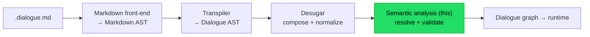

# Implementation note: Semantic analyzer

> [!NOTE]
> Status: **proposed** — a design draft, not yet implemented. Component 4 of the
> DialogueDown script compiler, the **resolve-and-validate** stage between desugar
> and the future dialogue-graph builder. It turns a syntactic, desugared tree into
> a **semantic model**: a unified speaker table, a nested scene tree with an anchor
> table, and resolved jump/speaker references — leaving the flow graph to the next
> component.

## Table of contents

- [Implementation note: Semantic analyzer](#implementation-note-semantic-analyzer)
  - [Table of contents](#table-of-contents)
  - [Goal and scope](#goal-and-scope)
  - [Where it sits](#where-it-sits)
  - [Ubiquitous language](#ubiquitous-language)
  - [Functionality checklist](#functionality-checklist)
  - [Interfaces and abstractions](#interfaces-and-abstractions)
  - [The analyzer at a glance](#the-analyzer-at-a-glance)
  - [Key design decisions](#key-design-decisions)
    - [DD1 — A separate semantic model, not an enriched tree](#dd1--a-separate-semantic-model-not-an-enriched-tree)
    - [DD2 — Pure sub-passes, orchestrated](#dd2--pure-sub-passes-orchestrated)
    - [DD3 — A build-once type index for traversal](#dd3--a-build-once-type-index-for-traversal)
    - [DD4 — The unified speaker table and the name invariant](#dd4--the-unified-speaker-table-and-the-name-invariant)
    - [DD5 — The scene tree and the anchor table](#dd5--the-scene-tree-and-the-anchor-table)
    - [DD6 — Jump resolution against the anchor table](#dd6--jump-resolution-against-the-anchor-table)
    - [DD7 — Reserved-tag validation](#dd7--reserved-tag-validation)
    - [DD8 — Errors throw now; diagnostic seams are marked](#dd8--errors-throw-now-diagnostic-seams-are-marked)
  - [Error and boundary cases](#error-and-boundary-cases)
  - [Integration](#integration)
  - [Testability](#testability)

## Goal and scope

The compiler's processing model is **parse → validate references → compile to
nodes and edges → run**. This component is the **validate references** step: it
reads the desugared Dialogue AST and produces a **`SemanticModel`** that resolves
what the syntax only names.

It does four things:

1. **Nest scenes** — fold the flat `SceneHeading` list into a **scene tree** by
   heading level, and derive an **anchor table** (slug → scene).
2. **Bind speakers** — build one **unified speaker table** keyed by both name and
   `@id`, auto-declaring references, merging partial-declaration tags, and honoring
   `##default`.
3. **Resolve jumps** — resolve each `Jump`'s target against the anchor table
   (same-file), or mark it external (cross-file, deferred).
4. **Validate reserved tags** — check each `##` tag against the known reserved set.

**In scope:** the `SemanticModel`, the four sub-passes, the shared traversal index,
and the `ISemanticAnalyzer` seam. **Out of scope, deferred to later components:**
the **flow graph** (succession/choice/jump *edges* — the "compile to nodes and
edges" step is its own builder), **cross-file** jump resolution (tracked as a
project item), and **collect-and-continue diagnostics** (this stage throws for now;
see [DD8](#dd8--errors-throw-now-diagnostic-seams-are-marked)). No **semantic
lint rules** yet — those run over this model in a later pass.

## Where it sits



The analyzer consumes a `DesugaredScriptDocument` and yields a `SemanticModel`. The
graph builder is the next component; it consumes the `SemanticModel` (which carries
both the tree and its resolutions) and lowers it to a flow graph.

## Ubiquitous language

| Term                  | Meaning                                                                                                                                      |
| --------------------- | -------------------------------------------------------------------------------------------------------------------------------------------- |
| **Semantic analyzer** | the resolve-and-validate stage; produces the semantic model.                                                                                 |
| **Semantic model**    | the analyzed artifact: the desugared tree plus its resolved tables and references. Bound to the tree it analyzed (Roslyn's `SemanticModel`). |
| **Speaker symbol**    | the resolved identity of a speaker (`Name?`, `Id?`, merged `Tags`, `IsDefault`). Distinct from the AST `Speaker` prefix node.                |
| **Speaker table**     | the unified lookup from a name **or** an `@id` to a speaker symbol.                                                                          |
| **Scene**             | a semantic section: a heading, its slug **anchor**, its child scenes, and the blocks it contains. Distinct from the AST `SceneHeading`.      |
| **Anchor**            | a scene's slug, the target a jump resolves against (GitHub-style: `## Play tennis` → `play-tennis`).                                         |
| **Anchor table**      | the lookup from an anchor slug to its scene.                                                                                                 |
| **Jump resolution**   | what a `Jump`'s target resolves to: a scene, an external (cross-file) target, or unresolved.                                                 |
| **Tree index**        | a build-once index of every node by type, so a sub-pass queries `OfType<T>()` instead of walking.                                            |
| **Sub-pass**          | one isolated analysis step (scene builder, speaker binder, jump resolver, tag validator).                                                    |

## Functionality checklist

- [ ] A **`DialogueTreeIndex`** walks the tree once and answers `OfType<T>()` in
      document order, including base-type queries (`OfType<Speaker>()`).
- [ ] A **scene builder** nests `SceneHeading`s into a `Scene` tree by level
      (blocks before the first heading form an implicit root scope) and builds the
      anchor table with GitHub-style slugs.
- [ ] A **speaker binder** builds the unified `SpeakerTable` (name and `@id`),
      auto-declaring references and merging partial-declaration tags.
- [ ] The binder asserts the **name invariant**: every speaker symbol ends with a
      name (an `@id` never named is an error).
- [ ] `##default` marks the default speaker; **at most one** is allowed. The table
      carries a built-in **system speaker**, so `Resolve` always yields a symbol.
- [ ] A **jump resolver** resolves same-file targets against the anchor table and
      marks cross-file targets external.
- [ ] A **tag validator** accepts a reserved tag only from the known set
      (`##default` today) and rejects the rest.
- [ ] The **`SemanticModel`** carries the desugared tree, the tables, the scene
      tree, and the node-keyed jump resolutions.
- [ ] The **`ISemanticAnalyzer`** seam analyzes a `DesugaredScriptDocument` into a
      `SemanticModel`, threading `source` for future diagnostics.
- [ ] Every place that will report a diagnostic is a **marked TODO seam** (throws
      for now).

## Interfaces and abstractions

| Type                | Visibility | Responsibility                                                            | Collaborators                       |
| ------------------- | ---------- | ------------------------------------------------------------------------- | ----------------------------------- |
| `ISemanticAnalyzer` | internal   | seam: `SemanticModel Analyze(DesugaredScriptDocument, string source)`     | `SemanticModel`                     |
| `SemanticAnalyzer`  | internal   | orchestrates the sub-passes and assembles the model                       | the sub-passes, `DialogueTreeIndex` |
| `SemanticModel`     | internal   | the analyzed artifact: tree + tables + resolutions                        | all sub-pass outputs                |
| `DialogueTreeIndex` | internal   | build-once `OfType<T>()` over the tree                                    | `ScriptNode`                        |
| `SceneBuilder`      | internal   | flat headings → `Scene` tree + `AnchorTable`                              | `SceneHeading`, `Scene`             |
| `Scene`             | internal   | one nested section (title, anchor, children, blocks)                      | `SceneHeading`                      |
| `AnchorTable`       | internal   | slug → `Scene`                                                            | `Scene`                             |
| `SpeakerBinder`     | internal   | AST speakers → `SpeakerTable`; enforces the name invariant                | `Speaker`, `SpeakerSymbol`          |
| `SpeakerSymbol`     | internal   | resolved speaker identity                                                 | `Tag`                               |
| `SpeakerTable`      | internal   | name/`@id` → `SpeakerSymbol`; `Resolve(Speaker)` incl. the system speaker | `SpeakerSymbol`                     |
| `JumpResolver`      | internal   | `Jump` target → `JumpResolution`                                          | `Jump`, `AnchorTable`, `Scene`      |
| `TagValidator`      | internal   | reserved-tag check against the known set                                  | `ReservedTag`                       |

## The analyzer at a glance

```text
Analyze(desugared, source):
    index = DialogueTreeIndex.Build(desugared)          # one walk

    # build tables (independent)
    (scenes, anchors) = SceneBuilder.Build(desugared)
    speakers          = SpeakerBinder.Bind(index)        # asserts the name invariant

    # resolve/validate against the tables
    resolvedJumps     = JumpResolver.Resolve(index.OfType<Jump>(), anchors)
    TagValidator.Validate(index.OfType<ReservedTag>())   # throws on unknown reserved tag

    return SemanticModel(desugared, speakers, scenes, anchors, resolvedJumps)
    # a line's speaker is resolved on demand via speakers.Resolve(line.Speaker)
```

Each sub-pass is a pure function of explicit inputs; the analyzer wires the
dependency order (tables before the resolvers that read them) and assembles the
model. `source` is validated and held for future diagnostics, mirroring the other
stage seams.

## Key design decisions

### DD1 — A separate semantic model, not an enriched tree

The analyzer produces a **`SemanticModel`** — a distinct layer — rather than
editing or re-typing the AST. This mirrors Roslyn: syntax stays syntax; semantics
live in a model **bound to** that syntax. Concretely, the AST is **immutable and
untouched**. Jump resolutions live in a **node-keyed side table** on the model
(`Jump → JumpResolution`), keyed by AST node reference identity (the records flow
through unchanged, so reference keys are stable). Speaker resolution is **not** a
precomputed map: the `SpeakerTable` exposes a `Resolve` method that resolves a
line's AST `Speaker` to its `SpeakerSymbol` on demand (see
[DD4](#dd4--the-unified-speaker-table-and-the-name-invariant)) — the table owns the
resolution logic, so callers ask it rather than reaching through a map. A
`Line → SpeakerSymbol` map can be added later if a consumer needs bulk lookup.

The model **holds the desugared tree**, because the tables only annotate that tree:
a node key is meaningless without it, and the next component (the graph builder)
needs the tree for content and order **and** the resolutions for meaning. This also
makes the `SemanticModel` the **pipeline handoff** — the graph builder takes a
`SemanticModel`, so analysis cannot be skipped (as `DesugaredScriptDocument` gates
this stage today).

This keeps the flow graph — the **nodes-and-edges** lowering — a separate concern
with its own design surface, matching the DSL's own two-step model
("validate references" then "compile to nodes and edges"). Resolving a jump here
yields a **target scene**, not yet a graph edge.

### DD2 — Pure sub-passes, orchestrated

The four responsibilities are **isolated sub-passes**, each a pure function with an
explicit input and output, composed by the analyzer — not one monolithic visitor
and not a shared mutable context threaded through every step. This is the standard
compiler shape (build symbol tables, then resolve against them) and it makes each
pass **unit-testable in isolation**: feed a scene tree and some jumps, assert the
resolutions; no global state to set up.

The passes form two dependency layers:

- **Build tables** (independent): the scene builder and the speaker binder.
- **Resolve/validate against tables**: the jump resolver (needs the anchor table)
  and the tag validator.

### DD3 — A build-once type index for traversal

Several passes need *all nodes of a kind* (every `Speaker`, every `Jump`, every
`ReservedTag`). Rather than each pass walking the tree itself, a
**`DialogueTreeIndex`** walks **once** and answers `OfType<T>()` from a
`Type → nodes` map. Each node is indexed under **every type in its inheritance
chain** (concrete up to `ScriptNode`), appended in DFS order, so a base-type query
like `OfType<Speaker>()` works and results stay in document order. This is the
read-traversal foundation the desugar note deferred to this stage.

The primary justification is **API cleanliness**: a sub-pass is a pure query
(`index.OfType<Jump>()`), not a hand-rolled walk, so traversal lives in one tested
place. It also trims redundant walks (one instead of one-per-pass) — a
constant-factor win, not an asymptotic one (both are `O(N)`). Deliberately **not**
built: per-node subtree caching (the passes need whole-document, not subtree,
queries, so it would pay `O(N·depth)` memory for nothing) and **cross-edit
incremental reuse** (the index is rebuilt per compile because the AST is rebuilt
per compile; true incrementality is a separate, heavier future effort).

### DD4 — The unified speaker table and the name invariant

A speaker can be named, id'd, or both, and `Alice @A` means `Alice:` and `@A:` are
the **same** speaker. So the table is not a plain dictionary but an **entity with
dual keys**: a **`SpeakerSymbol`** (`Name?`, `Id?`, merged `Tags`, `IsDefault`)
indexed in **two mutable maps** — `byName` and `byId` — that point at the same
symbol.

Building it is one document-order pass over `index.OfType<Speaker>()`:

| AST node                               | Action                                                            |
| -------------------------------------- | ----------------------------------------------------------------- |
| `SpeakerDeclaration` (name + id?/tags) | create or **enrich** the symbol; register its name and id keys    |
| `SpeakerNameReference` (`Alice:`)      | resolve by name; **auto-declare** a name-only symbol on first use |
| `SpeakerIdReference` (`@A:`)           | resolve by id; **auto-declare** an id-only symbol on first use    |
| `PartialSpeakerDeclaration` (`@A #x`)  | resolve by id; **merge** tags into that symbol (no-conflict)      |
| `##default` on a declaration           | set `IsDefault` (at most one across the document)                 |

**Auto-declaration is permissive on purpose**, then a terminal **name invariant**
makes it safe: after the pass, **every symbol must have a name**. This cleanly
separates the two ways a bare `@id` reference reaches an undeclared id:

- **Out-of-order** (`@A:` appears before its `Alice @A:` declaration): the
  declaration later attaches the name, so the symbol ends named — valid. Auto-
  declaration *is* the fix; order does not matter.
- **Misremembered id** (`@a:` when the alias is `A`): nothing ever names the `a`
  symbol, so it fails the invariant and is reported. A typo cannot masquerade as a
  real speaker.

The invariant also states the domain rule precisely: **a stable `@id` is secondary
to a name; a speaker's identity is ultimately its name.** Conflicts — a name bound
to two ids, an id bound to two names, two `##default`s, a contradictory partial-
declaration tag — are errors (per the DSL's "conflicting speaker metadata is a
compile-time error").

**Resolution is the table's job.** The `SpeakerTable` exposes a `Resolve(Speaker)`
method that maps a line's AST speaker to its symbol: a declaration → its own symbol,
a reference → the symbol it points at, a `DefaultSpeaker` → the `##default` speaker
or, if none is declared, the **system speaker**. The system speaker is a distinct
built-in `SpeakerSymbol` the table always carries, so `Resolve` **always** returns a
symbol — a line is never speaker-less after analysis. Callers ask the table rather
than reading a precomputed map, so the resolution rules live in one place.

### DD5 — The scene tree and the anchor table

The flat `SceneHeading` list becomes a **`Scene` tree** by the standard outline
rule: a heading nests under the nearest shallower one (a level-3 under the
preceding level-2 under a level-1). Each scene owns the blocks between it and the
next heading of the same or shallower level. Blocks **before the first heading**
form an **implicit root scope** (the document's own scene), so leading content is
never orphaned. From the tree, an **`AnchorTable`** maps each scene's **slug** to
the scene.

A related idea is deliberately **left to the graph builder**: reifying implicit
**Start/End** sentinels (a well-defined entry point and a terminal node a jump could
target). Those are flow-graph **entry/exit** nodes — a runtime concern about where
dialogue begins and ends — not a resolution concern, so they belong to the
nodes-and-edges component, not this model.

Slugs are **GitHub-style** (lowercase, drop punctuation, spaces → hyphens), so
`## Play tennis` → `play-tennis` — matching the DSL example and, crucially, a
writer's **Markdown preview**, since previewing the script in Markdown is a stated
goal. A writer's preview anchors and the compiler's anchors line up.

**Anchor collisions** — two scenes slugging the same — are an **error**, not a
silent GitHub-style `-1` suffix. An anchor is a **jump target**, so identity must
be unambiguous; silent disambiguation would make `=> [X](#scene)` resolve
arbitrarily. (This is the one deliberate divergence from GitHub slug behavior, for
target integrity.)

### DD6 — Jump resolution against the anchor table

For each `Jump`, its `Target` splits into an optional file part and an anchor part:

- **Same-file** (`#play-tennis`): look the anchor up in the `AnchorTable` → the
  target **scene**, or an **unresolved-target** error if absent.
- **Cross-file** (`chapter-02.md#meet-bob`): marked **external** and left
  unresolved — **not** an error. A future multi-file component owns resolving
  targets across documents; this is tracked as a project item.

A jump resolves to a **scene**, not a graph edge — edges are the graph builder's
job (DD1).

### DD7 — Reserved-tag validation

A reserved tag (`##name`) must come from DialogueDown's **known set** — today only
`##default`. The tag validator checks each `ReservedTag` against that set and
rejects an unknown one. Custom tags (`#name`) are opaque and pass through untouched;
the transpiler already guarantees a tag rides on a speaker, image, or speech (never
a bare line), so "a tag with nothing to attach to" is a transpiler concern, not
re-checked here.

### DD8 — Errors throw now; diagnostic seams are marked

This stage is built **before** the diagnostics subsystem. So each author-facing
problem — a speaker conflict, an unnamed `@id`, an anchor collision, an unresolved
same-file jump, an unknown reserved tag — **throws** a `DialogueSemanticError` for
now, with the offending span in the message. This is the error model's **semantic**
channel: the README's error hierarchy already names `DialogueSemanticError` (a
`SemanticError`, sibling to the transpiler's `DialogueSyntaxError`), but no throw
site exists yet — this component is its first, so it adds the exception type
alongside its first use. Every such site is a **marked TODO seam** where the future
`DiagnosticBag` will be reported into instead, so the analyzer migrates to
collect-and-continue without reshaping its logic. `source` is already threaded for
this reason. See the forthcoming diagnostics and validation note (a sibling
component, in progress on its own branch).

## Error and boundary cases

| Case                                          | Behavior                                                                                |
| --------------------------------------------- | --------------------------------------------------------------------------------------- |
| Empty document                                | an empty model: no scenes, no speakers, no jumps.                                       |
| No headings                                   | the whole document is one implicit root scope; jumps can only be cross-file/unresolved. |
| Speaker conflict (name↔two ids, id↔two names) | `DialogueSemanticError` (TODO: diagnostic).                                             |
| `@id` never given a name                      | fails the name invariant → error (TODO: diagnostic).                                    |
| Two `##default` speakers                      | `DialogueSemanticError` (TODO: diagnostic).                                             |
| Anchor collision (duplicate slug)             | `DialogueSemanticError` (TODO: diagnostic).                                             |
| Same-file jump to a missing anchor            | `DialogueSemanticError` (TODO: diagnostic).                                             |
| Cross-file jump                               | resolved as **external**, not an error (deferred).                                      |
| Unknown reserved tag (`##unknown`)            | `DialogueSemanticError` (TODO: diagnostic).                                             |
| Jump target with an empty anchor              | treated as unresolved (TODO: diagnostic).                                               |
| `null` document/source                        | `ArgumentNullException` (usage error, not a diagnostic).                                |

## Integration

- **Core** (`DialogueDown`): the analyzer, model, sub-passes, tables, and the tree
  index live under a new `DialogueDown.Script.Semantics` namespace. No new
  dependency.
- **Facade** (`ScriptCompiler`): runs the analyzer after desugar and exposes the
  `SemanticModel` as the next stage artifact on `CompilationResult` (internal, like
  the other stage artifacts), threading `source`. The facade's `TODO(semantic-
  analysis)` seam is where it plugs in.
- **Graph builder** (next component): consumes the `SemanticModel` and lowers it to
  the flow graph.
- **Diagnostics** (later): threads a `DiagnosticBag` into `Analyze`, replacing the
  throw sites marked in DD8.
- **Visualization** (later): a semantic tab can project the scene tree and the
  resolved references from the model.

## Testability

- **Each sub-pass** is unit-tested in isolation on a hand-built desugared tree
  (Object Mother factory): the scene builder's nesting and slugs, the binder's
  dual-key resolution / merge / auto-declaration / name-invariant, the jump
  resolver against a given anchor table, the tag validator's known-set check. One
  test file per source file.
- **`DialogueTreeIndex`** is tested for one-walk correctness, base-type queries,
  and document order.
- **The name invariant** gets explicit cases: out-of-order reference (passes) vs
  misremembered id (fails).
- **The analyzer** gets an integration test over the real front-end → transpiler →
  desugar → analyze pipeline on a multi-scene script with jumps and speakers,
  asserting the assembled model.
- **Boundary cases** each get a test: conflicts, collisions, unresolved jumps,
  unknown reserved tags (asserting the thrown `DialogueSemanticError` today, to be
  re-pointed at diagnostics later).
- Inputs are multi-line raw string literals so the parsed shape is visible.
