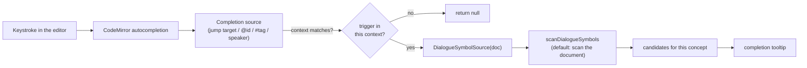

# Source Editor Autocompletion

> [!IMPORTANT]
> Status: **approved — in progress** (an enhancement to
> [Compilation Visualization](./Compilation%20Visualization.md)). As you type in
> the Source tab's editor, offer **document-aware completions** for the four names
> a dialogue script repeats: **jump targets** (scene-heading anchors), **speakers**,
> **speaker ids** (`@id`), and **tags** (`#tag`). Suggestions are drawn from the
> document itself through a **symbol-source seam**, so a later stage can feed the
> same completions from the semantic analyzer's resolved symbols without touching
> the editor glue.
>
> Like the rest of the visualization tooling, this surface is "vibe-coded" (see the
> visualization note's maturity caveat); the core engine stays the reviewed surface.

## Table of contents

- [Goal & scope](#goal--scope)
- [Ubiquitous language](#ubiquitous-language)
- [Functionality checklist](#functionality-checklist)
- [Design](#design)
  - [Modules & the seam](#modules--the-seam)
  - [Flow](#flow)
  - [Interfaces & abstractions](#interfaces--abstractions)
- [Key design decisions](#key-design-decisions)
- [Error & boundary cases](#error--boundary-cases)
- [Integration](#integration)
- [Testability](#testability)
- [Future: semantic symbol source](#future-semantic-symbol-source)
- [Implementation checklist](#implementation-checklist)

## Goal & scope

The Source tab hosts a CodeMirror editor of the dialogue script (editable in Live
Edit). A script repeats a small set of names, and mistyping one is a common,
silent error — a jump to `#the-markett` renders as a dead link; a speaker typed
`Aice` splits into a second character.

Offer **completions** for those repeated names as the author types, sourced from
the document so they are always relevant and need no server round-trip:

- **Jump targets** — the anchors of scene headings, completing a `](#…)` link
  destination. Highest value: a completed anchor always matches a real heading.
- **Speaker ids** — completing `@id`.
- **Tags** — completing `#tag`.
- **Speaker names** — completing a line's leading speaker.

**In scope:** an Edit-only CodeMirror autocompletion extension driven by a
**symbol source**, with a default source that scans the current document. **Out of
scope:** completing game-call verbs, front-matter keys, or Markdown syntax;
sourcing completions from the compiler's resolved symbols (designed as a seam here,
built later — see [Future](#future-semantic-symbol-source)).

## Ubiquitous language

The DSL already names these concepts (see the
[script-language spec](../../guide/script-language.md)); the editor reuses them so
one concept keeps one name across the spec, the code, and the completions.

| Term | Meaning |
| --- | --- |
| **Completion** | A suggestion the editor offers at the cursor (CodeMirror's term). |
| **Jump target** | The anchor of a scene heading, written `[label](#slug)` in a jump. The `slug` is the GitHub-style slug of the heading text — the same anchor the preview links to. |
| **Speaker** | A line's display name before the `:` (e.g. `Alice`). |
| **Speaker id** | A speaker's stable id, written `@id`. |
| **Tag** | A speaker/line tag, written `#tag`. |
| **Symbol** | A name the editor can suggest — a jump target, speaker, speaker id, or tag. |
| **Symbol source** | The **seam**: where the editor's symbols come from for the current document. The default scans the document; a future one reads the semantic analyzer's resolved symbols. |

## Functionality checklist

- [ ] Typing a jump destination `](#…)` completes the **slug of any scene heading**
      in the document; the completion's detail shows the heading text.
- [ ] Completed jump slugs are **GitHub-style** and match the preview's anchors
      exactly (via `github-slugger`, as the preview does).
- [ ] Typing `@…` completes **speaker ids** declared or referenced in the document.
- [ ] Typing a mid-line `#…` completes **tags** used in the document (a line-start
      `#` stays a Markdown heading, not a tag).
- [ ] Typing a line's leading word completes **speaker names** used in the document.
- [ ] Completions are **Edit-only** — inactive in read-only View and in the static
      export (they cannot type there anyway).
- [ ] Symbols come from a **document scan** by default, behind a `DialogueSymbolSource`
      seam that a semantic source can replace without changing the editor glue.
- [ ] The scan **ignores the YAML front-matter block**, so `title:` is not offered
      as a speaker.
- [ ] No suggestions and no error on an empty document or one with no matching names.

## Design

### Modules & the seam

Two focused modules keep the **domain** (what names the document contains) apart
from the **editor glue** (how CodeMirror offers them), with the symbol source as
the seam between them:

- **`dialogue-symbols.ts`** — pure, CodeMirror-free domain code: the `DialogueSymbols`
  value, the `DialogueSymbolSource` seam type, and `scanDialogueSymbols(doc)`, the
  default source that reads the names out of the document text. Trivially unit-tested
  as a pure function.
- **`editor-completions.ts`** — the CodeMirror glue: one `CompletionSource` per
  concept (jump target, speaker id, tag, speaker) that reads the current document
  through a `DialogueSymbolSource`, plus `dialogueAutocompletion(source?)` that
  assembles them into an editor extension.

Splitting the pure scanner from the editor glue makes the seam explicit and lets the
scanner be tested without a CodeMirror instance. `source-view.ts` wires the extension
into the editor's Edit-only extensions.

### Flow

Each completion source fires only in its own syntactic context (a `matchBefore`
test), then asks the symbol source for that concept's names and returns them as
candidates. The symbol source is called with the current document text, so a scan
always reflects what the author has typed so far.

### Interfaces & abstractions

| Type / function | Responsibility | Collaborators |
| --- | --- | --- |
| `DialogueSymbols` | The names found for a document, grouped by concept: `jumpTargets`, `speakers`, `speakerIds`, `tags`. | — |
| `JumpTarget` | One completable anchor: `{ slug, heading }` (slug inserted, heading shown as detail). | `github-slugger` |
| `DialogueSymbolSource` | **Seam.** `(doc: string) => DialogueSymbols`. Default = `scanDialogueSymbols`; future = a semantic source. | scanner / semantic analyzer |
| `scanDialogueSymbols` | Default source: parse headings, speaker prefixes, `@id`s and `#tag`s out of the document (front matter skipped). | `DialogueSymbols` |
| `dialogueAutocompletion(source?)` | Build the Edit-only editor extension from the four completion sources over a `DialogueSymbolSource`. | `@codemirror/autocomplete` |
| `createSourceView(..., { symbols? })` | Injects the source into the editor's Edit-only extensions (defaulting to the scanner). | `editor-completions.ts` |

## Key design decisions

- **Document-scan by default, behind a source seam.** The editor only receives the
  source string, and a document scan needs no server and no compiler — it is the
  right pragmatic v1. Rather than hard-wire scanning into the completion sources, the
  scan is one implementation of a `DialogueSymbolSource`, so the richer, resolved
  symbols the semantic analyzer will produce can replace it later without touching the
  editor glue. *Tradeoff:* a scan sees only what is typed (no cross-file speakers, no
  validation) — accepted for v1; the seam is the upgrade path.
- **Reuse `github-slugger` for jump slugs.** The preview already renders in-document
  anchors with `github-slugger` (via `marked-gfm-heading-id`). Completing jump targets
  with the same slugger guarantees a completed `#slug` resolves to a real heading — the
  feature's whole point. It is already an (indirect) dependency; this promotes it to a
  direct one.
- **Edit-only, in the editable compartment.** Completions make sense only when the
  author can type, so the extension joins the other authoring aids (close-brackets,
  format shortcuts) in the editor's editable-only compartment, off in View and in the
  static export.
- **Quiet, context-gated sources.** Each source fires only in its syntactic context
  and returns only names that match what is typed, so the tooltip stays silent unless a
  real suggestion exists. This keeps the noisiest case — a speaker name at the start of
  a prose line — unobtrusive: with no matching known speaker, nothing appears.
  *Alternative considered:* make speaker-name completion explicit-only (trigger key).
  Deferred; easy to switch via the source if it proves noisy.

## Error & boundary cases

| Case | Behavior |
| --- | --- |
| Empty document / no matching names | Sources return `null`; no tooltip, no error. |
| Line-start `#` (a Markdown heading) | The tag source does **not** fire — only a mid-line `#` completes a tag. |
| YAML front matter (`--- … ---`) | Skipped by the scan, so front-matter keys (`title:`) are never offered as speakers. |
| Duplicate scene headings | `github-slugger` deduplicates (`slug`, `slug-1`), matching the preview; both are offered. |
| Quoted speaker name (`"Long Name"`) | v1 scans identifier-form names; quoted names are a known limitation (the seam can address it later). |
| Read-only View / static export | The extension is absent (Edit-only), so nothing activates. |

## Integration

`createSourceView` (in `source-view.ts`) gains an optional `symbols?:
DialogueSymbolSource`, defaulting to `scanDialogueSymbols`. When the editor is
editable, its extensions include `dialogueAutocompletion(symbols)` (bundling the
completion sources and CodeMirror's `completionKeymap`, so accept/dismiss keys work
only where completions are active). Nothing else in the report changes; the report
stays a single self-contained file, offline-capable.

## Testability

- **`scanDialogueSymbols`** is a pure `string → DialogueSymbols` function — unit-test
  it directly against multi-line script literals (headings, speaker declarations and
  references, tags, front matter, edge cases). No CodeMirror needed.
- **Completion sources** are `(CompletionContext) => CompletionResult | null`. Unit-test
  each by building an `EditorState` with a document, constructing a `CompletionContext`
  at a cursor position, and asserting the returned `from`/`options` (or `null` outside
  the context). No live editor or DOM needed.
- **End-to-end** (Playwright): type into the editor and assert the completion tooltip
  lists the expected names, in Edit mode; confirm none appears in View.
- Target the usual high, meaningful coverage; mirror the one-file-per-source layout
  (`dialogue-symbols.test.ts`, `editor-completions.test.ts`).

## Future: semantic symbol source

The semantic analyzer (in progress on a separate branch) will resolve the script's
real symbol table — speakers with their ids and merged tags, and validated jump
targets. That table is a strictly better symbol source than a text scan: it knows
cross-file speakers, canonical ids, and which targets actually exist.

The seam is ready for it: a `SemanticSymbolSource` implementing `DialogueSymbolSource`
would read the resolved symbols the report already carries (or a live channel pushes),
and `main.ts` would pass it to `createSourceView` in place of the default scanner — no
change to the completion sources. This is tracked as a follow-up issue; see the
[implementation checklist](#implementation-checklist).

## Implementation checklist

- [ ] `dialogue-symbols.ts`: `DialogueSymbols`, `JumpTarget`, `DialogueSymbolSource`,
      `scanDialogueSymbols` (+ front-matter skip); unit tests.
- [ ] `editor-completions.ts`: the four completion sources + `dialogueAutocompletion`;
      unit tests via `CompletionContext`.
- [ ] Promote `github-slugger` to a direct dependency; slug jump targets with it.
- [ ] Wire into `source-view.ts` (Edit-only) with the `symbols?` seam; rebuild the
      committed `dist/report.html`.
- [ ] Help text + `CHANGELOG` + README touch-ups; Playwright coverage.
- [ ] File the **semantic symbol source** follow-up issue and add it to the board.
