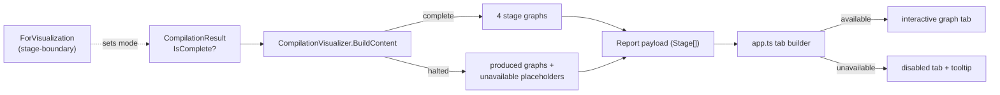

# Unavailable Stage Tabs

> [!NOTE]
> Status: **proposed / draft** — awaiting review. Now that the diagnostics work is on
> `main` (`CompilationResult.IsComplete`, the `CompilationMode` policy), this reframes
> the earlier mock-only draft into a real end-to-end integration.

## Goal and scope

The report has one tab per compiler stage — **Markdown AST → Dialogue AST → Desugared
AST → Semantic Model**. When a **stage-boundary** compile hits a transpiler error it
**halts**: `CompilationResult.IsComplete` is false and the later artifacts (`Desugared`,
`Semantics`) were never produced. Today the visualizer sidesteps this by *forcing
best-effort* — the [Diagnostics note](./Diagnostics%20and%20Validation.md) says so
outright: *"because a stage-boundary halt yields a partial result the stage projector
cannot read, the visualizer compiles in best-effort … (#111)."*

This component makes the report **able to project a partial result**: an absent stage
becomes a **disabled tab** — greyed, non-navigable, with a tooltip saying why — while the
produced stages stay fully interactive.

**In scope:**

- A payload seam, **end to end**, marking a stage **unavailable** with a short reason:
  the TypeScript `Stage` model and the `.NET` `DisplayGraph`/payload.
- The disabled-tab display: greyed, blocked navigation, an explanatory tooltip; the
  default and remembered tab never land on it.
- `CompilationVisualizer` **projecting a partial result** — available stages plus
  unavailable ones — instead of assuming a complete one.
- **Compiling stage-boundary** in the visualizer, so a halted compile actually reaches a
  real report and its disabled tabs are visible (not only under test).

**Out of scope (deferred):**

- **Surfacing the diagnostics themselves** — the messages and locations behind the halt.
  The disabled tab only points at "compilation errors"; the *report diagnostics overlay*
  is a separate planned component (noted in the Diagnostics design). Until it lands, a
  halted report shows disabled tabs whose tooltip says a compile error caused them, but
  not the errors — an accepted interim.
- **User-selectable compile mode** — exposing best-effort / stage-boundary through the CLI
  and config ([#110](https://github.com/pengzhengyi/godot-dialoguedown/issues/110)) so a
  reader can choose. The visualizer forces stage-boundary until then.

## Ubiquitous language

| Term | Meaning |
| --- | --- |
| **Stage** | One compiler-pipeline step shown as a tab (Markdown AST, Dialogue AST, Desugared AST, Semantic Model). |
| **Available stage** | A stage whose artifact was produced — an interactive graph tab. |
| **Unavailable stage** | A stage the compile did not produce (it halted earlier) — a disabled tab. |
| **Halted / partial compile** | A stage-boundary compile that stopped after an erroring stage (`CompilationResult.IsComplete == false`), so later stages are unavailable. |

## Functionality checklist

- [ ] `Stage` (TS) and `DisplayGraph` (`.NET`) can mark a stage **unavailable** with a
      short, reader-facing reason, carried through the payload.
- [ ] `CompilationVisualizer` projects a **partial** `CompilationResult`: available
      stages as graphs, absent ones as unavailable; editor symbols degrade to empty.
- [ ] An unavailable stage renders a **disabled tab**: muted, `cursor: not-allowed`,
      `aria-disabled="true"`, with the reason as its tooltip.
- [ ] A disabled tab **cannot be entered** (click/keyboard blocked); available stages are
      unchanged.
- [ ] The **default** and **remembered** (refresh) active tab never land on a disabled
      tab.
- [ ] Exercised by a **real halted compile** (a broken script compiled stage-boundary),
      not only a hand-built mock.

## Interfaces and abstractions

| Type / seam | Responsibility | Collaborators |
| --- | --- | --- |
| `StageUnavailable` (TS `model.ts`) | The reason a stage tab is disabled. | `Stage` |
| `Stage.unavailable?` (TS) | Marks a stage unavailable; absent ⇒ a normal graph tab. | `app.ts` tab builder |
| `DisplayGraph` unavailable marker (`.NET`) | A stage placeholder carrying a title, description, and reason but no graph. | `DisplayGraphJson`, `CompilationVisualizer` |
| `CompilationVisualizer.BuildContent` (`.NET`) | Project the produced stages and emit the absent ones as unavailable when `!IsComplete`. | `CompilationResult`, `SymbolProjection` |
| `app.ts` tab builder (`addStageTab` / `addTab` / `activate`) | Build a disabled vs interactive tab; block entry; skip disabled tabs when choosing the active tab. | `Stage`, tab tooltip, tab persistence |

### Payload shape (TypeScript)

```ts
/** Why a stage's tab is disabled — its artifact was not produced (a halted compile). */
export interface StageUnavailable {
    /** A short, reader-facing reason, shown as the disabled tab's tooltip. */
    reason: string;
}

export interface Stage {
    title: string;
    description: string;
    nodes: DisplayNode[]; // empty for an unavailable stage
    edges: DisplayEdge[]; // empty for an unavailable stage
    tables?: SemanticTable[];
    /** Present ⇒ the stage's artifact is absent; the tab renders disabled. */
    unavailable?: StageUnavailable;
}
```

The `.NET` `DisplayGraph` gains the mirror of `unavailable` (a reason with empty
nodes/edges), and `DisplayGraphJson` serializes it into the same field.

## Key design decisions

1. **An optional `unavailable?` marker on the stage, not a discriminated union.**
   Available-stage code (`stage.nodes`, the graph projection) stays untouched; an
   unavailable stage carries empty `nodes`/`edges` plus the marker — the smaller,
   reversible change in an established codebase.

2. **Disable with `aria-disabled` + a class + a JS click-guard — never the `disabled`
   attribute.** A `disabled` button suppresses pointer events, so its tooltip would never
   fire and the reader would not learn *why*. `aria-disabled` keeps the hover tooltip and
   reads correctly to assistive tech; it stays focusable-but-inert.

3. **Block entry, mirroring the dirty-tab guard.** `activate` refuses to switch **into** an
   unavailable tab (the click handler returns early); the default and remembered tab
   selection skip it. A navigation rule, not a new widget.

4. **The reason is a plain string — extensible.** Any stage can be unavailable for any
   cause; the display is generic. The current copy is *"This stage is unavailable due to
   compilation errors."*

5. **`CompilationVisualizer` projects a partial result.** `BuildContent` branches on
   `IsComplete`: complete ⇒ four stage graphs as today; halted ⇒ the produced stages plus
   an unavailable `DisplayGraph` for each absent one. When `Semantics` is absent, the
   editor's symbol set degrades to **empty** (autocompletion has nothing to offer, rather
   than throwing).

6. **The visualizer compiles stage-boundary.** `ForVisualization` forces
   `CompilationMode.StageBoundary` (replacing the old best-effort override): a valid script
   completes with all four stages; a broken one halts, so its later stages are unavailable
   and render disabled. Fail-fast is never used — it throws instead of returning a
   renderable result. Exposing the mode to the reader (best-effort included) is a later
   step ([#110](https://github.com/pengzhengyi/godot-dialoguedown/issues/110)); until then
   the report is deterministic.

## Error and boundary cases

| Case | Intended behavior |
| --- | --- |
| Halted compile (`!IsComplete`) | Produced stages render; absent stages render disabled; no throw when reading `Desugared`/`Semantics`. |
| `Semantics` absent | The editor's symbol set is empty; the Semantic tab is disabled. |
| Remembered tab is now unavailable | Fall back to the default (Source, else first available); never restore into a disabled tab. |
| Default active tab would be unavailable | Choose Source when present, else the first **available** tab. |
| A later re-compile fixes the error | The rebuild produces the stage as available again; the tab re-enables. |
| Keyboard activation (Enter/Space) on a disabled tab | Blocked, same as a click. |

## Integration



- The seam is defined **end to end** — the `.NET` `DisplayGraph` marker and serializer,
  and the TypeScript `Stage.unavailable` and disabled-tab rendering.
- `CompilationVisualizer` compiles **stage-boundary**, so a broken script halts and its
  disabled tabs appear in a real report; a valid script completes with every stage.

## Testability

- **`.NET` unit:** compile a broken script **stage-boundary** through the visualizer and
  assert the stages are the produced graphs plus unavailable placeholders, and the symbol
  set is empty. Payload serialization round-trips `unavailable`.
- **TS unit:** a `Stage` with `unavailable` yields an `aria-disabled` tab carrying the
  reason, which does not activate on click; the default/remembered selection skips it.
- **End-to-end:** a report (real halted compile or mock fixture) renders a disabled,
  non-clickable tab whose tooltip shows the reason, neighbors interactive.
