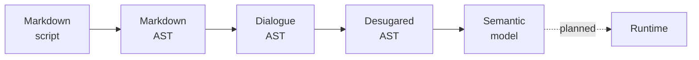

# DialogueDown overview

DialogueDown is an engine-agnostic C# library that **compiles** branching game
dialogue written in Markdown. You author a script in a Markdown-inspired syntax;
DialogueDown lowers it through a pipeline of compiler stages into a validated
model, reporting precise diagnostics as it goes — with no dependency on any game
engine.

> [!NOTE]
> DialogueDown is in early development. The compiler pipeline is implemented; the
> **runtime** that plays a compiled script — a dialogue runner and thin engine
> presentation adapters — is planned, not yet built.

## Table of contents

- [The compiler pipeline](#the-compiler-pipeline)
- [Script representations](#script-representations)
- [What is implemented](#what-is-implemented)
- [Related docs](#related-docs)

## The compiler pipeline

DialogueDown lowers a script through distinct, independently testable stages,
behind one `IScriptCompiler` facade:

- **Markdown front-end** parses the source into a Markdown AST.
- **Transpiler** turns that into a Dialogue AST — speakers, speech, choices,
  jumps, tags, and game calls.
- **Desugar** normalizes the Dialogue AST, assembling jumps and filling the
  default speaker.
- **Semantic analysis** resolves speakers, scenes, and jumps into a validated
  **semantic model** and reports invalid references.

Each stage has a design note; read them in pipeline order in the
[design notes](../contributing/design-notes/README.md).

## Script representations

Dialogue content moves through three representations:

1. **Source** — a Markdown-inspired script an author writes in a text file. See
   the [script language specification](./script-language.md).
2. **Compiled model** — the ASTs and the validated semantic model the compiler
   builds along the pipeline above.
3. **Runtime graph** *(planned)* — a directed graph/state machine a dialogue
   runner will traverse to play the dialogue.

## What is implemented

- **Compiler pipeline:** parse → transpile → desugar → analyze, behind
  `IScriptCompiler` (wire it up with `AddDialogueDown()` for DI, or
  `ScriptCompilerFactory.CreateDefault()`).
- **Diagnostics:** every problem is a located diagnostic with a stable `DLG####`
  code; the compiler collects them and continues where it safely can. See the
  [error codes](./error-codes.md).
- **Configuration:** a project's `dialogue.toml` declares its speakers and the
  compilation mode. See [project configuration](./configuration.md).
- **CLI and visualization:** the `dialoguedown` CLI compiles a script and renders
  every compiler stage as an interactive report.
- **Planned:** the runtime — a dialogue runner, effects and conditions, and thin
  engine presentation adapters.

## Related docs

- [Script language specification](./script-language.md) — the writer-facing
  dialogue syntax: speakers, speech, choices, jumps, tags, and game calls.
- [Project configuration](./configuration.md) — the `dialogue.toml` file.
- [Error codes](./error-codes.md) — the `DLG####` diagnostics the compiler
  reports, with each message and how to fix it.
- [Design notes](../contributing/design-notes/README.md) — the goal, key
  decisions, and tradeoffs behind each compiler stage.
